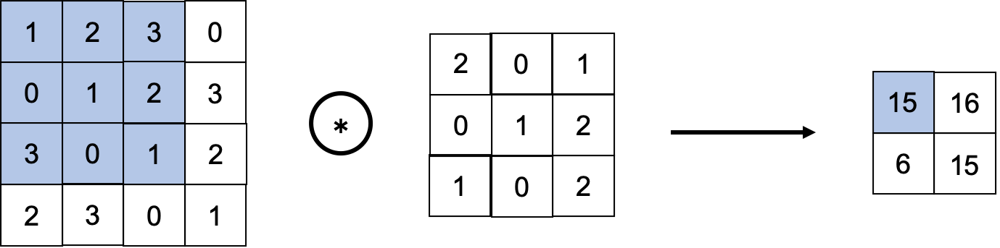
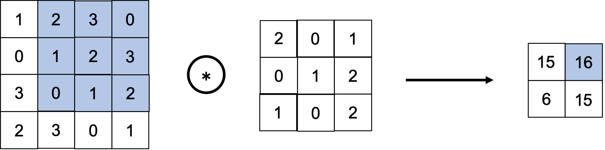
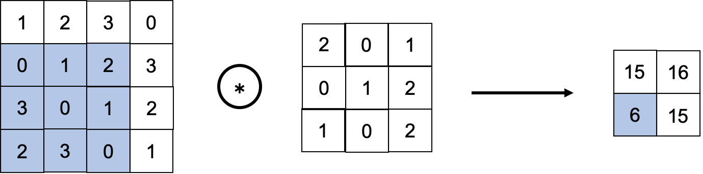
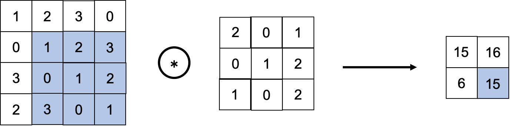

02 畳み込み層
===========

* `CNN`では、パディング、ストライドなどの特有の言語が登場する

* また、各層を流れるデータは形状のあるデータ(3次元など)になり、これまでの全結合のネットワークとは異なる

* ここでは、`CNN`で使われる畳み込み層の仕組みを見ていく

## 1.全結合層の問題点

* これまで見てきた全結合のニューラルネットワークでは、`全結合層`(Affineレイヤ)を用いた

  * `全結合層`では、隣接する層のニューロンが全て連結されており、出力の数は任意に決めることができる

### 全結合層の問題点(概要)

* データの形状が"無視されてしまう"こと

* 例)入力データが画像の場合、通常「縦・横・チャンネル方向」の3次元の形状

  * しかし、全結合層に入力する時には、3次元のデータを平らに(1次元のデータに)する必要がある

* これまでのMNISTデータセットを使った例では、入力画像は`(1,28,28)`(1チャンネル、縦28ピクセル、横28ピクセル)の形状

  * それを1列に並べた784個のデータを最初の`Affine`レイヤへ入力した

### 全結合層の問題点(詳細)

* 画像は3次元の形状であり、この形状には大切な空間的情報が含まれている

  * 例)空間的に近いピクセルは似たような値

  * 例)RBGの各チャンネル間にはそれぞれに密接な関係がある

  * 例)距離の離れたピクセル同士はあまり関わりがない

  > 3次元の形状の中にはくみ取るべき本質的なパターンがあるはず

* しかし、`全結合層`は、形状を無視して、全ての入力データを同等のニューロン(同じ次元のニューロン)として扱うので、形状に関する情報を活かせない

### CNNの場合

* 一方、`畳み込み層`(Convolutionレイヤ)は、形状を維持する

  * 画像の場合、入力データを3次元のデータとして受け取り、同じく3次元のデータとして、次のデータを出力する

  * そのため、画像などの形状を有したデータを正しく理解できる(可能性がある)

### CNNの言葉

* 畳み込み層の入出力データを、`特徴マップ`と言う

* また、畳み込み層の入力データを`入力特徴マップ`、出力データを`出力特徴マップ`と呼ぶ

## 2.畳み込み演算

* `畳み込み層`で行う処理は、「畳み込み演算」

  * これは、画像処理で言うところの「フィルター演算」に相当する

  * 以下に、具体的な例を示す

* 上の図のように、畳み込み演算は、「入力データ」に対して「フィルター」を適用する

  * この例では、「入力データ」は縦・横方向の形状を持つデータ

  * 「フィルター」も同様に、縦・横方向の次元を持つ

* 「データ」と「フィルター」の形状を、`(height, width)`で表記する

  * この例では、「入力サイズ」は`(4,4)`、「フィルターサイズ」は`(3,3)`、「出力サイズ」は`(2,2)`となる

### 畳み込み演算の計算手順

* 畳み込み演算は、「入力データ」に対して、フィルターのウィンドウを一定の間隔でスライドさせながら適用させる

  * ここで言う「ウィンドウ」は、灰色の3×3の部分を指す

* それぞれの場所で、フィルターの要素と入力の対応する要素を乗算し、その和を求める(**積和演算**)

* そして、その結果を出力の対応する場所へ格納していく

* このプロセスを全ての場所で行うことで、畳み込み演算の出力を得ることができる

### 畳み込み演算のバイアス

* 全結合のニューラルネットワークでは、重みパラメータの他にバイアスが存在していた

* `CNN`の場合、フィルタのパラメータが、これまでの「重み」に対応する

  * そして、`CNN`の場合もバイアスが存在する

* 「フィルター」と「バイアス」を含めた畳み込み演算の処理フローは、以下の図となる

* 上の図より、バイアス項の加算は、フィルター適用後のデータに対して行われる

* ここで示すように、常にバイアスは一つ(1×1)だけ存在する

  * この例では、フィルター適用後のデータ4つに対してバイアスは一つ

  * その一つの値が、フィルター適用後の全ての要素に加算される

## 3.パディング

* 畳み込み層の処理を行う前に、入力データの周囲に固定のデータ(例：0など)を埋めることがある

  * これを、`パディング`と呼び、畳み込み演算ではよく用いられる

  * 以下の図では、`(4,4)`のサイズの入力データに対して、幅`1`のパディングを適用している

  > 幅1のパティングとは、周囲を幅1ピクセルの`0`で埋めること

* 上の図に示すように、`(4,4)`のサイズの入力データは「パディング」によって、`(6,6)`の形状になる

  * そして、`(3,3)`のサイズのフィルターをかけると、`(4,4)`のサイズの出力データが生成される

* この例では、「パディング」を`1`に設定したが、任意の整数に設定することができる

  * もし上の例でパディングを`2`に設定すれば、入力データのサイズは`(8,8)`になる

> ### パディングを用いる理由
>
> * 出力サイズを調整するため
>
>   * 例)`(4,4)`のサイズの入力データに`(3,3)`のフィルターを適用する場合、出力サイズは`(2,2)`となる
>
>   * これは、出力サイズは入力サイズから2要素分だけ縮小されることになる
>
>   * ずっと縮小すると、ある時点で出力サイズが1になり、それ以上畳み込み演算ができなくなる
>
> * パディングを利用することで、空間的なサイズを一定にしたまま次の層へデータを渡すことができる
