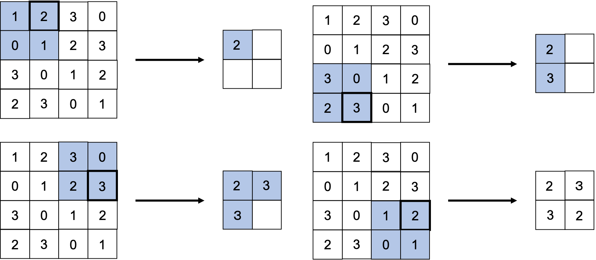
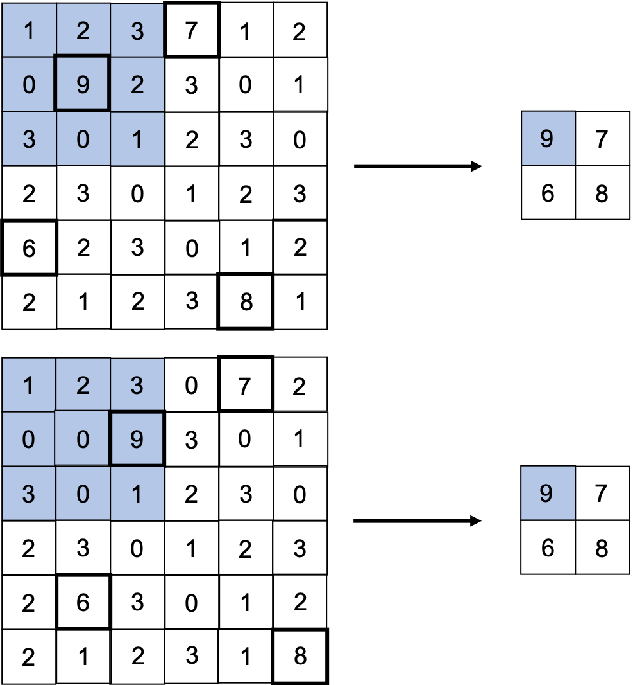

03 プーリング層
=============

* `プーリング`：縦・横方向の空間を小さくする演算

  * `2×2`の領域を一つの要素に集約するような処理を行い、空間サイズを小さくする

* 「Maxプーリング」：最大値をとる演算

  * 例)2×2のMaxプーリングをストライド2で行なった場合の処理手順

    * この領域に対して最大となる要素を取り出す

    * また、ストライドは2なので、ウィンドウの移動間隔は2要素となる

* なお、一般的に、プーリングのウィンドウのサイズと、ストライドは同じ値に設定する

  * 例)`3×3`のウィンドウは、ストライド`3`と設定する

> 「Maxプーリング」の他に、「Averageプーリング」などがある
>
> 「Averageプーリング」は、対象領域の平均を計算する
>
> 画像認識においては、主に「Maxプーリング」が使われる

## 1.プーリング層の特徴

### 学習するパラメータがない

* `プーリング層`は、`畳み込み層`と異なって、学習するパラメータを持たない

* `プーリング`は、対象領域から最大値をとる(もしくは平均値をとる)だけの処理なので、学習すべきパラメータは存在しない

### チャンネル数は変化しない

* プーリングの演算によって、入力データと出力データのチャンネル数は変化しない

* チャンネルごとに独立して計算が行われる

### 微小な位置変化に対してロバスト(頑健)

* 入力データの小さなずれに対して、プーリングは同じような結果を返す

  * そのため、入力データの微小なズレに対して`ロバスト`

  * 例)入力データが横方向に1要素分だけズレた場合でも、出力は同じような結果になる

| 版   | 年/月/日   |
| ---- | ---------- |
| 初版 | 2019/05/15 |
