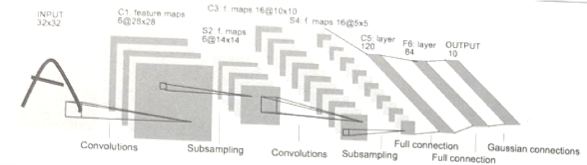
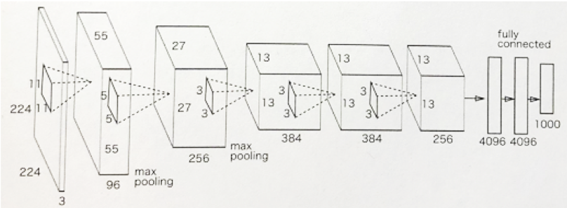

07 代表的なCNN
=============

* `CNN`は、これまで様々な構成のネットワークが提案されてきた

* ここでは、その中でも特に重要なネットワークを2つ紹介する

  * `LeNet`：1988年に初めて提案されたCNNの元祖

  * `AlexNet`：2012年に提案された、ディープラーニングが注目を集めるに至った手法

## 1.LeNet

* 下の図に示すように、「畳み込み層」と「プーリング層」を連続して行い、最後に全結合層を経て結果が出力される

> 正確には、「要素を間引く」だけのサブサンプリング層

* `LeNet`と「現在のCNN」を比較すると、いくつか違いがある

  * 1つ目：活性化関数

    * `LeNet`ではシグモイド関数が使用されているが、現在では主にReLUが用いられる

  * 2つ目：オリジナルの`LeNet`では、サブサンプリングによって中間データのサイズ縮小を行なっている

    * 現在では、`Max`プーリングが主流となっている

* このように、`LeNet`と「現在のCNN」にはいくつかの違いはあるものの、それほど大きな違いという訳ではない

## 2.AlexNet

* 基本的には、`LeNet`とネットワーク構成は大きくは変わっていない

* `AlexNet`は、畳み込み層とプーリング層を重ねて、最後に全結合層を経由して結果を出力する

* 以下の点で異なる

  * 活性化関数にReLUを用いる

  * LRN(Local Response Normalization)という局所的正規化を行う層を用いる

  * Dropoutを使用する

## まとめ

* ここで見てきたように、ネットワーク構成に関しては、`LeNet`と`AlexNet`には大きな違いはない

* しかし、それを取り巻く環境やコンピュータ技術には大きな進歩があった

  * 例)GPUなど

| 版   | 年/月/日   |
| ---- | ---------- |
| 初版 | 2019/05/18 |
