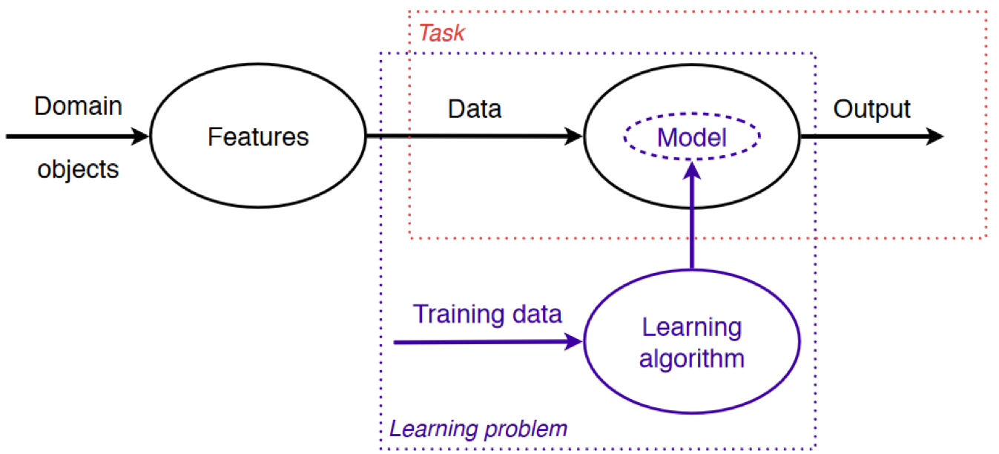

00 はじめに
==========

* `SpamAssasin`：オープンソースのスパムフィルター

  * 受け取る電子メールそれぞれに対して、あらかじめ決められた数多くのルールに引っかかるかどうかをチェックする

  * 引っかかれば、そのルールに対する`スコア`を加算する

  * 合計スコアが`5`以上であれば、`junk`というフラグ情報とレポートを電子メールのヘッダーに追記する

* `機械学習`：`経験`を通して知識や`性能`を改善するためのアルゴリズムやシステムについての体系的な研究

  * `経験`：訓練データ(ユーザーの手によってスパムであるかハムであるかが分類済みの電子メール)

  * `性能`：スパムを正しく分類する能力

* `過適合`：訓練データに対する性能の向上に固執してしまうこと

  > 例)過去問だけに夢中になって、試験本番で同じ題材で違う問題が出たら点が取れないケース

* `汎化`：ユーザごとの状況に応じて、性能が向上した機械学習のモデル

  > 受け取る人本人のメールを学習に用いると性能が高くなる

機械学習の関心は、正しい **特徴量** を用いて，正しい **モデル** をつくり，正しい **タスク** をこなすこと

| 版   | 年/月/日   |
| ---- | ---------- |
| 初版 | 2019/06/16 |
