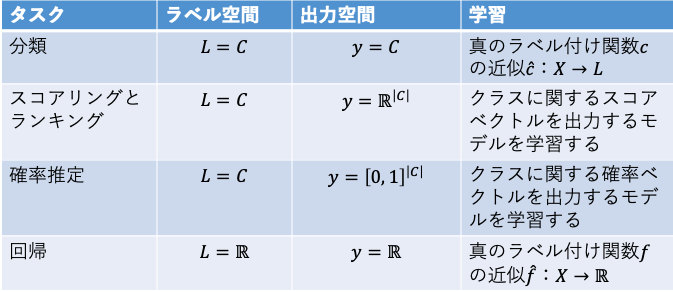

00 はじめに
==========

* `タスク`：機械学習がその性質を改善するために用いられる対象

> 例：スパムメール認識
>
> この場合のタスクは、「分類タスク」
>
> 訓練データから適切な分類器を学習する必要がある

* `分類器`：多くの異なる型が存在する

  * 例)線形分類器、ベイズ分類器、距離ベースの分類器

  * これらの「異なる型」のことを、`モデル`と呼ぶ

  > 4〜9章で取り扱う

* これらのタスクのそれぞれについて、

  * それは何なのか

  * どのような変形が存在するか

  * タスクの実行性能をどのように評価するか

  * 他のタスクにどう関係するか

* 本章では、一般的な記法を導入する

### インスタンス

* `インスタンス`：機械学習で興味のある対象になるもの

* `インスタンス空間`($`X`$)：生じうるあらゆるインスタンスの集合

> 例) アルファベットを用いて書くことができるあらゆる電子メールの集合

* `ラベル空間`($`L`$)：教師あり学習において、事例にラベル付けするために用いられる

* `出力空間`($`Y`$)

  * 考慮中のタスクを達成するためには、`モデル`(インスタンス空間から出力空間への写像)が必要となる

  > 例)分類：出力空間は、`クラスの集合`
  >
  > 例)回帰：出力空間は`実数の集合`

* これらのモデルを学習するために、`事例`(ラベル付けされたインスタンス $`(x,l(x))`$ の訓練データ $`Tr`$ を必要とする

  > $`l`$：$`X \rightarrow L`$：ラベル付け関数

### 訓練とテストデータ

### 一般的な機械学習のシナリオ

* ラベル空間と出力空間が一致する(𝑦=𝐿)

* ここでは、訓練データに割り振ったラベルを用いることで、真のラベル付け関数𝑙の近似𝑙 ̂：𝑋→𝐿を学習する

> このシナリオは、分類と回帰の両方を含む

* ラベル空間と出力空間が異なる

* 単なるラベル以上のもの(例：個々の可能なラベルのスコア)を出力するモデルを学習することに役立つ
> この場合、𝑘=|𝐿|(ラベルの数)とすると、𝑦=ℝ^𝑘となる
> これは、実数空間におけるラベルの次元を表す

### ノイズ

* 問題を複雑にするもの

* 以下の種類を持つ

　* 𝑙=𝑙(𝑥)の代わりに汚染されたラベル𝑙^′を観察するという「ラベルのノイズ」

　* 𝑥の代わりに汚染されたインスタンス𝑥^′を観察するという「インスタンスのノイズ」

> データノイズが原因で、訓練データと正確に一致させようとすることにより
過適合を導く可能性があるので、一般に望ましくないことがある

* そこで、ラベル付けされたデータのうちの一部分は、以下のように分割

  * テストデータ：𝑇𝑒

  * 訓練データ：

* 訓練データまたはテストデータを特定のクラスに制限するために上付き文字を使用

　* 正テスト事例の集合：〖𝑇𝑒〗^⨁={(𝑥,𝑙(𝑥))|𝑥∈𝑇𝑒, 𝑙(𝑥)=⊕}

  * 負テスト事例の集合： 〖𝑇𝑒〗^⊖

### 特徴量

* `特徴量`：属性、予測変数、説明変数あるいは独立変数と呼ばれる、インスタンスが記述されるもの

)

* 上の式によって特徴量の領域や値の集合を表す

> デカルト積

* 全てのインスタンスは、特徴量の次元ベクトル

  * いくつかの領域では、使用する特徴量は自然に定まるが、他の領域ではそれらを構築する必要がある

  * 例)スパムフィルターの中の、電子メールでの語彙の各単語の出現回数をカウントする

    > 多くの特徴量を構築できる

### まとめ

* 2.1：分類

* 2.2：スコアリングとランキング

* 2.3：クラス確率の推定

> これらは2クラスの問題を扱う

* この章では、

  * 木ベース：グループ分けモデルの代表

  * 線形モデル：グレード付けモデルの代表

  > 一つの特徴量からでもモデルを構築することがある

### 離散数学の便利な概念

> 5/16 國井>画像をあとで貼る

*
