00 はじめに
==========

* `タスク`：機械学習がその性質を改善するために用いられる対象

> 例：スパムメール認識
>
> この場合のタスクは、「分類タスク」
>
> 訓練データから適切な分類器を学習する必要がある

* `分類器`：特徴の線形結合の値に基づいて **分類** を行うもの

  * 例)線形分類器、ベイズ分類器、距離ベースの分類器

  * これらの「異なる型」のことを、`モデル`と呼ぶ

  > 4〜9章で取り扱う

* これらのタスクのそれぞれについて、

  * それは何なのか

  * どのような変形が存在するか

  * タスクの実行性能をどのように評価するか

  * 他のタスクにどう関係するか

* 本章では、一般的な記法を導入する

## インスタンス

* `インスタンス`：機械学習で興味のある対象になるもの

* `インスタンス空間`($`X`$)：生じうるあらゆるインスタンスの集合

> 例) アルファベットを用いて書くことができるあらゆる電子メールの集合

* `ラベル空間`($`L`$)：事例にラベル付けするために用いられる(教師あり学習)

* `出力空間`($`Y`$)

  * 考慮中のタスクを達成するためには、`モデル`(インスタンス空間から出力空間への写像)が必要となる

  > 例)分類：出力空間は、`クラスの集合`
  >
  > 例)回帰：出力空間は`実数の集合`

* `事例`：ラベル付けされたインスタンス $`(x,l(x))`$

  > モデルを学習するために、`事例`の訓練データ $`Tr`$ を必要とする

  > ラベル付け関数：$`l`$：$`X \rightarrow L`$

## 予測的機械学習のシナリオ

| タスク                   | ラベル空間       | 出力空間                        | 学習                                                                      |
| ------------------------ | ---------------- | ------------------------------- | ------------------------------------------------------------------------- |
| 分類                     | $`L=C`$          | $`y=C`$                         | 真のラベル付け関数 $`c`$ の近似：$`\hat{c}`$：$`X \rightarrow L`$         |
| スコアリング・ランキング | $`L=C`$          | $`y=\mathbb{R}^{\vert C\vert}`$ | クラスに関するスコアベクトルを出力するモデルを学習する                    |
| 確率推定                 | $`L=C`$          | $`y=[0,1]^{\vert C \vert}`$     | クラスに関する確率ベクトルを出力するモデルを学習する                      |
| 回帰                     | $`L=\mathbb{R}`$ | $`y=\mathbb{R}`$                | 真のラベル付け関数 $`f`$ の近似 $`\hat{f}`$：$`X \rightarrow \mathbb{R}`$ |

### 一般的な機械学習のシナリオ

* ラベル空間と出力空間が一致する($`y=L`$)

  * よく遭遇する機械学習のシナリオ

  * 訓練データに割り振ったラベルを用いることで、真のラベル付け関数 $`l`$ の近似 $`\hat{l}`$：$`X \rightarrow L`$ を学習する

  > このシナリオは、分類と回帰の両方を含む

* ラベル空間と出力空間が異なる($`y \neq L`$)

  * 単なるラベル以上のもの(例：個々の可能なラベルのスコア)を出力するモデルを学習することに役立つ

  * モデルを学習することに役に立つ

  * この場合、$`k=\vert L \vert`$(ラベルの数)とすると、$`y=\mathbb{R}^k`$ となる

  > これは実数空間におけるラベルの次元を表す

## 訓練とテストデータ

### ノイズ

* 問題を複雑にするものであり、以下の種類を持つ

　* `ラベルのノイズ`： $`l=l(x)`$ の代わりに、汚染されたラベル  $`\hat{l}`$ を観察する

　* `インスタンスのノイズ`： $`x`$ の代わりに、汚染されたインスタンス $`\hat{x}`$ を観察する

> データノイズが原因で、訓練データと正確に一致させようとすることにより
過適合を導く可能性があるので、一般に望ましくないことがある

### 訓練データとテストデータ

* ラベル付けされたデータのうちの一部分は、以下のように分割する

  * テストデータ

  * 訓練データ

* 訓練データまたはテストデータを特定のクラスに制限する

  > 上付き文字を使用

* 正テスト事例の集合： $`Te^{\oplus}=\{(x,l(x))\vert x \in Te, l(x)=\oplus\}`$

  * 負テスト事例の集合： $`Te^{\ominus}=\{(x,l(x))\vert x \in Te, l(x)=\ominus\}`$

## 特徴量

* `特徴量`：インスタンスが記述されるもの

  * 属性、予測変数、説明変数あるいは独立変数と呼ばれる

$`F_i (i=1,2, \cdots, d)`$

* 上の式を用いて、特徴量の領域や値の集合を表す(デカルト積)

$`X = F_1 \times F_2 \times \cdots \times F_d`$

* 全てのインスタンスは、特徴量の $`d`$ 次元ベクトル

  * いくつかの領域では、使用する特徴量は自然に定まるが、他の領域ではそれらを構築する必要がある

  * 例)スパムフィルターの中の、電子メールでの語彙の各単語の出現回数をカウントする

    > 多くの特徴量を構築できる

## まとめ

* 2.1：分類

* 2.2：スコアリングとランキング

* 2.3：クラス確率の推定

> これらは2クラスの問題を扱う

* この章では、

  * 木ベース：グループ分けモデルの代表

  * 線形モデル：グレード付けモデルの代表

  > 一つの特徴量からでもモデルを構築することがある

## 離散数学の便利な概念

### 離散数学

* `集合`：同じ種類のものの集まり

  > 例：全ての実数の集合 $`\mathbb{R}`$

  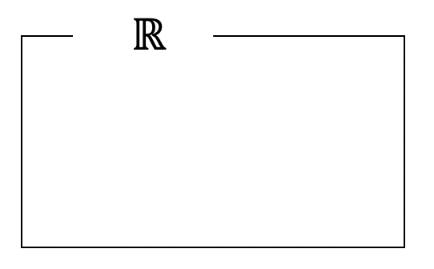

* `議論領域`($`U`$)：考慮する集合の全てを包括する

* $`x \in A`$

  * $`x`$ が集合 $`A`$ の元である場合

  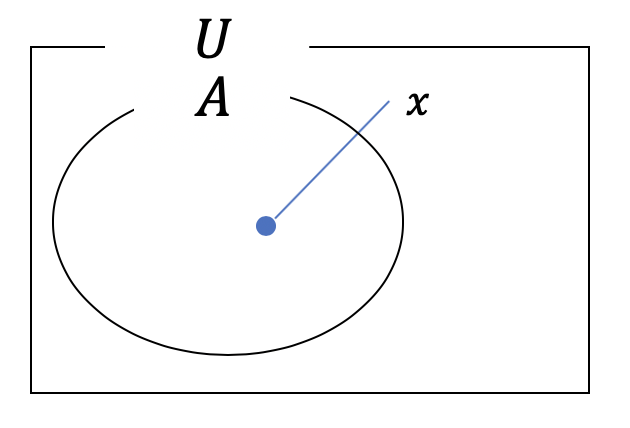

* $`A \subseteq B`$

  * $`\{ x \vert x \in A ならば x \in B\}`$

  * $`A`$ と $`B`$ が相等の場合も含む

  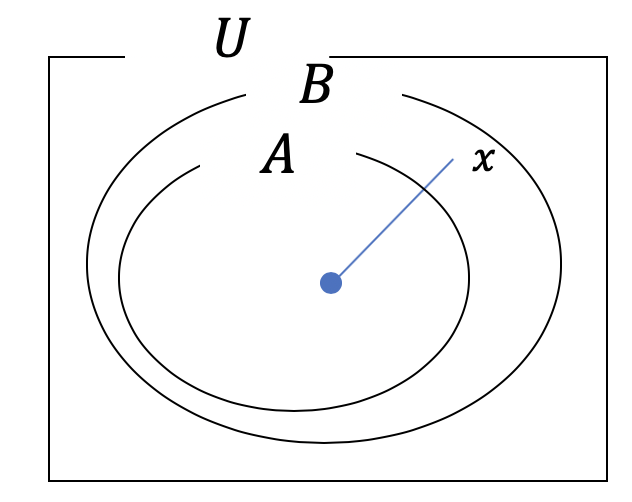

* $`A \cap B`$

  * $`A`$ と $`B`$ の積集合

  * $`\{ x \vert x \in A かつ x \in B\}`$

  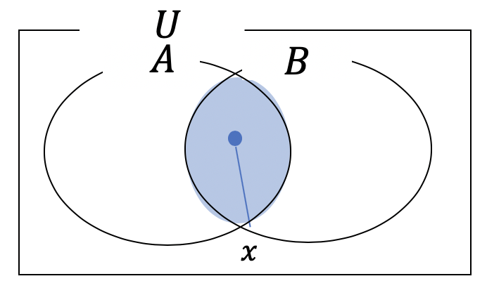

* $`A \cup B`$

  * $`A`$ と $`B`$ の和集合

  * $`\{ x \vert x \in A または x \in B\}`$

  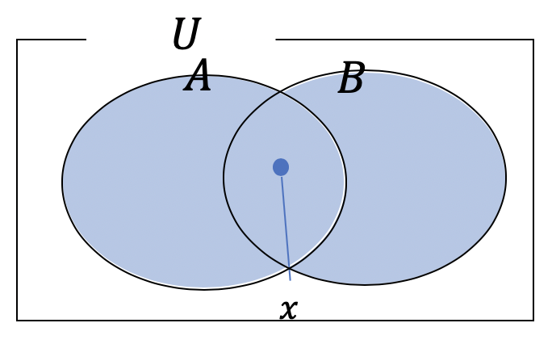

* $`A \setminus B`$

  * $`A`$ と $`B`$ の差集合

  * $`\{ x \vert x \in A かつ x \notin B\}`$

  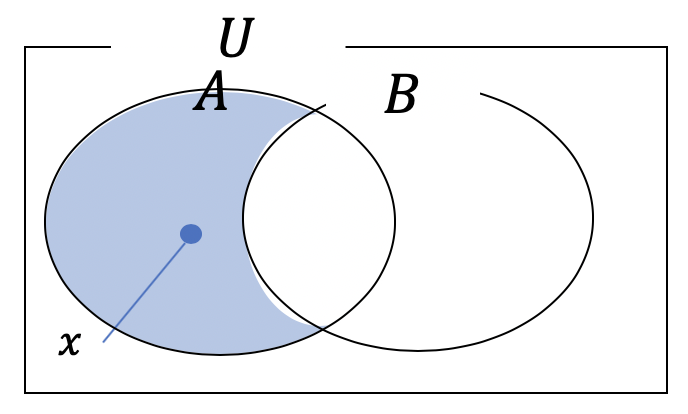

* $`\bar{A}`$

  * 集合 $`A`$ の補集合

  * $`\bar{A}=U \setminus A`$

  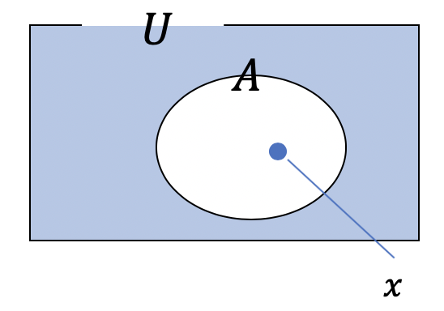

* $`A \cap B= \varnothing`$

  * 2つの集合 $`A`$ と $`B`$ が互いに素

  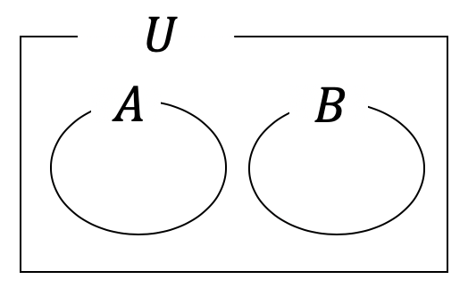

* 濃度： $`\vert A \vert`$

  * 集合 $`A=\{x_1, x_2, \cdots, x_n\}`$ の要素数

  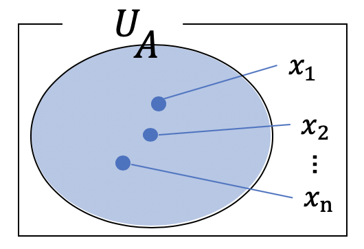

* $`2^A=\{B \vert B \subseteq A\}`$

  * $`A`$ の全ての部分集合の集まり

  * 冪集合 $`2^A`$ と呼ぶ

  * 濃度： $`\vert 2^A \vert=2^{\vert A \vert}`$

  > $`B`$ に含まれているか、含まれていないか：2通り
  >
  > 例) $`A=\{1, 2, 3\}`$
  >
  > $`A=\{ \varnothing, \{1\}, \{2\}, \{3\}, \{1,2\}, \{1,3\}, \{2,3\}, \{1,2,3\} \}`$

  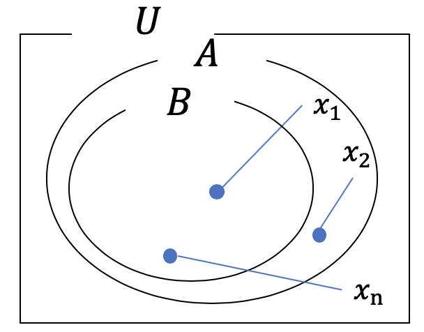

* 集合 $`A`$ の特性関数

  * $`A \subset U`$ の時、以下の条件が成立する

    * $`x \in A`$ ならば $`f(x)=true`$

    * $`x \in U \setminus A`$ ならば $`f(x)=false`$

  * 関数 $`f:U \rightarrow \{ true, false\} `$

  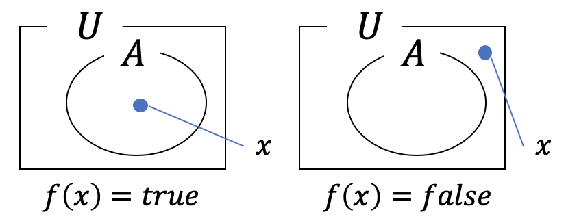

### デカルト積

* デカルト積(直積)： $`A \times B`$

  * 各集合から1つずつ元を取り出して組にしたもの全ての集まり

  * $`\{(x,y) \vert x \in A かつ y \in B\}`$

  

* $`A`$ , $`B`$ 上の二項関係

  * ある集合 $`A=\{a_1, \cdots, a_n\}`$ と $`B=\{b_1, \cdots, b_n\}`$ に対して、$`R \in A \times B`$ であるような組の集合

  > 集合 $`R`$ は、$`(x,y) \in R`$ の条件を満たしている

  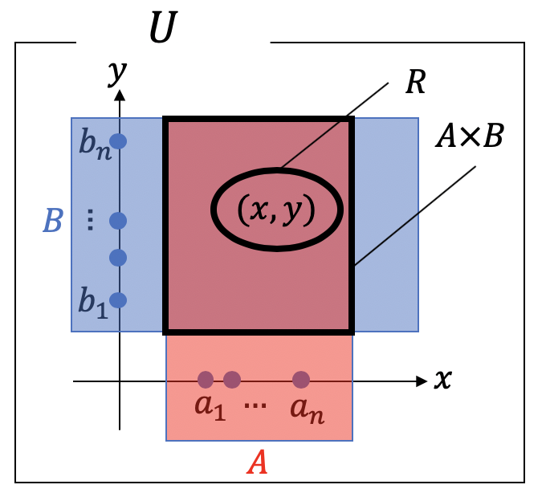

  * もし $`A=B`$ であれば、「 $`A`$ 上の二項関係」という

  * また $`(x,y) \in R`$ を、$`xRy`$ と表すことがある

### A上の二項関係の性質

1. `反射律`： $`\forall x \in A, xRx`$

1. `対称律`： $`\forall x, \forall y \in A, xRy \Rightarrow yRx`$

1. `反対称律`： $`\forall x, \forall y \in A, xRy かつ yRx \Rightarrow x=y`$

1. `推移律`： $`\forall x, \forall y, \forall z \in A, xRy かつ yRz \Rightarrow xRz`$

1. `完全性`： $`\forall x, \forall y \in A または yRx`$

### 二項関係と順序

* `半順序`：`反射律`、`反対称律`、`推移律`を満たす二項関係

  * 例)部分集合の関係 $`\subseteq`$

* `全順序`：`完全性`、`反対称律`、`推移律`を満たす二項関係

  * 例) $`\mathbb{R}`$ 上の関係 $` \leq`$

* $`x`$ と $`y`$ は`比較可能`： $`xRy`$ または $`yRx`$

  * そうでない場合は、`比較不可能`

* `同値関係`($`\equiv`$)：`反射律`、`対称律`、`推移律`を満たす二項関係

  * $`x`$ の`同値類`を、$`[x]=\{y \vert x \equiv y\}`$ とする

  > 例)任意の集合上で、「 $`A`$ は $`B`$ と同じ数の要素を含んでいる」という二項関係は、`同値関係`

* 任意の2つの同値類は互いに素であり、かつ全ての同値類の和集合は全体の集合

  * 言い換えると、全ての同値類の集合は、**集合の分割を形成する**

    * 集合 $`A`$ の分割： $`A_1, \cdots, A_n`$

    * $`A_1 \cup \cdots \cup A_n=A`$ かつ、 $`A_i \cap A_j = \varnothing (i \neq j)`$ である時、 $`A=A_1 \uplus \cdots \uplus A_n`$

* この例として、特徴量の決定木を $`T`$ とし、関係 $`\sim_T \subseteq X \times X`$ を以下のように定義する

  * 「 $`x \sim _T`$ $`\Leftrightarrow`$ $`x`$ および $`x'`$ は、特徴の決定木 $`T`$ の同じ葉に割り当てられる」

  * このとき、 $`\sim_T`$ は`同値関係`である

  * `同値類`は、 $`T`$ に関するインスタンス空間の分割を形成する

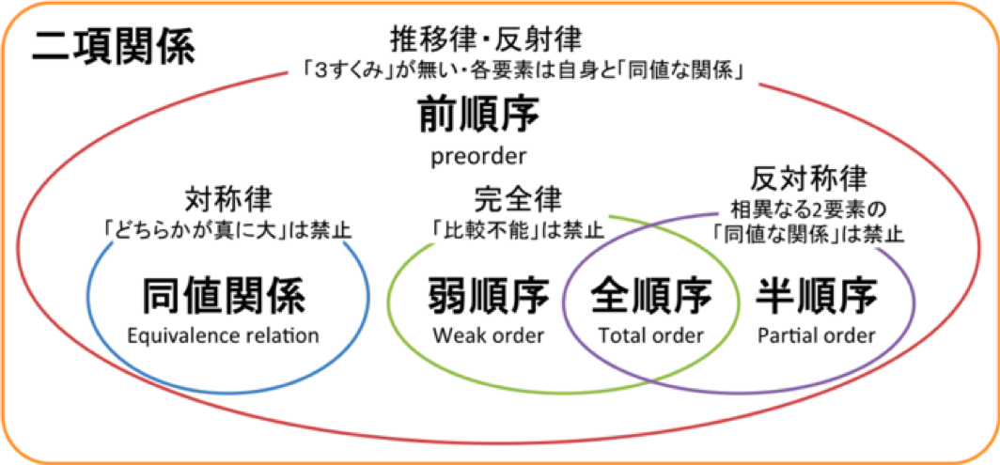
