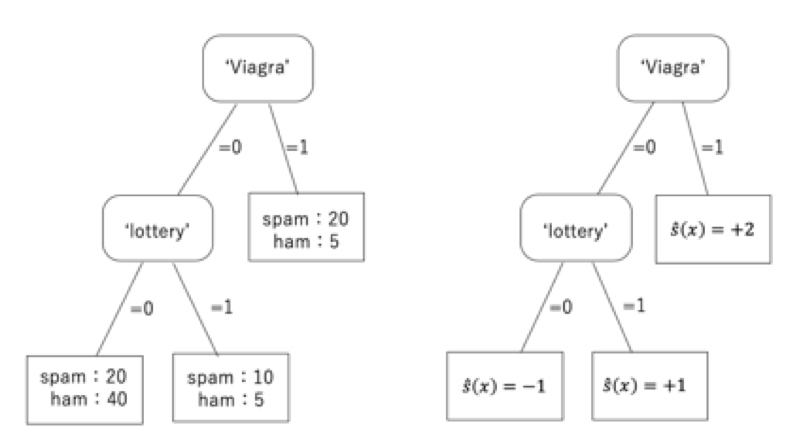
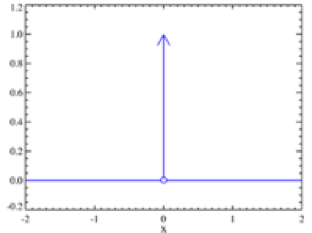

01 分類
=======

* `分類器`：写像 $`\hat{c}: X \rightarrow C`$

  * ただし、 $`C= \{ C_1, C_2, \cdots, C_k\}`$ は有限

  * また、通常は少数のクラスラベルの集合

  * クラスの事例の集合を表すために、しばしば $`C_i`$ を表すことがある

* $`\hat{c}(x)`$：未知の関数 $`c(x)`$ の推定量であることを示すために、 $`\hat{}`$ (ハット)を使う

* 分類器用の事例は、 $`(x,c(x))`$ の形式で表される

  * ただし、$`x \in X`$ はインスタンス

  * $`c(x)`$ ：インスタンスの真のクラス

* 分類器の学習は、$`\hat{c}`$ が $`c`$ に出来るだけ近づくように $`c`$ を構築することが必要

  > 理想的には、訓練データ上だけでなくインスタンス空間 $`X`$ の全体

### 単純なケース

* 最も単純な場合は、`2クラス分類`(`正`と`負`)

  * 二値分類

  * 概念学習：正のクラスを概念と呼ぶことができる場合

> 例)スパムメールのフィルタリングは、
>
>  * スパムメール：正のクラス
>
>  * ハムメール：負のクラス
>
>* 他にも、医学診断(特定の疾患がある場合に正のクラスとする)や、クレジットカード詐欺検知等

### 特徴木の例

* `特徴木`：クラスで各葉にラベルをつけた分類器

  * 各葉の中の「多数派クラス」を割り当てる

1. 'Viagra'を含む：スパムメール(右の葉)

1. 'lottery'を含む：スパムメール

* 「分類の精度」がわかる(数値)

> 例)左端の葉：正確に40のハムを予測するが、20のスパムを誤ってラベル付けする
>
> 例)中央の葉：正確に10のスパムメールを分類するが、5つのハムメールを誤ってラベル付けする
>
> 例)右端の葉：正確に20のスパムメールを選ぶが、誤って5つのハムメールを選ぶ
>
> まとめると、「50のスパムメールのうちの30のメールが正しく分類され、50のハムメールのうち40が正しく分類される」
>
> 左：葉における訓練データのクラス分布による特徴木
>
> 右：決定木は、多数決により得られる
>
> 

## 1.分類性能の評価

* 分類器の性能：`分割表`または`混同行列`

  * 各行：テスト集合に記録された実際のクラス

  * 各列：分類器によって予測されたクラス

  > 例)第1行：テストデータが50の正例を含み、そのうち30は正確に、20は不正確に予測された

|                  | 予測 $`\oplus`$ | 予測 $`\ominus`$ |     |
| ---------------- | --------------- | ---------------- | --- |
| 実際 $`\oplus`$  | 30              | 20               | 50  |
| 実際 $`\ominus`$ | 10              | 40               | 50  |
|                  | 40              | 60               | 100 |

* 最後の列と最後の行は、`周辺度数`(各列と各行の合計)

  * 統計的有意性を評価する事ができる

> 例)以下の表は同じ周辺度数を持っているが、分類器は正であるか負であるかを無作為に選択
>
> その結果、予測クラス内の実際の分布は、全体の分布(この場合は一様分布)と同じ
>
> |                  | 予測 $`\oplus`$ | 予測 $`\ominus`$ |     |
> | ---------------- | --------------- | ---------------- | --- |
> | 実際 $`\oplus`$  | 20              | 30               | 50  |
> | 実際 $`\ominus`$ | 20              | 30               | 50  |
> |                  | 40              | 60               | 100 |

### 正答率と誤り率

* `正答率`：正しく分類されたテストインスタンスの割合

* テスト集合 $`Te`$ 上での正答率は、

$`acc=\frac{1}{\vert Te \vert}\sum_{x \in Te} I[\hat{c}(x)=c(x)]`$

> $`\hat{c}(x)=c(x)`$ ：分類機によって正しく分類されたテストインスタンス数
>
> 関数 $`I[\cdot]`$ ：指示関数
>
>   * 引数が`true`：1
>
>   * 引数が`false`：0
>
> 

* `誤り率`：誤って分類されたインスタンスの割合

* ここで、「`正答率`」+「`誤り率`」=`1`という構図となる

> 例)下の表
>   
>   * `正答率`：0.70(70%)
>
>   * `誤り率`：0.30(30%)
>
> |                  | 予測 $`\oplus`$ | 予測 $`\ominus`$ |     |
> | ---------------- | --------------- | ---------------- | --- |
> | 実際 $`\oplus`$  | 20              | 30               | 50  |
> | 実際 $`\ominus`$ | 20              | 30               | 50  |
> |                  | 40              | 60               | 100 |

### テストデータの正答率

* `テストデータの正答率`：任意のインスタンス $`x \in X`$ が正しく分類される確率の推定値
