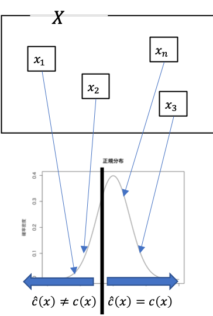
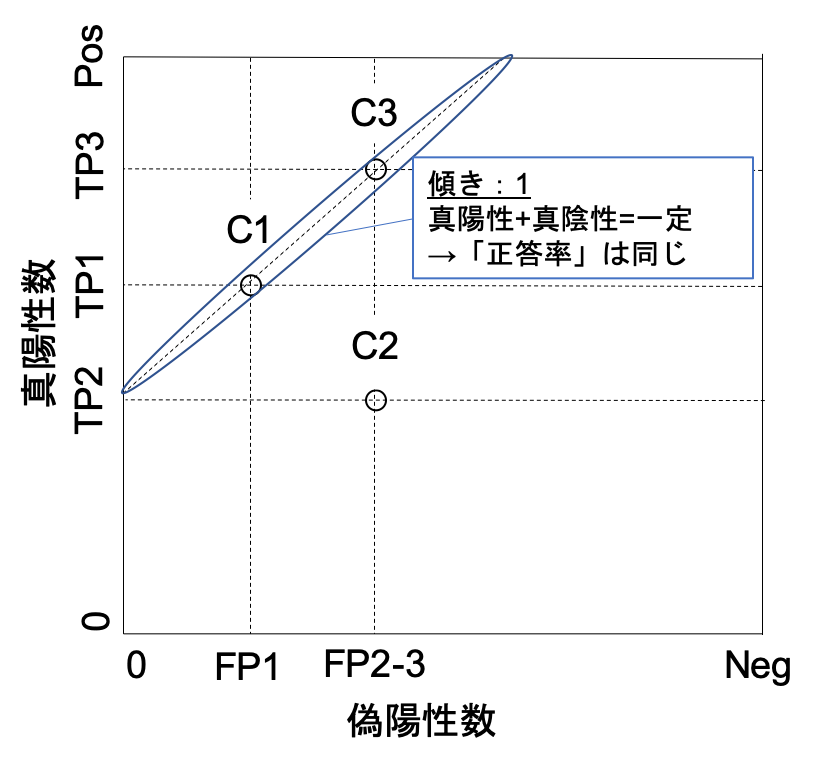

01 分類
=======

* `分類器`：写像 $`\hat{c}: X \rightarrow C`$

  * ただし、 $`C= \{ C_1, C_2, \cdots, C_k\}`$ は有限

  * また、通常は少数のクラスラベルの集合

  * クラスの事例の集合を表すために、しばしば $`C_i`$ を表すことがある

* $`\hat{c}(x)`$：未知の関数 $`c(x)`$ の推定量であることを示すために、 $`\hat{}`$ (ハット)を使う

* 分類器用の事例は、 $`(x,c(x))`$ の形式で表される

  * ただし、$`x \in X`$ はインスタンス

  * $`c(x)`$ ：インスタンスの真のクラス

* 分類器の学習は、$`\hat{c}`$ が $`c`$ に出来るだけ近づくように $`c`$ を構築することが必要

  > 理想的には、訓練データ上だけでなくインスタンス空間 $`X`$ の全体

### 単純なケース

* 最も単純な場合は、`2クラス分類`(`正`と`負`)

  * 二値分類

  * 概念学習：正のクラスを概念と呼ぶことができる場合

> 例)スパムメールのフィルタリングは、
>
>  * スパムメール：正のクラス
>
>  * ハムメール：負のクラス
>
>* 他にも、医学診断(特定の疾患がある場合に正のクラスとする)や、クレジットカード詐欺検知等

### 特徴木の例

* `特徴木`：クラスで各葉にラベルをつけた分類器

  * 各葉の中の「多数派クラス」を割り当てる

1. 'Viagra'を含む：スパムメール(右の葉)

1. 'lottery'を含む：スパムメール

* 「分類の精度」がわかる(数値)

> 例)左端の葉：正確に40のハムを予測するが、20のスパムを誤ってラベル付けする
>
> 例)中央の葉：正確に10のスパムメールを分類するが、5つのハムメールを誤ってラベル付けする
>
> 例)右端の葉：正確に20のスパムメールを選ぶが、誤って5つのハムメールを選ぶ
>
> まとめると、「50のスパムメールのうちの30のメールが正しく分類され、50のハムメールのうち40が正しく分類される」
>
> 左：葉における訓練データのクラス分布による特徴木
>
> 右：決定木は、多数決により得られる
>
> 

## 1.分類性能の評価

* 分類器の性能：`分割表`または`混同行列`

  * 各行：テスト集合に記録された実際のクラス

  * 各列：分類器によって予測されたクラス

  > 例)第1行：テストデータが50の正例を含み、そのうち30は正確に、20は不正確に予測された

|                  | 予測 $`\oplus`$ | 予測 $`\ominus`$ |     |
| ---------------- | --------------- | ---------------- | --- |
| 実際 $`\oplus`$  | 30              | 20               | 50  |
| 実際 $`\ominus`$ | 10              | 40               | 50  |
|                  | 40              | 60               | 100 |

* 最後の列と最後の行は、`周辺度数`(各列と各行の合計)

  * 統計的有意性を評価する事ができる

> 例)以下の表は同じ周辺度数を持っているが、分類器は正であるか負であるかを無作為に選択
>
> その結果、予測クラス内の実際の分布は、全体の分布(この場合は一様分布)と同じ
>
> |                  | 予測 $`\oplus`$ | 予測 $`\ominus`$ |     |
> | ---------------- | --------------- | ---------------- | --- |
> | 実際 $`\oplus`$  | 20              | 30               | 50  |
> | 実際 $`\ominus`$ | 20              | 30               | 50  |
> |                  | 40              | 60               | 100 |

### 正答率と誤り率

* `正答率`：正しく分類されたテストインスタンスの割合

* テスト集合 $`Te`$ 上での正答率は、

$$`acc=\frac{1}{\vert Te \vert}\sum_{x \in Te} I[\hat{c}(x)=c(x)]`$$

> $`\hat{c}(x)=c(x)`$ ：分類機によって正しく分類されたテストインスタンス数
>
> 関数 $`I[\cdot]`$ ：指示関数
>
>   * 引数が`true`：1
>
>   * 引数が`false`：0
>
> 

* `誤り率`：誤って分類されたインスタンスの割合

* ここで、「`正答率`」+「`誤り率`」=`1`という構図となる

> 例)下の表
>   
>   * `正答率`：0.70(70%)
>
>   * `誤り率`：0.30(30%)
>
> |                  | 予測 $`\oplus`$ | 予測 $`\ominus`$ |     |
> | ---------------- | --------------- | ---------------- | --- |
> | 実際 $`\oplus`$  | 20              | 30               | 50  |
> | 実際 $`\ominus`$ | 20              | 30               | 50  |
> |                  | 40              | 60               | 100 |

### テストデータの正答率

* `テストデータの正答率`：任意のインスタンス $`x \in X`$ が正しく分類される確率の推定値

  $$`P_X(\hat{c}(x)=c(x))`$$
`

  > インスタンス空間 $`X`$ 上の確率分布： $`P_X`$

* テストデータは可能な限り偏りなくインスタンス空間を代表することが重要

  * インスタンスの生起確率は、$`X`$ 上の未知の確率分布によって支配

  * テストデータ $`Te`$ は、生起確率に従って生成される

  > `生起確率`：特定の事例がどの程度起こり易いか
  >
  > 

### 分類機の性能をクラスごとに区別する

* `真陽性`：真には正であるものを、正しく正であると分類

* `真陰性`：真には負であるものを、正しく負であると分類

* `偽陽性`：真には正であるものを、誤って負であると分類

* `偽陰性`：真には負であるものを、誤って正であると分類

  > * `正負`：分類器の予測
  >
  > * `真偽`：予測が正しいかどうか

|                  | 予測 $`\oplus`$ | 予測 $`\ominus`$ |     |
| ---------------- | --------------- | ---------------- | --- |
| 実際 $`\oplus`$  | 30(`真陽性`)    | 20(`偽陰性`)     | 50  |
| 実際 $`\ominus`$ | 10(`偽陽性`)    | 40(`真陰性`)     | 50  |
|                  | 40              | 60               | 100 |

### 各クラスごとの正答率

* `真陽性率`：正しく分類された正例の割合(`感度`)

  * $`X`$ 上の任意の正例が、正しく分類される確率 $`P_X(\hat{c}(x)=\oplus \vert c(x)=\oplus)`$

  $$`tpr = \frac{\sum_{x \in Te}I[\hat{c}(x)=c(x)=\oplus]}{\sum_{x \in Te}I[c(x)=\oplus]}`$$
`
* `真陰性率`：正しく分類された負例の割合(`特異性`)

  * $`X`$ 上の任意の負例が、正しく分類される確率 $`P_X(\hat{c}(x)=\ominus \vert c(x)=\ominus)`$

  $$`tpr = \frac{\sum_{x \in Te}I[\hat{c}(x)=c(x)=\ominus]}{\sum_{x \in Te}I[c(x)=\ominus]}`$$
`

|                  | 予測 $`\oplus`$ | 予測 $`\ominus`$ |     |
| ---------------- | --------------- | ---------------- | --- |
| 実際 $`\oplus`$  | **30(`真陽性`)**    | 20               | 50  |
| 実際 $`\ominus`$ | 10              | **40(`真陰性`)**     | 50  |
|                  | 40              | 60               | 100 |

> * `真陽性率`：$`\frac{30}{50}=0.60`$
>
> * `真陰性率`：$`\frac{40}{50}=0.80`$

* `偽陽性率`：偽陽性の数の正例の総数に対する割合

* `偽陰性率`：偽陰性の数の負例の総数に対する割合

|                  | 予測 $`\oplus`$  | 予測 $`\ominus`$ |     |
| ---------------- | ---------------- | ---------------- | --- |
| 実際 $`\oplus`$  | 30               | **20(`偽陰性`)** | 50  |
| 実際 $`\ominus`$ | **10(`偽陽性`)** | 40               | 50  |
|                  | 40               | 60               | 100 |

> * `偽陽性率`：$`\frac{10}{50}=0.20`$
>
> * `偽陰性率`：$`\frac{20}{50}=0.40`$

* 通常の`正答率`は、以下の通りに計算できる

  * `正答率`：`真陽性率`と`真陰性率`の平均

  * `誤り率`：`偽陽性率`と`偽陰性率`の平均
`
> ただし、テストデータにおいて正例と負例の数が等しい場合にのみ正しい

### 重み付き平均としての正答率

|                  | 予測 $`\oplus`$ | 予測 $`\ominus`$ |     |
| ---------------- | --------------- | ---------------- | --- |
| 実際 $`\oplus`$  | 60              | 15               | 75  |
| 実際 $`\ominus`$ | 10              | 15               | 25  |
|                  | 70              | 30               | 100 |

* `真陽性率`：$`\frac{60}{75}=0.80`$

* `真陰性率`：$`\frac{15}{25}=0.60`$

> 通常の`正答率`：$`\frac{(60+15)}{100}=0.75`$

* 正例の割合：$`pos=0.75`$

* 負例の割合：$`neg=1-pos=0.25`$

> 重み付き平均としての`正答率`：$`acc=pos \cdot tpr + neg \cdot tnr=0.75`$

* 正答率を上げるためには、以下の条件が考えられる

  * 多数派クラスでの真陽性率、真陰性率を高くする

  > ただし、検索でヒットしない確率が99%のモデルが優れているとは言えない

  * `適合率`を向上させる

  > `適合率`：予測された正例のうち、実際に正であるものの割合
  >
  > $`\frac{60}{70}=0.857`$

| 尺度                                   | 定義                                                                                              | 同等なもの                     | 推定するもの                                 |
| -------------------------------------- | ------------------------------------------------------------------------------------------------- | ------------------------------ | -------------------------------------------- |
| `陽性数`                               | $`Pos=\sum_{x \in Te} I[c(x)=\oplus]`$                                                            |                                |                                              |
| `陰性数`                               | $`Neg=\sum_{x \in Te} I[c(x)=\ominus]`$                                                           | $`\vert Te \vert - Pos`$       |                                              |
| `真陽性数`                             | $`TP=\sum_{x \in Te} I[\hat{c}(x)=c(x)=\oplus]`$                                                  |                                |                                              |
| `真陰性数`                             | $`TN=\sum_{x \in Te} I[\hat{c}(x)=c(x)=\ominus]`$                                                 |                                |                                              |
| `偽陽性数`                             | $`FP=\sum_{x \in Te} I[\hat{c}(x)=\oplus, c(x)=\ominus]`$                                         | $`Neg-TN`$                     |                                              |
| `偽陰性数`                             | $`FN=\sum_{x \in Te} I[\hat{c}(x)=\ominus, c(x)=\oplus]`$                                         | $`Pos-TP`$                     |                                              |
| `正例の割合`                           | $`pos=\frac{1}{\vert Te \vert}\sum_{x \in Te}I[c(x)=\oplus]`$                                     | $`\frac{Pos}{\vert Te \vert}`$ | $`P(c(x)=\oplus)`$                           |
| `負例の割合`                           | $`pos=\frac{1}{\vert Te \vert}\sum_{x \in Te}I[c(x)=\ominus]`$                                    | $`1-Pos`$                      | $`P(c(x)=\ominus)`$                          |
| `クラス比`                             | $`clr=\frac{pos}{neg}`$                                                                           | $`\frac{Pos}{Neg}`$            |                                              |
| `正答率`                               | $`acc=\frac{1}{\vert Te \vert}\sum_{x \in Te} I[\hat{c}(x)=c(x)]`$                                |                                | $`P(\hat{c}(x)=c(x))`$                       |
| `誤り率`                               | $`acc=\frac{1}{\vert Te \vert}\sum_{x \in Te} I[\hat{c}(x)\neq c(x)]`$                            | $`1-acc`$                      | $`P(\hat{c}(x) \neq c(x))`$                  |
| `真陽性率` `感度` `再現率`       | $`tpr = \frac{\sum_{x \in Te}I[\hat{c}(x)=c(x)=\oplus]}{\sum_{x \in Te}I[c(x)=\oplus]}`$          | $`\frac{TP}{Pos}`$             | $`P(\hat{c}(x)=\oplus \vert c(x)=\oplus)`$   |
| `真陰性率` `特異度` `負の再現率` | $`tnr = \frac{\sum_{x \in Te}I[\hat{c}(x)=c(x)=\ominus]}{\sum_{x \in Te}I[c(x)=\ominus]}`$        | $`\frac{TN}{Neg}`$             | $`P(\hat{c}(x)=\ominus \vert c(x)=\ominus)`$ |
| `偽陽性率` `誤警報率`               | $`fpr = \frac{\sum_{x \in Te}I[\hat{c}(x)=\oplus, c(x)=\ominus]}{\sum_{x \in Te}I[c(x)=\ominus]}`$ | $`\frac{FP}{Neg}=1-tnr`$       | $`P(\hat{c}(x)=\oplus \vert (x)= \ominus)`$  |
| `偽陰性率`                             | $`fnr = \frac{\sum_{x \in Te}I[\hat{c}(x)=\ominus, c(x)=\oplus]}{\sum_{x \in Te}I[c(x)=\oplus]}`$  | $`\frac{FN}{Pos}=1-tpr`$       | $`P(\hat{c}(x)=\ominus \vert (x)= \oplus)`$  |
| `適合度` `信頼度`                   | $`prec=\frac{\sum_{x \in Te}I[\hat{c}(x)=c(x)=\oplus]}{\sum_{x \in Te}I[\hat{c}(x)=\oplus]}`$     | $`\frac{TP}{(TP+FP)}`$         | $`P(c(x)=\oplus \vert \hat{c}(x)= \oplus)`$  |

## 2.分類性能の可視化

* `カバレッジプロット`：分類器や他のモデルの性能を視覚化するプロット

  * 正例数 $`Pos`$ 、負例数 $`Neg`$ 、真陽性数 $`TP`$ 、偽陽性数 $`FP`$ を用いる

  > 2クラスの分割表では、4つの数字を選べば十分(`自由度が4`)

|                  | 予測 $`\oplus`$ | 予測 $`\ominus`$ |     |
| ---------------- | --------------- | ---------------- | --- |
| 実際 $`\oplus`$  | 60(`真陽性数`)  | 15               | 75  |
| 実際 $`\ominus`$ | 10(`偽陽性数`)  | 15               | 25  |
|                  | 70(`正例数`)    | 30(`負例数`)     | 100 |

> * $`C_1`$ は、 $`C_2`$ よりも優れている(`優越している`)
>
>   * $`C_1`$ は、$`C_2`$ より多くの真陽性
>
>   * $`C_1`$ は、$`C_2`$ より少ない偽陽性

* $`C_3`$ を考える

  * $`C_1`$ より、正例は良いが、負例は悪い

  * 真陽性が重要であれば $`C_1`$ 、真陰性が重要であれば $`C_3`$ を選ぶ

* カバレッジプロットにおいて、同じ正答率の分類器は **傾き1の線分上にある**

### ROCプロット

* クラス分布が異なるテストデータにおける結果を結合できるように、カバレッジプロットを正規化

  > 真陽性率と偽陽性率は既知だが、クラス分布は未知なので、`正答率`は計算できない

  * `平均再現率`：真陽性率と真陰性率の平均($`avg-rec`$)

  > $$` avg-rec=\frac{(tpr+tnr)}{2}=\frac{(tpr+1-fpr)}{2}=\frac{(1+y_0)}{2}`$$
`

  * 正答率のアイソメトリックの傾きは、$`\frac{Neg}{Pos}=\frac{1}{clr}`$

* ROCプロットにおいて、傾き1の線分は、**同じ平均再現率をもつ分類器を結んだもの**

  * 陽性再現率が重要：$`C_3`$ 、陰性再現率が重要：$`C_1`$

### まとめ

* クラス分布を考慮に入れたい場合：`カバレッジプロット`

  > 単一のデータセットなど

* 異なるクラス分布を持つ結果を合併したい場合：`ROCプロット`

  > 異なったデータセットなど

| 版   | 年/月/日   |
| ---- | ---------- |
| 初版 | 2019/06/09 |
