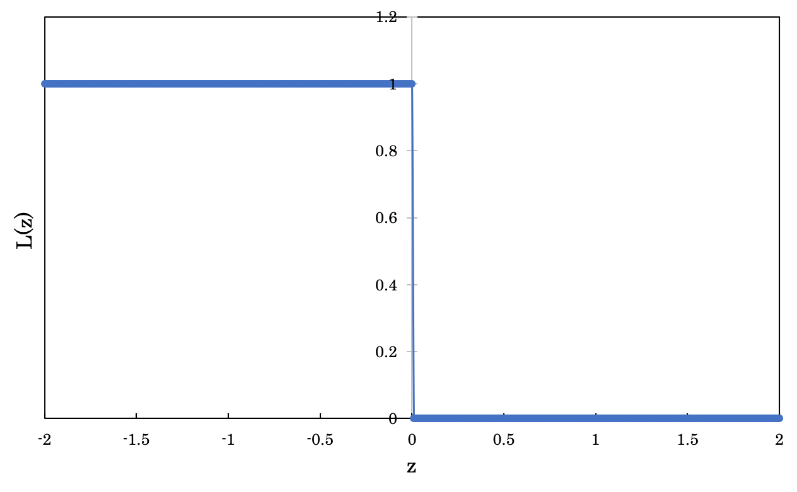
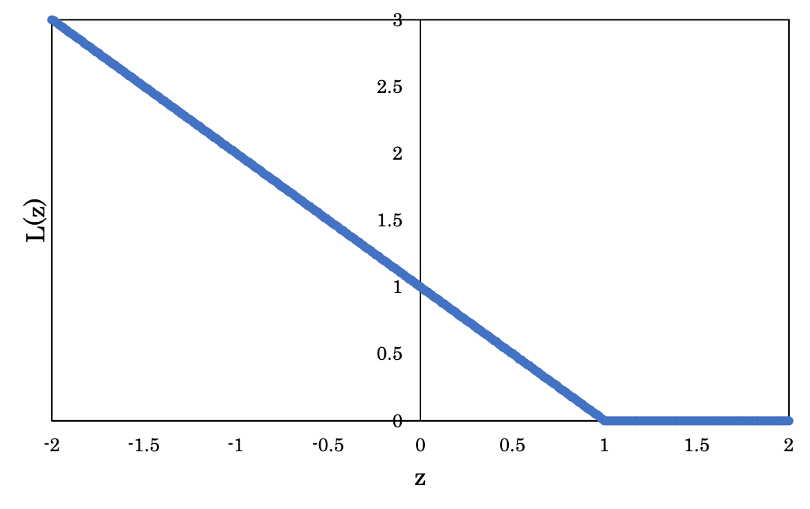
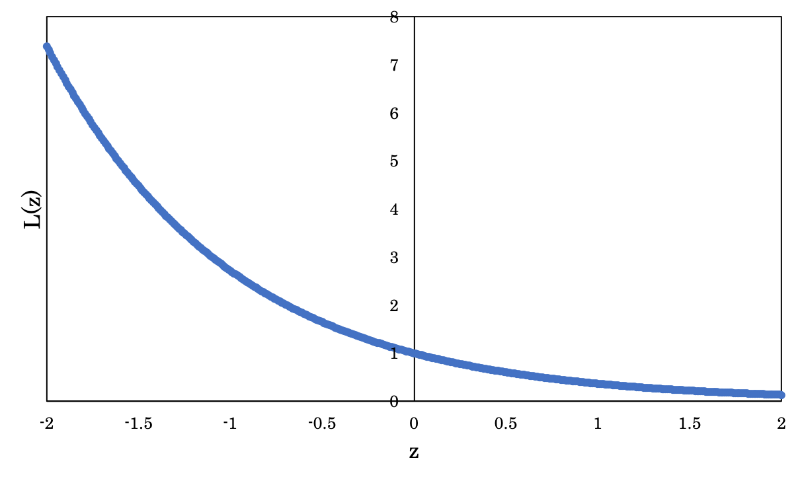
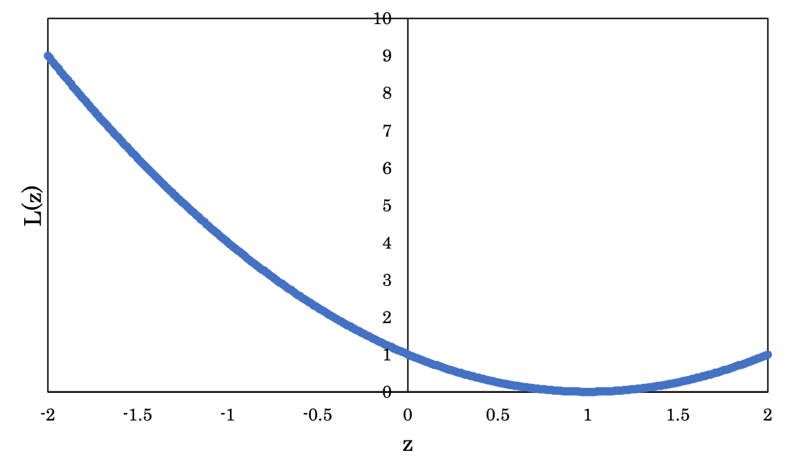
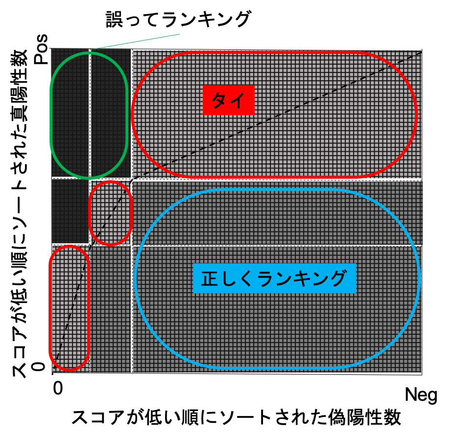
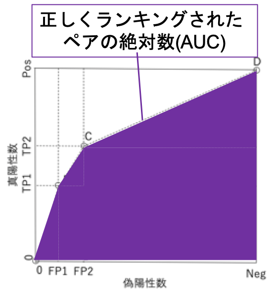
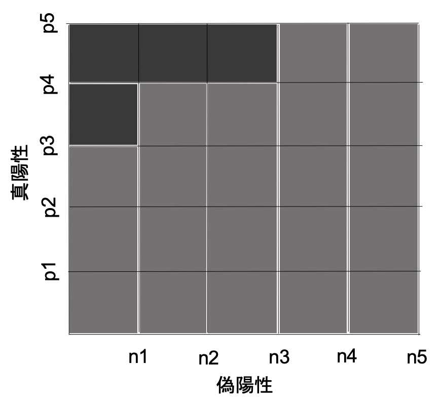

02 スコアリングとランキング
=======================

### スコアリング

* `スコアリング分類器`：写像 $`\hat{\bf{s}}: X \rightarrow \mathbb{R}^k`$

  * インスタンス空間から、$`k(>1)`$ 次元実ベクトル空間への写像

  * $`\hat{s}_i(x)`$ ：インスタンス $`x`$ に関して、クラス $`C_i`$ に割り当てられたスコア

  > $`\begin{eqnarray}
  > \hat{\bf{s}}(x)=(\hat{s}_1(x),\cdots,\hat{s}_k(x))
  > \end{eqnarray}`$
`

### スコアリングの例(スコアリング木)

* 各葉のスコアを得る：スパムとハムの比率を計算する

  > ただし、ここでは底を2として対数を取る

  * 左の葉： $`\frac{20}{40}=\frac{1}{2}`$ ($`\log_2{\frac{1}{2}}=-1`$)

  * 中央の葉： $`\frac{10}{5}=2`$ ($`\log_2{2}=1`$)

  * 右の葉： $`\frac{20}{5}=4`$ ($`\log_2{4}=2`$)

* $`\hat{s}>0`$ の場合、スパムと予測する

### 損失関数

* `マージン`：スコア分類器によって事例に割り当てられたもの

  * 真のクラス $`c(x)`$ に対して、以下の式で定義する

  $`z(x)=c(x)\hat{s}(x)
      \begin{cases}
      正値(正確な予測):c(x)=+1 \\
      負値(正しくない予測):c(x)=-1
    \end{cases}`$
`

* `損失関数`：大きな負の値に罰則を課す

  * 各事例のマージン $`z(x)`$ を、関連する損失 $`L(z(x))`$ へ写像する

  $`L:\mathbb{R} \rightarrow[0, \infty)
    \begin{cases}
      z<0:L(z) \geq 1\\
      z=0:L(0)=1 \\
      z>0:0 \leq L(z) <1
    \end{cases}`$
`

* テストデータ $`Te`$ 上の平均損失は、以下の式で表される

  $`\begin{eqnarray}
  \frac{1}{\vert Te \vert} \sum_{x \in Te}L(z(x))
  \end{eqnarray}`$
`

### 損失関数の例

* `0-1損失関数`：インスタンスの大きさを無視(符号のみ考慮)

  $`L_{01}(z)=
  \begin{cases}
    z \leq0:1 \\
    z>0:0
  \end{cases}`$
`

* `平均0-1損失`：テスト事例を誤分類する割合

  $`\begin{eqnarray}
  \frac{1}{\vert Te \vert}\sum_{x \in Te}L_{01}(z(x))
  =\sum_{x \in Te}I[c(x)\hat{s}(x)\leq0] \\
  = \sum_{x \in Te}I[c(x)\neq\hat{c}(x)] \\
  = err
  \begin{cases}
    \hat{s}>0:\hat{c}=+1\\
    \hat{s}=0:\hat{c}=0 \\
    \hat{s}<0:\hat{c}=-1
  \end{cases}
  \end{eqnarray}`$
`

* `ヒンジ損失`：インスタンスのマージンが1以上か否かで損失が決定

  $`L_h(z)
  \begin{cases}
    z \leq 1:(z-1) \\
    z > 1:0
  \end{cases}`$
`

* `対数損失`

  $`\begin{eqnarray}
  L_{\log}(Z)=\log_{2}(1+ \exp(-z))
  \end{eqnarray}`$
`

* `指数損失`

  $`\begin{eqnarray}
  L_{\exp}(Z)=\exp(-z)
  \end{eqnarray}`$
`

* `二乗損失`

  * $`z > 1`$ のとき $`0`$ ：`ヒンジ損失`

  $`\begin{eqnarray}
  L_{sq}(Z)=(1-z)^2
  \end{eqnarray}`$
`

## 1.ランキングの性能評価と可視化

* `スコア`：分類器によって割り当てられるもの

  * クラス $`c(x)`$ でラベル付けされたインスタンス $`x`$ から、分類器として学習

  > `回帰`：真の関数値 $`(x,f(x))`$ でラベル付けされたインスタンスから、関数 $`\hat{f}`$ を学習する

* 多くの場合、インスタンスの集合上のスコアの順序のみを保存

  * 大きさを無視するので、外れ値に対して影響を受けにくい

  * スコアを表現するスケールについて、仮定を置く必要がない

* `ランカー`：より高いスコアが正のクラスをより強く示唆

  * 負例から正例を分離するための特定のスコア閾値を仮定しない

* `ランキング`：事例の集合上のタイ(同順位)を許した全順序として定義される

  > `全順序`：全ての2つの要素が比較可能

### ランキングの例

* `+`：正例の列、`[...]`：タイのインスタンスとして、以下のランキングを生成する

  * 左の葉： $`[20+,40-]`$

  * 中央の葉： $`[10+,5-]`$

  * 右の葉： $`[20+,5-]`$

* ランキング中の分離点を選択することで、順位を分類に変えることができる

  * (A)：最初のセグメントの前に分離点を設定する(負クラスに全てのセグメント)

    > 2以上の任意のスコアを閾値

  * (B)：最初のセグメントを正クラスに割り当て、他の2つを負クラスに割り当てる

    > 1と2の間の任意のスコアを閾値

  * (C)：最初の2つのセグメントを正クラスに割り当てる

    > -1と1以上の任意のスコアを閾値

  * (D)：全てのセグメントを正のクラスに割り当てる

    > -1以下の任意のスコアを閾値

### ランキングの誤り

* `ランキングの誤り`：$`\hat{s}(x) < \hat{s}(x')`$ である場合に、$`x`$ が正例で、$`x'`$ が負例である場合

  1. ランキングの誤りの総数

    $`\begin{eqnarray}
    \sum_{x \in Te^{\oplus},x' \in Te^{\ominus}}I[\hat{s}(x) < \hat{s}(x')]
    \end{eqnarray}`$
`

  2. 同じスコア(タイ)を有する全ての正と負の事例

    > タイは中間の値として考える

    $`\begin{eqnarray}
    \frac{I[\hat{s}(x) < \hat{s}(x')]}{2}
    \end{eqnarray}`$
`

  3. ランキングの誤りの最大数

    $`\begin{eqnarray}
    \vert Te^{\oplus} \vert \cdot \vert Te^{\ominus} \vert = Pos \cdot Neg
    \end{eqnarray}`$
`

* `ランキングの誤り率`($`rank-err`$)

  $`\begin{eqnarray}
  rank-err=\frac{\sum_{x \in Te^{\oplus},x' \in Te^{\ominus}}I[\hat{s}(x) < \hat{s}(x')]+\frac{I[\hat{s}(x) < \hat{s}(x')]}{2}}{Pos \cdot Neg}
  \end{eqnarray}`$
`

* `ランキングの正答率`($`rank-acc`$)

  * 任意の正・負のペアが正しく順序付けされる確率の推定値として見ることができる

  $`\begin{eqnarray}
  rank-err=\frac{\sum_{x \in Te^{\oplus},x' \in Te^{\ominus}}I[\hat{s}(x) > \hat{s}(x')]+\frac{I[\hat{s}(x) < \hat{s}(x')]}{2}}{Pos \cdot Neg} \\
  =1-rank-err
  \end{eqnarray}`$
`

### ランキングの正答率

|        | 左の葉 | 中央の葉 | 右の葉 |
| ------ | ------ | -------- | ------ |
| ハム   | 40     | 5        | 5      |
| スパム | 20     | 10       | 20     |

* ランキングの誤り率

  > 正例よりもスコアが高いもの

  * 右の葉の5の負例：中央の10の正例、左の20の正例よりスコアが高い

    > $`5 \times 10 + 5 \times 20 = 150`$

  * 中央の葉の5の負例：左の葉の20の正例よりスコアが高い

    > $`5 \times 20 = 100`$

  * 故に、合計は以下の通りで表される

  $`\begin{eqnarray}
  \sum_{x \in Te^{\oplus},x' \in Te^{\ominus}}I[\hat{s}(x) < \hat{s}(x')] \\
  = 150 + 100 = 250
  \end{eqnarray}`$
`

* タイによる誤り

  * 左の葉：20の正例と、40の負例が同じスコアを持つ

    > $`\frac{20 \times 40}{2}=400`$

  * 中央の葉：5の正例と、10の負例が同じスコアを持つ

    > $`\frac{5 \times 10}{2}=25`$

  * 右の葉：20の正例と、5の負例が同じスコアを持つ

    > $`\frac{20 \times 5}{2}=50`$

  * 故に、合計は以下の通りで表される

  $`\frac{I[\hat{s}(x) < \hat{s}(x')]}{2} \\
  = 400 + 25 + 50 \\
  = 475`$
`

* ランキングの誤りの最大数

  $`Pos \cdot Neg \\
  = 50 \times 50 \\
  =2500`$
`

* ランキングの誤り率

  $`\frac{250 + 475}{2500} = 0.29`$
`

### ランキングの性能を可視化

### セルで描いたカバレッジプロット

* 正例数・負例数を、それぞれ縦軸と横軸にプロット

  > 各正例・負例ペアは、1つのセルに対応する

* より高いスコアをもつ事例が原点にして、スコアの降順に正例と負例を並べる

  * 右下：正しくランキングされたペア

  * 左上：誤ってランキングされたペア

  * 右下と左上の間：タイ

> * 斜線の下の面積：ランキング正答率
>
> * 斜線の上の面積；ランキングの誤り率

### カバレッジ曲線

* `カバレッジ曲線`：セルで描かれたカバレッジプロットの対角線に注目したもの

  * それぞれの点：ランキングの分離点、スコア閾値によって達成される分類性能

  > * 点A：達成不能な高い閾値
  >
  > * 点B：閾値1.5、$`TP1=20`$、$`FP1=5`$
  >
  > * 点C：閾値0、$`TP2=20+10=30`$、$`FP2=5+5=10`$
  >
  > * 点D：自明に低い閾値

* 曲線の線分：インスタンス空間の分割の同値クラス(例：特徴木の葉)

  > 各線分は、テストインスタンス数を超えない

* 各線分の傾き：その同値クラスにおける正のインスタンスと負のインスタンスの数の比

  * A〜B：4

  * B〜C：2

  * C〜D：1/2

### ROC曲線

* `AUC`：ROC曲線下の面積、ランキングの正答率を示している

> 例)スコアリング木に2倍の負例を追加：
>
> 2倍のランキングの誤りを生むが、同じく2倍の正・負のペアを生む
>
> =>ランキングの誤り率は不変

### 例：グレード付けモデル

* 決定境界が`B`の、線形分類器を考える

  * 正例：5、負例：5とする

  * 事例がp1,p2,p3,n1,p4,n2,n3,p5,n4,n5の順序でランク付けされる

* ただし、このランキングは以下の4つのエラーを含む

  * p4の前に、n1がある

  * p5の前にn1、n2、n3がある

* 左上の隅に、これらの4つのランキングの誤りを視覚化する

  > `AUC`：$`\frac{21}{25}=0.84`$

* `階段関数`：格子からカバレッジ曲線を得たもの

  * 事例と同数のセグメントがあるため、曲線中のセグメントが全て水平か垂直

  * 生成方法は、以下の通り

    1. 左端(原点)から初める

    1. ランキング中の次の事例が

      > * 正例：1段階段を上がる
      >
      > * 負例：右へ進む

### 例：グループ分けモデル

* 「正例 $`p`$ と負例 $`n`$ がタイの場合には、$`p`$ 段上ると **同時に** $`n`$ 右に進む」

  * 中間の領域の四角形を分割する斜線となる

  * データセットの各インスタンスにつき1つの線分となる

  > 高い`緻密性`を持つ

* 以下の条件の限り正確な位置は重要でない

  * 境界Aがp3とn1の間

  * 境界Bがp4とn2の間

  * 境界Cはp5とn4の間

* `タイ`は、カバレッジ曲線を点線のセグメントに変更する

  > AUCが $`0.84 \rightarrow 0.90`$ に増加する
  >
  > **モデルの緻密さを減少させることで、ランキング性能を向上させる**

* モデルの訓練は、以下に関係する

  * 意味のある区別の増幅

  * 誤った区別の影響の縮小

## 2.ランカーを分類器に変更する方法
