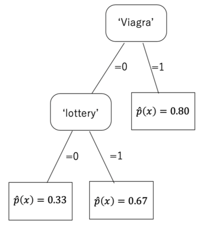
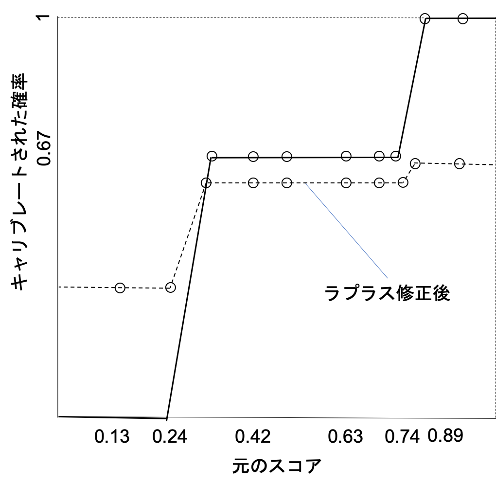

03 クラス確率の推定
=================

* `クラス確率推定量`：クラス上で確率ベクトルを出力するスコアリング分類器

  * 写像 $`\bf{\hat{p}} : X \rightarrow [0,1]^k`$

  > * $`\bf{\hat{p}}=(\hat{p}_1(x),\cdots,\hat{p}_k(x))`$
  >
  > * $`\hat{p}_i`$ ：インスタンス $`x`$ がクラス $`C_i`$ に割り付けられる確率
  >
  >   $$`\sum_{i=1}^k \hat{p}_i(x) = 1`$$

* 確率 $`\hat{p}_i(x)`$ を解釈するため、確率を $`P_C(c(x')=C_i \vert x' \sim x)`$ の推定量と捉える

  > 真の確率 $`p_i(x)`$ を直接入手することはできない

  * $`x`$ に似ているインスタンスのうち、クラス $`C_i`$ に属するインスタンスはどれくらいの割合か？

  > 割合が高いほど、$`x`$ が $`C_i`$ に属する確信の度合いが強い

### 例：確率推定木

**モデルに依存することになることの文脈での類似性は何を意味するか？**

* 仮定1：全ての2つのインスタンスが互いに似ている

  * $`x`$ の真のクラスを知る知らないに関わらず、$`\hat{p}(x)=pos`$ を予測

  > 正例の割合 $`pos`$ から、以下のものが推定される
  >
  > $$`P_C(c(x')=\oplus \vert x' \sim x) = P_C(c(x')=\oplus)`$$

* 仮定2：2つの事例が等しくない限り、似ていない

  * 全ての既知の正例には $`\hat{p}(x)=1`$、負例には $`\hat{p}(x)=0`$

  > $`x`$ は固定されているため、$`c(x)=\oplus`$ ならば`1`、それ以外は`0`となる
  >
  > $`P(c(x')=\oplus \vert x' \sim x) = P(c(x) = \oplus)`$

> 未知の事例に対してこの考えを一般化することはできない

* `特徴木`：関連した類似関係 $`\sim_T`$ を用いることで、上の2つの極端な場合のバランスを取る

  > $`x \sim_T x'`$ ：$`x`$ と $`x'`$ が同じ葉に割り当てられる

* 各葉において、割り当てられた陽性の割合を予測

  * 一番右の葉：割り当てられた **全ての事例** $`x`$ に対して、$`\hat{p}(x) = 0.80`$ と予測

  > 正例の割合 $`\frac{40}{50}=0.80`$

  * その他の葉：$`p(x)`$ を閾値`0.5`を境に二値化

  > スパムである確率が`0.5`以上：スパムと予測、それ以外はハムと予測

## 1.クラス確率の推定量の評価

* 2進法のベクトル：「真の確率」としてクラス確率の推定量を評価する

  * $`I[c(x)=C_1], \cdots, I[c(x)=C_k]`$

  > * $`x`$ の真のクラスが $`C_i`$ ： $`i`$ 番目のビットは`1`、その他の全てのビットは`0`

* 予測確率ベクトル $`\bf{\hat{p}(x)} = (\hat{p}_1(x), \cdots, \hat{p}_k(x))`$ の二乗誤差(`SE`)

  $$`SE(x)=\frac{1}{2}\sum_{i=1}^k(\hat{p}_i(x)-I[c(x)=C_i])^2`$$

  > $`\frac{1}{2}`$ ：二乗誤差が0と1の間で正規化

* テストデータの全てのインスタンス上での二乗誤差の平均：`MSE`

  $$`MSE = \frac{1}{\vert Te \vert}\sum_{x \in Te}SE(x)`$$

### 例：二乗誤差

**各葉における二乗誤差を考える**

* 左の葉： $`SE_1 = 20(0.33 - 1)^2 + 40(0.33 - 0)^2 = 13.33`$

* 中央の葉： $`SE_2 = 10(0.67 - 1)^2 + 5(0.67 - 0)^2 = 3.33`$

* 右の葉： $`SE_3 = 20(0.80 - 1)^2 + 5(0.80 - 0)^2 = 4.00`$

平均二乗誤差

$$`MSE = \frac{1}{100}(SE_1 + SE_2 + SE_3) = 0.21`$$

**各葉における予測確率：`MSE`を小さくする上では最適**

* (葉における)二乗誤差が最小：予測確率 $`\hat{p}`$ と経験確率 $`\dot{p}`$ が、$`\hat{p} = \dot{p}`$ の場合

  * `経験確率`：$`\dot{p}=\frac{n^{\oplus}}{n^{\oplus}+n^{\ominus}}`$

> $$`n^{\oplus}(\dot{p}-1)^2+n^{\ominus}\hat{p}^2\\=(n^{\oplus}+n^{\ominus})((\hat{p}-\dot{p})^2+\dot{p}(1-\dot{p}))`$$

### 経験確率

* `経験確率`：分類器やランカーから確率推定量を引き出したりする上で重要

  * ラベル付けされたインスタンスの集合 $`S`$ に関連した経験確率ベクトル

  $$`\bf{\dot{p}}(S)=(\frac{n_1}{\vert S \vert}, \cdots, \frac{n_k}{\vert S \vert})`$$

  > $`n_i`$ ：クラス $`C_i`$ に属する $`S`$ のインスタンスの数

* この経験ベクトルの相対頻度を平滑化

  > 極端な値(0または1)を取ることを避ける

  $$`\dot{p}_i(S) = \frac{n_i + 1}{\vert S \vert + k}`$$

  > $`k=2`$ ：ラプラス補正
  >
  > 実際には、一様な疑似カウントを、$`k`$ 個の選択肢の各各に加えている(経験確率が一様になる仮定)

* `M推定`：非一様な平滑化

  * ラプラス補正は、$`m=k`$ 、 $`\pi_i = \frac{1}{k}`$ の特殊な場合とする

  $$`\dot{p}_i(S) = \frac{n_i + m \pi_i}{\vert S \vert + m}`$$

  > * $`m`$ ：疑似カウント数
  >
  > * $`\pi_i`$ ：事前確率

### 経験確率と二乗誤差

* $`S`$ の要素が、全て同じ予測確率ベクトル $`\bf{\hat{p}}`$ を持つ場合、以下のように記述できる

  $$`SE(S)=\sum_{x \in S}SE(x)=\frac{1}{2}\vert S \vert \sum_{i=1}^k(\hat{p}_i(x)-\dot{p}_i(S))^2+\frac{1}{2}\sum_{i=1}^k(\dot{p}_i(S)(1-\dot{p}_i(S)))`$$

  * 第一項：キャリブレーション損失、経験確率に関する二乗誤差を測定する

    > 各セグメントに対し予測確率を自由に選ぶことができるグループ分けモデルにおいて、0に減らすことができる

  * 第二項：リファインメント損失、経験確率にのみ依存する

## 2.ランカーをクラス確率の推定量に変更する方法

* `スコア`：未知のスケールを表すと想定すると、スパムフィルターは`ランカー`

  * 経験確率：0(負例)、1(正例)

  * $`\dot{p}`$ 値の列：1-1-0-1-1-0-1-1-0-0(スコアの降順)

    * $`\dot{p} = 1`$ ：ROC曲線の縦の線分に対応

    * $`\dot{p} = 0`$ ：ROC曲線の線分に対応

  > これらの $`\dot{p}`$ 値は、スコアによって課される順序に従わないので、確率の推定に直接使えない

> * 凹部：ROCカーブ中の「くぼみ」(扱う曲線は、2つの凹部がある)
>
> * 凹部なしのROC曲線(上に凸)を扱うと良い

* ROC曲線における凹凸：線分を組み合わせてタイを作ることによって改善

  > `隣接逆順部`：スコアが左から右に降順の規則に反する

  1. 3番目および4番目双方にその平均スコアを割り当てる

    > 1-1-[1/2-1/2]-1-0-1-1-0-0

  2. 4番目の事例と隣接逆順部のペアを形成(平均スコアを与える)

    > 1-1-[2/3-2/3-2/3]-0-1-1-0-0

  3. 2つ目の凹部0-1-1が同じように処理される

    > 1-1-[2/3-2/3-2/3—[2/3-2/3-2/3]-0-0

* 元のランキングは`AUC=0.75`だが、凸包は`AUC=0.83`となる

### キャリブレートされた確率

* 凸包を決定したら、キャリブレートされた確率として凸包の各線分における経験確率を用いることができる

  * 実線：キャリブレーションマップ、$`x`$ 軸上の元のスコアから $`y`$ 軸上のキャリブレートされた確率への非減少な写像

  * 点線：ラプラス修正後の確率の推定量を与えるキャリブレーションマップ

    > 2/3-2/3-[3/5-3/5-3/5]-[3/5-3/5-3/5]-1/3-1/3

### まとめ

* 元のスコアの平均二乗誤差：`0.19`

  > これは、キャリブレーション損失そのもの(リファインメント損失：0)

  > $$`\frac{1}{10}`$$

* キャリブレートされたスコアの平均二乗誤差：`0.13`

  > $$`\frac{1}{10}`$$

* リファインメント損失の増加：キャリブレーション損失の減少

  > 全体の平均二乗誤差が、推定確率が構築された各各の線分における経験確率と等しい場合

  * キャリブレーション損失がリファインメント損失より大きいので、全体の誤差が減少

* `単調キャリブレーション`：ROC曲線の凸包を通してキャリブレートされたスコアを得た場合

  > データの過適合に注意する

| 版   | 年/月/日   |
| ---- | ---------- |
| 初版 | 2019/06/11 |
