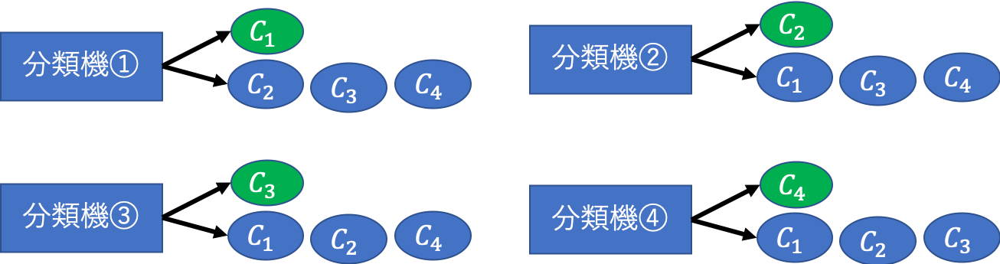
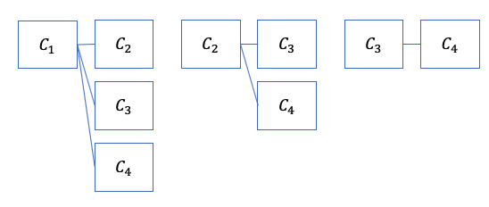

01 多クラス
==========

* `分類`、`スコアリング`、`クラス確率推定`について、多クラスでどのように扱うか議論する

  * 多クラスの場合の性能評価をどうするか

  * 2クラスのモデルから多クラスのモデルをどのように構成するか

  > 線形分類などの基本的に2クラス分類を目的としたモデルを考える上で必要不可欠

* ただし、決定木などのモデルは多クラスを扱うことができる

## 1.多クラス

* 多クラスにおける性能評価について考える

* 分類器の性能： $`k \times k`$ 分割表

  * クラスの数： $`k`$

* 分類器の正答率： $`\frac{\sum 分割表の対角成分}{\sum インスタンス数}`$

  * この指標では、クラス間の性能差を評価できない

### 例：多クラス分類器の性能

 例) $`3 \times 3`$ 分割表を考える

|       | 予測1  | 予測2  | 予測3  |     |
| ----- | ------ | ------ | ------ | --- |
| 実際1 | **15** | 2      | 3      | 20  |
| 実際2 | 7      | **15** | 8      | 30  |
| 実際3 | 2      | 3      | **45** | 50  |
|       | 24     | 20     | 56     | 100 |

 * 分類器の正答率： $`\frac{(15+15+15)}{100}=0.75`$

|         | 適合率                 | 再現率                 |
| ------- | ---------------------- | ---------------------- |
| クラス1 | $`\frac{15}{24}=0.63`$ | $`\frac{15}{20}=0.75`$ |
| クラス2 | $`\frac{15}{20}=0.75`$ | $`\frac{15}{30}=0.50`$ |
| クラス3 | $`\frac{45}{56}=0.80`$ | $`\frac{45}{50}=0.90`$ |

こららの平均(重み付き平均)を取ることで、この分類器全体に対する`適合率`と`再現率`をそれぞれ計算できる

* 重み付き平均をとった適合率：$`(0.20 \times 0.63)+(0.30 \times 0.75)+(0.50 \times 0.80)=0.75`$

 > また、重み付き平均をとった再現率は正答率に一致する

例)クラス1とクラス3のペアを考える(クラスのペアごとに適合率と再現率を計算して、別の指標を考える)

|       | 予測1  | 予測3  |     |
| ----- | ------ | ------ | --- |
| 実際1 | **15** | 3      | 18  |
| 実際3 | 2      | **45** | 47  |
|       | 17     | 48     | 65  |

* クラス1を正のクラス

  * 適合率：$`\frac{15}{17}=0.88`$

  * 再現率：$`\frac{15}{18}=0.83`$

* クラス3を正のクラス

  * 適合率：$`\frac{45}{48}=0.94`$

  * 再現率：$`\frac{45}{47}=0.96`$

### 多クラス分類器の構成

> いくつかの2クラス分塁器を組み合わせて、1つの $`k`$ クラス分類器をつくることで対応する

* `1対他分類器`：クラス $`C_1`$ と、それ以外のクラス $`C_2, \cdots, C_k`$ に対する二値分類器

  * 次に、$`C_2`$ と、それ以外のクラス $`C_3, \cdots, C_k`$ に対する二値分類器、といった $`k`$ 個の二値分類器を組み合わせて構成される

  * ただし、$`i`$ 番目の二値分類器を学習する際には、

    * クラス $`C_i`$ 中の全インスタンス：正

    * それ以外のインスタンス：負

> この分類器では、$`C_i`$ と $`C_{i+1}, \cdots, C_k (1\leq <k)`$ に対する二値分類器を $`k-1`$ 個組み合わせるような、学習の順番が決まっているものもある

  

* `一対一分類器`： $`\frac{k(k-1)}{2}`$ 個のクラスのペアに対して二値分類器を作り、それらを組み合わせて構成される

  * 二値分類器がクラスを非対称に扱う場合は、各ペアに対して2つの分類器を作る(総数： $`k(k-1)`$ )

  > 例)4分類の場合
  >
  > $`\frac{4 \cdot 3}{2!}=6`$
  >
  > 

### 出力符号行列

* `出力符号行列`： $`k`$ クラスの分類問題を $`l`$ 個の二値分類で記述する

  * 要素が`+1`、`0`、`-1`の $`k \times l`$ 行列

  * `+1`：正のクラス、`-1`：負のクラス、`0`：予測なし

* 一対一分類器による、3クラスの分類問題

> **対称の場合**
> $`
> \left(
> \begin{array}{ccc}
>   C_1 \\
>   C_2 \\
>   C_3
> \end{array}
> \right)
> = \underbrace{
>   \left(
>  \begin{array}{ccc}
>    +1 \\
>    -1 \\
>    0
>  \end{array}
> \right)}_{C_1:正, C_2:負}
> \times
> \underbrace{
>  \left(
> \begin{array}{ccc}
>   +1 \\
>   0 \\
>   -1
> \end{array}
> \right)}_{C_1:正, C_3:負}
> \times
> \underbrace{
>  \left(
> \begin{array}{ccc}
>   0 \\
>   +1 \\
>   -1
> \end{array}
> \right)}_{C_2:正, C_3:負} =
> \left(
> \begin{array}{ccc}
>   +1 & +1 &  0 \\
>   -1 &  0 & +1 \\
>    0 & -1 & -1
> \end{array}
> \right)
> `$

> **非対称の場合**
>
> 正と負を交換した3つの分類器が追加
>
> $`
> \left(
> \begin{array}{ccc}
>   C_1 \\
>   C_2 \\
>   C_3
> \end{array}
> \right)
> = \underbrace{
>   \left(
>  \begin{array}{ccc}
>    +1 & -1 \\
>    -1 & +1 \\
>     0 &  0
>  \end{array}
> \right)}_{C_1:正, C_2:負, 正と負を入れ替え}
> \times
> \underbrace{
>  \left(
> \begin{array}{ccc}
>   +1 & -1\\
>    0 &  0\\
>   -1 & +1
> \end{array}
> \right)}_{C_1:正, C_3:負, 正と負を入れ替え}
> \times
> \underbrace{
>  \left(
> \begin{array}{ccc}
>    0 &  0\\
>   +1 & -1\\
>   -1 & +1
> \end{array}
> \right)}_{C_2:正, C_3:負, 正と負を入れ替え} =
> \left(
> \begin{array}{ccc}
>   +1 & -1 & +1 & -1 &  0 &  0 \\
>   -1 & +1 &  0 &  0 & +1 & -1 \\
>    0 &  0 & -1 & +1 & -1 & +1
> \end{array}
> \right)
>`$

* 一対他分類器に対する出力符号行列

> **通常の場合**
>
> $`
> \left(
> \begin{array}{ccc}
>   C_1 \\
>   C_2 \\
>   C_3
> \end{array}
> \right)
> = \underbrace{
>   \left(
>  \begin{array}{ccc}
>    +1 \\
>    -1 \\
>    -1
>  \end{array}
> \right)}_{C_1:正, その他:負}
> \times
> \underbrace{
>  \left(
> \begin{array}{ccc}
>   -1 \\
>   +1 \\
>   -1
> \end{array}
> \right)}_{C_2:正, その他:負}
> \times
> \underbrace{
>  \left(
> \begin{array}{ccc}
>   -1 \\
>   -1 \\
>   +1
> \end{array}
> \right)}_{C_3:正, その他:負} =
> \left(
> \begin{array}{ccc}
>   +1 & -1 & -1 \\
>   -1 & +1 & -1 \\
>   -1 & -1 & +1
> \end{array}
> \right)
> `$

> **順番が決まっている場合**
>
> $`C_1 - C_2 - C_3`$ のように順番を決めている
>
> $`
> \left(
> \begin{array}{ccc}
>   C_1 \\
>   C_2 \\
>   C_3
> \end{array}
> \right)
> = \underbrace{
>   \left(
>  \begin{array}{ccc}
>    +1 \\
>    -1 \\
>    -1
>  \end{array}
> \right)}_{C_1:正, その他:負}
> \times
> \underbrace{
>  \left(
> \begin{array}{ccc}
>    0 \\
>   +1 \\
>   -1
> \end{array}
> \right)}_{C_2:正, C_3:負}
> \times =
> \left(
> \begin{array}{ccc}
>   +1 &  0 \\
>   -1 & +1 \\
>   -1 & -1
> \end{array}
> \right)
> `$

`

### 復号

* 新たなインスタンスが得られた場合

  1. 全ての二値分類器の予測を集める

  1. 正、負、予測棄却を決定する

  1. 予測結果を集めて、`語`を構成する

* `語`は、通常出力符号行列の`行`の中から探す

  > このプロセスを、`復号`と呼ぶ

* 順序なしの一対多分類器において、$`(-1\ +1\ -1)`$ が得られた場合

  * クラス $`C_2`$ に分類される

  

* 対称な一対一分類器において、$`w= (0\ +1\ 0)`$ が得られた場合

  * 最も近しい分類は $`C_1`$ だが、`ハミング距離`を定義する

  > $`d(w,c)=\sum_{i}\frac{1-w_ic_i}{2}`$
  >
  > * $`w_i`$ ：$`i`$ 番目の語
  >
  > * $`c_i`$ ：$`i`$ 番目の符号(分類器)

* `語`と`符号`が分類クラスを同じくしていれば、距離には影響はない

  * 一方が`+1`で他方が`-1`の場合には、距離に`1`の影響を与える

  * どちらかが`0`の場合には、$`\frac{1}{2}`$ の影響を与える

* この距離を用いて、予測クラスは $`\arg \min_j d(w,c_j)`$ で計算される

  * $`c_j`$ ：出力符号行列の第 $`j`$ 行ベクトル

  > $`\left(
  > \begin{array}{ccc}
  >   +1 & +1 &  0 \\
  >   -1 &  0 & +1 \\
  >    0 & -1 & -1
  > \end{array}
  > \right)`$

  > * 第一列：$`(+1\ +1\ 0)`$ 、$`w= (0\ +1\ 0)`$
  >
  > $`d(w,c_1) = \frac{1-0\cdot(+1)}{2} + \frac{1-(+1)\cdot(+1)}{2} + \frac{1-0\cdot0}{2} = 1`$

  > * 第二列：$`(-1\ 0\ +1)`$ 、$`w= (0\ +1\ 0)`$
  >
  > $`d(w,c_2) = \frac{1-0\cdot(-1)}{2} + \frac{1-(+1)\cdot0}{2} + \frac{1-0\cdot(+1)}{2} = 1.5`$

  > * 第三列：$`(0\ -1\ -1)`$ 、$`w= (0\ +1\ 0)`$
  >
  > $`d(w,c_3) = \frac{1-0\cdot0}{2} + \frac{1-(-1)\cdot(-1)}{2} + \frac{1-0\cdot(-1)}{2} = 1.5
  > `$

  * 故に、クラス $`C_1`$ に分類されることがわかる

### 例：距離の最も近い符号が常に唯一ではない場合

* 例)4クラスの`一対他分類器`にて、2つの`二値分類器`がそれを正、他の2つがそれを負と予測

  * この場合、2つの符号と距離が一致しているので、**クラスを一つに絞ることができない**

  > $`
  > \left(
  > \begin{array}{ccc}
  >   +1 & -1 & -1 & -1\\
  >   -1 & +1 & -1 & -1\\
  >   -1 & -1 & +1 & -1\\
  >   -1 & -1 & -1 & +1
  > \end{array}
  > \right)
  > `$

  > $`
  > w= (+1\ +1\ 0\ 0)
  > `$
`

* このような場合、出力符号行列にいくつかの列を追加することで状況を改善できる

  * 3つの列に「二値分類問題」を追加

  * その結果、任意の2つの符号の距離が2から4に増加し、出力符号行列にない語を復号できる可能性がある

  > $`
  > \left(
  > \begin{array}{ccc}
  >   +1 & -1 & -1 & -1& +1 & +1 & +1 \\
  >   -1 & +1 & -1 & -1& +1 & -1 & -1 \\
  >   -1 & -1 & +1 & -1& -1 & +1 & -1 \\
  >   -1 & -1 & -1 & +1& -1 & -1 & +1
  > \end{array}
  > \right)
  > `$

`

### 例：一対一符号投票

* クラス数が $`k=4`$ の`一対一符号行列`

$`
\left(
\begin{array}{ccc}
 +1 & +1 & +1 &  0&  0 &  0 \\
 -1 &  0 &  0 & +1& +1 &  0 \\
  0 & -1 &  0 & -1&  0 & +1 \\
  0 &  0 & -1 &  0& -1 & -1
\end{array}
\right)
`$

`
* ここで、6つの二値分類器が $`w= (+1\ -1\ +1\ -1\ +1\ +1)`$ のように予測

  * $`C_1-C_3-C_1-C_3-C_2-C_3`$

  > $`
  > \underbrace{
  > \left(
  > \begin{array}{ccc}
  >  +1 \\
  >  -1 \\
  >   0 \\
  >   0
  > \end{array}
  > \right)}_{+1:C_1}
  > \times
  > \underbrace{
  > \left(
  > \begin{array}{ccc}
  >  +1 \\
  >   0 \\
  >  -1 \\
  >   0
  > \end{array}
  > \right)}_{-1:C_3}
  > \times
  > \underbrace{
  > \left(
  > \begin{array}{ccc}
  >  +1 \\
  >   0 \\
  >   0 \\
  >  -1
  > \end{array}
  > \right)}_{+1:C_1}
  > \times
  > \underbrace{
  > \left(
  > \begin{array}{ccc}
  >   0 \\
  >  +1 \\
  >  -1 \\
  >   0
  > \end{array}
  > \right)}_{-1:C_3}
  > \times
  > \underbrace{
  > \left(
  > \begin{array}{ccc}
  >   0 \\
  >  +1 \\
  >   0 \\
  >  -1
  > \end{array}
  > \right)}_{+1:C_2}
  > \times
  > \underbrace{
  > \left(
  > \begin{array}{ccc}
  >   0 \\
  >   0 \\
  >  +1 \\
  >  -1
  > \end{array}
  > \right)}_{+1:C_3}
  > `$

`

* これは、以下のように投票されたことになる

  * $`C_1`$ ：2票

  * $`C_2`$ ：1票

  * $`C_3`$ ：3票

  * $`C_4`$ ：0票

* 形式的には、第 $`i`$ 番目の分類器の第 $`j`$ クラスへの投票は、以下の式で表される

  * $`c_{ji}`$ ：出力符号行列の第 $`(j,i)`$ 成分

  $`
  \begin{eqnarray}
  \frac{1+w_ic_{ji}}{2}
  \end{eqnarray}
  `$
`

* しかし、これでは行列の0要素を余分にカウントしてしまう

  * 各クラスは、$`k-1`$ 回二値分類の対象となる(例：$`4-1=3`$ 回二値分類を行う)

  * 二値分類の総数は、$`l = \frac{k(k-1)}{2}`$ (例：総数は $`\frac{4 \times 3}{2}=6`$ 個)

  > $`
  > \left(
  > \begin{array}{ccc}
  >  +1 & +1 & +1 &  0&  0 &  0 \\
  >  -1 &  0 &  0 & +1& +1 &  0 \\
  >   0 & -1 &  0 & -1&  0 & +1 \\
  >   0 &  0 & -1 &  0& -1 & -1
  > \end{array}
  > \right)
  > `$

`

* 各行の0要素の総数は、以下の式で表される(ここでは、3回)

  $`
  \begin{eqnarray}
  \frac{k(k-1)}{2} = \frac{(k-1)(k-2)}{2} = \frac{l(k-2)}{k}
  \end{eqnarray}
  `$
`

* 各0要素に対して $`\frac{1}{2}`$ を取り除く必要がある

$`
\begin{eqnarray}
\frac{l(k-2)}{k} \times \frac{1}{2} = \frac{l(k-2)}{2k}
\end{eqnarray}
`$

`

* 結局、クラス $`C_j`$ への投票数は以下の式で表される

  * $`d_j`$ ：距離

  > $`
  > \begin{eqnarray}
  > d_j = \sum_{i} \frac{1-w_ic_{ji}}{2}
  > \end{eqnarray}
  > `$
`

$`
\begin{eqnarray}
v_j = \Bigl( \sum_{i=1}^l \frac{1+w_ic_{ji}}{2} \Bigr) -l\frac{k-2}{2k} = \Bigl( \sum_{i=1}^l \frac{w_ic_{ji}-1}{2} \Bigr)+l-l\frac{k-2}{2k} \\
= - d_j + l\frac{2k-k+2}{2k} = \frac{(k-1)(k+2)}{4} - d_j
\end{eqnarray}
`$

`

* つまり、距離と投票数を合計すると、クラス数だけに依存するある定数になる(4クラス：4.5)

  * $`d_1`$ ：2.5( $`C_1`$ ： 2票)

  * $`d_2`$ ：3.5( $`C_2`$ ： 1票)

  * $`d_3`$ ：2.5( $`C_3`$ ： 3票)

  * $`d_4`$ ：4.5( $`C_4`$ ： 0票)

### 二値分類器がスコアを出力

* `損失に基づく復号`：二値分類器のスコアを用いて多クラス分類を行う方法

  * スコア $`s_i`$ の符号が、そのクラスを示しているとする

  * マージン $`z_i`$ は、出力符号行列の要素 $`c_{ji}`$ を用いて計算できる

  $`
  \begin{eqnarray}
  z_i = s_ic_{ji}
  \end{eqnarray}
  `$
`

* また、損失関数 $`L`$ が計算できる

  $`
  L = \exp(-z_i)
  `$
`

* よって、スコアベクトル $`s`$ と、符号行列の第 $`j`$ 行ベクトル $`c_j`$ の距離 $`d(s,c_j)`$ が定義される

  $`
  \begin{eqnarray}
  d(s,c_j) = \sum_i L(s_ic_{ji})
  \end{eqnarray}
  `$

`
* これにより、 $`d(s,c_j)`$ を最小にする予測クラスが計算できる

### 例：損失に基づく復号

* 次の行列を用いて考える

  $`
  \left(
  \begin{array}{ccc}
  +1 & +1 & +1 &  0&  0 &  0 \\
  -1 &  0 &  0 & +1& +1 &  0 \\
   0 & -1 &  0 & -1&  0 & +1 \\
   0 &  0 & -1 &  0& -1 & -1
  \end{array}
  \right)
  `$
`

* ここで、6つの二値分類器のスコアが $`w= (+5\ -0.5\ +4\ -0.5\ +4\ +0.5)`$ で与えられたとする

* このとき、`マージン`は次の行列で与えられる

  * ただし、マージンの大きさを無視する`0-1損失`を用いた

  * ゆえに、$`C_3`$ と予測される

  $`
  \left(
  \begin{array}{ccc}
  +5 & +0.5 & +4 &    0 &  0 &    0 \\
  -5 &    0 &  0 & +0.5 & +4 &    0 \\
   0 & -0.5 &  0 & -0.5 &  0 & +0.5 \\
   0 &    0 & -4 &    0 & -4 & -0.5
  \end{array}
  \right)
  `$
`

* 一方で、指数損失 $`L(z) = \exp (-z)`$ を用いると、スコア $`w= (4.67\ 153.08\ 4.82\ 113.85)`$ が得られる

  * $`C_1`$ と予測 ($`C_2`$ と $`C_4`$ に対して`マージン`の意味で強く勝っている)

## 2.多クラススコアと確率

二値分類器を用いて多クラススコアと確率を計算する方法は、以下のものが考えられる

* 損失に基づく復号によって距離を計算し、適切に変換

  > 二値分類器がキャリブレートされたスコアを出力する際に適用可能

* 二値分類器の出力を特徴量として扱い、それを用いて多クラススコアを出力できるようなモデルを学習させる

  > ナイーブベイズ法、木モデルなど
  >
  > 一般に適用できるが、追加学習が必要になる

* カバレッジ数からスコアを計算する

> `カバレッジ数`：二値分類器で正と予測された数
>
> 一般に適用可能、納得のいく結果を返す

### 例：スコアとしてのカバレッジ数

* 二値分類器を3つ用意する

  * １つ目： $`(8\ 0\ 2)`$

    * クラス1：8事例が正

    * クラス2：0事例が正

    * クラス3：2事例が正

  * 2つ目： $`(2\ 17\ 1)`$

  * 3つ目： $`(4\ 2\ 8)`$

  > 二値分類器は以下の通りで表される(各クラスのカバレッジ数)
  >
  > $`
  > \left(
  > \begin{array}{ccc}
  > 8 &  0 & 2 \\
  > 2 & 17 & 1 \\
  > 4 &  2 & 8
  > \end{array}
  > \right)
  > `$
`

* テストインスタンスが二値分類器によって正と予測

  * 1つ目のテストインスタンス： $`(1\ 0\ 1)`$

    * 1つ目の二値分類器：正と予測

    * 2つ目の二値分類器：負と予測

    * 3つ目の二値分類器：正と予測

  * 2つ目のテストインスタンス： $`(1\ 1\ 1)`$

  > テストインスタンスを正と予測した二値分類器は以下の通りで表される
  >
  > $`
  > \left(
  > \begin{array}{ccc}
  > 1 & 0 & 1 \\
  > 1 & 1 & 1
  > \end{array}
  > \right)
  > `$
`

* スコアベクトルは、それぞれ以下の通りに表される

  > $`
  > \left(
  > \begin{array}{ccc}
  > 1 & 0 & 1 \\
  > 1 & 1 & 1
  > \end{array}
  > \right)
  > \left(
  > \begin{array}{ccc}
  > 8 &  0 & 2 \\
  > 2 & 17 & 1 \\
  > 4 &  2 & 8
  > \end{array}
  > \right)=
  > \left(
  > \begin{array}{ccc}
  > 12 &  2 & 10 \\
  > 14 & 19 & 11
  > \end{array}
  > \right)
  > `$
`

* 上記の方法では、$`l`$ 個の二値分類器がある場合、インスタンス空間を最大で $`2^l`$ 個の領域に分割する

  > インスタンス空間の`冪集合`と考える

  * 各領域には`スコアベクトル`が対応する( $`l`$ が大きいほどスコアベクトルも多く得られる)

* 多クラススコアの良さを評価するには、ROC曲線の下面積(`AUC`)の平均を用いる

  * 例)一対他、一対一分類器などにおける二値分類器の`AUC`の平均

### 例：多クラスAUC

* 多クラス分類器が、各テストインスタンス $`x`$ に対して $`k`$ 次元のスコアベクトル $`\hat{s}(x) = (\hat{s}_1(x), \cdots, \hat{s}_k(x))`$ を持つとする

  * このベクトルの要素 $`\hat{s}_i(x)`$ に注目すると、クラス $`C_i`$ とそれ以外に対するスコア分類器が得られる

  * また、これを用いて $`C_i`$ に関する一対多AUCが計算できる

* 例)3クラス分類問題

  * $`C_1`$、$`C_2`$、$`C_3`$ に関する一対多AUCは、それぞれ $`(1\ 0.8\ 0.6)`$ とする

  > **AUCの平均**
  >
  > $`
  > \begin{eqnarray}
  > AUC_{ave}=\frac{1+0.8+0.6}{3}=0.8
  > \end{eqnarray}
  > `$
`

  * クラス $`C_i`$ から一様に抽出したインスタンス $`x`$ と、それ以外のクラスから抽出したインスタンス $`x'`$ に対して、$`\hat{s}_i(x) > \hat{s}_i(x')`$ となる確率が`0.8`となる

* ここで、各クラスに属するインスタンス数を以下のものとする

  * クラス $`C_1`$ ：10

  * クラス $`C_2`$ ：20

  * クラス $`C_3`$ ：70

* これらの`AUC`の重み付き平均は、以下のように計算される

  $`
  \begin{eqnarray}
  1 \times \frac{10}{100} + 0.8 \times \frac{20}{100} + 0.6 \times \frac{70}{100} = 0.68
  \end{eqnarray}
  `$
`
* このように表される理由としては、$`x`$ がクラス $`C_3`$ から選ばれる可能性が高く、そして `C_3`$ に属するインスタンスのスコアが小さいため

### 一対一分類器に対するAUCの平均
