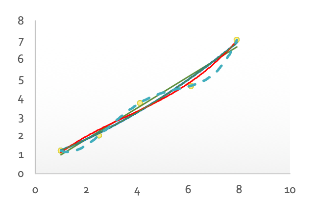
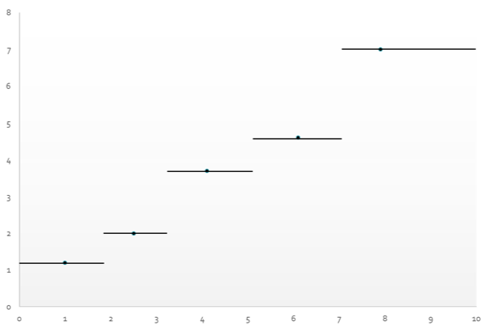
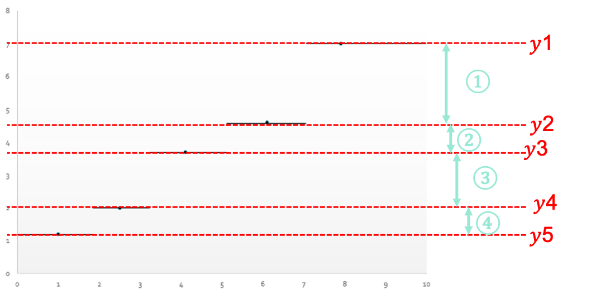
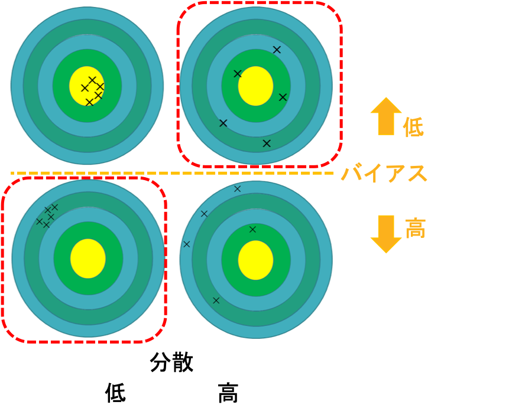

02 回帰
=======

* `回帰`：$`(x_i, f(x_i))`$ から、関数推定量 $`\hat{f}`$ を学習すること

  * `関数推定量`(リグレッサー)：写像 $`\hat{f}:X \rightarrow \mathbb{R}`$

  > 目的関数が実数値を取る場合を考える

### 例：線形適合

* $`x`$ の多項式で、$`y`$ を推定する

| $`x`$ | $`y`$ |
| ----- | ----- |
| 1.0   | 1.2   |
| 2.5   | 2.0   |
| 4.1   | 3.7   |
| 6.1   | 4.6   |
| 7.9   | 7.0   |

* 多項式回帰では、次数が大きくなるたびにデータ点に一致する

  > 極端に大きいと過適合のため、小さな次数での多項式回帰が妥当

### グループ分けモデル

* インスタンス空間をいくつかのセグメントに分け、各セグメントにおいて局所に学習する

  * 1変数問題の場合は、区分的定数関数が得られる

  > 回帰木では、各葉に対して1つの値を予測する

### モデルが持つパラメータ

* 次数 $`n`$ の多項式は、$`n+1`$ 個のパラメータをもつ

  > 例) $`y=ax+b`$ ：$`(a,b)`$ の2つのパラメータを持つ

* $`n`$ セグメントから成る区分的定数関数は、計 $`2n-1`$ 個のパラメータをもつ

  > $`n`$ 個の $`y`$ 値と、$`n-1`$ 個のジャンプが起きる $`x`$ 値

* 例)次数4の多項式：5つのパラメータを持つ

  > 合計9個のパラメータ：データ点よりも多いため過適合となる

* 過適合を避けるためには、パラメータ数はデータ点よりかなり少なくしなければならない

### 回帰モデルの性能評価

* 回帰モデルの評価：`残差`($`f(x)-\hat{f}(x)`$)に対する損失関数で評価を行う

  * 典型的な損失関数は、残差の二乗(`最小二乗法`)

  $`
  \begin{eqnarray}
  L = \sum_{i}(f(x_i)-\hat{f}(x_i))^2
  \end{eqnarray}
  `$
`

* 損失関数の調整を行うと、以下のようになる

  * パラメータを少なくする：残差は大きくなる

  * パラメータを多くする：過適合が起きる

  > バイアス-分散のジレンマ

### バイアス-分散のジレンマ

* バイアス：モデルと学習データの平均的なズレ

  $`
  (f(x)-\mathbb{E}[\hat{f}(x)])^2
  `$
`

* 分散：モデルの複雑さ

  $`
  \mathbb{E}\Bigl[ (\hat{f}(x) - \mathbb{E}[\hat{f}(x)]^2) \Bigr]
  `$
`

* 期待二乗損失

  $`
  \mathbb{E}\Bigl[ (f(x)-\hat{f}(x))^2 \Bigr] = (f(x)-\mathbb{E}[\hat{f}(x)])^2 + \mathbb{E}\Bigl[ (\hat{f}(x) - \mathbb{E}[\hat{f}(x)]^2) \Bigr]
  `$
`

> バイアスと分散はトレードオフの関係にある

| 版   | 年/月/日   |
| ---- | ---------- |
| 初版 | 2019/06/10 |
