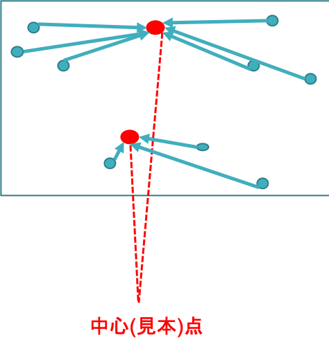

03 教師なし学習と記述的学習
=======================

* 以下の学習問題を考える

  * `予測クラスタリング`：予測モデルの教師なし学習

  * `記述クラスタリング`・`アソシエーションルール発見`：記述モデルの教師なし学習

  * `サブグループ発見`：記述モデルの教師あり学習

|              | 予測モデル         | 記述モデル                                       |
| ------------ | ------------------ | ------------------------------------------------ |
| 教師あり学習 | 分類、回帰         | サブグループ発見                                 |
| 教師なし学習 | 予測クラスタリング | 記述クラスタリング アソシエーションルール発見 |

* `記述モデル`：データの記述方法を生成すること

  > 実際のデータ全体を記述するモデルの作成を目的とする

## 1.予測クラスタリングと記述クラスタリング

* `クラスタリング`：ラベルなしのデータからラベル付け関数を学習させる

|                  | 予測モデル          | 記述モデル          |
| ---------------- | ------------------- | ------------------- |
| 写像 $`\hat{q}`$ | $`X \rightarrow C`$ | $`D \rightarrow C`$ |

> * $`C=\{ C_1, C_2, \cdots, C_k\}`$ ：ラベルの集合
>
> * $`X`$ ：インスタンス空間
>
> * $`D \subseteq X`$ を定義域とした一部のインスタンス空間

* 予測クラスタリング：インスタンス空間全体において写像を学習し、観測されていないインスタンスへ一般化する

* 記述クラスタリング：与えられたデータ $`D`$ のみをクラスタリングする

### クラスタリングの性能評価

* `緊密性`：同じクラスターからの2つのインスタンスが、他のクラスターのものより類似しているか

  > 良いクラスタリング：データが緊密なグループまたはクラスターに分割されているかどうか

* 距離によるクラスタリングの性能評価：類似度、非類似度または距離などを与えることで、性能評価できる

  * 特徴量が実数の場合：ユークリッド距離、シティブロック距離など

  * 特徴量がカテゴリ値の場合：単純一致係数、Jaccard係数など

* `中心点`・`見本点`：集合内の点との距離の総和(散乱)を最小にする点

  > 距離によるクラスタリングでは、存在する

* クラスター内散乱は、データ全体の散乱よりも遥かに小さいことが望まれる

### ソフトクラスタリング

* クラスタリングの問題は、クラスター内散乱を最小化する $`D=D_1 \uplus \cdots \uplus D_K`$ を見つける問題に帰着できる

* ただし、この方法にはいくつかの問題がある

  1. 自明解が存在する： $`K= \vert D \vert`$ とすると、各クラスター $`D`$ が、$`D`$ のインスタンスを1つずつ含む

    > 大きな $`K`$ に対して、ペナルティを課すことで解決できる

  2. クラスター数 $`K`$ を事前に固定しても、データ数が多いと計算量が莫大になる(`NP困難`)

    > * 発見的アプローチによって、「最良」ではなく「十分良い」解を見つける：K-平均法など
    >
    > * ソフトクラスタリングの導入：1つのインスタンスが複数のクラスに所属してもいい

### クラスタリングモデルの表し方

* `記述クラスタリング`： $`n`$ 個のデータ点を $`c`$ 個のクラスターに分ける

  > * `分割行列`：各行において、必ず1成分が1
  >
  >   ここでは、$`n \times c`$ の二値行列

  $`
  \left(
    \begin{array}{ccc}
      1 & 1 & 0 & 0\\
      0 & 0 & 0 & 1\\
      0 & 0 & 1 & 0\\
      0 & 0 & 0 & 0
    \end{array}
  \right)
  `$
`

* `ソフトクラスタリング`：行正規化された $`n \times c`$ 行列

  $`
  \left(
    \begin{array}{ccc}
      0.20 & 0.10 & 0.47 & 0.23\\
      0.40 & 0.41 & 0.09 & 0.10\\
      0.44 & 0.29 & 0.20 & 0.07\\
      0.35 & 0.08 & 0.50 & 0.07
    \end{array}
  \right)
  `$
`

* `予測クラスタリング`：インスタンス空間全体を分割

  > * クラスター：中心点もしくは見本点の座標($`c \times n`$ 行列)
  >
  > * クラスター境界：ある直線の集合(ボロノイ図)

  $`
  \left(
    \begin{array}{ccc}
      C_{1x} & C_{1y} \\
      C_{2x} & C_{2y} \\
      C_{3x} & C_{3y} \\
      C_{4x} & C_{4y}
    \end{array}
  \right)
  `$
`

### クラスタリングの評価

* クラスター内散乱を評価指標として、評価を行う

  > クラスター器の学習で使用しなかったテストデータで、クラスター内散乱を評価できる

* 例)真のクラスター $`\{ e_1, e_2\}, \{ e_3, e_4, e_5\}`$ の、5つのテストインスタンス

* インスタンスのペア：$`5 \times 4 = 20`$

  * リンクペア：4つ($`\{e_1, e_2\}`$、$`\{e_3, e_4\}`$、$`\{e_3, e_5\}`$、$`\{e_4, e_5\}`$)

  * 非リンクペア：16個

* `ランド指標`：クラスタリングにおける、対角成分の全体に占める割合 ($`\frac{16}{20}=0.8`$)

|                  | 予測リンクペア | 予測非リンクペア |        |
| ---------------- | -------------- | ---------------- | ------ |
| 真のリンクペア   | **2**          | 2                | 4      |
| 真の非リンクペア | 2              | **14*:           | 16     |
|                  | 4              | 16               | **20** |

* `F値`：`適合率`と`再現率`の調和平均を取ったもの

  > リンクペアの不足を補う1つの方法

  * `適合率`($`prec`$)：分割表の第1列

    > $`\frac{2}{4}=2`$

  * `再現率`($`rec`$)：分割表の第1行

    > $`\frac{2}{4}=2`$

  $`
  \begin{eqnarray}
  F = \frac{2prec \cdot rec}{prec+rec} = 0.5
  \end{eqnarray}
  `$
`

## 2.その他の記述モデル

### サブグループモデル

* 教師ありデータから学習される

* 母集団とは異なるクラス分布をもつ、データ集合の特定を目指す

  * `サブグループ`：写像 $`\hat{g}:D \rightarrow \{ true, false \}`$ によって定義され、ラベル付きデータ $`(x_i, l(x_i))`$ から学習される

  > $`l:X \rightarrow C`$ ：真のラベル付け関数

  * 定義より、$`\hat{g}`$ は集合 $`G=\{ x \in D \vert \hat{g}(x) = true \}`$ の特性関数

  > 集合 $`G`$ ：サブグループの外延
  >
  > ただし、写像 $`\hat{g}`$ は与えられたデータ $`D`$ から真データの集合 $`G`$ を、二値分類で全体とは異なるクラス分布を持つ部分集合を見つけ出す
