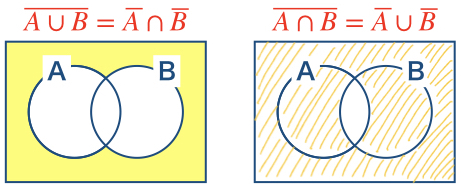

00 はじめに
==========

## 機械学習の3大要素

* `タスク`：2〜3章

* `モデル`：4〜9章

  > `モデル`：与えられたタスクを解くため、データから学習して形成されるもの

* `特徴量`：10章

## 学習モデル

* `論理モデル`：決定木、ルールモデルなど

* `幾何モデル`：最小二乗法、パーセプトロン、SVM、K-meansなど

* `確率モデル`：ナイーブベイズ法、ロジスティック回帰など

### 論理モデル

* グループ分けをするためのモデル

  > インスタンス空間を、いくつかの`セグメント`に分ける

* `セグメント`内では、なるべく同質になるように分ける

  > * 分類：各セグメントが1つのクラスに対応するセグメント分けを探す
  >
  > * 回帰：目的変数が、少数の予測変数の関数で表現できるようなセグメント分けを探す

* 論理モデルは、大まかに2種類がある

  1. `ルールモデル`：いくつもの論理包含と、`if-then`のルールから成る

    * `if`：セグメントを決定

    * `then`：各セグメントの動作を決定

  2. `木モデル`：`if`の部分が木の構造を持っている(ルールモデルの特殊ケース)

## 概念学習

* 概念学習(論理的な記述)を用いて、正と負の2クラスに分類する

  > それらの記述を満たさない：負のクラス

* 論理モデルにおいては、`汎化順序`を注意深く扱う

## 論理学の基礎

### リテラル

* `等式`：$`Feature = Value`$

* `不等式`：$`Feature < Value`$

### 論理結合子

* `連言`：論理積 $`\land`$

  > 二つの入力の両方が1のときのみ出力が1となり、いずれか一方あるいは両方が0の場合は0となる

* `選言`：論理和 $`\lor`$

  > 二つの入力のいずか一方あるいは両方が1のとき出力が1となり、いずれも0の場合に0となる

* `否定`： $`\lnot`$

  > 入力が1のとき0となり、0のとき1となる

* `論理包含`： $`\to`$

  > 第1命題が偽または第2命題が真のときに真となる論理演算
  >
  > | $`A`$ | $`B`$ | $`\lnot A \lor B`$ |
  > | ----- | ----- | ------------------ |
  > | 0     | 0     | 1                  |
  > | 0     | 1     | 1                  |
  > | 1     | 0     | 0                  |
  > | 1     | 1     | 1                  |

**例：ド・モルガンの法則**

$`\lnot(A \land B) \equiv \lnot A \lor \lnot B`$

$`\lnot(A \lor B) \equiv \lnot A \land \lnot B`$

> **その他**
>
> * $`\lnot A \equiv A`$
>
> * $`A \to B \equiv \lnot A \lor B`$

### インスタンスとブール表現

* インスタンス $`x`$ について、ブール表現 $`A`$ が真

  > 「$`A`$ は $`x`$ で真である(カバーする)」

* $`A`$ が真であるようなインスタンス全体の集合

  > 「$`A`$ の外延」：$`X_A = \{ x \in X \vert Aはxで真である\}`$

### 一般性

* $`X_A \supseteq X_{A'}`$ ： $`A`$ は $`A'`$ 以上に一般性が高い

* $`X_A \supseteq X_{A'}, X_A \nsubseteq{X_{A'}}`$ ： $`A`$ は $`A'`$ よりも一般性が高い

  > この一般性を表す順序を、`汎化順序`と呼ぶ

**例：他の対応関係**

* $`X_{A \land B} = A \cap B`$

* $`X_{A \lor B} = A \cup B`$

* $`X_{\lnot A} = X \setminus X_A`$

### 節

* `節`：論理包括 $`P \to Q`$ (論理学)

  * $`P`$ ：いくつかのリテラルの連言(論理積)

  * $`Q`$ ：いくつかのリテラルの選言(論理和)

**例：節となっている論理包含**

$`(A \land B) \to (C \lor D) \equiv \lnot(A \land B) \lor (C \lor D) \equiv \lnot{A} \lor \lnot{B} \lor C \lor D`$

> 1式→2式では論理包括、2式→3式では、ド・モルガンの法則を用いた

* `節`は、「リテラル」と「否定の選言」で表現できる

  * `連言標準形`(CNF)：任意の論理表現は、節の連言で表される

  * `選言標準形`(DNF)：任意の論理表現は、リテラルかまたはその否定の連言の選言で表される

* `ルール`： $`A \to B`$ が、1個のリテラルである場合

| 版   | 年/月/日   |
| ---- | ---------- |
| 初版 | 2019/06/14 |
