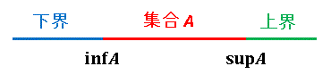
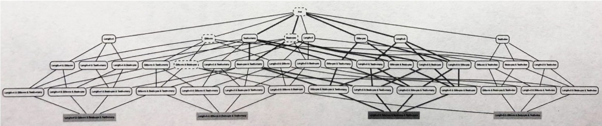

01 仮説空間
==========

> 最も簡単な場合：ある概念を記述する論理表現が、リテラルの連言で表される

* `仮説空間`：考えている対象の概念全体

  * `仮説`：仮説空間に属する概念(論理表現)


### 連言概念についての学習

* 海洋生物の一郡：1つの種に属している

  * `length`：メートル単位で測った体長

  * `gills`：エラがあるかどうか

  * `beak`：くちばしがあるかどうか

  * `teeth`：多くの歯があるかどうか

**それぞれの海洋生物**

1. 体長は3m、エラはない、くちばしはある、歯は多い

    * $`Length = 3 \land Gills = no \land Beak = yes \land Teeth = many`$

2. 1番目よりも、体長が3mよりも少し長かった

    * 1・2番目共通の性質：$`Gills = no \land Beak = yes \land Teeth = many`$

3. 体長は3m、エラがなく、くちばしはあるが、歯は少ない

    * 1・2・3番目共通の性質：$`Gills = no \land Beak = yes`$

> この連言で表される概念で真：それらの生物はイルカの一種


### 連言概念の問題点

* 体長(`length`)が3, 4, 5 mの3つの値をもつ場合

  * 全部：$`3 \cdot 2 \cdot 2 \cdot 2 = 24`$ 通りのインスタンス

    > 他の3つの特徴量：2つの値をもつ

  * 連言概念：$`4 \cdot 3 \cdot 3 \cdot 3 = 108`$ 通り

    > 連言概念に現れない状態を各要素の取りうる値として付加する

  * 外延の総数：$`2^{24} \simeq 1,600,000`$ 通り

    > `外延`：インスタンスの集合において、各インスタンスを含むかどうか



> * 一番下：24の連言概念、取りうるインスタンスに対応
>
> * 下から2番目：44の連言概念、3つのリテラル
>
> * 上から3番目：30個の連言概念、2つのリテラル
>
> * 上から2番目：9個の連言概念、1つのリテラル
>
> * 一番上：空、どのインスタンスにも当てはまる


## 1.最小汎化

* 上の図において、どれか1つのインスタンス(1匹)だけを満たす全ての連言概念は32個


* `最小汎化`(LGG)：最も一般性が低いもの

  * `LGG(H,x)`の探索：インスンタンスと現時点での仮説(連言概念)との連言を取り続けていく操作

  * 最終的に得られる連言概念は、インスタンスの順番に依らない

> **LGG-Set(D)：LGGの探索**
>
> ```
> Input: データD
> Output: 論理表現H
> 1: x ← Dにおける1個目のインスタンス
> 2: H ← x
> 3: while 次のインスタンスがある do
> 4:  x ← Dにおける次のインスタンス
> 5:  H ← LGG(H,x)                 # 例：LGG-ConjかLGG-Conj-ID
> 6: end
> 7: return H
> ```

> **LGG-Conj(x,y)：2つの連言の最小汎化を返すアルゴリズム**
>
> ```
> Input: 連言x,y
> Output: 連言z
> 1: z ← xとyに共通する全てのリテラルの連言
> 2: return z
> ```

* 2つのインスタンス(上の図)での`LGG`は、上から3番目の中央にある連言概念

  > $`Gills = no \land Beak = yes`$

* `束`：任意の2つの要素が、`最小上界`と`最大下界`をもつような半順序集合

  > `LGG`が一意に定まる場合のことを言う

  * データから得られる概念として、最も保守的なもの




### 負例を使った概念学習

* 以下の3匹のイルカの正例：

  * $`p1: Length = 3 \land Gills = no \land Beak = yes \land Teeth = many`$

  * $`p2: Length = 4 \land Gills = no \land Beak = yes \land Teeth = many`$

  * $`p3: Length = 3 \land Gills = no \land Beak = yes \land Teeth = few`$

* 以下の1匹のイルカの負例：

  * $`n1: Length = 5 \land Gills = yes \land Beak = yes \land Teeth = many`$

  > $`Beak = yes`$ は、イルカを表すには不適当

* 負例を扱うことで、`LGG`として得られた概念 $`Gills = no \land Beak = yes`$ と、$`Gills = no`$ という2つの連言概念が残る



> 太い線：負例で真になる概念、正例からは取り除かれる


## 2.内部選言

* `内部選言`：例)「体長は3mかまたは4m」という条件を概念に加える

  * $`Length = [3,4]`$

  * 値を3つ以上もつ特徴量にとって有用

    > $`Teeth = [many,few]`$ ：常に真となるので、無用


### 内部選言の例

* 内部選言無し：

  * $`p1: Length = 3 \land Gills = no \land Beak = yes \land Teeth = many`$

  * $`p2: Length = 4 \land Gills = no \land Beak = yes \land Teeth = many`$

  * $`p3: Length = 3 \land Gills = no \land Beak = yes \land Teeth = few`$

* 内部選言あり：

  * 1・2つ目： $`Length = [3,4] \land Gills = no \land Beak = yes \land Teeth = many`$

  * 1・2・3つ目： $`Length = [3,4] \land Gills = no \land Beak = yes`$

    > 内部選言を使った場合の`LGG`となる


### 内部選言を使ったアルゴリズム

* 内部選言を使って2つの連言の`LGG`を返すアルゴリズムを考える

  * $`Combine-ID(v_x,v_y)`$ ：値の集合 $`v_x`$ と $`v_y`$ に対して、その和集合 $`[v_x,v_y]`$ を返す関数

    > 例)$`Combine-ID([3,4],[4,5])=[3,4,5]`$

```
Input: 連言x,y
Output: 連言z
1: z ← true
2: for 各特徴量 f do
3:  if 「f=v_xはxにおける連言」かつ「f=v_yはyにおける連言」then
4:    f = Combine-ID(v_x,v_y)をzに加える
5:  end
6: end
7: return z
```


| 版   | 年/月/日   |
| ---- | ---------- |
| 初版 | 2019/06/15 |
