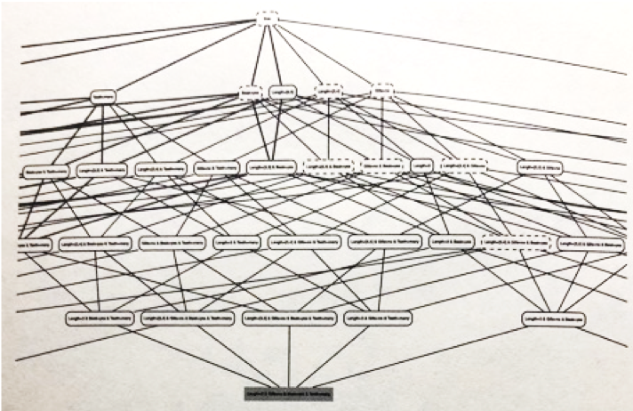
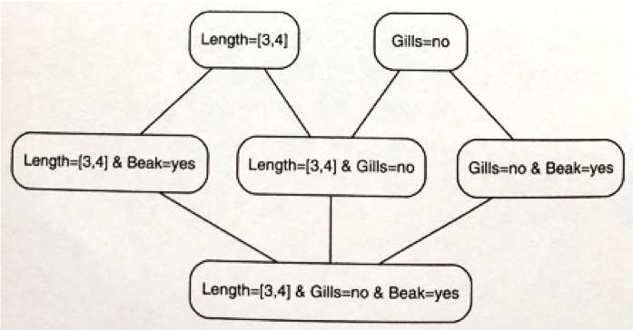
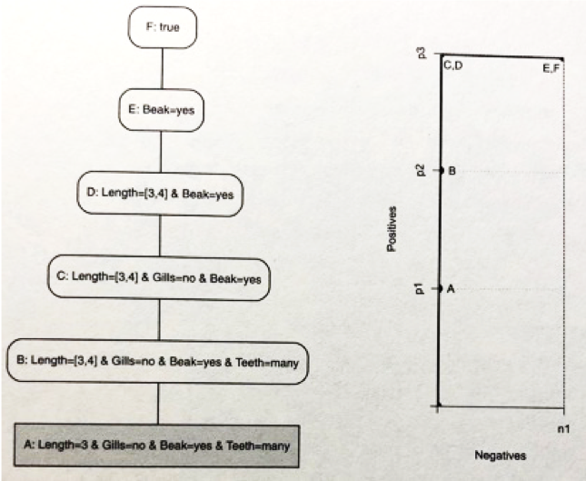
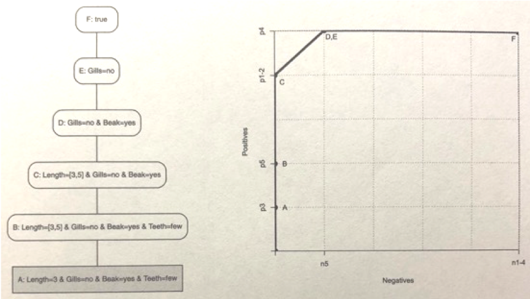
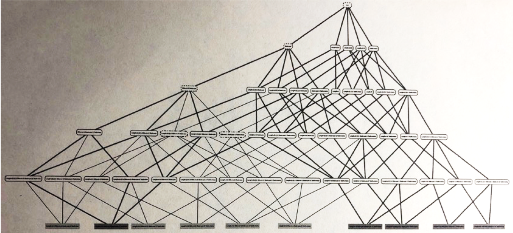

02 仮説空間上のパス
=================

* 以下の図より、この場合に最も一般性の高い概念は2つある

> 体長に内部選言を使った場合：汎化のステップが1段増えている



* 有効な仮説(概念)の集合：最小と最大の一般性をもつ概念を使って表される

  * `LGG`と最も一般性の高い概念との間に存在している概念も、有効な概念

  * このデータに合う仮説は、`凸集合`となる

    > `凸集合`：部分集合 $`A`$ 内の任意の2点(概念A・B)を結ぶ辺上の点(概念C)が、全て $`A`$ に含まれる集合


### バージョン空間

* `完全`：全ての正例に対して、真になるような概念

* `整合的`：全ての負例に対して、真にならないような概念

* `バージョン空間`：`完全`かつ`整合的`な概念の全てからなる集合

  * この空間は、`凸`である

  * 最小の一般性をもつ概念と、最大の一般性をもつ概念によって決定される

> LGGと最も一般性の高い2つの概念との間の概念から成るバージョン空間




### カバレッジプロットと仮説空間

* 1つの正例で真になる概念から始めて、終わりは空の概念まで概念を徐々に一般化させる

  * 最初：$`(0, 1)`$

    > 正例 $`n1`$ の場合： $`(0,n1)`$

    * 正例も負例も真にならない概念の場合：原点 $`(0,0)`$ からはじまる

  * 最後： $`(Neg, Pos)`$

    > 空の概念では、正例も負例も真になる



* 仮説空間で上に向かうパスは、カバレッジ曲線に対応(ランキングにも対応)

  * 上の方向：一般性の高い方向

  > 真になる正例と負例の数は減ることはない

  * バージョン空間の要素を含むパスであれば、対応するカバレッジ曲線は`ROC最良点`(0,Pos)なので、`AUC=1`となる

* 概念学習では、仮説空間から最適なパスを探索する作業


### 連言的分離可能ではないデータの場合

* `連言的分離可能`：任意の整合的な仮説が完全でない場合に、バージョン空間が空になること

  * 正例で真になるような`LGG`が、負例でも真になる場合、`LGG`より一般性の高い任意の概念も整合的でなくなる(対偶も同じ)

* 以下の5つの正例：

  * $`p1: Length = 3 \land Gills = no \land Beak = yes \land Teeth = many`$

  * $`p2: Length = 4 \land Gills = no \land Beak = yes \land Teeth = many`$

  * $`p3: Length = 3 \land Gills = no \land Beak = yes \land Teeth = few`$

  * $`p4: Length = 5 \land Gills = no \land Beak = yes \land Teeth = many`$

  * $`p5: Length = 5 \land Gills = no \land Beak = yes \land Teeth = few`$

* 以下の5つの負例：

  * $`n1: Length = 5 \land Gills = yes \land Beak = yes \land Teeth = many`$

  * $`n2: Length = 4 \land Gills = yes \land Beak = yes \land Teeth = many`$

  * $`n3: Length = 5 \land Gills = yes \land Beak = no \land Teeth = many`$

  * $`n4: Length = 4 \land Gills = yes \land Beak = yes \land Teeth = many`$

  * $`n5: Length = 4 \land Gills = no \land Beak = yes \land Teeth = few`$

* 最も一般性の低い完全な概念：$`Gills = no \land Beak = yes`$

  > これは、負例`n5`でも真になる

* 最も一般性の高い整合的な概念7つ(どれも完全ではない)

  * `Length= 3`：`p1`と`p3`が真になる

  * $`Length = [3,5] \land Gills = no`$ ：`p1`以外が真になる

  * $`Length = [3,5] \land Teeth = few`$ ：`p3`と`p5`が真になる

  * $`Gills = no \land Teeth = many`$ ：`p1`と`p2`と`p4`が真になる

  * $`Gills = no \land Beak = no`$ ：どの正例に対しても真でない

  * $`Gills = yes \land Teeth = few`$ ：どの正例に対しても真でない

  * $`Beak = no \land Teeth = few`$ ：どの正例に対しても真でない


## 1.最も一般性の高い整合的な仮説

* 最も一般性の高い整合的な概念を知る

  > ただし、これらの概念を見つけるためには基本的には列挙しなければならない

  * $`MGConsistent(C,N)`$ の引数 $`C`$ として、空の概念を代入する($`C=true`$)

  * `Cの特殊化`：`C`よりも一般性が低いものの中で最も一般性が高いもの

    > `C`に連言を1つ増やしたり、内部選言の値の1つを削除して得られる

```
Input: 概念C, 負例N
Output: 概念の集合S
1: if CがNのどの例に対しても真でない then return {C}
2: S ← 空集合
3: for Cの特殊化C' do
4:  S ← S と MGConsistent(C,N)の和集合
5: end
6: return S
```

* 仮説空間のパスと対応するカバレッジ曲線

  * パスが3個の整合的な概念： $`y`$ 軸上をカバレッジプロットの点が動く

  * 残りの3個の完全な概念： グラフの一番上の横線上をカバレッジプロットの点が動く

    > `D`：正例の`LGG`

* ランキング：`p3-p5-[p1,p4]-[p2,n5]-[n1-4]`

  * `AUC=0.98`：これらのランキングで、25のうち0.5だけエラーになる

  * 概念C・D・E：最良の正答率を達成する

    > * D：正例に対する性能に重きを置く
    >
    > * C：負例に対する性能に重きを置く




## 2.閉概念

* カバレッジプロットにおいて、DとEが同じ理由を考える

  * Eの方が一般性が高い：正例と負例で真になる数は変わらない

    > 与えられたデータによって、DにあってEにはない条件($`Beak = yew`$)も真になる

* `閉概念`：ある概念が、論理包含で示される条件を全て含んでいる(論理包含について閉じている)

  > D、E：全ての正例と`n5`で真、`LGG`はDの条件となる($`Gills = no \land Beak = yes`$)

  * Dの外延はEの外延の真部分集合($`X_D \subset	X_E`$)

  * $`X`$ の中には、Eでは真であるが、Dでは真でないインスタンスが存在する

    > * DとEで真偽が異なるインスタンスがないと、区別がつかない

* `閉概念`のみに注目することで、仮説空間を小さくできる




| 版   | 年/月/日   |
| ---- | ---------- |
| 初版 | 2019/06/15 |
