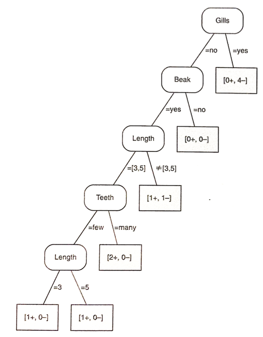
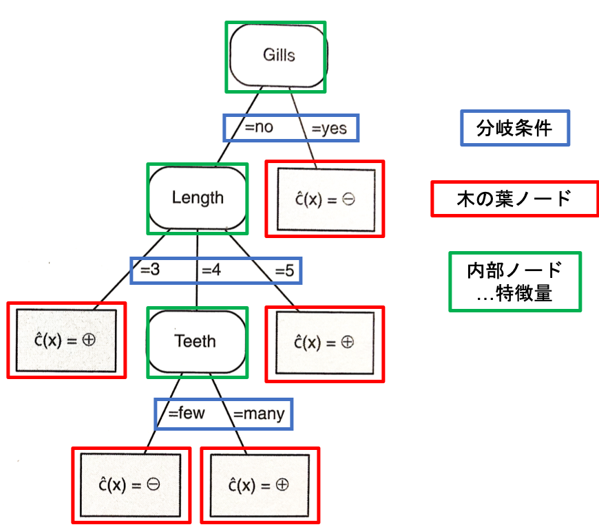

00 はじめに
==========

`木モデル`：最もポピュラーなモデルの1つ

* 再帰的な分割統治の性質を持つ

* ほとんどすべての機械学習のタスクに対して利用される


## 論理仮説空間上のパス図と決定木

### パス図

以下の例を用いる

* 5つの正例：

  * $`p1: Length = 3 \land Gills = no \land Beak = yes \land Teeth = many`$

  * $`p2: Length = 4 \land Gills = no \land Beak = yes \land Teeth = many`$

  * $`p3: Length = 3 \land Gills = no \land Beak = yes \land Teeth = few`$

  * $`p4: Length = 5 \land Gills = no \land Beak = yes \land Teeth = many`$

  * $`p5: Length = 5 \land Gills = no \land Beak = yes \land Teeth = few`$

* 5つの負例：

  * $`n1: Length = 5 \land Gills = yes \land Beak = yes \land Teeth = many`$

  * $`n2: Length = 4 \land Gills = yes \land Beak = yes \land Teeth = many`$

  * $`n3: Length = 5 \land Gills = yes \land Beak = no \land Teeth = many`$

  * $`n4: Length = 4 \land Gills = yes \land Beak = yes \land Teeth = many`$

  * $`n5: Length = 4 \land Gills = no \land Beak = yes \land Teeth = few`$

これらの例を用いて`パス図`は以下で表わされる



* 仮説空間上のパス：同等の特徴木に変換(多くの連言概念を表現)

* $`i`$ 番目の葉ノードを`正`、それ以外を`負`：決定木に変換


### 決定木

* 3つ以上の値を持つ特徴量の値に対して、分岐を作ることができる

* 葉ノードの左から右への順序に従わないラベル付けも行うことができる



以下の論理表現で変換できる

**1.`選言標準形`(DNF)**

* 木の最上部から正とラベル付けされた葉ノードまでの全てのパスの連言を構成

* それぞれのパスは、リテラルの連言を与えている

```math
(Gills = no \land Length = 3) \lor(Gills = no \land Length = 4 \land Teeth = many) \lor (Gills = no \land Length = 5)
```

**2.`分配法則`を用いて`連言標準形`を簡易化**

> `分配法則`
>
> ```math
> (A \land B) \lor (A \land C) \equiv A \land (B \lor C)
> ```

```math
Gills = no \land [Length = 3 \lor (Length = 4 \land Teeth = many) \lor Length = 5]
```

**3.負のクラスを表す連言標準形を作成、それを否定する**

```math
\lnot{[(Gills = no \land Length = 4 \land Teeth = few) \lor Gills = yes]}
```

**4.ド・モルガンの法則を用いて3つ目の表現を`CNF`に変換**

> `ド・モルガンの法則`
>
> ```math
> \lnot(A \land B) \equiv \lnot A \lor \lnot B
> \lnot(A \lor B) \equiv \lnot A \land \lnot B
> ```

```math
(Gills = yes \lor Length = [3,5] \lor Teeth = many) \land Gills = no
```


## 決定木と連言概念

決定木による概念と同等な連言概念を得ることはできない

* 決定木は、連言概念よりも厳密に表現力が高い

  > 全ての論理表現が同等な連言標準形をもつ

* 決定木が分類できない唯一のデータは、ラベル付けに一貫性が無いデータ

  > 同じインスタンスに対して異なるラベル付けがされているデータ

* 正例のみをカバーする選言の集合では、他のインスタンスをカバーしていない(`過適合`)

  * `帰納的バイアス`：学習アルゴリズムが事例を超えた一般化を推し進めるのと共に、過適合を回避することを確認する


## 決定木とタスク

決定木は、ほとんどすべての機械学習のタスクに対して利用される(ランキング、確率推定、回帰、クラスタリング)


### 定義

* 特徴木：各内部ノードが1つの特徴量でラベル付け

* 枝：ある内部ノードから出ており、それぞれ1つのリテラルによってラベル付けされる

* `分岐条件`：1つのノードにおけるリテラルの集合

* 木の葉ノード：論理式

* 連言の外延：その葉ノードに関連付けられた`インスタンス空間セグメント`

  > `外延`：連言によってカバーされるインスタンスの集合


### 特徴

* 仮説空間における多くの連言概念を表現するための方法

  * 学習の問題：与えられたタスクを解く最良な条件の決定

  > 木学習器では、全ての概念に対してトップダウン型の検索を実行


### アルゴリズム

* $`Homogeneous(D)`$：$`D`$ に含まれるインスタンスが、単独のラベルでラベル付けできるかを判断(`真`or`偽`)

* $`Label(D)`$：インスタンス集合 $`D`$ に対して、最も適切なラベルを返す

* $`BestSplit(D,F)`$：内部ノードに設定するのに最良なリテラルの集合を返す

**$`GrowTree(D,F)`$：訓練データから特徴木を生成する**

|                                                                                                                                |
| ------------------------------------------------------------------------------------------------------------------------------ |
| Input: データ $`D`$, 特徴量の集合 $`F`$                                                                                        |
| Output: ラベル付けされた葉ノードを持つ特徴木 $`T`$                                                                             |
| 1: if $`Homogeneous(D)`$ then return $`Label(D)`$                                                                              |
| 2: $`S \leftarrow BestSplit(D,F)`$                                                                                             |
| 3: $`S`$ に含まれるリテラルに従って $`D`$ を部分集合 $`D_i`$ に分割する                                                        |
| 4: for 各 $`i`$ do                                                                                                             |
| 5:   if $`D_i \neq \varnothing`$ then $`T_i \leftarrow GrowTree(D,F)`$ else $`T_i`$ は $`Label(D)`$ でラベル付けされた葉ノード |
| 6: end                                                                                                                         |
| 7: return 根ノードが $`S`$ でラベル付けされ、子が $`T_i`$ である木                                                             |


### アルゴリズムの特徴

`分割統治`：データをいくつかの部分集合に分割し、それぞれを繋げて木モデルを作る

1. データを部分集合に分割

1. 各部分集合に対して木を構築

1. その部分集合に対する木を1つの木に結合する

> 一度した選択を再度検討しない


| 版   | 年/月/日   |
| ---- | ---------- |
| 初版 | 2019/06/29 |
