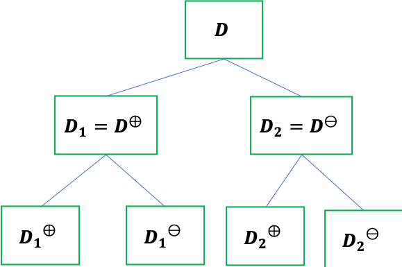
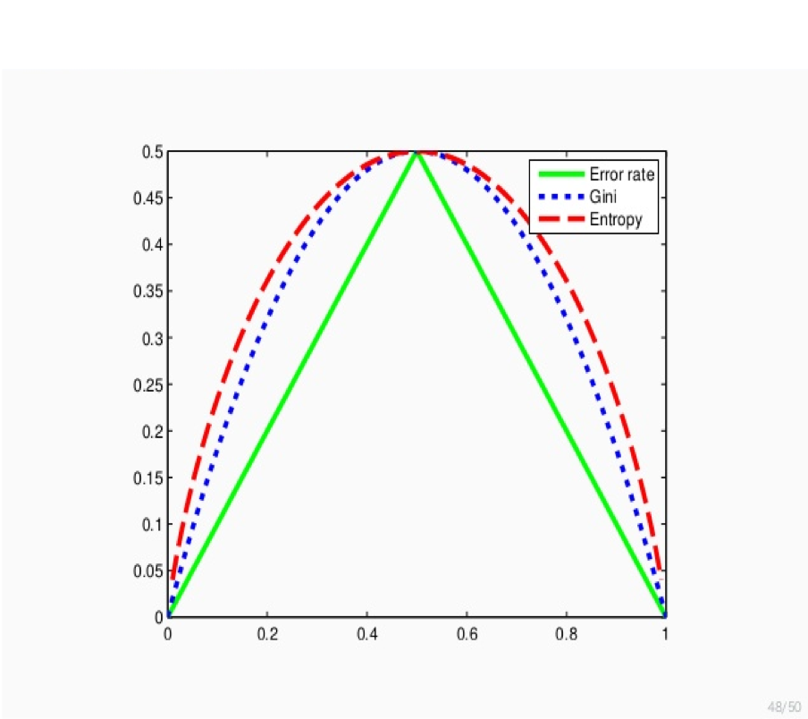
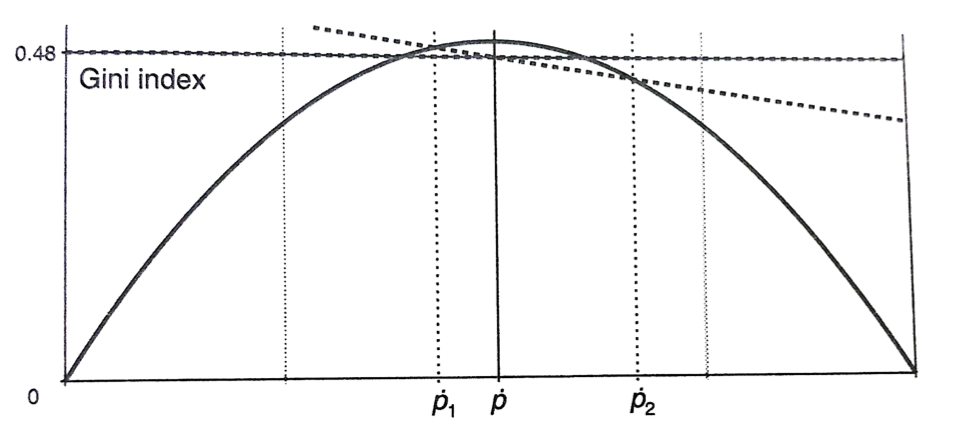
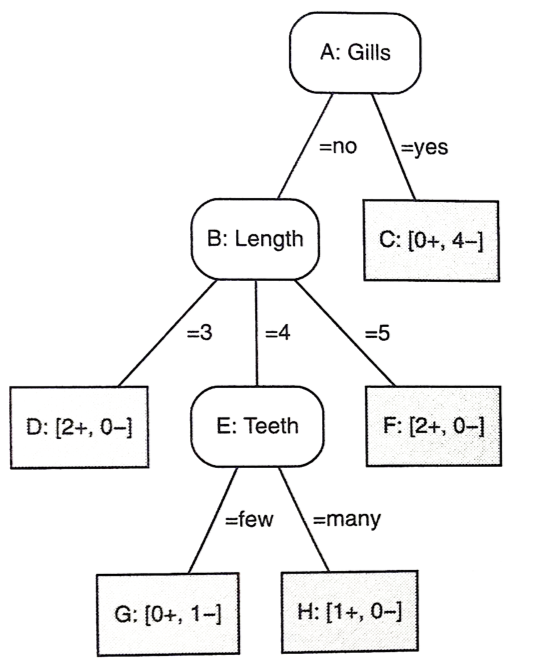
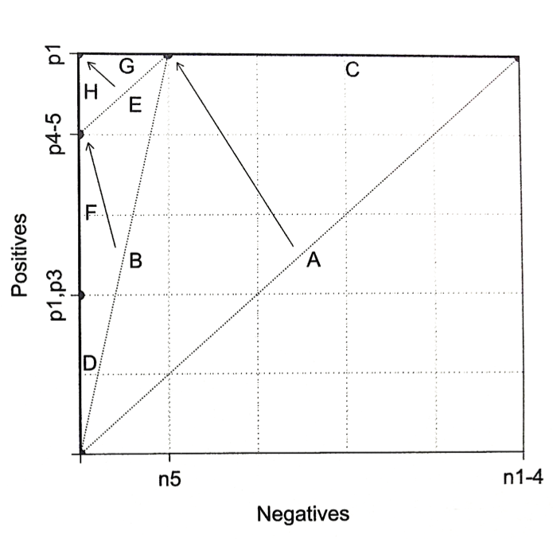

01 決定木
========

* $`Label(D)`$：$`D`$ 内のインスタンスにおける多数派クラスを返す

  > $`BestSplit(D,F)`$ をどのように定義するかを考える

**仮定：ブール型の特徴量を扱う**

* $`D`$ を $`D_1`$、$`D_2`$ の2つに分割

* 2クラス：$`D^{\oplus}`$、$`D^{\ominus}`$ と表す

  > 各部分集合：$`D_1^{\oplus}`$

**最良の状況**

* $`D_1^{\oplus} = D^{\oplus}`$ かつ $`D_1^{\ominus} = \varnothing`$

* $`D_1^{\oplus} = \varnothing`$ かつ $`D_1^{\ominus} = D^{\ominus}`$

これらの状況を、「分岐の2つの子ノードは純粋である」という



**不純度の測定**

`不純度`($`\dot{p}`$)：$`n^{\oplus}`$ 個の正例と、$`n^{\ominus}`$ 個の負例を考える

* 相対度数のみに依存する、正の`経験確率`を用いる

  > ```math
  > \dot{p} = \frac{n^{\oplus}}{(n^{\oplus} + n^{\ominus})}
  > ```

* $`\dot{p}`$ を $`1 - \dot{p}`$ で置き換えた場合にも、不純度は変化しない

* $`\dot{p} = 0`$ もしくは $`\dot{p} = 1`$ のときに`0`の値、$`\dot{p} = \frac{1}{2}`$ の場合に最大値を取る


## 不純度尺度

* `少数派クラス`

* `ジニ・インデックス`

* `エントロピー`

**少数派クラス(誤り率)**

```math
\min (\dot{p}, 1- \dot{p})
```

`不純度`は、以下の式で表わされる

```math
\frac{1}{2} - \vert \dot{p} - \frac{1}{2} \vert
```

**ジニ・インデックス**

葉ノード内の事例を、ランダムにラベル付けされた場合の期待誤差

* 確率 $`\dot{p}`$：正

* 確率 $`1 - \dot{p}`$：負

```math
2 \dot{p} (1 - \dot{p})
```

* 偽陽性の確率：$`\dot{p} (1 - \dot{p})`$

* 偽陰性の確率：$`(1 - \dot{p})\dot{p}`$

**エントロピー**

ビット単位での期待情報量

```math
- \dot{p} \log_2 \dot{p} - (1 - \dot{p}) \log_2 (1 - \dot{p})
```



全ての尺度において、$`(0.5,0.5)`$ で最大値を取る


### 葉ノードの不純度尺度

$`Imp(D_j)`$：葉ノード $`D_j`$ の不純度

* 相互に背反な葉ノードの集合 $`D_1, \cdots, D_l`$ の不純度は、以下の重み付き平均として定義される

  > $`D = D_1 \cup \cdots \cup D_l`$

```math
Imp(\{D_1, \cdot, D_l \}) = \sum_{j=1}^l \frac{\vert D_j \vert}{\vert D \vert} Imp(D_j)
```

**$`Imp(\{ D_1, D_2\})`$ を見つける**

仮定：親ノードと子ノードの経験確率が与えられている

1. 不純度曲線上の、2つの不純度の値 $`Imp(D_1)`$、$`Imp(D_2)`$ を見つける

1. 2つの値の重み付き平均：その2点を結ぶ直線上にあるので、2つの不純度を直線で結ぶ

1. 親ノードの経験確率は、同じ重みを用いた子ノードの経験確率の重み付き平均なので、$`\dot{p}`$ によって正しい補間点が得られる

```math
\dot{p} = \frac{\vert D_1 \vert}{\vert D \vert}\dot{p}_1 + \frac{\vert D_2 \vert}{\vert D \vert}\dot{p}_2
```




### 例：不純度の計算

以下の例を用いる

* 5つの正例：

  * $`p1: Length = 3 \land Gills = no \land Beak = yes \land Teeth = many`$

  * $`p2: Length = 4 \land Gills = no \land Beak = yes \land Teeth = many`$

  * $`p3: Length = 3 \land Gills = no \land Beak = yes \land Teeth = few`$

  * $`p4: Length = 5 \land Gills = no \land Beak = yes \land Teeth = many`$

  * $`p5: Length = 5 \land Gills = no \land Beak = yes \land Teeth = few`$

* 5つの負例：

  * $`n1: Length = 5 \land Gills = yes \land Beak = yes \land Teeth = many`$

  * $`n2: Length = 4 \land Gills = yes \land Beak = yes \land Teeth = many`$

  * $`n3: Length = 5 \land Gills = yes \land Beak = no \land Teeth = many`$

  * $`n4: Length = 4 \land Gills = yes \land Beak = yes \land Teeth = many`$

  * $`n5: Length = 4 \land Gills = no \land Beak = yes \land Teeth = few`$

利用できる4つの特徴量は、それぞれ以下のような分岐となる

* $`Length = [3,4,5]`$：$`[2+,0-]`$, $`[1+,3-]`$, $`[2+,2-]`$

* $`Gills = [yes,no]`$：$`[0+,4-]`$, $`[5+,1-]`$

* $`Beak = [yes,no]`$：$`[5+,3-]`$, $`[0+,2-]`$

* $`Teeth = [many,few]`$：$`[3+,4-]`$, $`[2+,1-]`$

**$`Length`$ の不純度を考える**

前提：`エントロピー`を用いて不純度を計算する

1. 最初のセグメントのエントロピー($`[2+,0-]`$)

  > ```math
  > - \Bigr( \frac{2}{2} \log_2 \Bigr( \frac{2}{2}\Bigl) \Bigl) - \Bigr( \frac{0}{2} \log_2 \Bigr( \frac{0}{2}\Bigl) \Bigl) = 0
  > ```

2. 2つめのセグメントのエントロピー($`[1+,3-]`$)

  > ```math
  > - \Bigr( \frac{1}{4} \log_2 \Bigr( \frac{1}{4}\Bigl) \Bigl) - \Bigr( \frac{3}{4} \log_2 \Bigr( \frac{3}{4}\Bigl) \Bigl) = 0.81
  > ```

3. 3つめのセグメントのエントロピー($`[2+,2-]`$)

  > ```math
  > - \Bigr( \frac{2}{4} \log_2 \Bigr( \frac{2}{4}\Bigl) \Bigl) - \Bigr( \frac{2}{4} \log_2 \Bigr( \frac{2}{4}\Bigl) \Bigl) = 1
  > ```

`エントロピー`の合計は、重み付き平均として以下のように計算される

```math
\frac{2}{10} \cdot 0 + \frac{4}{10} \cdot 0.81 + \frac{4}{10} \cdot 1 = 0.72
```

**全特徴量の不純度**

* $`Length`$：$`0.72`$

* $`Gills`$：$`0.39`$

* $`Beak`$：$`0.76`$

* $`Teeth`$：$`0.97`$

故に、$`Gills`$ が分割に用いるための極めて良い特徴量となる

> エントロピー以外の関数でも同じ結果を得る


## 多クラスによる不純度

`一対他`方式で、クラスごとの不純度を合計することによって実行

* $`k`$ クラスエントロピー：$`\sum_{i=1}^k - \dot{p}_i \log_2 \dot{p}_i`$

* $`k`$ クラスジニ・インデックス：$`\sum{i=1}^k \dot{p}_i (1 - \dot{p}_i)`$

`純度の増加量`：特徴量の分割の質を評価

> その特徴量を含めることによって得られるクラスについての情報の増加量

```math
Imp(D) - Imp(\{ D_1, \cdots, D_l \})
```

**$`BestSplit-Class(D,F)`$：決定木のための最良の分岐を探索する**

親ノードの不純度を無視し、その子ノード最小の重み付き平均不純度を与える特徴量を探索する

|                                                                                   |
| --------------------------------------------------------------------------------- |
| Input: データ $`D`$, 特徴量の集合 $`F`$                                           |
| Output: 分割するための特徴量 $`f`$                                                |
| 1: $`I_{\min} \leftarrow 1`$                                                      |
| 2: for 各 $`f \in F`$ do                                                          |
| 3:   $`f`$ の値 $`v_j`$ に基づいて $`D`$ を部分集合 $`D_1,\cdots,D_l`$ に分割する |
| 4:   if $`Imp(\{ D_1, \cdots, D_l \}) < I_{\min}`$ then                           |
| 5:     $`I_{\min} \leftarrow Imp(\{ D_1, \cdots, D_l \})`$                        |
| 6:     $`f_{best} \leftarrow f`$                                                  |
| 7:   end                                                                          |
| 8: end                                                                            |
| 9: return $`f_{best}`$                                                            |


### 決定木学習アルゴリズムの流れ

**不純度の計算**

1. 最良の特徴量を用いる($`GIlls = yes`$)

  * 正である子ノード：$`[5+,1-]`$

  * 負である子ノード：$`[0+,4-]`$

2. $`Beak`$ 以外の特徴量を、不純度の低い順に用いる

  * $`Length = 3`$：$`[2+,0-]`$

  * $`Length = 4`$：$`[1+,1-]`$

  * $`Length = 5`$：$`[2+,0-]`$

  > このノードにおいて、全ての事例が $`Beak = yes`$ となる(不純度が減少しない)

3. $`Teeth`$ を用いて、ノードを分割する

  * $`Teeth = many`$：$`[1+,0-]`$

  * $`Teeth = few`$：$`[0+,1-]`$




### カバレッジ空間

* 木の根ノードは、全ての正例と負例をカバーしている

* 一つ目の分岐：線分BとCに置き換えられる

* 線分Bは更に線分D、E、Fに分割される

* 最終的に、Eが2つの純粋なノードに分割




| 版   | 年/月/日   |
| ---- | ---------- |
| 初版 | 2019/06/29 |
