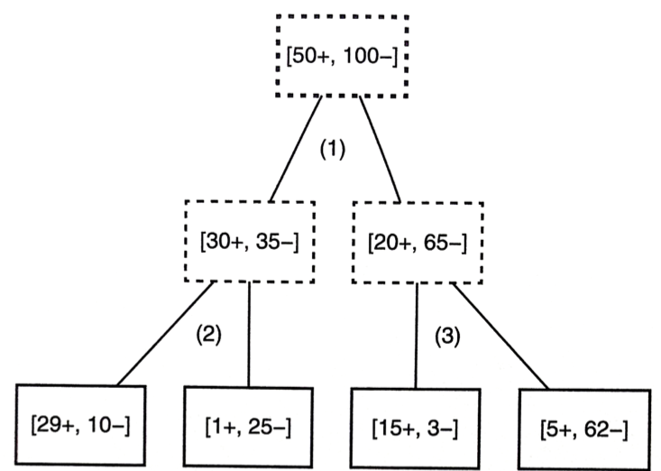
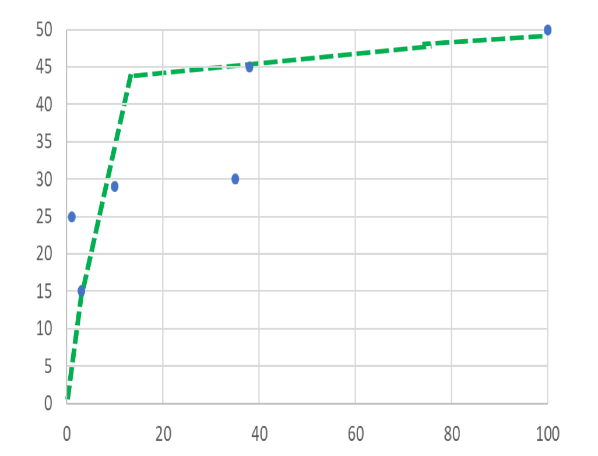
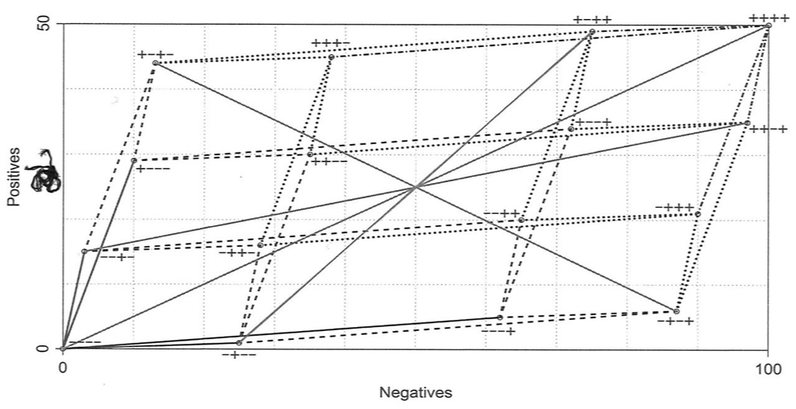
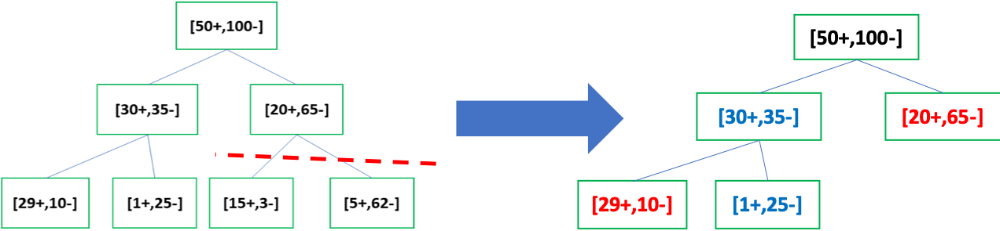
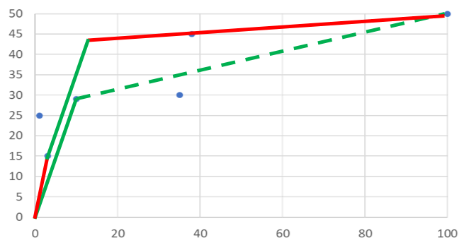
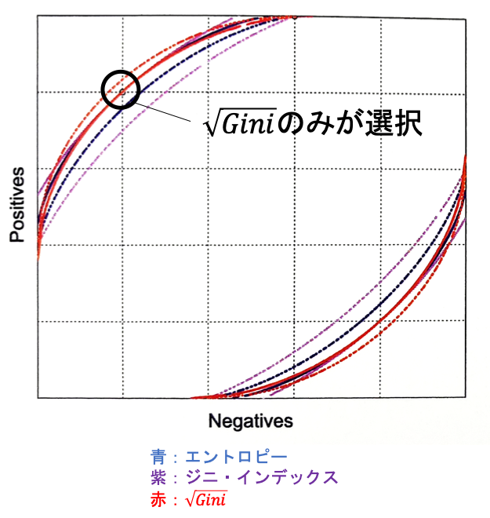
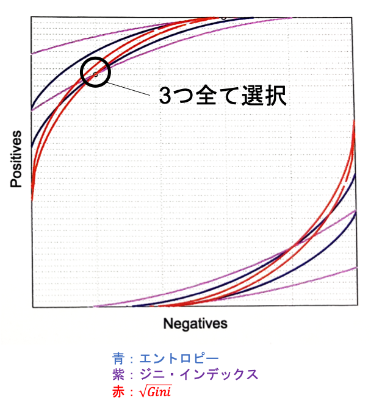

02 ランキング木と確率推定木
=======================

## 1.ランキング木と確率推定木

`グループ分け分類器`：インスタンス空間をセグメントに分割し、セグメントの順序を学習してランカーに変更される

`決定木`：セグメントや葉ノードの局所的なクラス分布にアクセスしている

* `クラス分布`：訓練データにおいて、最適な葉ノードの順序を構成するために用いる

**決定木における順序の決め方**

1. 経験確率 $`\dot{p}`$ から得られる

1. 順序がタイの時、正例が多い方を優先

最適な順序：`[D-F]-H-G-C`(`AUC=1`)


**順序の特徴**

決定木の葉ノードでの経験確率から得られるランキングにより、訓練データの上に凸なROC曲線を得ることができる

* 経験確率 $`\dot{p}`$ を持つカバレッジ曲線の傾き

  ```math
  \frac{\dot{p}}{1 - \dot{p}}
  ```

* 以下の変換は、単調変換である

  ```math
  \dot{p} \mapsto \frac{\dot{p}}{1 - \dot{p}}
  ```

**線分の順序**

ある分岐の親ノードが持つ経験確率がわかっても、その子ノードの経験確率に対して何の制約も持たない

* 親ノードのクラス分布：$`[n^{\oplus},n^{\ominus}]`$($`n = n^{\oplus} + n^{\ominus}`$)

* 子ノードのクラス分布：$`[n_1^{\oplus},n_1^{\ominus}]`$($`n_1 = n_1^{\oplus} + n_1^{\ominus}`$), $`[n_2^{\oplus},n_2^{\ominus}]`$($`n_2 = n_2^{\oplus} + n_2^{\ominus}`$)

ゆえに、親ノードの経験確率は「子ノードの経験確率の重み付き平均」となる

```math
\dot{p} = \frac{n^{\oplus}}{n} = \frac{n_1}{n}\frac{n_1^{\oplus}}{n_1} + \frac{n_2}{n}\frac{n_2^{\oplus}}{n_2} = \frac{n_1}{n}\dot{p}_1 + \frac{n_2}{n}\dot{p}_2
```


### 木の育成                                                                                                                       

以下の図を用いて考える



(1)、(2)、(3)で分岐された場合のカバレッジプロットは、以下の図で表わされる


ここで、線分の傾きが小さい順に並べることで、曲線が得られる



**決定木の分岐**

1. 該当する曲線の線分を、2つもしくは3つ以上の線分に分割する

1. 線分の傾きの大きさについて降順になるように、線分を並び替える


### ランキングの検討

**決定木によって構成される全てのランキングの検討**

1. ラベル付けの方法が何通りあるか？

2. そのラベル付けの性能はどうなのか？

**一般的な性質**

* 葉ノードをクラスでラベル付け：$`c^l`$ 通り(16通り)

* ROC曲線を作る場合の数： $`l!`$ 通り(24通り)

> $`c`$：クラスの数、$`l`$：葉ノードの数


### ラベル付けとランキングの図

左下の「----」から始まり、「+」に変更していくことでランキングを得る

* 最適なカバレッジ曲線：「----」、「--+-」、「+-+-」、「+-++」」、「++++」

> 「+-+-」：左から1つめと3つめの葉ノードを「+」に、2つめと4つめの葉ノードを「-」にラベル付けする



**決定木をランキング、確率推定木に変更する**

* 特徴木からランカー：経験確率が増加しないように特徴木の葉ノードの並べ替えを行う

* 特徴木から確率推定木：各葉ノードにおける経験確率を推定、サイズの小さな葉ノードに対して頑健な推定量を与える(ラプラス平滑化、M推定平滑化)

* 特徴木から分類器：動作条件を選択、その条件のもとで最適な動作点を見つける


### 特徴木から分類器に変換する

**仮定**

* 多数派クラスラベル付けにおいて、訓練データ集合が代表的かつ期待コストが一様

  * $`c > 1`$：正例を $`c`$ 倍多くサンプリング

  * $`c < 1`$：負例を $`\frac{1}{c}`$ 倍多くサンプリング

* 集合のデータのクラス比($`clr = \frac{50}{100}`$)

* 5つのラベル付けから1つを選ぶ際には、その選択は期待コスト比 $`c`$ に左右される

```math
c = \frac{c_{FN}}{c_{FP}}
```

**実際の値**

* 「----」：$`c < \frac{3}{15}`$(偽陽性にかかるコストは偽陰性の5倍)

* 「--+-」：$`\frac{3}{15} < c < \frac{10}{29}`$

* 「+-+-」：$`\frac{10}{29} < c < \frac{62}{5}`$

* 「+-++」：$`\frac{62}{5} < c < \frac{25}{1}`$

* 「++++」：$`\frac{25}{1} < c`$(偽陰性にかかるコストが偽陽性の25倍)

**例：クラス分布が代表的で、偽陰性にかかるコストは偽陽性の20倍**

$`c = \frac{20}{1}`$ なので、「+-++」を選択する

* 負例を取り除く：2つめの葉ノードだけを利用するために、右2つの葉ノードは1つに結合する(`枝刈り`)



**枝刈りの特徴**

* メリット：よりシンプルになって見やすい

* デメリット：AUCが下がる



以下の場合ににのみ枝刈りを行う

* 木の分類のみ使用する

* 十分正確に期待される動作条件を定義できる

**$`PruneTree(T,D)`$：決定木の縮小誤差枝刈り**

枝刈りが訓練データ上の正答率を改善しないことに注意する

|                                                                                                     |
| --------------------------------------------------------------------------------------------------- |
| Input: 決定木 $`T`$, ラベル付けされたデータ $`D`$                                                   |
| Output: 枝刈りされた木 $`T'`$                                                                       |
| 1: for $`T`$ の全ての内部ノード $`N`$ について、最下部から開始する do                               |
| 2:   $`T_N \leftarrow N`$ を根ノードにもつ $`T`$ の部分木                                           |
| 3:   $`D \leftarrow \{ x \in D \vert x は N にカバーされている \}`$                                 |
| 4:   if $`D_N`$ 上での $`T_N`$ の正答率が $`D_N`$ 上での多数はクラスの場合よりも悪い then           |
| 5:     $`T`$ 内で $`T_N`$ を $`D_N`$ 上での多数派クラスでラベル付けされた葉ノードによって置き換える |
| 6:   end                                                                                            |
| 7: end                                                                                              |
| 8: return $`T`$ の枝刈りされたバージョン                                                            |


## 2.偏りのあるクラス分布に対する感度

**訓練データ集合が正しい動作条件を反映する**

モデルの展開において、正例や負例の複製を作成して、訓練データ集合のクラス比を、期待コスト比と期待クラス比の積に等しくする

* メリット：どのようなモデルに対してもそのまま適用可能

* デメリット：

  * 訓練時間を増加

  * 学習されているモデルに対して、実際には効果がない可能性


### 分割基準のコスト感度

$`[10+,10-]`$ を分割する

* エントロピー、ジニ・インデックス：$`[8+,2-]`$、$`[2+,8-]`$ が良い

* ジニ・インデックスの平方根：$`[10+,6-]`$、$`[0+,4-]`$ が良い

ここで、正例誤分類は負例誤分類より約10倍コストかかることより、正例を10倍にする

$`[80+,2-]`$、$`[20+,8-]`$

$`[100+,60-]`$、$`[0+,4-]`$

この場合、3つの基準全てがジニ・インデックスの分岐を支持する

**(1)正例を膨らませた状況**

直感的に、$`[100+,60-]`$、$`[0+,4-]`$ の方が純粋である

**(2)正例を膨らませなかった状況**

`ジニ・インデックス`

* 親ノードの不純度：$`2 \frac{n^{+}}{n}\frac{n^{-}}{n}`$

* 子ノードの重み付き不純度：$`\frac{n_1}{n}2\frac{n_1^{\oplus}}{n_1}\frac{n_1^{\ominus}}{n_1}`$

* 相対不純度：$`\frac{n_1}{n}\frac{n^{+}}{n}\frac{n^{-}}{n}`$

$`\sqrt{Gini}`$

* 親ノードの不純度：$`\sqrt{\frac{n^{\oplus}}{n}\frac{\ominus}{n}}`$

* 子ノードの重み付き不純度：$`\frac{n_1}{n}\sqrt{\frac{n_1^{\oplus}}{n_1}\frac{n_1^{\ominus}}{n_1}}`$

* 相対不純度：$`\sqrt{\frac{n_1^{\oplus}}{n^{\oplus}}\frac{n_1^{\ominus}}{n^{\ominus}}}`$

> `ジニ・インデックス`は相対不純度比が正例の数に比例するが、$`\sqrt{Gini}`$ ではクラス分布の変化に対して反応しない


### 分割基準のROC曲線

* アイソメトリックは曲線：分割基準が非線形のため

* アイソメトリックは対角線の両側に現れる：分岐の質を変えることなく左右の子ノードを取り替え可能のため

**そのままの数の正例におけるアイソメトリック**

* 実線：分岐 $`[8+,2-]`$、$`[2+,8-]`$

* 点線：分岐 $`[10+,6-]`$、$`[0+,4-]`$



**正例を10倍にした場合におけるアイソメトリック**

* 実線：分岐 $`[80+,2-]`$、$`[20+,8-]`$

* 点線：分岐 $`[100+,6-]`$、$`[0+,4-]`$



エントロピーとジニ・インデックスはクラス分布の変動に影響を受けやすいが、$`\sqrt{Gini}`$ は影響を受けない


### 木モデルのまとめ

1. うまくランキングできることを重視

  * 良いランカーからは、良い分類や確率推定が行える

  * 良い分類や確率推定からは、必ずしも良いランカーが保証されない

2. 分布に影響されにくい不純度尺度を用いる($`\sqrt{Gini}`$)

  * もしくは、少数派クラスを過剰分布してみる

3. 確率推定値の平滑化(ラプラス修正、M推定)

4. 動作条件確認後、ROC曲線上の最良の動作点を選択

5. すべての葉ノードが同じラベルを持つような部分木を枝刈りで消去


| 版   | 年/月/日   |
| ---- | ---------- |
| 初版 | 2019/06/30 |
