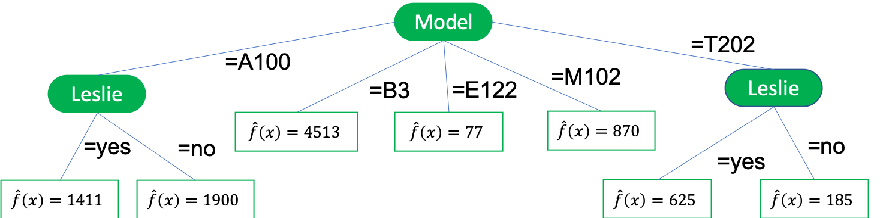
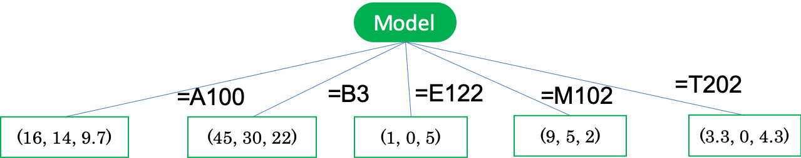

03 分散縮小としての木学習
=====================

決定木を、回帰タスクやクラスタリングに適用する

経験確率 $`\dot{p}`$ で表が出るようなコインを用いて、コイン投げを行う

* 表が出た場合：`1`

* 裏が出た場合：`0`

`期待値`：$`\dot{p}`$

`分散`：$`\dot{p}(1 - \dot{p})`$

> `ベルヌーイ試行`という

よって、分散項としての`ジニ・インデックス`の別の解釈が得られる

* 葉ノードが純粋になるほど、コインの偏りが大きくなり、分散が小さくなる

* 多クラスの場合：一体他クラスの確率変数の分散を合計すればよい

**ジニ・インデックスを用いた子ノードの重み付き平均不純度**

経験確率 $`\dot{p}_1`$、$`\dot{p}_2`$ によって、$`n`$ 例を $`n_1`$ 例と $`n_2`$ 例に分割

* $`\sigma_j^2`$：成功確率 $`\dot{p}_j`$ のベルヌーイ分布の分散

```math
\frac{n_1}{n} 2 \dot{p}_1 (1 - \dot{p}_1) + \frac{n_2}{n} 2 \dot{p}_2 (1 - \dot{p}_2) = 2 \Bigr( \frac{n_1}{n} \sigma_1^2 + \frac{n_2}{n} \sigma_2^2 \Bigl)
```

重み付き平均ジニ・インデックスの最小値を与える分岐を見つける：分散の重み付き平均を最小化する


### 分散のまとめ

`分散`：データのばらつきの度合い

* 実数の集合 $`X \subseteq \mathbb{R}`$ に対する分散は、平均値からの二乗誤差として定義される

  ```math
  Var(X) = \frac{1}{\vert X \vert} \sum_{x \in X} (x - \bar{x})^2
  ```

  > $`\bar{x}`$ は、 $`X`$ の平均値
  >
  > ```math
  > \bar{x} = \frac{1}{\vert X \vert}\sum_{x \in X} x
  > ```

* `分散`は、2乗の平均と平均の2乗の差で表わされる

  ```math
  Var(X)
  = \frac{1}{\vert X \vert} \Bigr( \sum_{x \in X} x^2 - 2 \bar{x} \sum_{x \in X} x + \sum_{x \in X} \bar{x}^2 \Bigl)
  = \frac{1}{\vert X \vert} \Bigr( \sum_{x \in X} x^2 - 2 \bar{x} \vert X \vert \bar{x} + \vert X \vert \bar{x}^2 \Bigl)
  = \frac{1}{\vert X \vert} \sum_{x \in X} x^2 - \bar{x}^2
  ```

* 他の値 $`x' \in \mathbb{R}`$ からの平均二乗誤差を考える

  ```math
  \frac{1}{\vert X \vert} \sum_{x \in X} (x - x')^2
  = \frac{1}{\vert X \vert} \Bigr( \sum_{x \in X} x^2 - 2 x' \vert X \vert \bar{x} + \vert X \vert x'^2 \Bigl)
  = Var(X) + (x' - \bar{x})^2
  ```

* $`X`$ の任意の2つの要素間の平均二乗誤差は、分散の2倍

  ```math
  \frac{1}{\vert X \vert^2} \sum_{x' \in X}\sum_{x \in X}(x - x')^2
  = \frac{1}{\vert X \vert}\sum_{x' \in X}(Var(X) + (x' - \bar{x})^2)
  = Var(X) + \sum_{x' \in X}\sum_{x \in X}(x' - \bar{x})^2
  = 2 Var(X)
  ```

* $`X \subseteq \mathbb{R}^d`$ が $`d`$ 個の実数値からなるベクトルの集合である場合、$`d`$ 個の各座標に対して分散 $`Var_i(X)`$ を定義できる

  * 分散の和は、集合 $`X`$ 上のベクトルと、平均ベクトルとの平均二乗ユークリッド距離として解釈可能


## 1.回帰木

回帰問題において、目的変数は連続

* 目的変数 $`Y`$ の分散を、平均値からの平均二乗誤差として定義する

  ```math
  Var(Y) = \frac{1}{\vert Y \vert} \sum_{y \in Y} (y - \bar{y})^2
  ```

  > $`y = \frac{1}{\vert Y \vert} \sum_{y \in Y}y`$：$`Y`$ に含まれる目的変数の値の平均値

* 分散の重み付き平均は、以下の式で表わされる

  > ある分岐で、目的変数の値の集合 $`Y`$ が互いに背反な集合 $`\{Y_1, \cdots, Y_l\}`$ に分割される場合

  ```math
  Var(\{Y_1, \cdots, Y_l\})
  = \sum_{j=1}^l \frac{\vert Y_j \vert}{\vert Y \vert} Var(y_j)
  = \sum_{j=1}^l \frac{\vert Y_j \vert}{\vert Y \vert} \Bigr( \frac{1}{\vert Y_j \vert} \sum_{y \in Y_j} y^2 - \bar{y}_j^2 \Bigl)
  = \frac{1}{\vert Y \vert} \sum_{y \in Y} y_2 - \sum_{j=1}^l \frac{\vert Y_j \vert}{\vert Y \vert}\bar{y}_j^2
  ```

回帰木学習する際、不純度尺度 $`Imp`$ を $`Var`$ に書き換える

* 分散の最小化は、各分岐の子ノードでの二乗平均の重み付き平均の最大化に等しい


### 回帰木の学習

データ：オルガンの特徴量と値段

| #   | Model | Condition | Leslie | Price |
| --- | ----- | --------- | ------ | ----- |
| 1.  | B3    | excellent | no     | 4513  |
| 2.  | T202  | fair      | yes    | 625   |
| 3.  | A100  | good      | no     | 1051  |
| 4.  | T202  | good      | no     | 270   |
| 5.  | M102  | good      | yes    | 870   |
| 6.  | A100  | excellent | no     | 1770  |
| 7.  | T202  | fair      | no     | 99    |
| 8.  | A100  | good      | yes    | 1900  |
| 9.  | E112  | fair      | no     | 77    |

**購入する際の妥当な価格を決める**

3つの特徴量：以下の3つの分岐を考える

* $`Model = [A100, B3, E112, M102, T202]`$

  * $`[1051, 1770, 1900], [4513], [77], [870], [99, 270, 625]`$

  * 平均値：$`1574, 4513, 77, 870, 331`$

  * 二乗平均の重み付き平均：$`3.21 \times 10^6`$

* $`Condition = [excellent , good , fair]`$

  * $`[1770, 4513], [270, 870, 1051, 1900], [77, 99, 625]`$

  * 平均値：$`3142, 1023, 267`$

  * 二乗平均の重み付き平均：$`2.68 \times 10^6`$

* $`Leslie = [yes,no]`$

  * $`[625, 870, 1900], [77, 99, 270, 1051, 1770, 4513] `$

  * 平均値：$`1132, 1297`$

  * 二乗平均の重み付き平均：$`1.55 \times 10^6`$

故に、最初の分岐は最も値の大きな「Model」を用いて分岐を行う

**$`A100`$ の場合**

* $`Condition = [excellent , good , fair]`$

  * $`[1770], [1051, 1990], []`$

* $`Leslie = [yes,no]`$

  * $`[1900], [1051, 1770]`$

故に、次の分岐は「Leslie」を用いて分岐を行う

**$`T202`$ の場合**

* $`Condition = [excellent, good, fair]`$

  * $`[], [270], [99, 625]`$

* $`Leslie = [yes, no]`$

  * $`[625] [99, 270]`$

故に、次の分岐は「Leslie」を用いて分岐を行う



### まとめ

* 回帰木は常に過適合に警戒する

  > 縮小誤差枝刈りを適用

* 葉ノード内で一定値を予測する

  > 線形回帰

* `モデル木`を考える(葉ノードで線形回帰モデルをもつ木)


## 2.クラスタリング木

`クラスタリング木`：回帰木におけるセグメント内の目的変数が集まっている箇所を探すことで対応

* 任意の2つのインスタンス $`x, x' \in X`$ の距離を導入

* 非類似度を測る抽象的な関数 $`Dis(D)`$ (クラスター非類似度) を導入(Dis: $`X \times X \rightarrow \mathbb{R}`$)

  > $`Dis(x, x')`$ が大きいほど、$`x`$ と $`x'`$ は似ていない

  ```math
  Dis(D) = \frac{1}{\vert D \vert^2} \sum_{x \in D} \sum_{x' \in D} Dis(x, x')
  ```

ゆえに、ある分岐における全ての子ノード上のクラスター非類似度の重み付き平均は、`分岐非類似度`($`BestSplit(D,F)`$ に寄与)を与える


### 非類似度行列に基づくクラスタリング木の学習

データ：オルガンの特徴量と値段に、追加の特徴量を用いたときの非類似度行列

|     | 1   | 2   | 3   | 4   | 5   | 6   | 7   | 8   | 9   |
| --- | --- | --- | --- | --- | --- | --- | --- | --- | --- |
| 1   | 0   | 11  | 6   | 13  | 10  | 3   | 13  | 3   | 2   |
| 2   | 11  | 0   | 1   | 1   | 1   | 3   | 0   | 4   | 0   |
| 3   | 6   | 1   | 0   | 2   | 1   | 1   | 2   | 2   | 1   |
| 4   | 13  | 1   | 2   | 0   | 0   | 4   | 0   | 4   | 0   |
| 5   | 10  | 1   | 1   | 0   | 0   | 3   | 0   | 2   | 0   |
| 6   | 3   | 3   | 1   | 4   | 3   | 0   | 4   | 1   | 3   |
| 7   | 13  | 0   | 2   | 0   | 0   | 4   | 0   | 4   | 0   |
| 8   | 3   | 4   | 2   | 4   | 2   | 1   | 4   | 0   | 4   |
| 9   | 12  | 0   | 1   | 0   | 0   | 3   | 0   | 4   | 0   |

以下の式を用いて、分岐を考える

`クラスター非類似度`

```math
Dis(D) = \frac{1}{\vert D \vert^2} \sum_{x \in D} \sum_{x' \in D} Dis(x, x')
```

`分岐非類似度`

```math
\sum_{j=1}^l \frac{\vert D_j \vert}{\vert D \vert} Dis(D)
```

9個すべてのペアごとの非類似度の平均：`2.94`

* $`Model = [A100,B3,E112,M102,T202]`$

  * $`[3, 6, 8],[1],[9],[5],[2, 4, 7]`$

  * クラスター非類似度：$`[0.89],[0],[0],[0],[0.22]`$

  * 分岐非類似度：`0.37`

* $`Condition = [excellent, good, fair]`$

  * $`[1,6],[3, 4, 5, 8],[2, 7, 9]`$

  * クラスター非類似度：$`[1.5],[1.19],[0]`$

  * 分岐非類似度：`0.86`

* $`Leslie = [yes,no]`$

  * $`[2, 5, 8],[1, 3, 4, 6, 7, 9]`$

  * クラスター非類似度：$`[1.56],[3.56] `$

  * 分岐非類似度：`2.89`

ゆえに、$`Model`$ は与えられた比類似度の大部分を占めるが、$`Leslie`$ は実質的に関係していない

* クラスターのサイズが小さくなるほど、非類似度が小さくなることで過適合がしやすくなる(枝切りをすることで対応ができることもある)

* 単独の事例が支配的となる可能性があるので、1つ目の取引をそれ自身からなる1つのクラスターとする分岐から免れるのは難しい


### クラスタリング木の葉ノードのラベル付け

直感的に、クラスター内の代表的なインスタンスでそのクラスターのラベルとする

> 直感的：他のインスタンスに対する非類似度が最小であることと定義

**例：$`A100=[3,6,8]`$ の場合**

* 取引6と他の非類似度：$`Dis(3,6)=Dis(8,6)=1`$

* 取引3と8の非類似度：$`Dis(3,8)=2`$

故に、取引6が代表的となる


### ユークリッド距離における非類似度

* 最良分岐の決定が簡単

* 一意なクラスターラベルが得られる

  > 分散の2倍で表わされる

```math
Dis(x,x')=\frac{1}{\vert X \vert}\sum_{x \in X}(x-x')^2\\
\rightarrow 2Var(X)
```

**ユークリッド距離を用いたクラスタリング木の学習**

| #   | Model | Condition | Leslie | Price | Reserve | Bids |
| --- | ----- | --------- | ------ | ----- | ------- | ---- |
| 1.  | B3    | excellent | no     | 4513  | 30      | 22   |
| 2.  | T202  | fair      | yes    | 625   | 0       | 9    |
| 3.  | A100  | good      | no     | 1051  | 8       | 13   |
| 4.  | T202  | good      | no     | 270   | 0       | 1    |
| 5.  | M102  | good      | yes    | 870   | 5       | 2    |
| 6.  | A100  | excellent | no     | 1770  | 15      | 15   |
| 7.  | T202  | fair      | no     | 99    | 0       | 3    |
| 8.  | A100  | good      | yes    | 1900  | 19      | 1    |
| 9.  | E112  | fair      | no     | 77    | 0       | 5    |

* 数値的特徴量：$`[Price,Reserve,Bids]`$

* 平均値：$`[13.3,8.6,7.9]`$

* 分散：$`[158,101.8,48.8]`$

* 二乗ユークリッド距離の平均：$`308.6`$

  > 分散の総和

* A100クラスターについて

  * 平均値：$`[16,14,9.7]`$

  * 分散：$`[12.7,20.7,38.2]`$

  * 二乗ユークリッド距離の平均：$`71.6`$

* T202クラスターについて

  * 平均値：$`[3.3,0,4.3]`$

  * 分散：$`[4.2,0,11.6]`$

  * 二乗ユークリッド距離の平均：$`15.8`$

この分岐を用いることで、葉ノードが平均ベクトルによってラベル付けされたクラスタリング木を学習できる




### 木モデルの分岐決め

1. カテゴリカル特徴量を用いる

1. 閾値を用いる

**閾値の学習**

* 各特徴量で並べ替え、互いに隣り合わせになる2つの事例を分ける値を考える

* 十分に異なる連続的な事例

  * 回帰タスク：目的変数の値　

  * 分類タスク：クラス　

  * クラスタリングタスク：非類似度


| 版   | 年/月/日   |
| ---- | ---------- |
| 初版 | 2019/07/17 |
