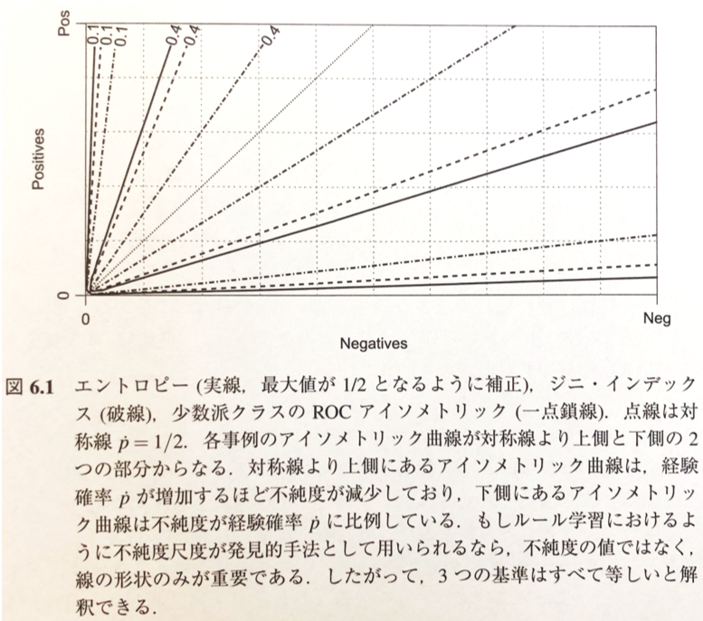
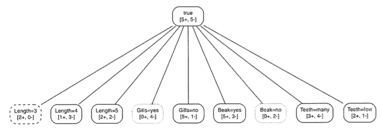
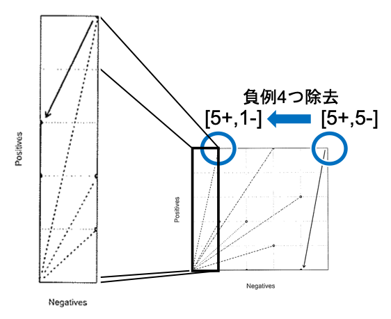
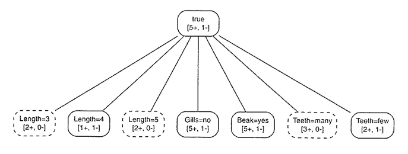
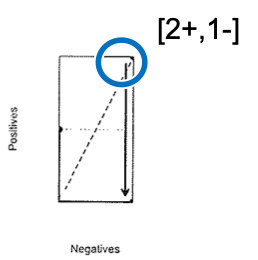
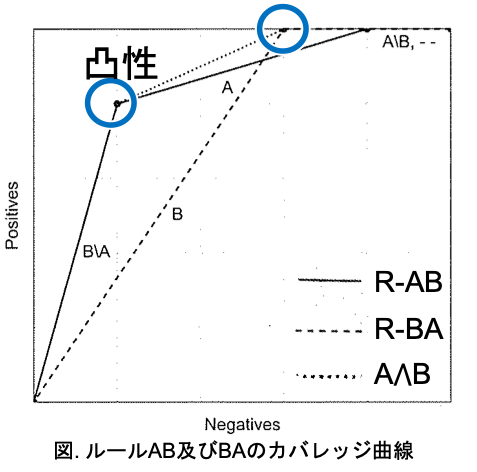

01 順序付けされたルールリストの学習
==============================

## 1.ルールリスト学習

`同質性`を最もよく改善するリテラルを加えることによって、`連言ルールボディ`を拡大し続ける

* 仮説空間を下へ降りていくようなパスを構築する

* ある同質性に関する基準を満たせば終了とする

ルールボディにリテラルを追加：追加したリテラルが、元のルールボディにカバーされていたインスタンスを2つのグループに分割する

* 新しいリテラルが真となる子ノード1つの純度のみに興味をもつ

> 不純度尺度は直接用いることができ、どの種類の尺度でも同じ結果が得られる

* 概念の不純度は`経験確率` $`\dot{p}`$ が以下の通りになっていることに注意する

  * $`\dot{p} > \frac{1}{2}`$ ： $`\dot{p}`$ と共に減少

  * $`\dot{p} < \frac{1}{2}`$ ： $`\dot{p}`$ と共に増加

  > 不純度尺度の違いは、ルール学習では消滅する

### ルールリスト学習

以下の5つの正例：

* $`p1: Length = 3 \land Gills = no \land Beak = yes \land Teeth = many`$

* $`p2: Length = 4 \land Gills = no \land Beak = yes \land Teeth = many`$

* $`p3: Length = 3 \land Gills = no \land Beak = yes \land Teeth = few`$

* $`p4: Length = 5 \land Gills = no \land Beak = yes \land Teeth = many`$

* $`p5: Length = 5 \land Gills = no \land Beak = yes \land Teeth = few`$

以下の5つの負例：

* $`n1: Length = 5 \land Gills = yes \land Beak = yes \land Teeth = many`$

* $`n2: Length = 4 \land Gills = yes \land Beak = yes \land Teeth = many`$

* $`n3: Length = 5 \land Gills = yes \land Beak = no \land Teeth = many`$

* $`n4: Length = 4 \land Gills = yes \land Beak = yes \land Teeth = many`$

* $`n5: Length = 4 \land Gills = no \land Beak = yes \land Teeth = few`$

**9つのリテラルとそのカバレッジ数**

* 9つのリテラルのうち、3つは純粋

> 破線(点線)で囲われているリテラルは、正(負)のクラスに対して純粋なもの

**不純度アイソメトリックプロット**

* 不純度の値を、不純度アイソメトリック曲線で示す

* 2つの正例と負例をカバーしているリテラルの不純度：データ集合全体の不順度

  > カバレッジプロットの上昇対角線上にある

### ルール学習アルゴリズムのプロセス

`分離統治法`：学習されたルールがカバーしている事例の除去、残りの事例のみを対象として次のルールを学習

1. 最初のルール： $`if`$  $`Gills = yes`$ $`then`$ $`Class = \ominus`$

    > $`Gills  = yes`$ が3つの純粋なリテラルの中で最も多くの事例をカバーしており、最良である($`[0+,4-]`$)

  * 最初のルールが学習されると、5つの正例、1つの負例が残る

2. 次のルール： $`if`$ $`Teeth = many`$ $`then`$ $`Class = \oplus`$

    > $`Teeth = many`$ が、最良である($`[3+,0-]`$)

  * 次のルールが学習されると、2つの正例、1つの負例が残る

3. 最後のルール： $`if`$ $`Length = 4`$ $`then`$ $`Class = \ominus`$

    > $`Length = 4`$ が、1つの負例をカバーする($`[0+,1-]`$)

  * 他の事例は全て正なので、これらの事例をカバーするデフォルトルールを呼び出せる

### ルール学習アルゴリズムのプロセス・まとめ

ここまで学習されたルールは、以下のようになる

$`if`$  $`Gills = yes`$ $`then`$ $`Class = \ominus`$

$`else`$ $`if`$ $`Teeth = many`$ $`then`$ $`Class = \oplus`$

$`else`$ $`if`$ $`Length = 4`$ $`then`$ $`Class = \ominus`$

$`else`$ $`Class = \oplus`$

* ただし、ルール間で事例が重複することもある

* 内部選言を用いて相互排他的に書き直すことができるが、冗長となる

> $`if`$  $`Gills = yes`$ $`then`$ $`Class = \ominus`$
>
> $`if`$  $`Gills = yes \land Teeth = many`$ $`then`$ $`Class = \oplus`$
>
> $`if`$  $`Gills = yes \land Teeth = few \land Length = 4`$ $`then`$ $`Class = \ominus`$
>
> $`if`$  $`Gills = no \land Teeth = few \land Length \neq 4`$ $`then`$ $`Class = \oplus`$

### ルール学習のアルゴリズム

**`LearnRuleList(D)`：順序付けされたルールリストの学習**

* 訓練データがまだ残っている場合はさらなる学習を行う

* ルールによってカバーされた全ての事例をデータセットから取り除く

> このようなシステムを持つアルゴリズムを、`カバリングアルゴリズム`と呼ぶ

|                                                                        |
| ---------------------------------------------------------------------- |
| Input: ラベル付けされた訓練データ $`D`$                                |
| Output: ルールリスト $`R`$                                             |
| 1: $`R \leftarrow \varnothing`$                                        |
| 2: while $`D \neq \varnothing`$ do                                     |
| 3:   $`r \leftarrow LearnRule(D)`$                                     |
| 4:   $`R`$ の末尾に $`r`$ を追加する                                   |
| 5:   $`D \leftarrow D \setminus \{x \in D \vert xはrでカバーされている\}`$ |
| 6: end                                                                 |
| 7: return $`R`$                                                        |

**`LearnRule(D)`：単一のルール学習**

* `Homogenerous(D)`：さらなるリテラルの細分化が必要かどうかを決定

* `Label(D)`：ルールのヘッドにどのクラスを割り当てるかを決定

* `BestLiteral(D,L)`：リテラルの集合 $`L`$ の中からルールに加えるための最適なリテラルを選択

> これらのリテラルは、純度に基づいて選択される

|                                                                               |
| ----------------------------------------------------------------------------- |
| Input: ラベル付けされた訓練データ $`D`$                                       |
| Output: ルール $`r`$                                                          |
| 1: $`b \leftarrow true`$                                                      |
| 2: $`L \leftarrow リテラルの集合`$                                            |
| 3: while not `Homogenerous(D)` do                                             |
| 4:   $`l \leftarrow BestLiteral(D,L)`$                                        |
| 5:   $`b \leftarrow b \land l`$                                               |
| 6:   $`D \leftarrow D \setminus \{x \in D \vert xはbでカバーされている\}`$    |
| 7:   $`L \leftarrow L \setminus \{l' \in L \vert l'はlと同じ特徴量を使う \}`$ |
| 8: end                                                                        |
| 9: $`C \leftarrow Label(D)`$                                                  |
| 10: $`r \leftarrow if`$ $`b`$ $`then`$ $`Class = C`$                          |
| 11: return $`r`$                                                              |

### ルールリストと決定木

> @TODOここの内容は、決定木を学習してから勉強する

## 2.ランキングと確率推定のためのルールリスト

* ルールリストは、ランカーと確立推定器に変換することが可能

  * 各ルールにおける局所的なクラス分布を同定できる

  * クラス分岐のための基準として経験確率に基づくスコアを使用可能

  > 各ルールに対して、1つのセグメントをもつカバレッジ曲線が描かれる

### ランカーとしてのルールリスト

以下の2つの構造を考える

| セグメント | ルール         | 正例   | 負例        |
| ---------- | -------------- | ------ | ----------- |
| (A)        | $`Length = 4`$ | `p2`   | `n2`,`n4-5` |
| (B)        | $`Beak = yes`$ | `p1-5` | `n1-2`,`n5` |

* ルールリスト $`AB`$ を構成する

  * ルール $`B \setminus A`$ ：最初のセグメントは`A`にはカバーされておらず、`B`にカバーされているもの

| ルール                                                     | カバレッジ  |
| ---------------------------------------------------------- | ----------- |
| $`if`$ $`Length = 4`$ $`then`$ $`Class = \ominus`$         | $`[1+,3-]`$ |
| $`else`$ $`if`$ $`Beak = yes`$ $`then`$ $`Class = \oplus`$ | $`[4+,1-]`$ |
| $`else`$ $`Class = \ominus`$                               | $`[0+,1-]`$ |

  * 経験確率によるランキング： $`B \setminus A`$ $`-`$ $`A`$ $`-`$ $`Default`$

  > 先にルール`A`で捌いてるためルール`B`の中身はこの様になる
  >
  > ただし、ルールリストの順番とは異なる

* ルールリスト $`BA`$ を構成する

| ルール                                                       | カバレッジ  |
| ------------------------------------------------------------ | ----------- |
| $`if`$ $`Beak = yes`$ $`then`$ $`Class = \oplus`$            | $`[5+,3-]`$ |
| $`else`$  $`if`$ $`Length = 4`$ $`then`$ $`Class = \ominus`$ | $`[0+,1-]`$ |
| $`else`$ $`Class = \ominus`$                                 | $`[0+,1-]`$ |

  * 経験確率によるランキング： $`B`$ $`-`$ $`[A \setminus B, Default]`$

### ルールリストの評価

|                  | リスト $`AB`$ | リスト $`BA`$ |
| ---------------- | ------------- | ------------- |
| ランキングの誤り | `4.5`         | `7.5`         |
| `AUC`            | `0.82`        | `0.70`        |
| 正答率           | `0.80`        | `0.70`        |

> 一概にどちらが良いか言えない

* 2つのルールの重複部分であるセグメント $`A \land B`$ のルールリストを導入していないことにより、問題が発生している

  * ルールの重複部分にアクセスするには、2つのルールリストを結合するか、それぞれのルールリストより強力な方法を必要とする

| 版   | 年/月/日   |
| ---- | ---------- |
| 初版 | 2019/06/16 |
