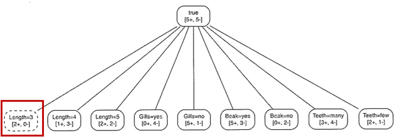
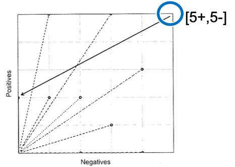
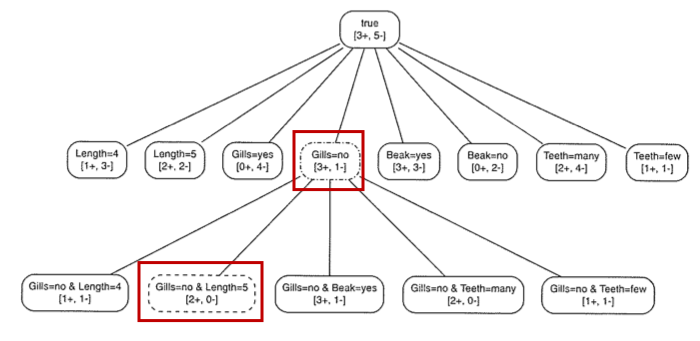
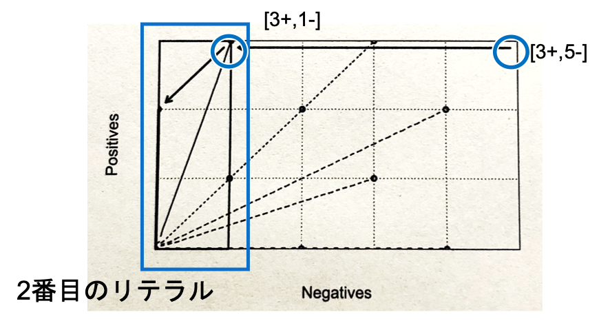
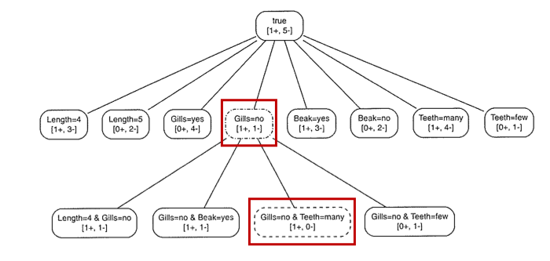
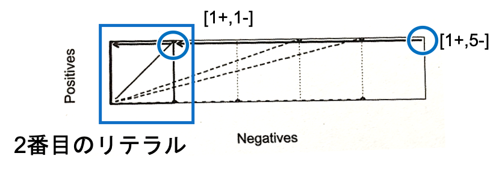
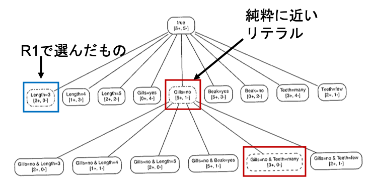
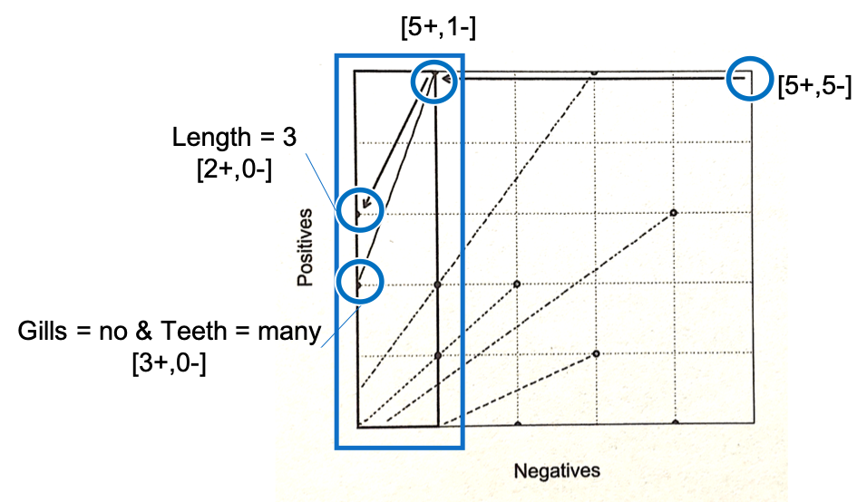

02 順序付けされないルールセットの学習
===============================

`ルールセット学習`：1回の学習につき、1つのクラスごとにルール学習を行う

* 学習するクラスの経験確率 $`\dot{p}`$ の最大化に基づく方法

* 基本的にルールリストと同じ

* ＋のみ着目：正に純粋 $`[n+,0-]`$ が必要

### 1つのクラスに対するルールセットの学習

1. 最初のルール： $`if `$ $`Length = 3`$ $`then`$ $`Class = \oplus`$

  > 残っている正例： $`[5+,5-]`$

  * このルールにカバーされている2つの事例を取り除き、次の新しいルールを学習する

2. 2番目のルール： $`if `$ $`Gills = no \land Length = 5`$ $`then`$ $`Class = \oplus`$

  > 残っている正例： $`[3+,5-]`$

  * 最初のルールで捌かれず残った中で、同様にしてルールを設定する

  * 純粋なルール($`[n+,0-]`$)が存在しないので、論理積を用いて $`[n+,0-]`$ を探す

3. 3番目のルール： $`if `$ $`Gills = no \land Teeth = many`$ $`then`$ $`Class = \oplus`$

  > 残っている正例： $`[1+,5-]`$

  * 現在残っている正例をカバーするルールを設定する

クラスが2つしかない場合は、ルールにカバーされていない事例を全て負に分類する

> しかし不確かで難しいケースを負と分類する選択バイアスを生む

4. 負のクラスに対する、いくつかのルール学習を行う

  * 1番目のルール： $`if `$ $`Gills = yes`$ $`then`$ $`Class = \ominus`$

  * 2番目のルール： $`if `$ $`Lengh = 4 \land Teeth = few`$ $`then`$ $`Class = \ominus`$

| ルールセット | ルールの内容                                                          |
| ------------ | --------------------------------------------------------------------- |
| (R1)         | $`if `$ $`Length = 3`$ $`then`$ $`Class = \oplus`$                    |
| (R2)         | $`if `$ $`Gills = no \land Length = 5`$ $`then`$ $`Class = \oplus`$   |
| (R3)         | $`if `$ $`Gills = no \land Teeth = many`$ $`then`$ $`Class = \oplus`$ |
| (R4)         | $`if `$ $`Gills = yes`$ $`then`$ $`Class = \ominus`$                  |
| (R5)         | $`if `$ $`Lengh = 4 \land Teeth = few`$ $`then`$ $`Class = \ominus`$  |

### ルールセットの学習アルゴリズム

**$`LearnRuleSet(D)`$：順序付けされていないルールセットの学習**

`LearnRuleList`との違い

* 各クラスを順に見ていく

* ルールが見つかったときに、学習中のクラスでルールにカバーされている事例のみを取り除く

  > あるルールにカバーされる負例は、他のルールによってデータセットから取り除かれない

|                                                                         |
| ----------------------------------------------------------------------- |
| Input: ラベル付けされた訓練データ $`D`$                                 |
| Output: ルールセット $`R`$                                              |
| 1: $`R \leftarrow \varnothing`$                                         |
| 2: for 全てのクラス $`C_i`$ do                                          |
| 3:   $`D_i \leftarrow D`$                                               |
| 4:   while $D_i$ がクラス $`C_i`$ の事例を含む do                       |
| 5:     $`r \leftarrow LearnRuleForClass(D_i,C_i)`$                      |
| 6:     $`R \leftarrow R \cup \{r \}`$                                   |
| 7:     $`D_i \setminus \{ x \in C_i \vert xはrによってカバーされる \}`$ |
| 8:   end                                                                |
| 9: end                                                                  |
| 10: return $`R`$                                                        |

**$`LearnRuleForClass(D,C_i)`$：与えられたクラスに対する単一のルールの学習**

* 1つのクラスに対して、1つのルールを学習するためのアルゴリズム

* 以下の2点以外は、`LearnRule`と同様

  1. 最良のリテラルは、学習中のクラス $`C_i`$ に関して選ばれる

  1. ルールのヘッドは常にクラス $`C_i`$ でラベル付けされる

|                                                                                  |
| -------------------------------------------------------------------------------- |
| Input: ラベル付けされた訓練データ $`D`$ とクラス $`C_i`$                         |
| Output: ルール $`r`$                                                             |
| 1: $`b \leftarrow true`$                                                         |
| 2: $`L \leftarrow 利用可能なリテラルの集合`$                                     |
| 3: while $`Homogenerous(D)`$ でないdo                                            |
| 4:   $`l \leftarrow BestLiteral(D,L,C_i)`$                                       |
| 5:   $`b \leftarrow b \land l`$                                                  |
| 6:   $`D \leftarrow D \setminus \{ x \in D \vert xはrによってカバーされる \}`$   |
| 7:   $`L \leftarrow L \setminus \{ l' \in L \vert l'はlと同じ特徴量を用いる \}`$ |
| 8: end                                                                           |
| 9: $`r \leftarrow`$ $`if`$ $`b`$ $`then`$ $`Class = C_i`$                        |
| 10: return $`r`$                                                                 |

### 探索法として適合率を用いる問題点

* 純粋なルールを見つけることにやや焦点を当てすぎることで、より一般的な「純粋に近い」ルールを見逃してしまう可能性がある

