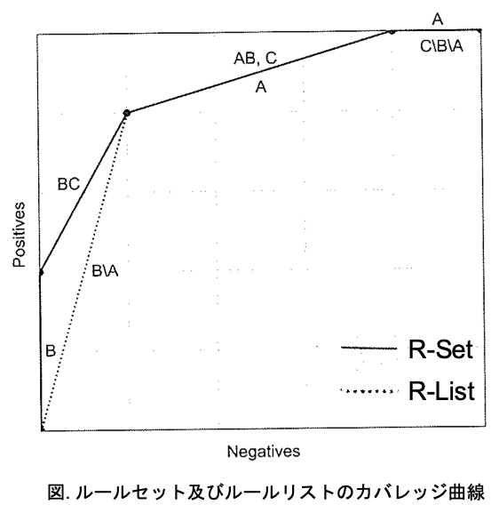
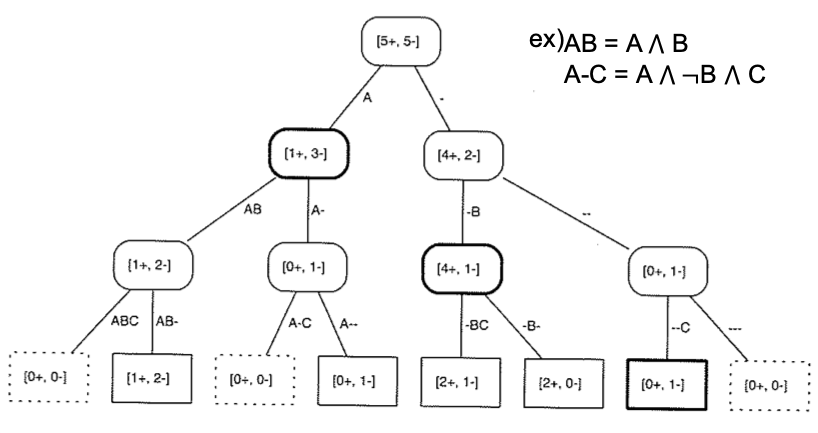
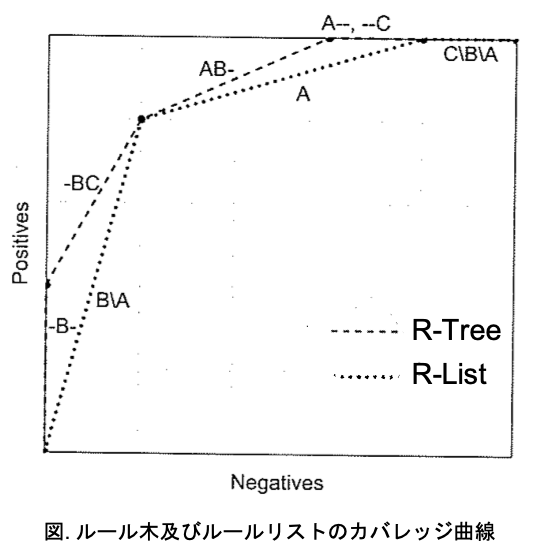

02 順序付けされないルールセットの学習
===============================

`ルールセット学習`：1回の学習につき、1つのクラスごとにルール学習を行う

* 学習するクラスの経験確率 $`\dot{p}`$ の最大化に基づく方法

* 基本的にルールリストと同じ

* ＋のみ着目：正に純粋 $`[n+,0-]`$ が必要

### 1つのクラスに対するルールセットの学習

1. 最初のルール： $`if `$ $`Length = 3`$ $`then`$ $`Class = \oplus`$

  > 残っている正例： $`[5+,5-]`$

  * このルールにカバーされている2つの事例を取り除き、次の新しいルールを学習する

2. 2番目のルール： $`if `$ $`Gills = no \land Length = 5`$ $`then`$ $`Class = \oplus`$

  > 残っている正例： $`[3+,5-]`$

  * 最初のルールで捌かれず残った中で、同様にしてルールを設定する

  * 純粋なルール($`[n+,0-]`$)が存在しないので、論理積を用いて $`[n+,0-]`$ を探す

3. 3番目のルール： $`if `$ $`Gills = no \land Teeth = many`$ $`then`$ $`Class = \oplus`$

  > 残っている正例： $`[1+,5-]`$

  * 現在残っている正例をカバーするルールを設定する

クラスが2つしかない場合は、ルールにカバーされていない事例を全て負に分類する

> しかし不確かで難しいケースを負と分類する選択バイアスを生む

4. 負のクラスに対する、いくつかのルール学習を行う

  * 1番目のルール： $`if `$ $`Gills = yes`$ $`then`$ $`Class = \ominus`$

  * 2番目のルール： $`if `$ $`Lengh = 4 \land Teeth = few`$ $`then`$ $`Class = \ominus`$

| ルールセット | ルールの内容                                                          |
| ------------ | --------------------------------------------------------------------- |
| (R1)         | $`if `$ $`Length = 3`$ $`then`$ $`Class = \oplus`$                    |
| (R2)         | $`if `$ $`Gills = no \land Length = 5`$ $`then`$ $`Class = \oplus`$   |
| (R3)         | $`if `$ $`Gills = no \land Teeth = many`$ $`then`$ $`Class = \oplus`$ |
| (R4)         | $`if `$ $`Gills = yes`$ $`then`$ $`Class = \ominus`$                  |
| (R5)         | $`if `$ $`Lengh = 4 \land Teeth = few`$ $`then`$ $`Class = \ominus`$  |

### ルールセットの学習アルゴリズム

**$`LearnRuleSet(D)`$：順序付けされていないルールセットの学習**

`LearnRuleList`との違い

* 各クラスを順に見ていく

* ルールが見つかったときに、学習中のクラスでルールにカバーされている事例のみを取り除く

  > あるルールにカバーされる負例は、他のルールによってデータセットから取り除かれない

|                                                                         |
| ----------------------------------------------------------------------- |
| Input: ラベル付けされた訓練データ $`D`$                                 |
| Output: ルールセット $`R`$                                              |
| 1: $`R \leftarrow \varnothing`$                                         |
| 2: for 全てのクラス $`C_i`$ do                                          |
| 3:   $`D_i \leftarrow D`$                                               |
| 4:   while $D_i$ がクラス $`C_i`$ の事例を含む do                       |
| 5:     $`r \leftarrow LearnRuleForClass(D_i,C_i)`$                      |
| 6:     $`R \leftarrow R \cup \{r \}`$                                   |
| 7:     $`D_i \setminus \{ x \in C_i \vert xはrによってカバーされる \}`$ |
| 8:   end                                                                |
| 9: end                                                                  |
| 10: return $`R`$                                                        |

**$`LearnRuleForClass(D,C_i)`$：与えられたクラスに対する単一のルールの学習**

* 1つのクラスに対して、1つのルールを学習するためのアルゴリズム

* 以下の2点以外は、`LearnRule`と同様

  1. 最良のリテラルは、学習中のクラス $`C_i`$ に関して選ばれる

  1. ルールのヘッドは常にクラス $`C_i`$ でラベル付けされる

|                                                                                  |
| -------------------------------------------------------------------------------- |
| Input: ラベル付けされた訓練データ $`D`$ とクラス $`C_i`$                         |
| Output: ルール $`r`$                                                             |
| 1: $`b \leftarrow true`$                                                         |
| 2: $`L \leftarrow 利用可能なリテラルの集合`$                                     |
| 3: while $`Homogenerous(D)`$ でないdo                                            |
| 4:   $`l \leftarrow BestLiteral(D,L,C_i)`$                                       |
| 5:   $`b \leftarrow b \land l`$                                                  |
| 6:   $`D \leftarrow D \setminus \{ x \in D \vert xはrによってカバーされる \}`$   |
| 7:   $`L \leftarrow L \setminus \{ l' \in L \vert l'はlと同じ特徴量を用いる \}`$ |
| 8: end                                                                           |
| 9: $`r \leftarrow`$ $`if`$ $`b`$ $`then`$ $`Class = C_i`$                        |
| 10: return $`r`$                                                                 |

### 探索法として適合率を用いる問題点

* 純粋なルールを見つけることに焦点を当てすぎる

> より一般的な「純粋に近い」ルールを見逃してしまう可能性がある

**対処方法**

* `ラプラス補正`：

  > 例) $`[5+,1-] \rightarrow [6+,2-]`$ 、$`[2+,0-] \rightarrow [3+,1-]`$
  >
  > 1つの正例、1つの負例を加える(疑似カウント)ことで、より一般的なルールにも適用できる

* `ビーム探索`：一定数の候補を保持する

  * '近視眼的な特性'の改善

  * 'タイ'をなくす

  > 例)ビームのサイズが小さいときに、一般的なルールを見つける
  >
  > 1. 最初のビームは、候補となるボディとして、 $`Length = 3`$ と $`Gills = no`$ を含む
  >
  > 1. 次に、考えうる全ての純粋でないリテラルをビームに加える
  >
  > 1. 元のビームに全てのリテラルを加えたあとで、少数の最良のもののみキープする
  >
  > 1. 全てのビームの要素が純粋になり、最良のビームが決定したら探索を終了する

## 2.ランキングと確率推定のためのルールセット

いくつかのセグメントにおける、カバレッジ数を推定する必要がある

### ランカーとしてのルールセット

| ルールの種類 | ルール                                             | カバレッジ  | 経験確率                           |
| ------------ | -------------------------------------------------- | ----------- | ----------------------------------- |
| (A)          | $`if`$ $`Length = 4`$ $`then`$ $`Class = \ominus`$ | $`[1+,3-]`$ | $`\hat{p}(A) = \frac{1}{4} = 0.25`$ |
| (B)          | $`if`$ $`Beak = yes`$ $`then`$ $`Class = \oplus`$  | $`[5+,3-]`$ | $`\hat{p}(B) = \frac{5}{8}= 0.63`$  |
| (C)          | $`if`$ $`Length = 5`$ $`then`$ $`Class = \ominus`$ | $`[2+,2-]`$ | $`\hat{p}(C) = \frac{2}{4} = 0.50`$ |

* `A`と`C`は相互排他的なので、`AB`、`BC`の重複を考える

* 重複ルールの経験確率は、「関係のあるルールのカバレッジを平均」することで求める

  * `AB`のカバレッジ $`[3+,3-]`$ ：$`\hat{p}(AB) = \frac{3}{6} = 0.5`$

  * `BC`のカバレッジ (@TODO こちらわからない)： $`\hat{p}(BC) = \frac{3.5}{6} = 0.58`$

よって経験確率に基づくランキングは、`B-BC-[AB,C]-A`となる

> 別のルールリスト`ABC`の比較を考える
>
> | ルールの種類 | ルール                                             | カバレッジ  |
> | ------------ | -------------------------------------------------- | ----------- |
> | (A)          | $`if`$ $`Length = 4`$ $`then`$ $`Class = \ominus`$ | $`[1+,3-]`$ |
> | (B)          | $`if`$ $`Beak = yes`$ $`then`$ $`Class = \oplus`$  | $`[4+,1-]`$ |
> | (C)          | $`if`$ $`Length = 5`$ $`then`$ $`Class = \ominus`$ | $`[0+,1-]`$ |

よって、`ルールセット`は`ルールリスト`よりも優れている

* `B`のみにカバーされている事例

* `B`と`C`にカバーされている事例

を分離できる

### まとめ

* ルールセットの方がルールリストよりも結果が良いとは限らない

* いくつかのセグメントのカバレッジ数を推定しなければならないので凸性が保証できない

  > ルール`C`も`p1`をカバーしていても、ルールリストの性能には影響しない(既にルール`B`にカバーされている)

* ルールを調整することで凹性を導入することができる

  > ルール`AB`とルール`C`のタイが崩れることにより、凹性が導入される

* ランカーを分類器として応用したい場合は、カバレッジ曲線上において最良動作点を見つける必要がある

  > 適合率の場合： $`\hat{p} > 0.5`$ となるインスタンスを正に、他を負に分類する

## 3.ルール重複の検討

**ルールリスト**

* 訓練データへの凸なカバレッジ曲線を与えた

* 2つのルールの重複部分の $`A \land B`$ にアクセスすることができない

  > ルール群の最適な順序付けを大域的にできない
  >
  > アクセス可能：
  >
  >   * ルール順序 $`A \land B`$ ： $`A = (A \land B) \lor (A \land \lnot{B})`$
  >
  >   * ルール順序 $`B \land A`$ ： $`B = (A \land B) \lor (\lnot{A} \land B)`$

* 一般的に、$`r`$ 個のルールから成るとき、$`r`$ 個のインスタンス空間セグメントのみアクセス可能($`<< 2^r`$ 個)

**ルールセット**

* ルールの重複部分に関してもアクセスすることができる

* 重複しているセグメントのいくつかのカバレッジ数を推定する必要がある

  > 訓練データへの凸性が失われる

* 一般的に、$`r`$ 個のルールから成るとき、$`2^r`$ 個のインスタンス空間セグメントのみアクセス可能

**ルール木**

* リストではなく木を用いることでセグメントの分岐を増やせる

  > アクセス可能なインスタンス空間セグメントが増える

* $`r`$ 個のルールから成る $`2^r`$ の重複部分を表現でき、各領域で正確なカバレッジ数を得ることができる

  > ルールが増えると、サイズが指数的に増加する

* $`A`$ とラベル付けされているノードは、更に $`AB`$($`A \land B`$) と $`A-`$($`A \land \lnot{B}`$) に分割される

| 版   | 年/月/日   |
| ---- | ---------- |
| 初版 | 2019/06/17 |
