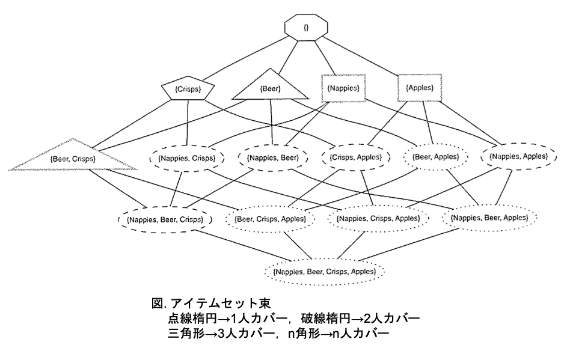

03 記述的ルール学習
================

* 教師あり学習の例：サブグループの発見に適用されるかを議論する

* 教師なし学習の例：頻出アイテム集合とアソシエーションルール発見

## 1.サブグループ発見のためのルール学習

良いサブグループ：全体の母集団とは著しく異なるクラス分布を持つサブグループ

> 純粋なサブグループのこと

* しかし、サブグループ発見においては、その補集合も同程度に重要となる

  > * $`Gills = yes`$ ： $`[0+,4-]`$ (純粋)
  >
  > * $`Gills = no`$ ： $`[5+,1-]`$ (純粋ではない)

### ラプラス補正を用いたサブグループ発見

* カバレッジ空間：正例($`y`$ 軸)、負例($`x`$ 軸)

* 上昇対角線上のサブグループ：全体の母集団における正例の比率に対応

  > 興味の対象とはなりにくい

* 対角線の上下のサブグループ：母集団に対しての正の比率に対応(上：大きい、下：小さい)

**対角線の上のデフォルト値からの絶対偏差を計算する**

* $`\vert prec - pos \vert`$ ：対角線上のどのサブグループの適合率も正例に等しいので、評価尺度となる

* ラプラス補正を行った適合率 $`prec^L`$ を適用して、$`\vert prec^L - pos \vert`$ を評価尺度とすることもできる

> 例)ラプラス補正を行った場合
>
> $`[5+,1-] \rightarrow [6+,2-]`$
>
> $`[2+,0-] \rightarrow [3+,1-]`$

**アイソメトリック曲線が上昇対角線に平行になるような基準を用いる**

* `平均再現率`を用いる

> 対角線上に分布するサブグループの平均再現率は、クラス分布に関わらず`0.5`となる

* 良いサブグループの基準：$`\vert avgrec - 0.5`$

### ラプラス補正適合率と平均再現率の比較

* ラプラス補正正答率ではなく、平均再現率を用いることで、いくつかのサブグループに影響を与える

> 優劣が異なってくる

| サブグループ                      | カバレッジ  | $`prec^L`$ | ランク | avg-rec | ランク |
| --------------------------------- | ----------- | ---------- | ------ | ------- | ------ |
| $`Gills = yes`$                   | $`[0+,4-]`$ | `0.17`     | 1      | `0.10`  | 1-2    |
| $`Gills = no \land Teeth = many`$ | $`[3+,0-]`$ | `0.80`     | 2      | `0.80`  | 3      |
| $`Gills = no`$                    | $`[5+,1-]`$ | `0.75`     | 3-9    | `0.90`  | 1-2    |
| $`Beak = no`$                     | $`[0+,2-]`$ | `0.25`     | 3-9    | `0.30`  | 4-11   |
| $`Gills = yes \land Beak = yes`$  | $`[0+,2-]`$ | `0.25`     | 3-9    | `0.30`  | 4-11   |
| $`Length = 3`$                    | $`[2+,0-]`$ | `0.75`     | 3-9    | `0.70`  | 4-11   |
| $`Length = 4 \land Gills = yes`$  | $`[0+,2-]`$ | `0.25`     | 3-9    | `0.30`  | 4-11   |
| $`Length = 5 \land Gills = no`$   | $`[2+,0-]`$ | `0.75`     | 3-9    | `0.70`  | 4-11   |
| $`Length = 5 \land Gills = yes`$  | $`[0+,2-]`$ | `0.25`     | 3-9    | `0.30`  | 4-11   |
| $`Length = 4`$                    | $`[1+,3-]`$ | `0.33`     | 10     | `0.30`  | 4-11   |
| $`Beak = yes`$                    | $`[5+,3-]`$ | `0.60`     | 11     | `0.70`  | 4-11   |

### 重み付きカバリングの効果

* 一度カバーされた事例は取り除かれるため重複には注目しないが、サブグループの発見ではルールの重複に目を向ける必要がある

`重み付きカバリング`：すべての事例に重さ1を付与し，ルールによりカバーされた事例は除去されるのではなく重さが半分になる

* 新しく学習されるルールが事例をカバーするごとに減少するような重みを事例に付与する

  * 重複に目を向けることができ，かつ影響を少なくできる

> 例)最初のサブグループ： $Length = 4$
>
>   * 1つの正例、3つの負例：重みを $`\frac{1}{2}`$ に減らす

| サブグループ                      | カバレッジ  | `avg-rec` | `Wgtd cov`      | `W-avg-rec` | ランク |
| --------------------------------- | ----------- | --------- | --------------- | ----------- | ------ |
| $`Gills = yes`$                   | $`[0+,4-]`$ | `0.10`    | $`[0+,3-]`$     | `0.07`      | 1-2    |
| $`Gills = no \land Teeth = many`$ | $`[3+,0-]`$ | `0.90`    | $`[4.5+,0.5+]`$ | `0.93`      | 1-2    |
| $`Gills = no`$                    | $`[5+,1-]`$ | `0.80`    | $`[2.5+,0-]`$   | `0.78`      | 3      |
| $`Beak = no`$                     | $`[0+,2-]`$ | `0.30`    | $`[0+,2-]`$     | `0.21`      | 4      |
| $`Gills = yes \land Beak = yes`$  | $`[0+,2-]`$ | `0.70`    | $`[2+,0-]`$     | `0.72`      | 5-6    |
| $`Length = 3`$                    | $`[2+,0-]`$ | `0.70`    | $`[2+,0-]`$     | `0.72`      | 5-6    |
| $`Length = 4 \land Gills = yes`$  | $`[0+,2-]`$ | `0.30`    | $`[0+,1.5-]`$   | `0.29`      | 7-9    |
| $`Length = 5 \land Gills = no`$   | $`[2+,0-]`$ | `0.30`    | $`[0+,1.5-]`$   | `0.29`      | 7-9    |
| $`Length = 5 \land Gills = yes`$  | $`[0+,2-]`$ | `0.70`    | $`[4.5+,2-]`$   | `0.71`      | 7-9    |
| $`Length = 4`$                    | $`[1+,3-]`$ | `0.30`    | $`[0.5+,1.5-]`$ | `0.34`      | 10     |
| $`Beak = yes`$                    | $`[5+,3-]`$ | `0.30`    | $`[0+,1-]`$     | `0.36`      | 11     |

> * `Wgtd cov`： $`Length = 4`$ が当てはまる事例の重みを $`\frac{1}{2}`$ に減らした時
>
> * `W-avg-rec`： `avg-rec`の値の重み付け

**重み付きカバリングの効果**

> * 太枠：重み付けによって縮小されたカバレッジ空間
>
> * 矢印： $`Length = 4`$ によって重複しているサブグループの重み付きカバレッジへの影響

**`WeightCovering(D)`：重み付き事例による重複ルール学習**

* 1つのルールを学習するための評価基準が2クラス以上に対応できる限りは、$`k > 2`$ クラス以上のサブグループにも適用可能

|                                                                  |
| ---------------------------------------------------------------- |
| Input: 重みの初期値`1`を付与したラベル付けされた訓練データ $`D`$ |
| Output: ルールリスト $`R`$                                       |
| 1: $`R \leftarrow \varnothing`$                                  |
| 2: while $`D`$ 内のいくつかの事例が重み`1`をもつ do              |
| 3:   $`r \leftarrow LearnRule(D)`$                               |
| 4:   $`r`$ を $`R`$ の末尾に加える                               |
| 5:   $`r`$ にカバーされている事例の重みを減少させる              |
| 6: end                                                           |
| 7: return $`R`$                                                  |

## 2.アソシエーションルールマイニング

| Transaction | Items                |
| ----------- | -------------------- |
| 1           | nappies              |
| 2           | beer, crips          |
| 3           | apples, nappies      |
| 4           | beer, crips, nappies |

> 集合 $`\{beer,crisps\}`$ ：顧客の集合 $`\{2,4,6\}`$

* カバーする顧客に関連するアイテムの部分集合の包含関係を`半順序`として扱う　

> `束`を形成する

### 頻出アイテム集合の探索

* `サポート`($`Supp(I)`$)：アイテム集合 $`I`$ にカバーされる顧客数

* `頻出アイテム集合`：サポートの閾値 $`f_0`$ を超えるもの

  > $`f_0 = 3`$ 以上の最大の頻出アイテム集合： `{apples}`,`{beer,crisps}`, `{nappies}`

**$`FrequentItems(D,f_0)`$：与えられたサポート閾値を超える全ての最大アイテム集合の発見**

`頻出アイテム集合`は、単純列挙の幅優先探索や階層探索で見つけられる

> 束を単調に降りる場合サポートは増加せずに単調するため

|                                                                    |
| ------------------------------------------------------------------ |
| Input: データ $`D \subseteq X`$ 、サポート閾値 $`f_0`$             |
| Output: 最大頻出アイテム集合の族 $`M`$                             |
| 1: $`M \leftarrow \varnothing`$                                    |
| 2: 優先度付きキュー $`Q`$ を、空アイテム集合を含むように初期化する |
| 3: while $`Q`$ が空でない do                                       |
| 4:   $`I \leftarrow Q`$ の前方から消去された次のアイテム集合       |
| 5:   $`\max \leftarrow true`$                                      |
| 6:   for $`I`$ の全ての拡張 $`I'`$ do                              |
| 7:     if $`Supp(I') \geq f_0`$ then                               |
| 8:       $`\max \leftarrow false`$                                 |
| 9:       $`Q`$ の末尾に $`I'`$ を加える                            |
| 10:    end                                                         |
| 11:  end                                                           |
| 12: if $`\max = true`$ $`then`$ $`M \leftarrow M \cup \{ I \}`$    |
| 13:end                                                             |
| 14:return $`M`$                                                    |

* `閉アイテム集合`を用いることで、計算のスピードが向上する

  > そのアイテムがカバーする顧客が共通で購入しているアイテムからなるアイテム集合
  >
  > 同じカバレッジをもつ隣接したアイテム集合は存在しない

### アソシエーションルールの構築と検討

1. アソシエーションルールの構築

  * 顧客に同時に頻出するアイテム集合から、ボディ $`B`$ とヘッド $`H`$ を選択

  > $`if`$ $`B`$ $`then`$ $`H`$

2. アソシエーションルールの検討

  * 集合 $`B`$ と集合 $`\{ H, B \}`$ のサポート値から`信頼度`を求める

  > `信頼度`： $`\frac{Supp(\{ H, B \})}{Supp(\{ B |})}`$

3. 閾値以下の信頼度であればルールを消去

アソシエーションルールの例

* `{beer}`と`{nappies,beer}`に着目

  * `{beer}`：サポート3

  * `{nappies,beer}`：サポート2

  > `信頼度`： $`\frac{2}{3}`$

* $`if`$ $`beer`$ $`then`$ $`crisps`$：サポート:3、信頼度: $`\frac{3}{3}`$

* $`if`$ $`crisps`$ $`then`$ $`beer`$：サポート:3、信頼度: $`\frac{3}{5}`$

* $`if`$ $`true`$ $`then`$ $`crips`$：サポート:5、信頼度: $`\frac{5}{8}`$

### 頻出アイテムに関連するアソシエーションルールのみを構成する

1. 与えられたサポート閾値を超える全ての最大アイテム集合の発見によって、頻出アイテム集合を獲得する

2. 頻出アイテム集合 $`m`$ から、ボディ $`B`$ とヘッド $`H`$ を選択、与えられた閾値よりも信頼度が低いルールを消去する

  > 頻出アイテム集合の部分集合であれば、どの集合も同じように頻出アイテム集合
  >
  > 最大頻出アイテム集合のいくつかのアイテムも自由に削除しても良い

**$`AssociationRules(D,f_0,c_0)`$：与えられたサポート閾値を超える全てのアソシエーションルールの発見**

|                                                                                           |
| ----------------------------------------------------------------------------------------- |
| Input: データ $`D \subseteq X`$ 、サポート閾値 $`f_0`$ 、信頼閾値 $`c_0`$                 |
| Output: アソシエーションルールの集合 $`R`$                                                |
| 1: $`R \leftarrow \varnothing`$                                                           |
| 2: $`M \leftarrow FrequentItems(D,f_0)`$                                                  |
| 3: for 各 $`m \in M`$ do                                                                  |
| 4:   for $`H \cap B = \varnothing`$ となる $`H \subseteq m`$ と $`B \subseteq m`$ do      |
| 5:     if $`Supp(B \cup H)/Supp(B) \leq C_0`$ then $`R \leftarrow R \cup \{if B then H}`$ |
| 6:   end                                                                                  |
| 7: end                                                                                    |
| 8: return $`R`$                                                                           |

* サポート閾値：`3`、信頼度の閾値`0.6`

  * $`if`$ $`beer`$ $`then`$ $`crisps`$：サポート:3、信頼度: $`\frac{3}{3}`$

  * $`if`$ $`crisps`$ $`then`$ $`beer`$：サポート:3、信頼度: $`\frac{3}{5}`$

  * $`if`$ $`true`$ $`then`$ $`crips`$：サポート:5、信頼度: $`\frac{5}{8}`$

> 6/18> `リフト`については省略

| 版           | 年/月/日   |
| ------------ | ---------- |
| 初版(残あり) | 2019/06/18 |
