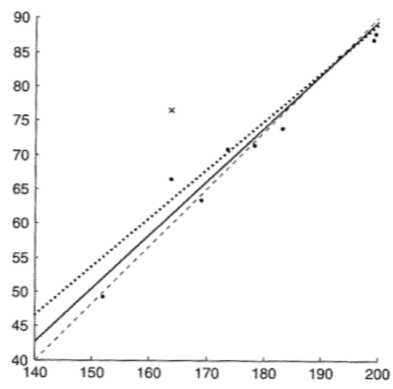
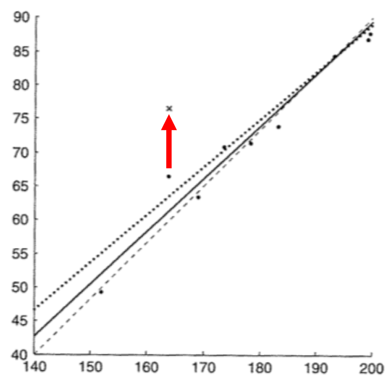
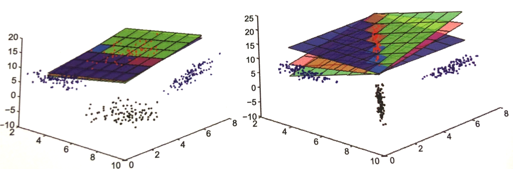
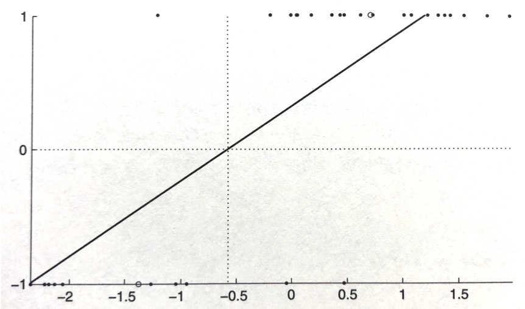

01 最小二乗法
===========

`回帰問題`：例 $`(x_i,f(x_i))`$ $`(i = 1,\cdots,n)`$ から、推定関数 $`\hat{f}: X \rightarrow \mathbb{R}`$ を学習する


## 1.線形単回帰

`最小二乗法`：$`\sum_{i=1}^n \epsilon_i^2`$ を最小にするような $`\hat{f}`$ を探索する方法

* `残差`：真の関数値と推定された関数値の差 $`\epsilon_i = f(x_i) - \hat{f}(x_i)`$

* `単回帰`：説明変数と目的変数が1つずつでの回帰

  > 1つの`特徴量` $`x_i`$ からなる回帰


### 線形単回帰

> $`(h_i,w_i)`$ ： $`n`$ 組の身長と体重($`1 \leq i \leq n`$)

`線形単回帰`は、方程式 $`w = a + bh`$ を仮定する

* 残差の二乗和 $`\sum_{i=1}^n(w_i -(a+bh_i))^2`$ を最小にするパラメータの $`a`$、$`b`$ の値を選ぶ

* 上式の偏導関数を解き、それらが0になる方程式を、$`a`$ 、$`b`$ について解く(合成関数の微分を用いる)

  > ```math
  > \frac{\partial}{\partial a}\sum_{i=1}^n(w_i-(a+bh_i))^2 = -2 \sum_{i=1}^n(w_i-(a+bh_i)) = 0
  > ```
  >
  > ```math
  > \frac{\partial}{\partial b}\sum_{i=1}^n(w_i-(a+bh_i))^2 = -2 \sum_{i=1}^n(w_i-(a+bh_i))h_i = 0
  > ```

* それぞれの値は、以下で求められる($`\hat{}`$：$`a`$,$`b`$、$`\bar{}`$： $`h_i`$,$`w_i`$(標本平均))

  > ```math
  > \hat{a} = \bar{w} - \hat{b}\bar{h}
  > ```
  >
  > ```math
  > \hat{b} = \frac{\sum_{i=1}^n(h_i - \bar{h})(w_i - \bar{w})}{\sum_{i=1}^n(h_i - \bar{h})^2}
  > ```

* ゆえに、線形回帰による解は、以下の式で表される

  > ```math
  > w = \hat{a} + \hat{b}h = \bar{w}+\hat{b}(h-\bar{h})
  > ```




### 回帰係数の見方

特徴量 $`x`$ と、目的変数 $`y`$ に対して、回帰係数は以下の式で表される

* 分子($`n\sigma_{xy}`$)：$`h`$ と $`w`$ の共分散を $`n`$ 倍したもの

* 分母($`n\sigma_{xx}`$, $`n \sigma_{x}^2`$)：$`h`$ の分散を $`n`$ 倍したもの

  > ```math
  > \hat{b} = \frac{n \sigma_{xy}}{n \sigma_{xx}} = \frac{\sigma_{xy}}{\sigma_{xx}}
  > ```

解釈方法は、以下の通り

* 共分散($`\sigma_{xy}`$)：$`x`$ と $`y`$ の単位の積(kg・cm)

* 分散($`\sigma_{xx}`$)：$`x`$ の単位の平方(cm^2)

これらの商の単位が、$`x`$ の単位当たりの $`y`$ の単位となる(kg/cm)


### 中心化と正規化

**中心化**

$`x`$ の値から $`\hat{x}`$ を引き、$`y`$ の値から $`\hat{y}`$ を引くことで、切片を`0`にすること

> 平行移動は、回帰係数には影響を与えない

**正規化**

$`x`$ を、その分散で割ること

正規化された特徴量と目的変数の共分散が、`回帰係数`$`\hat{b}`$ となる

> $`x_i \rightarrow x_i' = \frac{x_i}{\sigma_{xx}}`$, $`\bar{x} '\rightarrow \bar{x}' = \frac{\bar{x}}{\sigma_{xx}}`$ とする
>
> ```math
> \hat{b} = \frac{1}{n}\sum_{i=1}^n(x_i' - \bar{x}')(y_i - \bar{y}) = \sigma_{x'y}
> ```

* 線形単回帰は、以下のステップから構成される

  1. 特徴量を、その分散で割って正規化する

  1. 目的変数と、特徴量の共分散を計算する


### 外れ値の影響

最小二乗解の残差の和は、`0`となる

> ```math
> \sum_{i=1}^n(y_i - (\hat{a} + \hat{b} x_i)) = n(\bar{y} - \hat{a} - \hat{b}\bar{x}) = 0
> ```

* ただし、線形回帰が`外れ値`に影響しやすい原因にもなっている

  > `外れ値`：測定の誤差などによって、回帰直線から遠くに位置してしまった点

* 一方で、最小二乗法の機能は、`外れ値`があってもうまく機能する

> 赤矢印に点が移動すると,実線が点線になる



**外れ値に対しての最小二乗法の見方**

観測される $`y`$ の値には、ランダムノイズが入っていると仮定する

* 観測された例は、$`(x_i,f(x_i))`$ ではなく、$`(x_i,f(x_i)+\epsilon_i)`$

* この例を用いて、ある $`a`$ と $`b`$ に対して、$`f(x) = a + bx`$　を仮定する

  * $`a`$ と $`b`$ が既知：残差の値が正確に計算できる

  * 分散 $`\sigma^2`$ が既知：残差の集合が得られる確率の推定ができる

> ただし、$`a`$ と $`b`$ は未知であるため、推定しないといけない
>
> 望ましい $`a`$ と $`b`$ の推定値：残差の得られる確率が最大になるような値


### 行列の記法について

* $`\bf{X}`$：列に $`d`$ 個の特徴量、行に $`n`$ 個のインスタンス

  > ```math
  > \bf{X} = \left(\begin{array}{ccc}5 & 0 \\3 & 5 \\1 & 7\end{array}\right)
  > ```

* $`\bf{X}_{r \cdot}`$：$`\bf{X}`$ の第 $`r`$ 行

  > ```math
  > \bf{X}_{1 \cdot} = \left(\begin{array}{ccc}5 & 0\end{array}\right)
  > ```

* $`\bf{X}_{\cdot c}`$：$`\bf{X}`$ の第 $`c`$ 列

  > ```math
  > \bf{X}_{\cdot 1} = \left(\begin{array}{ccc}5 \\3 \\1\end{array}\right)
  > ```

* $`\bf{X}_{r c}`$：$`\bf{X}`$ の $`r`$ 行 $`c`$ 列

  > ```math
  > \bf{X}_{11} = \left(\begin{array}{ccc}5\end{array}\right)
  > ```

* $`\mu_j`$：第 $`j`$ 列の平均

  ```math
  \mu_j = \frac{1}{n}\sum_{i=1}^n\bf{X}_{ij}
  ```

  > ```math
  > \mu_1 = \frac{1}{n}\sum_{i=1}^n\bf{X}_{i1}\end{eqnarray} = \frac{5 + 3 + 1}{3} = 3
  > ```

* $`\bf{\mu}^\bf{T}`$：全ての列の平均を含む行ベクトル

  > ```math
  > \bf{\mu}^\bf{T} = \left(\begin{array}{ccc}3 & 4 \end{array}\right)
  > ```

* $`\bf{1}`$：全ての成分が`1`である $`n`$ 次元ベクトル

  > ```math
  > \bf{1}= \left(\begin{array}{ccc}1 \\1 \\1\end{array}\right)
  > ```

* $`\bf{1 \mu^T}`$：各行が $`\bf{\mu}^\bf{T}`$ である $`n`$ 行 $`d`$ 列の行列

  > ```math
  > \bf{1 \mu^T} = \left(\begin{array}{ccc}3 & 4 \\3 & 4 \\3 & 4\end{array}\right)
  > ```

* $`\bf{X}' = \bf{X} - \bf{1 \mu^{T}}`$：各列の平均が`0`である`中心化データ行列`

  > ```math
  > \bf{X} - \bf{1 \mu^{T}} \\ = \left(\begin{array}{ccc}5 & 0 \\3 & 5 \\1 & 7\end{array}\right)- \left(\begin{array}{ccc}3 & 4 \\3 & 4 \\3 & 4\end{array}\right) \\=\left(\begin{array}{ccc}2 & -4 \\0 &  1 \\-2 &  3\end{array}\right)
  > ```

* $`\bf{M} = \bf{\mu^T \mu}`$：$`d`$ 行 $`d`$ 列の行列

  > ```math
  > \bf{\mu^T \mu} = \left(\begin{array}{ccc}3 \\4\end{array}\right)\left(\begin{array}{ccc}3 & 4\end{array}\right)\\= \left(\begin{array}{ccc}9 & 12 \\12 & 16\end{array}\right)
  > ```

* $`\bf{S} = \bf{X'^TX'}`$：$`d`$ 行 $`d`$ 列の行列である`散乱行列`

  $`\bf{S} = \bf{X'^TX'} = (\bf{X} - \bf{1 \mu^T})^{\bf{T}}(\bf{X} - \bf{1 \mu^T})\\= \bf{X^T X} - n \bf{M}`$

  > ```math
  > \bf{S} = \left(\begin{array}{ccc}8 & -14 \\-14 &  26\end{array}\right)
  > ```

* $`\bf{\sum} = \frac{1}{n}\bf{S}`$：$`\bf{X}`$ の共分散行列

  > ```math
  > \bf{\sum} =\left(\begin{array}{ccc}\frac{8}{3}   & -\frac{14}{3} \\-\frac{14}{3} &  \frac{26}{3}\end{array}\right)
  > ```

  * $`\sigma_{jc}`$：共分散

    ```math
    \sigma_{jc} = \frac{1}{n}\sum_{i=1}^n(\bf{X}_{ij} - \mu_j)(\bf{X}_{ic} - \mu_c) = \frac{1}{n}\Bigr( \sum_{i=1}^n \bf{X_{ij}X_{ic}} - \mu_i \mu_c\Bigl)
    ```

  * $`\sigma_{jj}`$：第 $`j`$ 列の分散

    ```math
    \sigma_{jj} = \frac{1}{n}\sum_{i=1}^n(\bf{X_{ij} - \mu_j})^2 = \frac{1}{n}\Bigr( \sum_{i=1}^n \bf{X_{ij}^2 - \mu_j^2} \Bigl)
    ```


## 2.線形重回帰

任意の数の特徴量を扱う

* $`\bf{y}`$, $`\bf{a}`$, $`\bf{X}`$, $`\bf{\epsilon}`$：$`n`$ 次元ベクトル

* $`\bf{b}`$：スカラー

> 特徴量が $`d`$ 個：$`\bf{X}`$ は $`n`$ 行 $`d`$ 列の行列、$`\bf{b}`$ は $`d`$ 次元の回帰係数ベクトル

```math
\left(\begin{array}{ccc}y_1 \\\vdots \\y_n\end{array}\right)= \left(\begin{array}{ccc}1 \\\vdots \\1\end{array}\right)a+\left(\begin{array}{ccc}x_1 \\\vdots \\x_n\end{array}\right)b+\left(\begin{array}{ccc}\epsilon_1 \\\vdots \\\epsilon_n\end{array}\right)
```

```math
\bf{y} = \bf{a} + \bf{Xb} + \bf{\epsilon}
```

同次座標系を用いると、以下の式で表される

* $`\bf{X^{\circ}}`$：第1列の成分が全て`1`、残りの列は $`\bf{X}`$ の列である $`n`$ 行 $`(d+1)`$ 列の行列

* $`\bf{w}`$：第1成分が切片、残りの $`d`$ 個は回帰係数の $`(d+1)`$ 次元ベクトル

```math
\left(\begin{array}{ccc}y_1 \\\vdots \\y_n\end{array}\right)= \left(\begin{array}{ccc}1      & x_1    \\\vdots & \vdots \\1      & x_n\end{array}\right)\left(\begin{array}{ccc}a \\b\end{array}\right)+\left(\begin{array}{ccc}\epsilon_1 \\\vdots     \\\epsilon_n\end{array}\right)
```

```math
\bf{y} = \bf{X^{\circ}w} + \bf{\epsilon}
```


### 重回帰における回帰係数と切片

**各特徴量と目的変数の共分散**

```math
\bf{X} = \left(\begin{array}{ccc}x_{11} & \ldots & x_{1j} \\\vdots & \ddots & \vdots \\x_{n1} & \ldots & x_{nj}\end{array}\right)
```

```math
\bf{X^T} = \left(\begin{array}{ccc}x_{11} & \ldots & x_{n1} \\\vdots & \ddots & \vdots \\x_{1j} & \ldots & x_{nj}\end{array}\right)
```

```math
\bf{y} = \left(\begin{array}{ccc}y_1 \\\vdots \\y_n\end{array}\right)
```

* ここで、$`\bf{X^Ty}`$ という $`n`$ 次元ベクトルを考える

```math
\bf{X^Ty}= \left(\begin{array}{ccc}x_{11} & \ldots & x_{n1} \\\vdots & \ddots & \vdots \\x_{1j} & \ldots & x_{nj}\end{array}\right)\left(\begin{array}{ccc}y_1 \\\vdots \\y_n\end{array}\right)=\left(\begin{array}{ccc}x_{11}y_1 & \ldots & x_{n1}y_n \\\vdots    & \ddots & \vdots    \\x_{1j}y_1 & \ldots & x_{nj}y_n\end{array}\right)
```

* 第 $`j`$ 成分に $`\bf{X}`$ の第 $`j`$ 列 $`(x_{1j}, \cdots, x_{nj})`$ と $`(y_1, \cdots, y_n)`$ の積和を持つ

  * 各特徴量が中心化されている場合：$`\mu_j = 0`$ となるので、「必要となる全ての共分散(のn倍)を持つn次元ベクトル」となる

```math
(\bf{X^Ty})_j = \sum_{i=1}^nx_{ij}y_i = \sum_{i=1}^n(x_{ij} - \mu_j)(y_i - \bar{y}) + n \mu_j \bar{y} = n(\sigma_{jy} + \sigma_j \bar{y})
```


**特徴量の正規化**

正規化は、対角成分に $`\frac{1}{n \sigma_{jj}}`$ をもつ、$`d`$ 行 $`d`$ 列の対角行列によって実現

* $`\bf{S}`$ が対角成分に $`n \sigma_{jj}`$ をもつ対角行列である場合、その逆行列 $`\bf{S^{-1}}`$ で得られる

```math
\bf{\hat{w}} = \bf{S^{-1}} \bf{X^T} \bf{y}
```

ただし、一般の場合には、以下の複雑な行列が必要となる

```math
\bf{\hat{w}} = (\bf{X^TX})^{-1}\bf{X^Ty}
```

* 特徴量が中心化され、かつ無相関であることを仮定

  > `無相関`：異なる2つの特徴量の共分散が全て`0`

* 共分散行列 $`\bf{\sum}`$ は、対角成分が $`\sigma_{jj}`$ の対角行列

  > $`\bf{X}`$ の列は正規化：$`\bf{M}`$ の成分は全て`0`となる

  $`\bf{X^TX} = n(\bf{\sum} + \bf{M}) \sim n \bf{\sum}`$

故に、「$`\bf{(X^T X)^{-1}}`$ は、特徴量を無相関し、中心化かつ正規化する役割をもつ」


### 行列表記を用いた2変量線形回帰

**基本的な表現**

$
\bf{X^TX} = \left(
  \begin{array}{cccc}
    x_{11} & \ldots & x_{n1} \\
    x_{12} & \ldots & a_{n2}
  \end{array}
\right)\left(
  \begin{array}{cccc}
    x_{11} & x_{12} \\
    \vdots & \vdots \\
    x_{n1} & x_{n2}
  \end{array}
\right)=
\left(
    \begin{array}{cccc}
      x_{11}x_{11} \cdots x_{n1}x_{n1} & x_{11}x_{12} \cdots x_{n1}x_{n2} \\
      x_{11}x_{12} \cdots x_{n1}x_{n2} & x_{12}x_{12} \cdots x_{n2}x_{n2}
    \end{array}
  \right)
\end{eqnarray}\\
= n\left(
    \begin{array}{cccc}
      \sigma_{11} + \bar{x}_1^2 & \sigma_{12} + \bar{x}_1 \bar{x}_2 \\
      \sigma_{12} + \bar{x}_1 \bar{x}_2 & \sigma_{22} + \bar{x}_2^2
    \end{array}
  \right)
$

$`
\begin{eqnarray}
\bf{X^TX}^{-1} = \frac{1}{nD}\left(
    \begin{array}{cccc}
      \sigma_{22} + \bar{x}_2^2 & - \sigma_{12} - \bar{x}_1 \bar{x}_2 \\
      - \sigma_{12} - \bar{x}_1 \bar{x}_2 & \sigma_{11} + \bar{x}_1^2
    \end{array}
  \right)
\end{eqnarray}
`$
`

$`D = ( \sigma_{11} + \bar{x}_1^2)(\sigma_{22} + \bar{x}_2^2) - ( \sigma_{12} + \bar{x}_1 \bar{x}_2)^2`$

$`
\begin{eqnarray}
\bf{X^Ty} = \left(
    \begin{array}{cccc}
      x_{11} & \ldots & x_{n1} \\
      x_{12} & \ldots & x_{n2}
    \end{array}
  \right)
  \left(
      \begin{array}{cccc}
        y_1    \\
        \vdots \\
        y_n
      \end{array}
    \right)
=n\left(
    \begin{array}{cccc}
      \sigma_{1y} + \bar{x}_1 \bar{y} \\
      \sigma_{2y} + \bar{x}_2 \bar{y}
    \end{array}
  \right)
\end{eqnarray}
`$
`

1. $`\bf{X}`$ が同次座標系で表される場合(単回帰)

  * $`1 \leq i \leq n`$ に対して、$`x_{i1} = 1`$

  * $`\bar{x}_1 = 1`$、$`\sigma_{11} = \sigma_{12} = \sigma_{1y} = 0`$

  * $`x_2 \rightarrow x`$、$`\sigma_{22} \rightarrow \sigma_{xx}`$、$`\sigma_{2y} \rightarrow \sigma_{xy}`$

  $`
  \begin{eqnarray}
  (\bf{X^TX})^{-1} = \frac{1}{n \sigma_{xx}}\left(
      \begin{array}{cccc}
        \sigma_{xx} + \bar{x}^2 & - \bar{x} \\
        - \bar{x} & 1
      \end{array}
    \right)
  \end{eqnarray}
  `$
`

  $`
  \begin{eqnarray}
  \bf{X^Ty} = n\left(
      \begin{array}{cccc}
        \bar{y} \\
        \sigma_{xy} + \bar{x}\bar{y}
      \end{array}
    \right)
  \end{eqnarray}
  `$
`

$`
\begin{eqnarray}
\bf{\hat{w}} = (\bf{X^TX})^{-1}\bf{X^T}\bf{y} = \frac{1}{\sigma_{xx}}\left(
    \begin{array}{cccc}
      \sigma_{xx}\bar{y} - \sigma_{xy}\bar{x} \\
      \sigma_{xy}
    \end{array}
  \right)
\end{eqnarray}
`$
`

2. $`x_1`$、$`x_2`$、$`y`$ が中心化されている場合

  * 切片が`0`

  * $`\bf{w}`$ に2個の回帰係数が含まれている

  $`
  \begin{eqnarray}
  (\bf{X^TX})^{-1} = \frac{1}{n(\sigma_{11}\sigma_{22} - \sigma_{12}^2)}\left(
      \begin{array}{cccc}
        \sigma_{22} & - \sigma_{12} \\
        - \sigma_{12} & \sigma_{11}
      \end{array}
    \right)
  \end{eqnarray}
  `$
`

  $`
  \begin{eqnarray}
  \bf{X^Ty} = n\left(
      \begin{array}{cccc}
        \sigma_{1y} & \sigma_{2y}
      \end{array}
    \right)
  \end{eqnarray}
  `$
`

  $`
  \begin{eqnarray}
  \bf{\hat{w}} = (\bf{X^TX})^{-1} \bf{X^T} \bf{y} = \frac{1}{\sigma_{11}\sigma_{22} - \sigma_{12}^2}\left(
      \begin{array}{cccc}
        \sigma_{22}\sigma_{1y} - \sigma_{12}\sigma_{2y} \\
        \sigma_{11}\sigma_{2y} - \sigma_{12}\sigma_{1y}
      \end{array}
    \right)
  \end{eqnarray}
  `$
`

**考察**

* 最後の式で、$`x_1`$ と $`x_2`$ の相関を考慮する($`\sigma_{12}\neq0`$)

  * $`x_1`$ と $`y`$ の間に相関がなくても($`\sigma_{1y} = 0`$)、$`x_1`$ の回帰係数は必ずしも`0`にならない

* 最後の式で、$`x_1`$ と $`x_2`$ の相関を考慮しない($`\sigma_{12} = 0`$)

  * $`\bf{\hat{w}}`$ の成分は $`\sigma_{jy}/\sigma_{jj}`$ となり、以下の式に帰着する

    $`\bf{\hat{w}} = \bf{S}^{-1} \bf{X^T} \bf{y}`$

**まとめ**

* 特徴量間が全て無相関であることを仮定すると、重回帰問題は情報を失うことなく、$`d`$ 個の単回帰問題に分解できる

* 特徴量間の相関が弱い場合：平面(真の関数)について十分な情報をもつ

* 特徴量間の相関が強い場合(今回は負の相関)：一方の特徴量が増えれば他方が減るので、二変量線形回帰はほとんど一定の値をとる

  > その結果、2つの単回帰問題に分解すると、定数に近い関数を学習することになる




## 3.正則化回帰

`正則化法`：重みベクトル $`\bf{w}`$ に制約を与えることで、過適合を防ぐ方法

* 重みベクトルが平均的に小さくなることを保証する(`縮小`)

> 最小二乗法：特徴量間に強い相関があると、解が不安定になる

**縮小の達成法**

* 最小二乗回帰問題の最適化問題

  * 右辺は、残差の平方和を内積で表したもの

  $`\bf{w}^* = \arg \min_{w} (\bf{y} - \bf{Xw})^T(\bf{y} - \bf{Xw})`$

* 正則化において、以下の式で表される

  * $`\| \bf{w} \|^2 = \sum_i w_i^2`$ ：ベクトル $`\bf{w}`$ の二乗ノルム($`\bf{w^Tw}`$)

  * $`\lambda`$：正則化の程度を規定する、正の実数

  $`\bf{w}^* = \arg \min_{w} (\bf{y} - \bf{Xw})^T(\bf{y} - \bf{Xw}) + \lambda \| \bf{w} \|^2`$

* この正則化問題では、以下のように陽な解を持つ

  * $`\bf{I}`$：単位行列、$`\bf{X^TX}`$ の対角成分に $`\lambda`$ を加えることに相当

  $`\bf{\hat{w}} = (\bf{X^TX} + \lambda \bf{I})^{-1} \bf{X^T} \bf{y}`$

> この正則化方法を、`リッジ回帰`と呼ぶ

**Lasso**

* リッジ回帰の二乗ノルムの項を、重みの絶対和に変更する

  $`\sum_iw_i^2 \rightarrow \sum_i |w_i|`$

  $`\bf{w}^* = \arg \min_{w} (\bf{y} - \bf{Xw})^T(\bf{y} - \bf{Xw}) + \lambda \| \bf{w} \|`$

* 損失($`L`$)が最小になる $`w_i`$ を求めるので、いくつかのパラメータが`0`になる


## 4.分類問題への応用

二値分類問題への応用：2つのクラスの情報を、実数値でコーディングすることで、二値分類器への学習にも用いることができる

* $`Pos`$ 個の正例：$`y^{\oplus} = +1`$

  * 正例の平均ベクトル：$`\bf{\mu^{\oplus}}`$

* $`Neg`$ 個の負例：$`y^{\ominus} = -1`$

  * 負例の平均ベクトル：$`\bf{\mu^{\ominus}}`$

$`\begin{eqnarray}\bf{X^Ty} = Pos\cdot\bf{\mu^{\oplus}} - Neg \cdot\bf{\mu^{\ominus}}\end{eqnarray}`$


### 単変量最小二乗法分類器

単変量：$`\sum_{i} x_i y_i = Pos\cdot\mu^{\oplus} - Neg\cdot \mu^{\ominus}`$

* $`\sum_{i}x_iy_i = n(\sigma_{xy} + \bar{x}\bar{y})`$ より、$`\sigma_{xy} = pos \cdot \mu^{\oplus} - neg \cdot \mu^{\ominus} - \bar{x}\bar{y}`$

**回帰直線の傾き**

$`\begin{eqnarray}\hat{b} = 2pos \cdot neg \frac{\mu^{\oplus} - \mu^{\ominus}}{\sigma_{xx}}\end{eqnarray}`$

* 回帰直線の傾き：2クラス間の分離の度合いの増加によって大きくなる、2クラスの事例数の比が不均一になるほど小さくなる

  > `分離の度合い`：クラス平均の間の距離を、特徴量の分散で調整したもの

**決定境界**

回帰方程式($`y = \bar{y} + \hat{b}(x - \bar{x})`$)：決定境界を得るために用いる

* $`y_0`$ が、$`y^{\oplus}`$ と $`y^{\ominus}`$ の間にあるような点 $`(x_0, y_0)`$ を決定する必要がある

  > ここで、$`y_0 = 0`$ とする

$`\begin{eqnarray}x_0 = \bar{x} + \frac{y_0 - \bar{y}}{\hat{b}} = \bar{x} - \frac{pos - neg}{2 pos \cdot neg} \frac{\sigma_{xx}}{\mu^{\oplus} - \mu^{\ominus}}\end{eqnarray}`$

* 正例と負例が同数存在する場合：$`x_0 = \bar{x}`$

  > 特徴量の平均 $`\bar{x}`$ を、境界として分類する

* 事例数の比が不均一：この境界を右または左に移動させる




### 決定境界の構成

**最小二乗分類器**

$`\begin{eqnarray}\bf{w} = (\bf{X^TX})^{-1}(Pos \cdot \bf{\mu^{\oplus}} - Neg \cdot \bf{\mu^{\ominus}})\end{eqnarray}`$

* 決定境界の学習：$`\bf{w} \cdot \bf{x} = t`$

* あるインスタンス $`\bf{x}`$ に対するクラスの予測：$`\hat{y} = sign(\bf{w \cdot x} - t)`$

$`\begin{eqnarray}sign(x) = \begin{cases}+1 & x > 0 \\0 & x = 0 \\-1 & x < 0\end{cases}\end{eqnarray}`$

**式を簡単にするための仮定**

* 中心化された特徴量

* 分散が等しい特徴量

* 無相関の特徴量

* クラスの事例数が等しい

ここで、全ての仮定を与える(最も単純な場合)

> $`c`$：境界の閾値 $`t`$ に関連するスカラー

$`\begin{eqnarray}\bf{w} = c(\bf{\mu^{\oplus}} - \bf{\mu^{\ominus}})\end{eqnarray}`$

* 基本線形分類器とみなす事ができる


### まとめ

決定境界($`\bf{w}\cdot\bf{x} = t`$)を持つ線形分類器を構成する一般的な方法

* $`\bf{w}`$ を $`\bf{M}^{-1}(n^{\oplus} \bf{\mu}^{\oplus} - \mu^{\ominus}\bf{\mu}^{\ominus})`$ とする


| 版   | 年/月/日   |
| ---- | ---------- |
| 初版 | 2019/06/23 |
