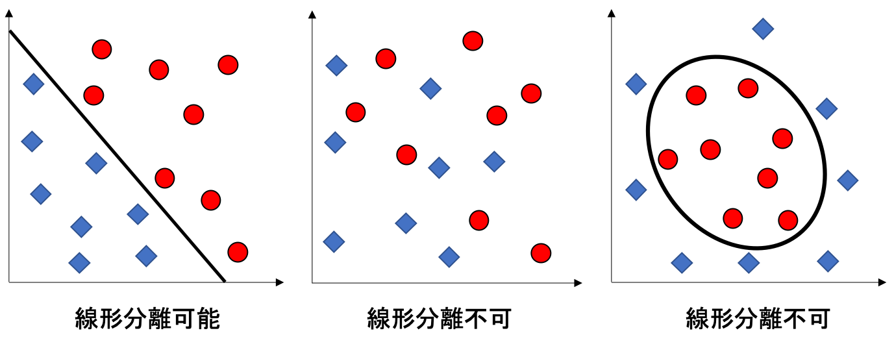
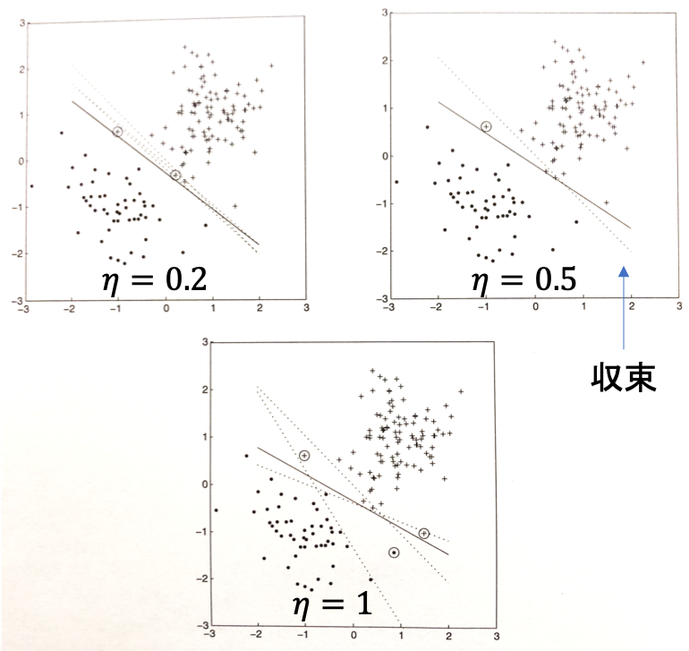
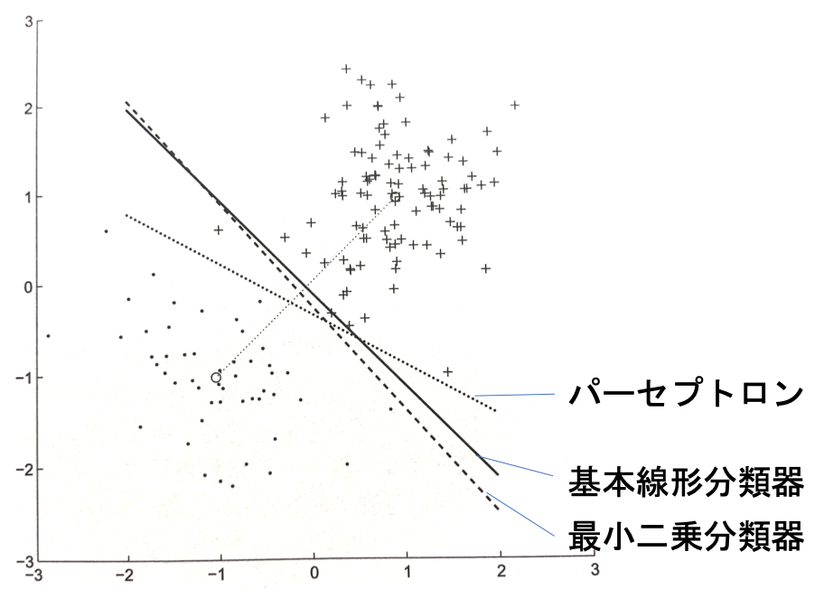

02 パーセプトロン
===============

`線形分離可能`：超平面で空間を分割できること

> `超平面`：議論している空間の次元が一つ小さい




## パーセプトロン

誤って分類された事例がある場合には、常に重みベクトルを更新、学習を繰り返す

* 誤分類された正例($`\bf{x}_i`$)：$`y_i = +1`$ かつ $`\bf{w} \cdot \bf{x}_i < t`$

  * $`\bf{w}' \cdot \bf{x}_i > \bf{w} \cdot \bf{x}_i`$ となる $`\bf{w}'`$ を見つける

  * 新しい重みベクトルを $`\bf{w}' = \bf{w} + \eta \bf{x}_i`$ とすることで達成

    > `学習率`($`\eta`$)：$`0 < \eta \leq 1`$

* 誤分類された負例($`\bf{x}_i`$)：$`y_i = -1`$ かつ $`\bf{w} \cdot \bf{x}_i > t`$

  * 新しい重みベクトルを $`\bf{w}' = \bf{w} - \eta \bf{x}_i`$ とすることで達成

**パーセプトロンの更新規則**

```math
\bf{w}' = \bf{w} + \eta y_i \bf{x}_i
```


### パーセプトロンのアルゴリズム

* 全ての事例が正しく分類されるまで学習を繰り返す

* 次々と送られてくる事例を処理するオンラインアルゴリズムに容易に変形できる

> 最後に受け取った事例が誤分類された場合にのみ、重みベクトルを更新する

**$`Perceptron(D, \eta)`$：線形分類のためのパーセプトロン学習**

|                                                                                                |
| ---------------------------------------------------------------------------------------------- |
| Input: 同次座標系においてラベル付けされた訓練データ集合 $`D`$, 学習率 $`\eta`$                 |
| Output: 分類器の重みベクトル $`\bf{w}`$(分類器は $`\hat{y} = sign(\bf{w}\cdot\bf{x})`$ で定義) |
| 1: $`\bf{w} \leftarrow \bf{0}`$                                                                |
| 2: $`converged \leftarrow false`$                                                              |
| 3: while $`converged = false`$ do                                                              |
| 4:   $`converged \leftarrow true`$                                                             |
| 5:   for $`i = 1`$ to $`\vert D \vert`$ do                                                     |
| 6:     if $`y_i \bf{w}\cdot\bf{x_i} \leq 0`$                                                   |
| 7:     then                                                                                    |
| 8:       $`\bf{w} \leftarrow \bf{w} + \eta y_i \bf{x}_i`$                                      |
| 9:       $`converged \leftarrow false`$                                                        |
| 10:    end                                                                                     |
| 11:  end                                                                                       |
| 12:end                                                                                         |

**初期の決定境界から離れていく速度と学習率の関係**

重みベクトルの初期値：基本線形分類器の重みベクトル

* 初期の決定境界から離れていく速度と学習率($`\eta`$)の関係を表す

* 重みベクトルの初期値が0ベクトル：学習率は収束に影響を与えない



> * 訓練データが線形分離可能であれば、解の収束が保証される
>
> * 線形分離可能でなければ、収束が保証されるとは限らない


## パーセプトロンの重みベクトル

**パーセプトロンのアルゴリズム**

* 事例 $`\bf{x}_i`$ が誤分類されたとき、重みベクトルに $`y_i \bf{x}_i`$ を加える

* $`\bf{x}_i`$ が誤分類された回数を $`\alpha_i`$ とすると、`重みベクトル`は以下の式で表される

```math
\bf{w} = \sum_{i=1}^n \alpha_i y_i \bf{x}_i
```

> `重みベクトル`は、訓練インスタンスの線形結合

パーセプトロンは、この性質を基本線形分類器と共有している

* $`c(\bf{x})`$：事例 $`\bf{x}`$ の真のクラス(+1または-1)

* $`\alpha^{\oplus} = \frac{1}{Pos}`$

* $`\alpha^{\ominus} = \frac{1}{Neg}`$

```math
\bf{w}_{blc} = \bf{\mu^{\oplus}} - \bf{\mu^{\ominus}}= \frac{1}{Pos}\sum_{\bf{x}^{\oplus} \in Tr^{\oplus}} \bf{x}^{\oplus} - \frac{1}{Neg}\sum_{\bf{x}^{\ominus} \in Tr^{\ominus}} \bf{x}^{\ominus}\\= \sum_{\bf{x}^{\oplus} \in Tr^{\oplus}} \alpha^{\oplus}c(\bf{x}^{\oplus}) \bf{x}^{\oplus} - \sum_{\bf{x}^{\ominus} \in Tr^{\ominus}} \alpha^{\ominus}c(\bf{x}^{\ominus}) \bf{x}^{\ominus}
```

特徴量に対する重み($`w_j`$)ではなく、「インスタンスに対する重み $`\alpha_i`$ を学習している」

* インスタンス $`\bf{x}`$ は、$`\hat{y} = sign(\sum_{i=1}^n \alpha_i \bf{x}_i \cdot \bf{x})`$ と分類

* 学習において必要な訓練データの情報は、全ての事例の組の内積である

**$`DualPerceptron(D)`$：双対形式のパーセプトロン学習**

|                                                                                                              |
| ------------------------------------------------------------------------------------------------------------ |
| Input: 同次座標系においてラベル付けされた訓練集合 $`D`$                                                      |
| Output: 係数 $`\alpha_i`$(重みベクトル $`\bf{w} = \sum_{i=1}^{\vert D \vert} \alpha_i y_i \bf{x}_i`$ を構成) |
| 1: $`\alpha \leftarrow 0 (1 \leq i \leq \vert D \vert)`$                                                     |
| 2: $`converged \leftarrow false`$                                                                            |
| 3: while $`converged = false`$ do                                                                            |
| 4:   $`converged \leftarrow true`$                                                                           |
| 5:   for $`i = 1`$ to $`\vert D \vert`$ do                                                                   |
| 6:     if $`\sum_{i=1}^{\vert D \vert} \alpha_i y_i \bf{x}_i \cdot \bf{x}_j \leq 0`$ then                    |
| 7:       $`\alpha_i \leftarrow \alpha_i + 1`$                                                                |
| 8:       $`converged \leftarrow false`$                                                                      |
| 9:     end                                                                                                   |
| 10:   end                                                                                                    |
| 11:end                                                                                                       |


### それぞれの分類器の違い

パーセプトロンのみが完全分離を達成している




## パーセプトロンと回帰

残差平方を用いた更新規則に変更する

```math
\bf{w}' = \bf{w} + (y_i - \hat{y}_i)^2 \bf{x}_i
```

ただし、変更したアルゴリズムは収束しない可能性がある

> 固定した回数だけ反復する

**$`PerceptronRegression(D,T)`$：回帰のためのパーセプトロン学習**

|                                                                                            |
| ------------------------------------------------------------------------------------------ |
| Input: 同次座標系においてラベル付けされた訓練データの集合 $`D`$, 学習の反復回数 $`T`$      |
| Output: 重みベクトル $`\bf{w}`$($`y`$ の予測値は $`\hat{y} = \bf{w} \cdot \bf{x}`$ で定義) |
| 1: $`\bf{w} \leftarrow \bf{0}`$, $`t \leftarrow 0`$                                        |
| 2: while $`t < T`$ do                                                                      |
| 3:   for $`i = 1`$ to $`\vert D \vert`$ do                                                 |
| 4:     $`\bf{w} \leftarrow \bf{w} + (y_i - \hat{y}_i)^2 \bf{x}_i`$                         |
| 5:   end                                                                                   |
| 6:   $`t \leftarrow t + 1`$                                                                |
| 7: end                                                                                     |


| 版   | 年/月/日   |
| ---- | ---------- |
| 初版 | 2019/06/23 |
