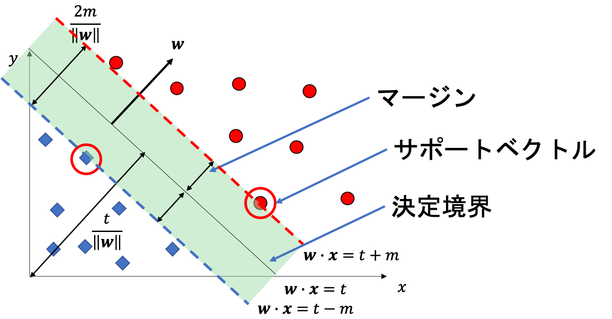
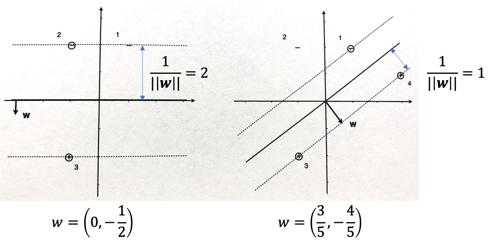
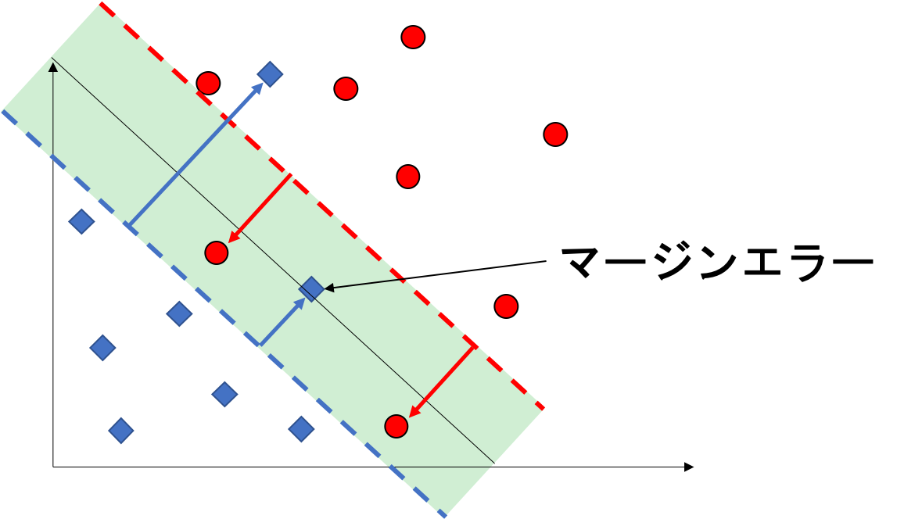
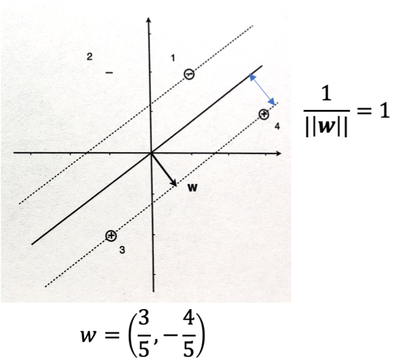

03 サポートベクトルマシン
=====================

## 1. マージン最大化分類器

$`x`$ に対するマージンを $`c(x)\hat{s}(x)`$ と定義する

* $`c(x)`$：正例に対して`+1`、負例に対して`-1`

* $`\hat{s}(x)`$ を事例 $`x`$ に対するスコア

$`\hat{s}(\bf{x}) = \bf{w}\cdot\bf{x} - t`$ を考える

* 真陽性例 $`\bf{x}_i`$：マージンは $`\bf{w}\bf{x}_i - t > 0`$

* 真陰性例 $`\bf{x}_i`$：マージンは $`- (\bf{w}\bf{x}_i - t) > 0`$

与えられた`訓練データ集合`と`決定境界`に対して、以下のマージンの和を最小にすることを考える

* $`m^{\oplus}`$：全ての正例の中でも、最も小さいマージン

* $`m^{\ominus}`$：全ての負例の中でも、最も小さいマージン

> この和は、決定境界に最も近い正例・負例が正しく分類されるように保ち続ける限り、閾値 $`t`$ とは無関係

$`t`$ は $`m^{\oplus}`$ と $`m^{\ominus}`$ の値が等しくなるように調整可能



`サポートベクトル`：決定境界に最も近い訓練事例

* `SVM`の決定曲線は、`サポートベクトル`の線形結合

* `マージン`：$`m / \| \bf{w} \|`$

  > $`m`$：決定境界に最も近い訓練インスタンスの、決定境界から $`\bf{w}`$ に沿って測った距離

* `マージン`の最大化は、$`\| \bf{w} \|`$ の最小化と同等

  > $`t`$、$`\| \bf{w} \|`$、$`m`$：値を定数倍しても結論は変わらない($`m=1`$ と設定)
  >
  > ただし、訓練インスタンスの点がマージンの間に落ちないことを仮定する


### 最適化問題・制約付き最適化問題

**最適化問題**

`最適化問題`：可能な値の集合から、最適な値などを探索する問題の総称

* `残差`の平方和 $`f(a,b) = \sum_{i=1}^n(w_i - (a + bh_i))^2`$ を最小にする、$`a`$ と $`b`$ の値を探索する

```math
a^*, b^* = \arg_{a,b} \min f(a,b)
```

$`f`$：目的関数

* 最小値は、$`a`$ と $`b`$ についての偏導関数が`0`になるような $`a`$ と $`b`$ の値を求める

* $`\bigtriangledown f(a,b) = \bf{0}`$ となるような $`a`$ と $`b`$ の値を求める問題で定義できる

  > `勾配`($`\bigtriangledown f`$)：これらの偏導関数からなるベクトル

ただし、目的関数が凸でない場合には、解の一意性は必ずしも保証されない


**制約付き最適化問題**

`制約付き最適化問題`：制約を与えたもとでの最適化問題

```math
a^*, b^* = \arg_{a,b} \min f(a,b)
```

subject: $`g(a,b) = c`$

* 制約によって示される関係が線形の場合：一方の変数を多数の変数で表し、制約のない最適化問題を解く($`a - b = 0`$ など)

* 制約によって示される関係が非線形の場合：`ラグランジュ乗数`($`g`$)を用いる


**ラグランジュの未定乗数法**

```math
\Lambda(a, b, \lambda) = f(a, b) - \lambda(g(a, b) - c)
```

* $`\lambda`$：ラグランジュ乗数

この関数 $`\Lambda`$ について、制約のない最適化問題を解く

```math
\bigtriangledown \Lambda(a, b, \lambda) = \bf{0} \begin{cases}\bigtriangledown_{a,b} \Lambda(a,b,\lambda) = \bigtriangledown f(a,b) - \lambda \bigtriangledown_g (a,b) \\\bigtriangledown_{\lambda} \Lambda(a,b,\lambda) = g(a, b) - c\end{cases}
```

* $`f`$ と $`g`$ の勾配は、同じ方向を示すベクトル

* 制約を満たしている

> 複数の等式制約や不等式制約には、それぞれの制約に個別のラグランジュ乗数を与える


### マージンの最適化問題

$`\| \bf{w} \|`$ の最小化と等価である $`\frac{1}{2} \| \bf{w} \|`$ の最小化を考える

```math
\bf{w}^*, t^* = \arg_{\bf{w}, t} \min \frac{1}{2} \| \bf{w} \|^2
```

subject：$`y_i(\bf{w} \cdot \bf{x}_i - t) \geq 1`$, $`1 \leq i \leq n`$

訓練データの各事例に対する制約に、ラグランジュ乗数 $`\alpha_i`$ を掛けたものを目的関数に加える

```math
\Lambda(\bf{w}, t, \alpha_1, \cdots, \alpha_n) = \frac{1}{2} \| \bf{w} \|^2 - \sum_{i=1}^n \alpha_i(y_i (\bf{w} \cdot \bf{x}_i - t) - 1) \\= \frac{1}{2} \| \bf{w} \|^2 - \sum_{i=1}^n \alpha_i y_i (\bf{w} \cdot \bf{x}_i) + \sum_{i=1}^n \alpha_i y_i t + \sum_{i=1}^n \alpha_i \\= \frac{1}{2} \bf{w}\cdot\bf{w} - \bf{w} \Bigr( \sum_{i=1}^n \alpha_i y_i \bf{x}_i \Bigl) + t \Bigr( \sum_{i=1}^n \alpha_i y_i \Bigl) + \sum_{i=1}^n \alpha_i
```

このラグランジュ関数の偏導関数をとり、`0`になるようにする

```math
\frac{\partial}{\partial t} \Lambda(\bf{w}, t, \alpha_1, \cdots, \alpha_n) = \sum_{i=1}^n \alpha_i y_i = 0
```

```math
\frac{\partial}{\partial \bf{w}} \Lambda(\bf{w}, t, \alpha_1, \cdots, \alpha_n) = \bf{w} - \sum_{i=1}^n \alpha_i y_i \bf{w}_i = 0
```

> ここで、$`\bf{w} = \sum_{i=1}^n \alpha_i y_i \bf{x}_i`$ となるので、パーセプトロンと同じ重みベクトルの表現となる

これらの解をラグランジュ関数に代入すると、以下の式となる

```math
\Lambda (\alpha_1, \cdots, \alpha_n) = - \frac{1}{2} \Bigr( \sum_{i=1}^n \alpha_i y_i \bf{x}_i \Bigl) \cdot \Bigr( \sum_{i=1}^n \alpha_i y_i \bf{x}_i \Bigl) + \sum_{i=1}^n \alpha_i \\= - \frac{1}{2} \sum_{i=1}^n \sum_{j=1}^n \alpha_i \alpha_j y_i y_j \bf{x}_i \cdot \bf{x}_j + \sum_{i=1}^n \alpha_i
```

ここで、双対問題は、以下のものとなる

* 上の関数において、$`\alpha_i`$ が正であるという複数個の不等式制約

* 1個の等式制約のもとで最大化

```math
\alpha_1^*, \cdots, \alpha_n^* = \arg_{\alpha_1, \cdots, \alpha_n} \max - \frac{1}{2} \sum_{i=1}^n \sum_{j=1}^n \alpha_i \alpha_j y_i y_j \bf{x}_i \cdot \bf{x}_j + \sum_{i=1}^n \alpha_i
```

subject：$`\alpha_i \geq 0`$, $`1 \leq i \leq n`$, $`\sum_{i=1}^n \alpha_i y_i = 0`$

**SVMに対する最適化問題の双対形式**

1. マージンを最大化するような決定境界の探索は、サポートベクトルの探索と同等

1. 最適化問題が訓練インスタンスの組に対する内積(グラム行列の成分)で表される


### 2つのマージン最大化分類器とそのサポートベクトル

各データ点 $`\bf{X}`$、ラベル $`\bf{y}`$、$`\bf{X}'`$($`\bf{X}`$ の各行にクラスラベルを乗じたもの)

```math
\bf{X} = \left(\begin{array}{ccc}1 &  2 \\-1 &  2 \\-1 & -2\end{array}\right),\bf{y} = \left(\begin{array}{ccc}-1 \\-1 \\+1\end{array}\right),\bf{X}' = \left(\begin{array}{ccc}-1 & -2 \\1 & -2 \\-1 & -2\end{array}\right)
```

グラム行列は、以下の通りになる

```math
\bf{X'X'^T} = \left(\begin{array}{ccc}5 & 3 & 5 \\3 & 5 & 3l \\5 & 3 & 5\end{array}\right)
```

双対最適化問題は、以下の通りに表される

```math
\alpha_1^*, \alpha_2^*, \alpha_3^* = \arg_{\alpha_1, \alpha_2, \alpha_3} \max - \frac{1}{2}(5 \alpha_1^2 + 3 \alpha_1 \alpha_2 + 5 \alpha_1 \alpha_3 + 3 \alpha_2 \alpha_1 + 5 \alpha_2^2 + 3 \alpha_2 \alpha_3 + 5 \alpha_3 \alpha_1 + 3 \alpha_3 \alpha_2 + 5 \alpha_3^2) + \alpha_1 + \alpha_2 + \alpha_3\\= \arg_{\alpha_1, \alpha_2, \alpha_3} \max - \frac{1}{2}(5 \alpha_1^2 + 6 \alpha_1 \alpha_2 + 10 \alpha_1 \alpha_3 + 5 \alpha_2^2 + 6 \alpha_2 \alpha_3 +5 \alpha_3^2) + \alpha_1 + \alpha_2 + \alpha_3
```

subject：$`\alpha_1 \geq 0`$, $`\alpha_2 \geq 0`$, $`\alpha_3 \geq 0`$, $`- \alpha_1 - \alpha_2 + \alpha_3 = 0`$

ここで、$`\alpha_3`$ を消去すると以下の式で表される

```math
\alpha_1^*, \alpha_2^*, \alpha_3^* = \arg_{\alpha_1, \alpha_2, \alpha_3} \max - \frac{1}{2}(20 \alpha_1^2 + 32 \alpha_1 \alpha_2 + 16 \alpha_2^2) + 2 \alpha_1 + 2 \alpha_2
```

この式に関して、偏導関数が`0`となる方程式を立てる

```math
\frac{\partial}{\partial \alpha_1}\alpha_1^*, \alpha_2^*, \alpha_3^* = -20 \alpha_1 - 16 \alpha_2 + 2 = 0 \\\frac{\partial}{\partial \alpha_2}\alpha_1^*, \alpha_2^*, \alpha_3^* = -16 \alpha_1 - 16 \alpha_2 + 2 = 0
```

この式より、以下の解が導出できる

```math
\alpha_1 = 0, \alpha_2 = \alpha_3 = \frac{1}{8}
```

ゆえに、$`\bf{w}`$、マージンは以下の通りに表される

```math
\bf{w} = \alpha_1 y_1 \bf{x_1} + \alpha_2 y_2 \bf{x_2} + \alpha_3 y_3 \bf{x_3}\\= 0 \cdot(-1) \cdot \bf{x}_1 + \frac{1}{8} \cdot(-1) \cdot\bf{x}_2 + \frac{1}{8} \cdot 1 \cdot \bf{x}_3\\= \frac{1}{8}(\bf{x}_3 - \bf{x}_2) = \left(\begin{array}{ccc}0 \\-\frac{1}{2}\end{array}\right)
```

```math
\frac{1}{\| \bf{w} \|} = 2
```

**正例を追加した場合**

```math
\bf{X}' = \left(\begin{array}{ccc}-1 & -2 \\1 & -2 \\-1 & -2 \\3 &  1\end{array}\right), \bf{X}'\bf{X}'^T = \left(\begin{array}{ccc}5 & 3 &  5 & -5 \\3 & 5 &  3 &  1 \\5 & 3 &  5 & -5 \\-5 & 1 & -5 & 10\end{array}\right)
```

ラグランジュ乗数は以下の通りに表される

```math
\alpha_1 = \frac{1}{2}, \alpha_2 = 0, \alpha_3 = \frac{1}{10}, \alpha_4 = \frac{2}{5}
```

また、マージンと決定境界は以下の通りに表される

```math
\frac{1}{\| \bf{w} \|} = 1\\\bf{w} = \left(\begin{array}{ccc}\frac{3}{5} \\\frac{-4}{5}\end{array}\right)
```




## 2.ソフトマージンSVM

データが線形分離でない場合：制約 $`y_i(\bf{w}\cdot\bf{x}_i - t) \geq 1`$ が全て同時に成り立たない

* `スラック変数`($`\xi_i`$)：`マージンエラー`を許容する

  > `マージンエラー`：いくつかの事例がマージンの内側、またはご分類される領域に入ること




### ソフトマージン最適化問題

* SVMの制約を変更：

* 全てのスラック変数の和を目的関数に加える： $`C \sum_{i=1}^n \xi_i`$

```math
\bf{w}^*, t^*, \xi_i^* = \arg_{\bf{w}, t, \xi} \min \frac{1}{2} \| \bf{w} \|^2 + C \sum_{i=1}^n \xi_i
```

subject: $`y_i(\bf{w}\cdot\bf{x}_i - t) \geq 1 - \xi_i`$, $`\xi_i \geq 0`$, $`1 \leq i \leq n`$

`複雑性パラメータ`($`C`$)：スラック変数の最小化と、マージン最大化のバランスを調整する

* $`C`$ が小さい：誤差を許容する

* $`C`$ が大きい：誤差に厳しい

* $`C = \infty`$：ハードマージンSVM(誤差なし)

**最適化問題のラグランジュ関数**

制約 $`\xi_i \geq 0`$ のラグランジュ乗数として、$`\beta_i`$ を導入する

```math
\Lambda(\bf{w}, t, \xi_i, \alpha_i, \beta_i) = \frac{1}{2} \| \bf{w} \|^2 + C \sum_{i=1}^n \xi_i - \sum_{i=1}^n \alpha_i(y_i(\bf{w}\cdot \bf{x}_i -t) - (1 - \xi_i)) - \sum_{i=1}^n \beta_i \xi_i\\= \frac{1}{2} \bf{w}\cdot\bf{w} - \bf{w}\cdot\Bigr( \sum_{i=1}^n \alpha_i y_i \bf{x}_i \Bigl) + t\Bigr( \sum_{i=1}^n \alpha_i y_i \Bigl) + \sum_{i=1}^n \alpha_i + \sum_{i=1}^n (C - \alpha_i - \beta_i)\xi_i\\= \Lambda(\bf{w}, t, \alpha_i) + \sum_{i=1}^n (C-\alpha_i - \beta_i)\xi_i
```

ここで、$`\xi_i`$ についての偏導関数をとる

```math
\frac{\partial}{\partial \xi_i}\Lambda(\bf{w}, t, \xi_i, \alpha_i, \beta_i) = \sum_{i=1}^n (C-\alpha_i - \beta_i)\xi_i = 0
```

したがって、全ての $`i`$ に対して $`C - \alpha_i - \beta_i = 0`$ となる

さらに $`\alpha_i`$ と $`\beta_i`$ の両者が正値であることから、$`\alpha_i`$ は $`C`$ よりも大きくなりえない

> $`C`$ は双対問題における $`\alpha_i`$ の上限として機能する

```math
\alpha_1^*, \cdots, \alpha_n^* = \arg_{\alpha_1, \cdots, \alpha_n} \max - \frac{1}{2} \sum_{i=1}^n \sum_{j=1}^n \alpha_i \alpha_j y_i y_j \bf{x}_i \cdot \bf{x}_j + \sum_{i=1}^n \alpha_i
```

subject: $`0 \leq \alpha_i \leq C`$, $`\sum_{i=1}^n \alpha_i y_i = 0`$

**ソフトマージンSVMとヒンジ損失**

* 最適化問題に`スラック変数`を加えることで、`スラック変数`の値を正値に制約

* 目的関数に`スラック変数`を加えることで、`スラック変数`はマージンの内側に落ちた例のみに対する逸脱を測る罰則項として機能

* 主問題における罰則項が $`\xi_i`$ の線形関数であることから、$`\beta_i`$ は双対問題に現れない

故に、`スラック変数`は`ヒンジ損失`を導入したことと同じになる

> マージン $`z > 1`$：罰則はない
>
> マージン $`z = 1 - \xi \leq 1`$：罰則 $`\xi = 1 - z`$ を与える

**$`\alpha_i`$ の上限とは**

* $`\alpha_i = 0`$：マージンの上、または外側に位置する

  > $`\bf{x}_j`$ がサポートベクトルでないことを意味し、$`y_j(\bf{w}\cdot\bf{x}_j - t) \geq 1`$ となる

* $`0 < \alpha_i < C`$：マージン上のサポートベクトル

* $`\alpha_i = C`$：マージンの上、または内側に位置する

  > $`\beta_i = 0`$ となるが、$`\beta = 0`$ は制約の下限に位置していないので、$`\xi_i > 0`$ を意味する


### ソフトマージンの例

ここでは、以下の例を用いて考える

* ラグランジュ乗数：$`\alpha_1 = 1/2`$, $`\alpha_2 = 0`$, $`\alpha_3 = 1/10`$, $`\alpha_4 = 2/5`$



これらのラグランジュ乗数の中で一番 $`\alpha_1 = 1/2`$ が大きい

* $`C > 1/2`$：マージンエラーは許されない

* $`C = 1/2`$：$`\alpha_1 = C`$ より、マージンの上、または内側に位置する

* $`C < 1/2`$：$`\bf{x}_1`$ はマージンエラー

> $`C`$ の値が減少するにつれ、決定境界とその上側のマージンは上昇、一方で下側は同じまま


**左の例**

$`C = \frac{5}{16}`$ の場合

```math
\bf{w} = \left(\begin{array}{ccc}\frac{3}{8} \\-\frac{1}{2}\end{array}\right)
```

```math
t = \frac{3}{8}
```

よって、上側のマージンは $`\bf{x}_2`$ に達し、マージンは $`1.6`$ に増える

* ラグランジュ乗数：$`\xi_1 = 6/8`$, $`\alpha_1 = C = 5/16`$, $`\alpha_2 = 0`$, $`\alpha_3 = 1/16`$, $`\alpha_4 = 1/4`$

**右の例**

> $`C`$ の値をさらに減少させた場合、決定境界は時計回りに回転する
>
> $`\bf{x}_2`$, $`\bf{x}_3`$ のみがサポートベクトルとなる

$`C = \frac{1}{10}`$ の場合

```math
\bf{w} = \left(\begin{array}{ccc}\frac{1}{5} \\-\frac{1}{2}\end{array}\right)
```

```math
t = \frac{1}{5}
```

よって、マージンは $`1.86`$ に増える

$`\xi_1 = 4/10`$, $`\xi_4 = 7/10`$ となり、全ての $`\alpha_i`$ は $`C`$ に等しくなる

> $`C`$ をこれ以上増やすと、全ての点がマージンエラーとなる


### まとめ

複雑性が最小のソフトマージン分類器は、各クラスのクラス平均によって記述できる

* 十分小さい $`C`$ に対し、全ての事例の係数 $`\alpha_i`$ が同じ値 $`C`$ となる

  ```math
  \bf{w} = C \sum_{i=1}^n y_i \bf{x}_i = C (Pos \cdot \bf{\mu}^{\oplus} - Neg \cdot \bf{\mu}^{\ominus})
  ```

  > $`\bf{\mu}^{\oplus}`$, $`\bf{\mu}^{\ominus}`$：それぞれの正例と負例の平均

中程度の値の $`C`$ に対して、決定境界は、サポートベクトルと各クラスのマージンエラーの平均によって張られる


| 版   | 年/月/日   |
| ---- | ---------- |
| 初版 | 2019/06/24 |
