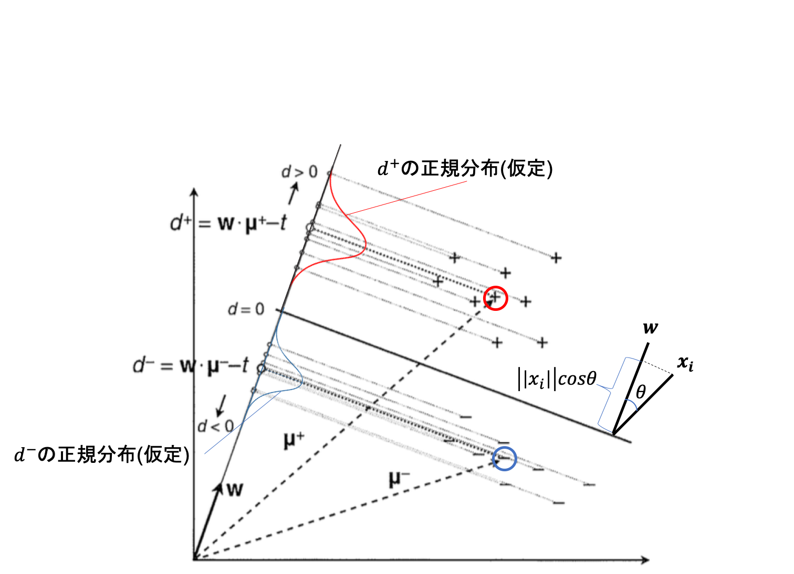
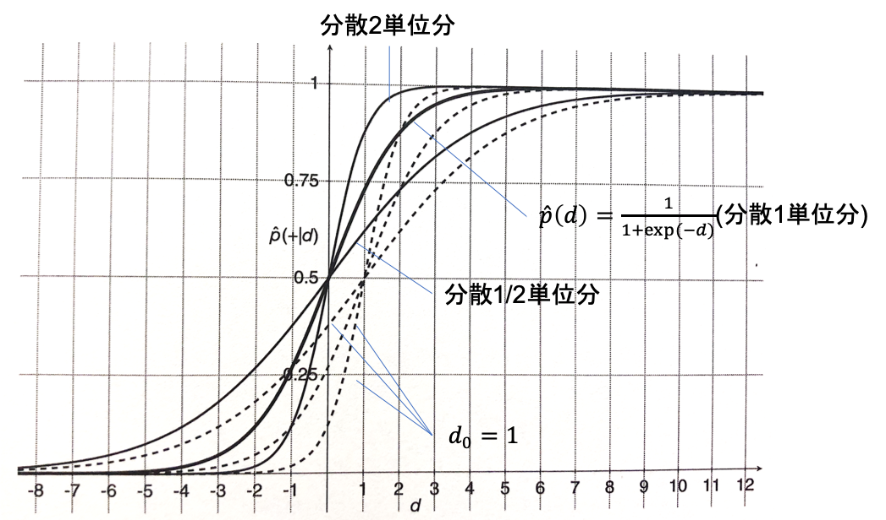
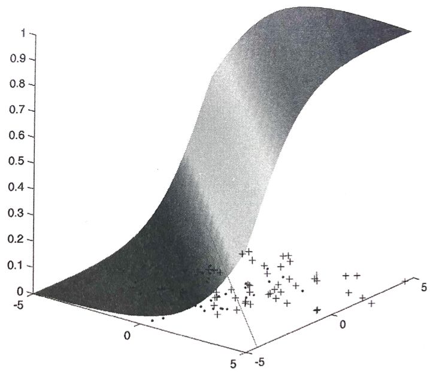
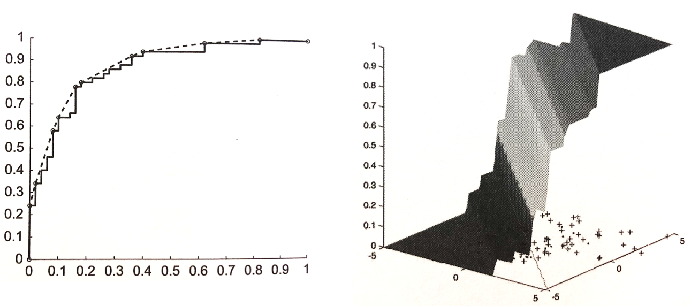

04 確率の推定
===========

線形分類器：事例を分類するためのスコア $`\hat{s}(\bf{x}_i) = \bf{w}\cdot\bf{x}_i - t`$ を算出

* このスコアを用いて、決定境界からの「符号付き」距離を得ることができる

  * $`\bf{w}' = \frac{\bf{w}}{\| \bf{w} \|}`$

  * $`t' = \frac{t}{\| \bf{w} \|}`$

  \[d(\bf{x}_i) = \frac{\hat{s}(\bf{x}_i)}{\| \bf{w} \|} = \frac{\bf{w}\cdot\bf{x}_i}{\| \bf{w} \|} = \bf{w}' \cdot \bf{x}_i - t'\]

  > 内積の定義より、$`\| \bf{x}_i \| \cos \theta = \frac{(\bf{w}\cdot\bf{x}_i)}{\| \bf{w} \|}`$

故に、この量の符号は、その事例が決定境界のどちら側に存在するかを示す

* 決定境界の正側：距離は正

* 決定境界の負側：距離は負

### スコアを確率に変換する

$`\bar{d}^{\oplus}`$：正例の決定境界からの距離の平均

* $`\bf{\mu}^{\oplus}`$：正例の平均

* $`\bf{w}`$：長さ`1`

ゆえに、$`\bar{d}^{\oplus} = \bf{w}\cdot\bf{\mu}^{\oplus} - t`$

ここで、これらの平均を中心に正規分布に従っていることを仮定する

* $`d`$ の確率密度関数：$`P(d \vert \oplus) = \frac{1}{\sqrt{2 \pi} \sigma} \exp \Bigr( - \frac{(d - \bar{d}^{\oplus})^2}{2 \sigma^2} \Bigl)`$

同様に、負例の距離も $`\bar{d}^{\ominus} = \bf{w}\cdot{\mu}^{\ominus} - t`$ を中心に正規分布に従うことが期待される

> $`\bar{d}^{\ominus} < 0 < \bar{d}^{\oplus}`$、正規分布の分散は $`\sigma^2`$ に従う

### ベイズの定理と尤度比

**ベイズの定理**

結果の起こる原因の確率を計算する手法

$`\begin{eqnarray}p(A \vert B_i) = \frac{P(A \cap B_i)}{p(B_i)}\\p(B_i \vert A) = \frac{P(A \cap B_i)}{p(A)}\end{eqnarray}`$

上の式の時、以下の式で表される

$`\begin{eqnarray}p(A \vert B_i) = \frac{p(A) \times p(B_i \vert A)}{p(B_i)}\end{eqnarray}`$

**尤度比**

疾病にかかっている人がその検査結果となる確率と、正常な人がその検査結果となる確率の比

$`\begin{eqnarray}尤度比 = \frac{有疫者が異常}{正常者が異常}\end{eqnarray}`$

### ベイズの定理と確率推定

距離 $`d(\bf{x})`$ を持つ点が観測された場合に、以下のように定義する

* $`d(\bf{x}) > 0`$：正

* $`d(\bf{x}) < 0`$：負

加えて、この予測に確率 $`\hat{p}(\bf{x}) = P(\oplus \vert d(\bf{x}))`$ を用いる

$`\begin{eqnarray}P(\oplus \vert d(\bf{x})) = \frac{P(d(\bf{x}) \vert \oplus)P(\oplus)}{P(d(\bf{x})\vert \oplus)P(\oplus)+ P(d(\bf{x})\vert \ominus)P(\ominus)} = \frac{LR}{LR + 1/clr}\end{eqnarray}`$

> * $`LR`$：正規分布から得られる尤度比
>
> * $`clr`$：クラス比

**仮定：$`p(\oplus) = p(\ominus) = 1/2`$($`clr = 1`$), $`\sigma^2 = 1`$, $`\bar{d}^{\oplus} = - \bar{d}^{\ominus} = 1/2`$**

$`\begin{eqnarray}LR = \frac{P(d(\bf{x}) \vert \oplus)}{P(d(\bf{x}) \vert \ominus)} = \frac{\frac{\exp (-d(\bf{x}) - 1/2)^2}{2}}{\frac{\exp (-d(\bf{x}) + 1/2)^2}{2}} = \exp (d(\bf{x}))\end{eqnarray}`$

故に、次の式を得る

$`\begin{eqnarray}P(\oplus \vert d(\bf{x})) = \frac{\exp (d \bf(x))}{\exp (d \bf(x)) + 1} = \frac{\exp (\bf{w}\cdot\bf{x} - t)}{\exp (\bf{w}\cdot \bf{x}- t) + 1}\end{eqnarray}`$

まとめると、線形分類器から得られた距離スコア $`d`$ から確率を推定するには、以下の写像によって変換する

$`\begin{eqnarray}d \mapsto \frac{\exp (d)}{\exp (d) + 1}\end{eqnarray}`$

> この関数を、`シグモイド関数`と呼ぶ

**仮定：$`p(\oplus) = p(\ominus) = 1/2`$($`clr = 1`$), $`\bar{d}^{\oplus} = - \bar{d}^{\ominus}`$**

$`\begin{eqnarray}LR = \exp \Bigr( \frac{-(d(\bf{x}) - \bar{d}^{\oplus})^2 + (d(\bf{x}) - \bar{d}^{\ominus})^2}{2 \sigma^2} \Bigl)\\= \exp \Bigr( \frac{2 \bar{d}^{\oplus} d(\bf{x}) - (\bar{d}^{\oplus})^2 - 2 \bar{d}^{\ominus} d(\bf{x}) + (\bar{d}^{\ominus})^2}{2 \sigma^2} \Bigl)\\= \exp (\gamma d(\bf{x}))\end{eqnarray}`$

> $`\gamma = \frac{(\bar{d}^{\oplus} - \bar{d}^{\ominus})}{\sigma^2}`$
>
> 各クラスの平均の距離が分散の1単位分に成るように、重みベクトルを調整するパラメータ($`\bf{w}`$ が単位ベクトルであるという仮定を外す)

**仮定：$`p(\oplus) = p(\ominus) = 1/2`$($`clr = 1`$)**

最も一般的な形を得る

$`\begin{eqnarray}LR = \frac{P(d(\bf{x}) \vert \oplus)}{P(d(\bf{x}) \vert \ominus)} = \exp (\gamma (d(\bf{x}) - d_0))\end{eqnarray}`$

> $`\begin{eqnarray}\gamma = \frac{\bar{d}^{\oplus} - \bar{d}^{\ominus}}{\sigma^2} = \frac{\bf{w}\cdot(\bf{\mu}^{\oplus} - \bf{\mu}^{\ominus})}{\sigma^2}\end{eqnarray}`$
>
> $`\begin{eqnarray}d_0 = \frac{\bar{d}^{\oplus} + \bar{d}^{\ominus}}{2} = \frac{\bf{w}\cdot(\bf{\mu}^{\oplus} + \bf{\mu}^{\ominus})}{2} - t\end{eqnarray}`$

ここで、$`d_0`$ は、決定境界が $`\bf{w}\cdot\bf{x} = t`$ から、2クラスの平均の等分点 $`\bf{x} = \frac{\bf{\mu}^{\oplus} + \bf{\mu}^{\ominus}}{2}`$ に移動したことになる

まとめると、線形分類器から得られた距離スコア $`d`$ から確率を推定するには、以下の写像によって変換する

$`\begin{eqnarray}d \mapsto \frac{1}{1 + \exp(-\gamma(d-d_0))}\end{eqnarray}`$

### 線形分類器に対するロジスティックキャリブレーション

`ロジスティックキャリブレーション`は、基本線形分類器 $`\bf{w} = \bf{\mu}^{\oplus} - \bf{\mu}^{\ominus}`$ に対して、以下の簡単な式で表される

$`\begin{eqnarray}\bar{d}^{\oplus} - \bar{d}^{\ominus} = \frac{\bf{w}\cdot(\bf{\mu}^{\oplus} - \bf{\mu}^{\ominus})}{\| \bf{w} \|} = \frac{\|\bf{\mu}^{\oplus} - \bf{\mu}^{\ominus} \|^2}{\|\bf{\mu}^{\oplus} - \bf{\mu}^{\ominus} \|} = \|\bf{\mu}^{\oplus} - \bf{\mu}^{\ominus} \|\end{eqnarray}`$

故に、$`\gamma = \|\bf{\mu}^{\oplus} - \bf{\mu}^{\ominus} \| / \sigma^2}`$

さらに、$`(\bf{\mu}^{\oplus} - \bf{\mu}^{\ominus})/2`$ が決定境界上の点であることより、$`d_0 = 0`$ となる

この場合、2クラスの分離の度合いに従って、ロジスティック関数の傾き具合を調整するだけで良い

> 図：共分散行列が等しい2つの正規分布から抽出されたデータに対する`ロジスティックキャリブレーション`

### ロジスティックキャリブレーションのまとめ

**線形分類器から確率の推定値を得る**

まず、平均距離 $`\bar{d}^{\oplus}`$、$`\bar{d}^{\ominus}`$、分散 $`\sigma^2`$ を計算する

次に、これらの値から`位置パラメータ`($`d_0`$)、`尺度パラメータ`($`\gamma`$) を求める

このとき、`尤度比`は以下の式となる

$`\begin{eqnarray}LR = \exp (\gamma (d (\bf{x}) - d_0)) = \exp (\gamma (\bf{w}\cdot\bf{x} -t - d_0))\end{eqnarray}`$

* `対数線形モデル`：`尤度比`の対数が $`\bf{x}`$ の線形関数となるため

> $`\bf{w}' = \gamma \bf{w}`$、$`t' = \gamma(t + d_0)`$ とすると、以下の式で表される
>
> $`\begin{eqnarray}\gamma (\bf{w}\cdot\bf{x} -t - d_0) = \bf{w}'\cdot\bf{x} - t'\end{eqnarray}`$

`ロジスティックキャリブレーション`は決定境界の位置は変えられるが、方向は変えることはできない

### 単調キャリブレーション

* 左の図：基本線形分類器のROC曲線と凸包

* 右の図：凸包の各面に対応する水平域を持つ、区分的にキャリブレーション関数を構成する事ができる

この方法では、データに対して何の仮定も要請しない

> 過適合防止：大きなデータを用いること

| 版   | 年/月/日   |
| ---- | ---------- |
| 初版 | 2019/06/23 |
