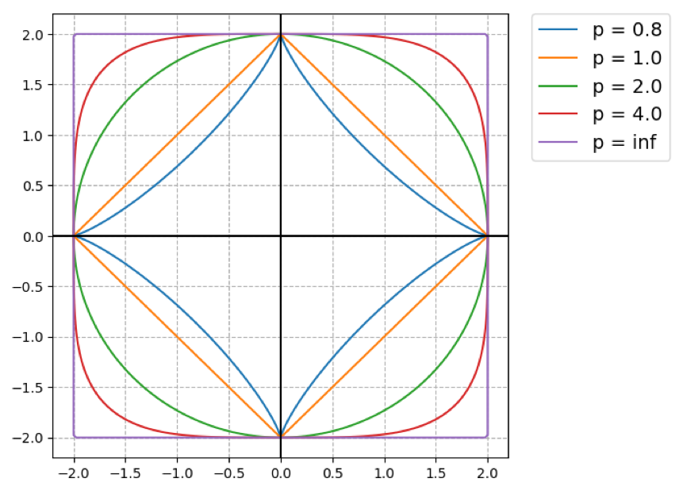
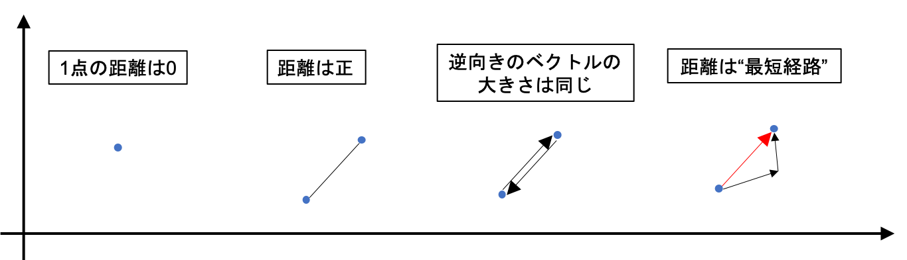
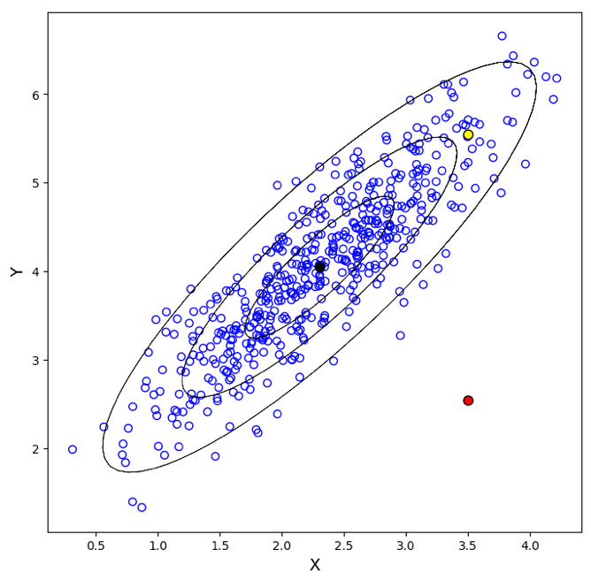
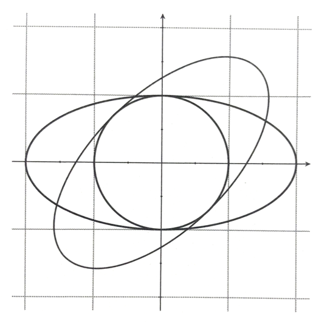

01 さまざまな「道」
================

## 1.ミンコフスキー距離

$`X=\mathbb{R}^d`$ のとき、$`p(>0)`$ 次の`ミンコフスキー距離`は以下で表わされる

```math
Dis_p(\bf{x},\bf{y})=\Bigr( \sum^d_{j=1} \vert x_j - y_j \vert ^p \Bigl)^{1/p} = \| \mathbb{x} - \mathbb{y} \|_p
```

ただし、以下の表記を「ベクトル $`\bf{z}`$ の $`p-`$ ノルム」と呼ぶ

```math
Dis_p = \| \bf{z} \|_p = \Bigr( \sum^d_{j=1} \vert z_j \vert ^p \Bigl)^{1/p}
```

**ユークリッド距離**

* `2-ノルム`とも呼ばれる

* 2点間の直線距離を表す

```math
Dis_2(\bf{x},\bf{y})= \sqrt{\Bigr( \sum^d_{j=1} \vert x_j - y_j \vert ^p \Bigl)^{2}} = \sqrt{(\mathbb{x}-\mathbb{y})^T(\mathbb{x}-\mathbb{y})}
```

**マンハッタン距離**

* `1-ノルム`とも呼ばれる

* 座標軸に平行な経路のみを移動する

```math
Dis_1(\mathbb{x},\mathbb{y})=\sum^d_{j=1} \| x_j - y_j \|
```

**チェビシェフ距離**

* 各座標の中で最大のものに近づく

```math
Dis_{\inf}(\mathbb{x},\mathbb{y}) = \max_j \vert x_j - y_j \vert
```




## 2.距離メトリック

> そもそも距離とは何か？

インスタンス空間 $`X`$ に対して、`距離メトリック`は次の4つの条件を満たす関数 $`Dis: X \times X \rightarrow \mathbb{R}`$

> 任意の $`x,y,z \in \mathbb{R}`$ に対して

1. 自身との距離は $`0:Dis(x,x)=0`$

1. 他の点との距離は正である：$`x \neq y`$ ならば $`Dis(x,y) > 0`$

1. 対称である：$`Dis(x,y) = Dis(y,x)`$

1. 迂回により距離が短縮されることはない：$`Dis(x,z) \leq Dis(x,y) + Dis(y,z)`$

> 2つ目の条件が統合付きに緩和された場合、この関数は`擬距離`と呼ばれる




## 3.マハラノビス距離

* 説明変数間に相関がある場合の距離

> 行列 $`\mathbb{M}`$：楕円の形状を表すが、逆行列とすると共分散行列の逆行列として定義される

```math
Dis_M(\mathbb{x},\mathbb{y} \vert \mathbb{\sum}) = \sqrt{(\mathbb{x} - \mathbb{y})^T \mathbb{\sum}^{-1}(\mathbb{x} - \mathbb{y})}
```



* 赤点：異常値

* 黄点：クラスターに近い点

* 黒点：平均点

> 分散が大きい方向と小さい方向の尺度が等しいとみなすユークリッド距離では、データ点を上手く評価出来ない

共分散行列として単位行列 $`\bf{I}`$ を考えると、主成分空間におけるユークリッド距離となる

```math
Dis_2(\bf{x},\bf{y}) = Dis_M(\bf{x},\bf{y} \vert \bf{I})
```


### 楕円距離

* 半径 $`r(d \geq 2)`$ の超球：$`\bf{x}^T\bf{x}=r^2`$

* 回転・収縮が行列 $`\mathbb{M}`$ で表わされる長楕円：$`\bf{x}^T\bf{M}\bf{x}=r^2`$

**実際の例**

* 行列 $`R`$：時計回りで $`45^\circ`$ の回転行列

* 対角行列 $`S`$：$`x`$ 軸方向に対して1/2倍するスケーリング行列

``math
\bf{R} = \left(
    \begin{array}{ccc}
      \frac{1}{\sqrt{2}} & \frac{1}{\sqrt{2}} \\
      -\frac{1}{\sqrt{2}} & \frac{1}{\sqrt{2}}
    \end{array}
  \right)\\
\bf{S} = \left(
    \begin{array}{ccc}
      \frac{1}{2} & 0 \\
      0 & 1
    \end{array}
  \right)\\
\bf{M} = \left(
    \begin{array}{ccc}
      \frac{5}{8} & -\frac{3}{8} \\
      -\frac{3}{8} & \frac{5}{8}
    \end{array}
  \right)
```

例：時計まわりに $`45^\circ`$ 回転させ、$`x`$ 軸方向に対して1/2倍した形状

* 半径1/2倍の円を表す

* $`45^\circ`$ の方向に伸びた楕円を表す

```math
(\bf{sRx}^T)(\bf{sRx})=\bf{x^TR^TS^TSRx}=\bf{x^TR^TS^2Rx}=\bf{x^TMx} = \frac{1}{4}
```

この楕円方程式としては、以下の式で表わされる

```math
\Bigr(\frac{5}{8} \Bigl)x^2 + \Bigr( \frac{5}{8} \Bigl)y^2 - \Bigr( \frac{3}{4} \Bigl)xy = \frac{1}{2}
```



> 回転した楕円、長軸が水平方向の楕円、円


| 版   | 年/月/日   |
| ---- | ---------- |
| 初版 | 2019/07/17 |
