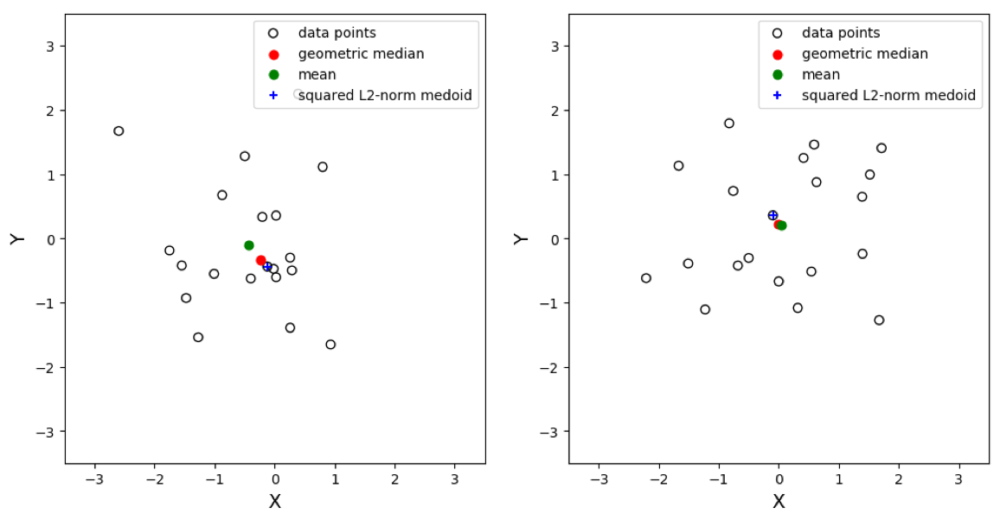
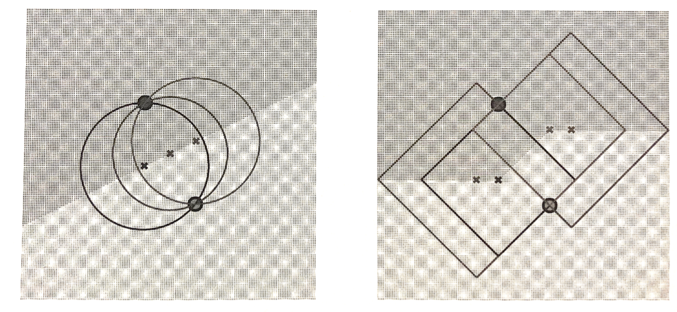

02 近隣と見本点
=============

距離ベースのモデルの鍵となる考え方

1. `見本点`に基づいてモデルを構築する(プロトタイプとなるインスタンス)

1. 最も近い`見本点`(`近隣`)に基づいて決定ルールをていぎすること


## 1.算術平均のユークリッド距離二乗最小化

ベクトル集合の平均は、「ベクトルのユークリッド距離の二乗和を最小にする」性質を持っている

**定理**

ユークリッド空間内のデータ集合 $`D`$ の算術平均 $`\mu`$ は、データとのユークリッド距離の二乗和を最小にする唯一の点である

**証明**

* $`\arg \min_{\bf{y}} \| \bf{x} - \bf{y} \|^2 = \bf{\mu}`$ を示す

* 左辺の最小値を求めるために、勾配が $`0`$ になるものを求める

  > 勾配：$`y_i`$ に関する偏微分からなるベクトル

```math
\bigtriangledown_{\bf{y}} \sum_{\bf{x} \in D} \| \bf{x} - \bf{y} \|^2 = -2 \sum_{\bf{x} \in D} (\bf{x} - \bf{y}) = -2 \sum_{\bf{x} \in D} \bf{x} + 2 \vert D \vert \bf{y} = \bf{0}
```

故に、以下を得る

```math
\bf{y} = \frac{1}{\vert D \vert} \sum_{\bf{x} \in D} \bf{x} = \bf{\mu}
```

(証明終)


## 2.見本点

* `算術平均`(セントロイド)：外れ値の影響を受けやすい

* `中央値`(幾何中央値)：ユークリッド距離そのものの和を最小にする見本点

  * 1変量のデータでは、さまざまな数値の中で「真ん中の値」になる

  * 多変量データでは、逐次近似で求める必要がある

* `メドイド`：各データに対して他のデータとの距離の総和を計算、その中から最小のものを選ぶ

  * 算術平均に最も近いデータ点

  * 計算量が多いことが問題




## 3.決定ルール

データ $`\bf{x}`$ が $`\bf{\mu}^{\oplus}`$ の方に近ければ、$`\bf{x}`$ を正として分類、逆であれば負と分類する

* `ユークリッド距離`：見本点を結ぶ線分が垂直二等分線となるような線形の決定境界となる

* `マンハッタン距離`：互いに異なる2点の見本点を頂点とした、短形が構成される



3つ以上の見本点に対しても、同じことが適用できる

> ミンコフスキー距離の各 $`p`$ における境界


## まとめ

距離ベースのモデルの構成要素は、以下のようにまとめられる

* ユークリッド、マンハッタン、ミンコフスキー、マハラノビスなどの様々な距離メトリック

* 見本点：決められた距離メトリックにより定まる、データ集合の中心である重心や、データ集合の中で最も中心に位置するデータ点であるメトイド

* 距離ベースの決定ルールで、$`k`$ 番目に近い見本点までを用いるもの


| 版   | 年/月/日   |
| ---- | ---------- |
| 初版 | 2019/07/19 |
