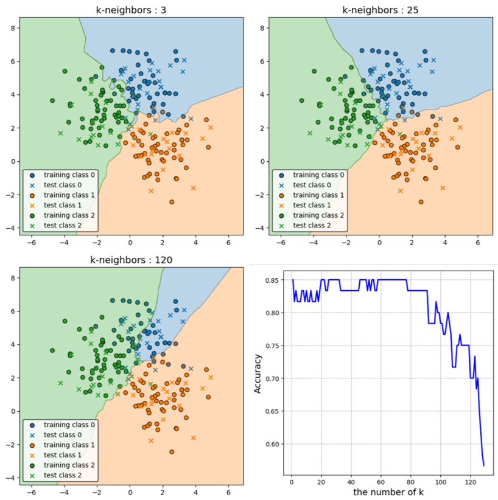
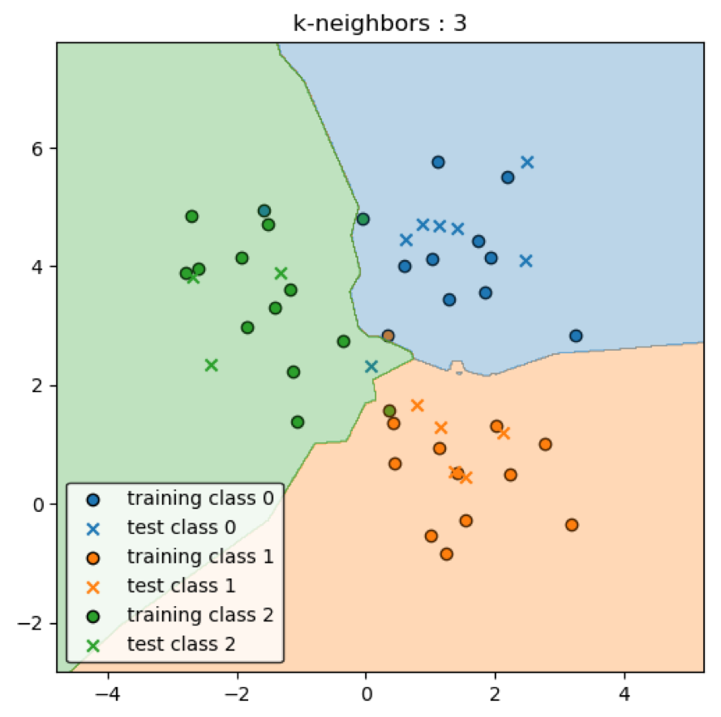

03 最近隣分類
============

`最近隣分類`：訓練インスタンスのうちいずれかをそのまま見本点として扱い、結果として分類器の「訓練」では訓練データを記憶する

  * 1つのインスタンスが複数のクラスに属していなければ、訓練データを完全に分類できる

  * 決定境界を張る見本点のいずれかが変化すれば、それに強く依存して境界も変化する

## 1.最近隣分類の特徴

1. アルゴリズムが極めて単純

  * 実装しやすい、分析結果を理解しやすい

2. 高次元データには向かない

  * 高次元データは疎であるため，どの2点間の距離も大きくなる

  * 情報としての距離に意味が無くなる

    > どの点とも同じような類似度になる

3. 予測段階での計算負荷が多い

  * 新しいデータに対しても他の全てのデータ点との距離を計算

  * 予測においても計算量が多い

4. $`k`$ の値はユーザーが決定する必要

  * $`k`$ の値を大きくすると初めは精度が良くなる

  * さらに大きくすると精度が悪くなる

## 2.最近隣分類におけるタスク

* 回帰分析：$`k`$ 番目に近いデータ点のラベルの多数決でラベルを予測

* 確率の推定量：分類対称のインスタンスに近い方から $`k`$ 番目までの見本点を選び、どのクラスがふさわしいかを予測

  * クラスの要素数を正規化したものを、各クラスの確率分布として扱う

## 3.最近隣分類の例

5クラスからなる20個の見本点のデータセットに対して、$`k=3`$ でk-近傍法を用いた

* 近隣3点のうち、2個が緑、1個がオレンジの場合、テストデータは緑に分類される

| 版   | 年/月/日   |
| ---- | ---------- |
| 初版 | 2019/07/19 |
