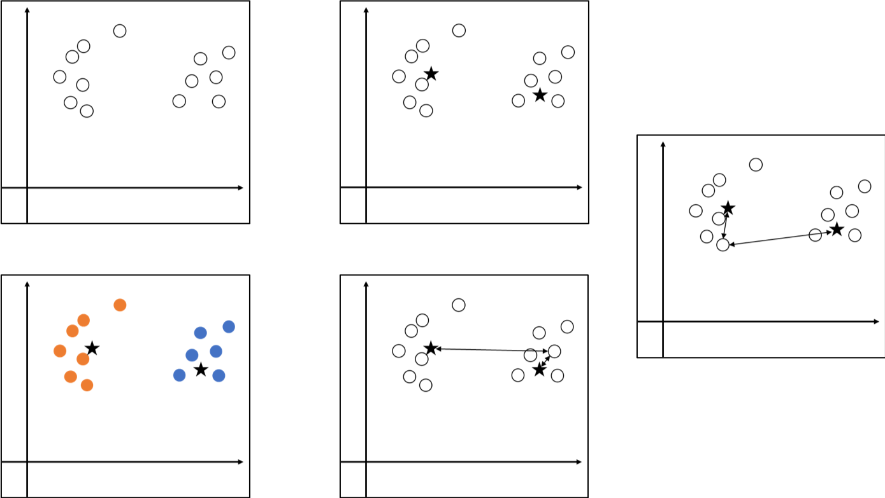
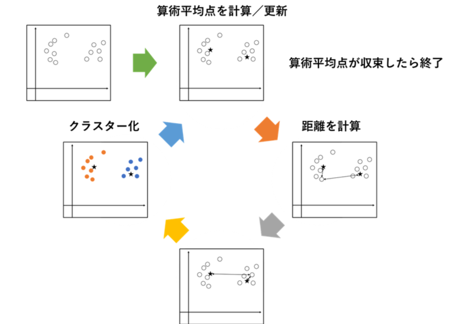
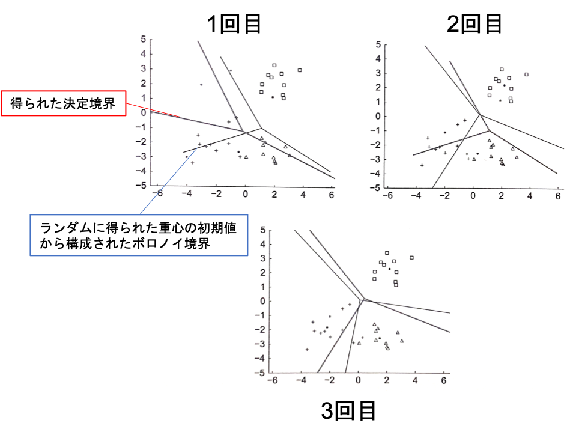
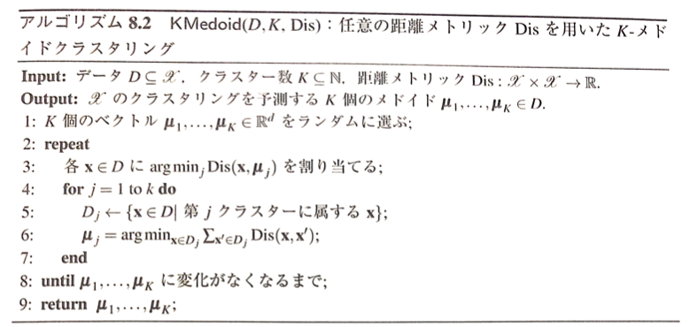
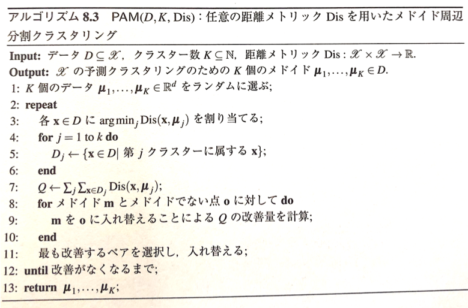
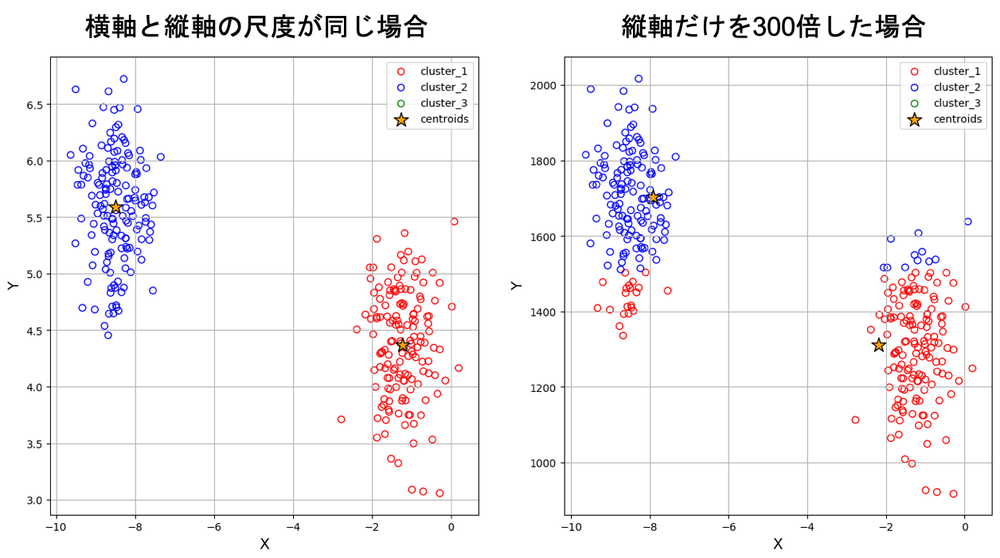
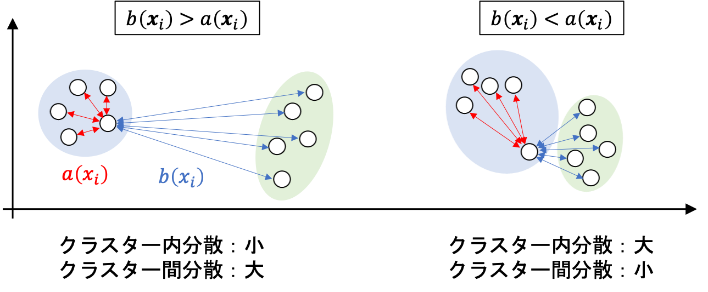
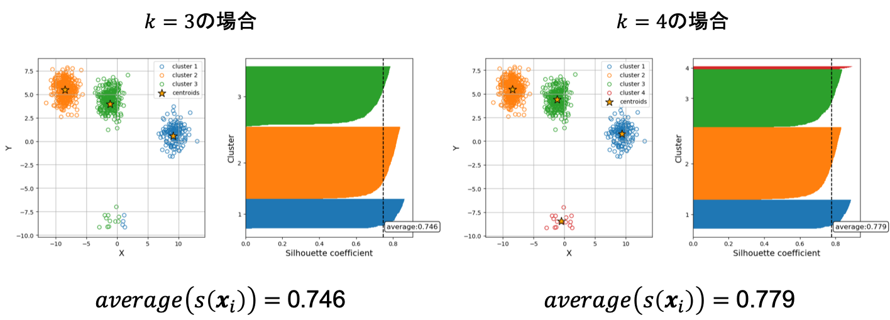

04 距離ベースクラスタリング
=======================

`k-means`：全クラスター内散乱を最小にする分割を探索する問題

> 一番近い基準点が同じデータを同じクラスターとみなす




### k-meansのアルゴリズム

**散乱行列**

* $`\bf{\mu}`$：$`\bf{X}`$ の各行ｎ平均からなる行ベクトル

```math
\bf{S} = (\bf{X}-\bf{1\mu})^T(\bf{X}-\bf{1\mu}) = \sum_{i=1}^n(\bf{X}_i-\bf{\mu})^T(\bf{X}_i-\bf{\mu})
```

$`\bf{X}`$ の散乱は、以下の式で表わされる

```math
Scat(\bf{X})=\sum_{i=1}^n\| \bf{X}_i - \bf{\mu} \|^2
```

> 散乱行列のトレースに等しい(トレース：正方行列の対角成分の和)

**k-means**

* $`D`$ が $`K`$ 個の排反な部分集合 $`D_1 \uplus \cdots \uplus D_K = D`$ に分解されているとする

* 各 $`D_j`$ の平均：$`\bf{\mu_j}`$

* $`\bf{S}`$、$`\bf{X}_j`$：それぞれ $`D`$、$`D_j`$ の散乱行列

これらの条件で、以下の散乱行列を満たす

* $`B`$(`クラスター間散乱行列`)：$`D`$ の各点を対応する平均 $`\bf{\mu}_j`$ で置き換えたものに対する散乱行列

  > クラスターの重心の広がり具合を表す

* $`\bf{S}_j`$(`クラスター内散乱行列`)：第 $`j`$ クラスターのコンパクト性を表す

```math
\bf{S} = \sum_{j=1}^K \bf{S}_j + \bf{B}
```

また、これらの行列のトレースも、以下の通りに分解される

```math
Scat(D) = \sum_{j=1}^K Scat(D_j) + \sum_{j=1}^K \vert D_j \vert \| \bf{\mu}_j - \bf{\mu} \|^2
```

ゆえに、クラスターに対する全散乱の最小化は、重心の(重み付き)散乱の最大化となる


### データ分割による散らばりの削減

5点：$`(0,3)`$、$`(3,3)`$、$`(3,0)`$、$`(-2,-4)`$、$`(-4,-2)`$

> データの中心：$`(0,0)`$

散乱行列は、以下の通りに表わされる

```math
\bf{S} = \left[
    \begin{array}{rrr}
      0 & 3 & 3 & -2 & -4\\
      3 & 3 & 0 & -4 & -2
    \end{array}
  \right]
  \left[
      \begin{array}{rrr}
         0 &  3 \\
         3 &  3 \\
         3 &  0 \\
        -2 & -4 \\
        -4 & -2
      \end{array}
    \right]
    \left[
        \begin{array}{rrr}
          38 & 25 \\
          25 & 38
        \end{array}
      \right]
```

また、トレースは以下の通りになる

```math
Scat(D)=76
```
**はじめの2点を1つのクラスター、残りの3点をもう1つのクラスターと考える**

それぞれの平均は、以下の通りに表わされる

```math
\bf{\mu}_1 = \left[
        \begin{array}{rrr}
          1 & 5 & 3
        \end{array}
      \right]
```

```math
\bf{\mu}_2 = \left[
        \begin{array}{rrr}
          -1 & -2
        \end{array}
      \right]
```

クラスター内散乱行列は以下の通りで表わされる

```math
\bf{S}_1 = \left[
            \begin{array}{rrr}
              0-1.5 & 3-1.5 \\
              3-3   & 3-3
            \end{array}
          \right]
          \left[
            \begin{array}{rrr}
              0-1.5 & 3-3 \\
              3-1.5 & 3-3
            \end{array}
          \right]=
          \left[
            \begin{array}{rrr}
              4.5 & 0 \\
              0   & 0
            \end{array}
          \right]
```

```math
\bf{S}_2 = \left[
            \begin{array}{rrr}
              3-(-1) & -2-(-1) & -4-(-1) \\
              0-(-2) & -4-(-2) & -2-(-2)
            \end{array}
          \right]
          \left[
            \begin{array}{rrr}
               3-(-1) & 0-(-2) \\
              -2-(-1) & -4-(-2) \\
              -4-(-1) & -2-(-2)
            \end{array}
          \right]=
          \left[
            \begin{array}{rrr}
              26 & 10 \\
              10 & 8
            \end{array}
          \right]
```

また、トレースは以下の通りになる

```math
Scat(D_1)=4.5
```

```math
Scat(D_2)=34
```

これらのクラスター間散乱行列 $`B`$ は、以下の通りで表わされる

```math
\bf{B} = \left[
    \begin{array}{rrr}
      1.5 & 1.5 & -1 & -1 & -1 \\
        3 &   3 & -2 & -2 & -2
    \end{array}
  \right]
  \left[
    \begin{array}{rrr}
      1.5 &  3 \\
      1.5 &  3 \\
       -1 & -2 \\
       -1 & -2 \\
       -1 & -2
    \end{array}
  \right]
  \left[
    \begin{array}{rrr}
      7.5 & 15 \\
       15 & 30
    \end{array}
  \right]
```

故に、トレースは $`37.5`$ となる

**はじめの3点を1つのクラスター、残り2点をもう1つのクラスターと考える**

それぞれの平均は、以下の通りに表わされる

```math
\bf{\mu}_1' = \left[
        \begin{array}{rrr}
          2 & 2
        \end{array}
      \right]
```

```math
\bf{\mu}_2' = \left[
        \begin{array}{rrr}
          -3 & -3
        \end{array}
      \right]
```

クラスター内散乱行列は、以下の式で表わされる

```math
\bf{S}_1' = \left[
            \begin{array}{rrr}
              0-2 & 3-2 & 3-2 \\
              3-2 & 3-2 & 0-2
            \end{array}
          \right]
          \left[
            \begin{array}{rrr}
              0-2 & 3-2 \\
              3-2 & 3-2 \\
              3-2 & 0-2
            \end{array}
          \right]=
          \left[
            \begin{array}{rrr}
               6 & -3 \\
              -3 &  6
            \end{array}
          \right]
```

```math
\bf{S}_2' = \left[
            \begin{array}{rrr}
              -2-(-3) & -4-(-3) \\
              -4-(-3) & -2-(-3)
            \end{array}
          \right]
          \left[
            \begin{array}{rrr}
              -2-(-3) & -4-(-3) \\
              -4-(-3) & -2-(-3)
            \end{array}
          \right]=
          \left[
            \begin{array}{rrr}
               2 & -2 \\
              -2 &  2
            \end{array}
          \right]
```

また、トレースは以下の式で表わされる

```math
Scat(D_1')=12
```

```math
Scat(D_2')=4
```

また、クラスター間散乱行列は、以下の式で表される

```math
\bf{B} = \left[
    \begin{array}{rrr}
      2 & 2 & 2 & -3 & -3 \\
      2 & 2 & 2 & -3 & -3
    \end{array}
  \right]
  \left[
    \begin{array}{rrr}
       2 & 2 \\
       2 & 2 \\
       2 & 2 \\
      -3 & -3 \\
      -3 & -3
    \end{array}
  \right]
  \left[
    \begin{array}{rrr}
      30 & 30 \\
      30 & 30
    \end{array}
  \right]
```

故に、トレースは $`60`$ となる

2つのクラスタリング結果を比べると、2つ目の方が際立ったクラスタリングが行われている

> 重心が離れているため


## 1.K-平均アルゴリズム

* 距離：ユークリッド距離

* 見本点：算術平均

* 決定ルール：ユークリッド空間で一番近いセントロイドが同じデータを同じクラスターにする

**$`KMeans(D,K)`$：ユークリッド距離 $`Dis_2`$ を用いたK-平均クラスタリング**

* ヒューリスティックなアルゴリズム

* 最近隣重心決定ルールを用いた分割、その分割から重心の再計算を行う




また、このアルゴリズムでは一度の反復計算において、クラスター内散乱が増加することはない

> `停留点`に到達可能(これ以上改善の余地がない点)

ただし、重心の初期値によって最適解に到達しないこともある

> アルゴリズムを何度か繰り返し、クラスター内散乱が最小になる点を選択すると良い

 


## 2.メドイド周辺のクラスタリング

**$`KMedoid(D,K,Dis)`$：任意の距離メトリック $`Dis`$ を用いたK-メドイドクラスタリング**

見本点がデータ点であるように制限を加えたアルゴリズム

ただし、大規模データには向いていない

> クラスターのメドイドを計算する場合には、全てのデータ点の組み合わせについて調べる必要があるため



**$`PAM(D,K,Dis)`$：任意の距離メトリック $`Dis`$ を用いたメドイド周辺分割クラスタリング**

メドイドを他のデータ点と入れ替えることで、局所的にクラスタリングを改良する

クラスタリング $`Q`$ の良さは、データとそれに最も近いメドイドとの距離を総和することで評価できる




## 3.シルエット

各特徴量の尺度を統一しないと，直観に反した結果を生むことがある

> 特徴量は標準化して尺度を統一しておく



`シルエット`：クラスターによってグループ化された各インスタンスに対して、$`s(\bf{x})`$ を降べきに並び替えてプロットしたもの

* $`a(\bf{x}_i)`$：データ $`x_i`$ とそれが属するクラスター $`D_j`$ 内のデータ点との距離の平均

* $`b(\bf{x}_i)`$：データ $`x_i`$ とそれが属するクラスターに隣接するクラスター内の点との距離の平均

`シルエット係数`($`s(\bf{x}_i)`$)：クラスターがどれだけ凝集・乖離しているかを表す

```math
s(\bf{x}_i) = \frac{b(\bf{x}_i) - a(\bf{x}_i)}{\max(a(\bf{x}_i),b(\bf{x}_i))}
```



シルエット係数の平均値が大きいほど適切にクラスタリングできていると判断できる



> $`k=4`$ の方がよく分離できている


## まとめ

**k-means法の課題**

* 特徴量の尺度に影響される：クラスタリング前に特徴量の尺度を統一する

* 見本点の初期値をどこに置くか？：見本点の初期値によって結果が異なる

* クラスター数はどう決めるか？：クラスター数は自明ではない

  > 見た目で判断すると恣意性の高い結果になる

* クラスター数の妥当性はどう判断するか？：ユーザーが決定したクラスター数を正当化する根拠が必要

* クラスターをどう解釈するか？：機械的に抽出したクラスターには何の意味／特徴があるか


| 版   | 年/月/日   |
| ---- | ---------- |
| 初版 | 2019/07/20 |
