05 階層的クラスタリング
====================

`階層的クラスタリング`：データ点を近い順にまとめていく

* 与えられたデータのみを分割

* 適当な数のクラスターごとに傾向を分析出来る

> 記述クラスタリング

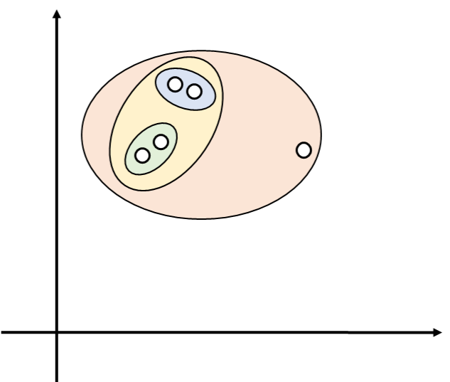

`非階層的クラスタリング`：

* インスタンス空間全体を分割

* 未知データにラベルを付与出来る

> 予測クラスタリング


## 1.デンドログラムの定義

**データセット $`D`$ を葉とする二値の木**

* 木の内部ノード：そこを根とする部分木の葉からなる部分集合を表す

* ノードのレベル：そのノードから生えた枝によって構成される2つのクラスター間の距離

  * 葉；レベル0

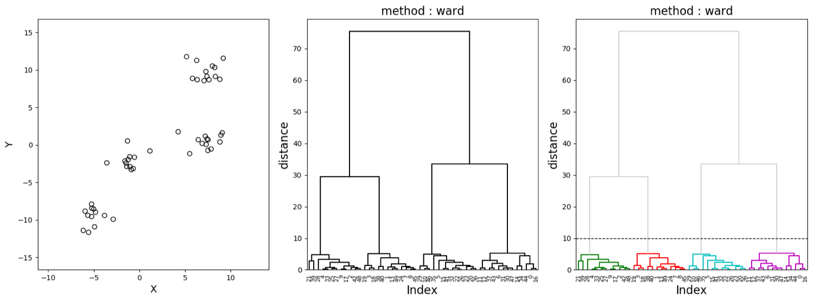


## 2.連結関数

**2点間の距離を2クラスター間の距離（非類似度）に変換する関数**


### 定義

距離メトリック $`Dis:X \times X \rightarrow \mathbb{R}`$ が与えられた時、

インスタンス空間の任意の部分集合間の距離を測る $`L:2^x \times 2^x \rightarrow \mathbb{R}`$ の関数


## 3.さまざまな連結関数

* `単連結`：2つのクラスター間の距離を、各クラスターの要素間の距離の中で最小のものとして定義

* `完全連結`：2つのクラスター間の距離を、各クラスターの要素間の距離の中で最大のものとして定義

* `平均連結`：2つのクラスター間の距離を、各クラスターの要素間の距離平均として定義

* `重心連結`：2つのクラスター間の距離を、各クラスターの要素の平均間の距離として定義

**$`HAC(D,K)`$：階層的凝集クラスタリング**

デンドログラムを構成する一般的なアルゴリズム

* 各反復において互いの距離が最も近いクラスターを統合することにより、データの新しい分割を構築する

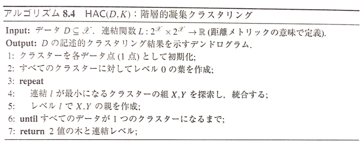


### 単連結

```math
L_{single}(C_m,C_n)= \min_{\bf{x}_i \in C_m, \bf{x}_j \in C_n} D(\bf{x}_i, \bf{x}_j)
```

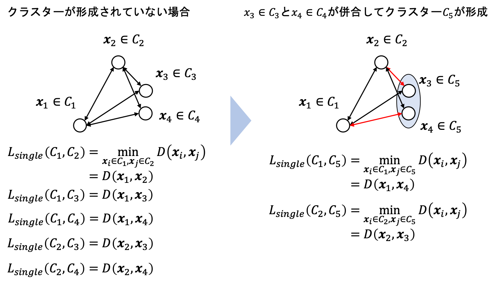

併合後のクラスター間距離：併合前の近い方のクラスターまでの距離

**特徴**

* 併合してできた新しいクラスターは以後併合の対象として選ばれる可能性が加速度的に増加する（空間濃縮／空間縮小）

* 実データではあまりいい結果が得られない

* 外れ値に弱い

* データが一方向に鎖状に分布している場合に有効

* どの距離尺度も用いることが出来る

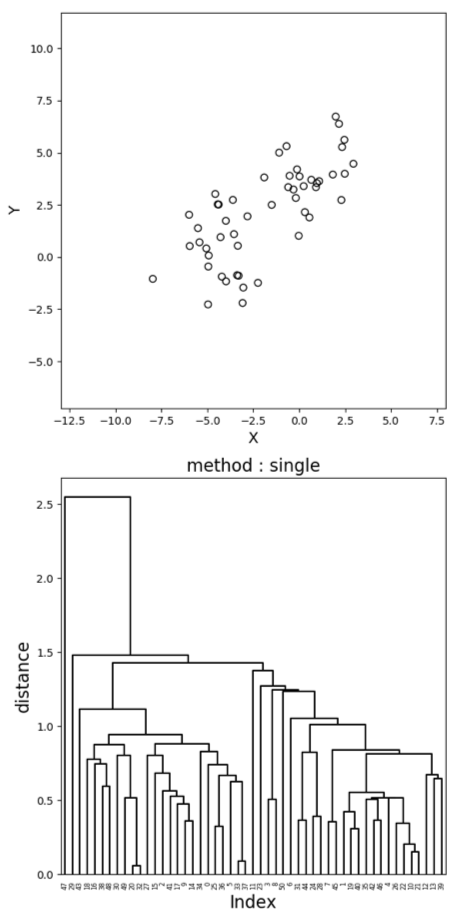

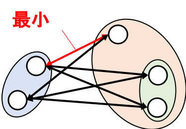


### 完全連結

```math
L_{complete}(C_m,C_n)=\max_{\bf{x}_i \in C_m, \bf{x}_j \in C_n} D(\bf{x}_i, \bf{x}_j)
```

併合後のクラスター間距離＝併合前の遠い方のクラスターまでの距離

**特徴**

* 併合してできた新しいクラスターは以後併合の対象として選ばれる可能性が加速度的に減少する（空間拡散／空間拡大）

* クラスターの大きさが揃いやすい

* 外れ値に弱い

* 超球状のクラスターが生成しやすい

* データが明確に分離している時はよい結果が期待出来る

* どの距離尺度も用いる事が出来る

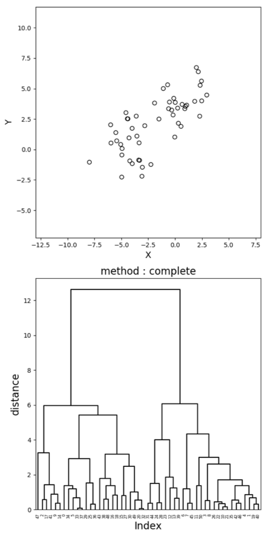

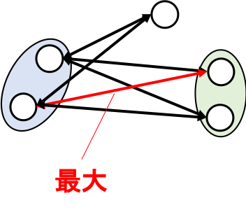


### 平均連結

```math
L_{average}(C_m, C_n) = \frac{\sum_{\bf{x}_i \in C_m, \bf{x}_j \in C_n}D(\bf{x}_i, \bf{x}_j)}{\vert C_m \vert \cdot \vert C_n \vert}
```

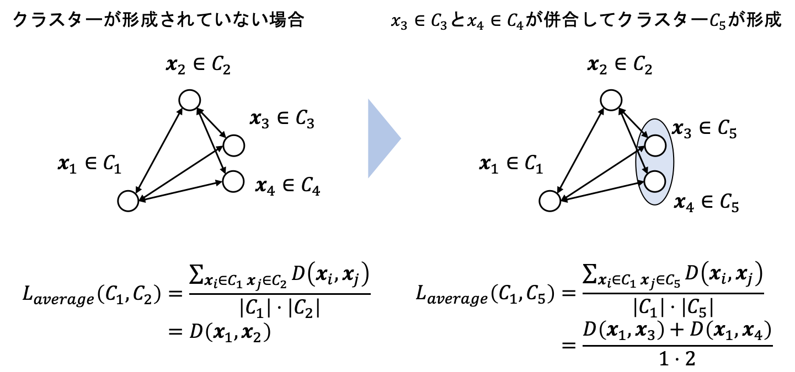

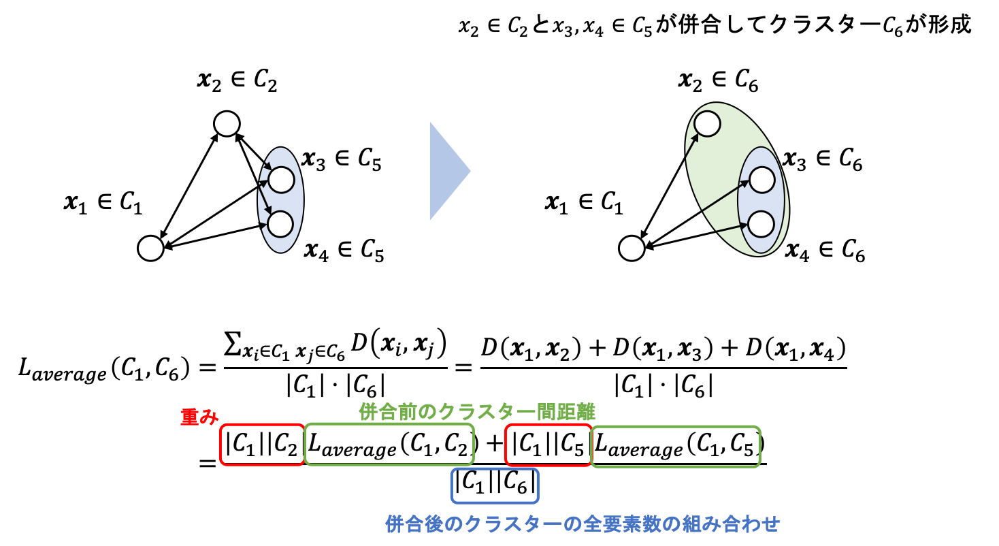

併合後のクラスター間距離＝併合前の各クラスターまでの距離の荷重平均

**特徴**

* 単連結と完全連結の中間的なクラスターを生成する

* 外れ値に対して頑強

* 空間拡散を起こさない（空間保存）

* 更新式が単純（計算負荷が小さい）

* 現在ではあまり使われていない

* どの距離尺度も用いることが出来る

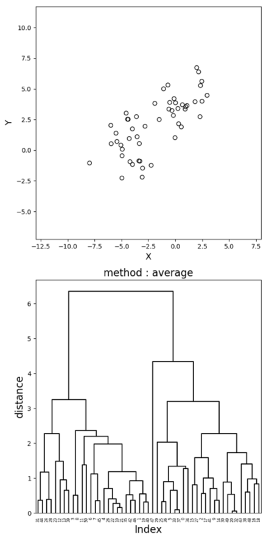

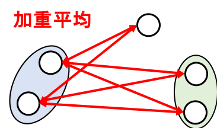


### 重心連結

```math
L_{centroid}(C_m, C_n) = D_2 \Bigr( \frac{\sum_{\bf{x}_i \in C_m} \bf{x}_i}{\vert C_m \vert}, \frac{\sum_{\bf{x}_j \in C_n} \bf{x}_j}{\vert C_n \vert} \Bigl)^2
```

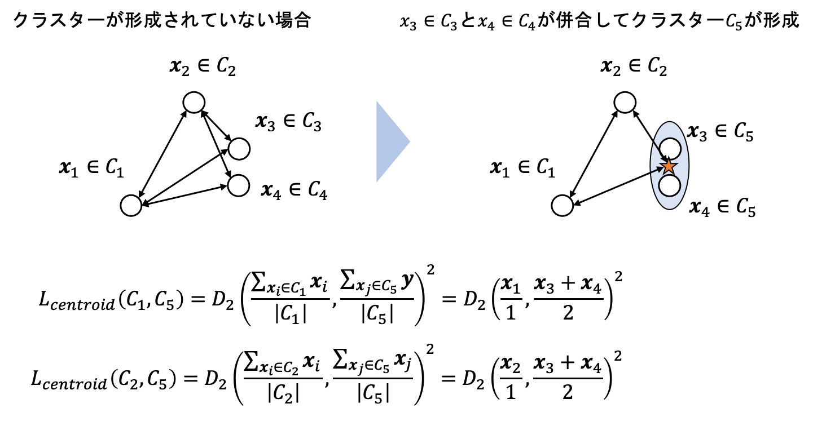

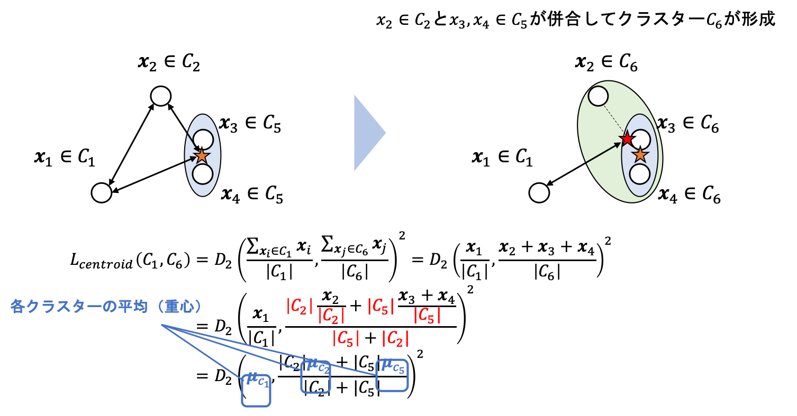

併合後のクラスター間距離＝併合後の各クラスター平均間の荷重ユークリッド平方距離


**特徴**

* データ数を重みとして用いる

* 空間保存の性質

* 用いる距離尺度はユークリッド平方距離

* 各クラスターのサンプル数が揃っている時に有効

* 重心間の重みを等しくしたものは，各クラスターの重心の中点間の距離となるため，メディアン連結と呼ばれる

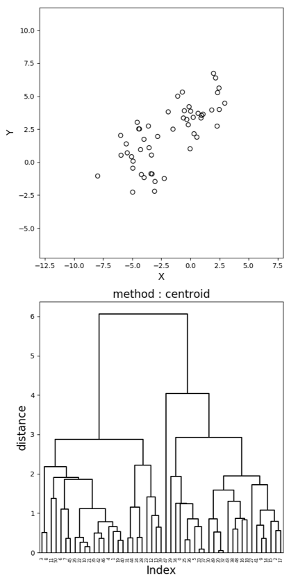

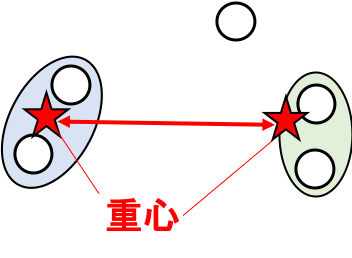


| 版   | 年/月/日   |
| ---- | ---------- |
| 初版 | 2019/07/20 |
