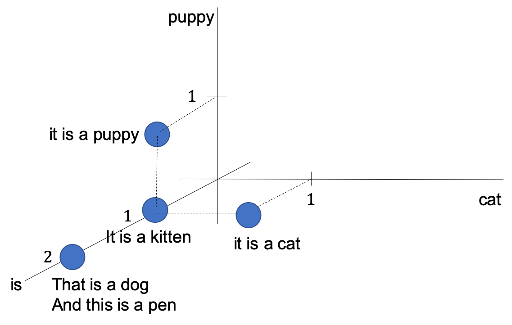
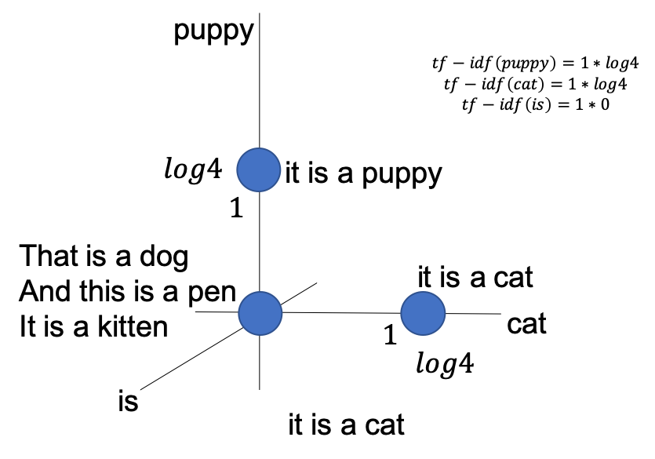

01 TF-IDF：Bag-of-Wordsに対するシンプルな変換方法
=============================================

* `TF-IDF`：Bag-of-Wordsに対するシンプルな変換方法

  * `TF`と`IDF`の積

  * `TF`：出現頻度

    * 各文書における各単語の出現回数であるBag-of-Wordsを正規化して頻度に変えたもの

  * `IDF`：逆文書頻度

    * ある単語がどれほど情報をもたらすかを表す量

    * 多くの文書に出現する単語の影響が弱くなり、ごく一部の文書に出現する単語の影響が強くなる

### TF-IDFの定義

* `N`：データセットにおける文書数

* この逆文書頻度の定義では、ある単語が少数の文書に現れた場合、逆文書頻度は1よりずっと大きくなる

### 逆文書頻度

* 逆文書頻度はそのまま使用する場合もあれば、対数変換して利用する場合もある

* この定義では、全ての文書に出現する単語の影響は0となる

* ごく一部の文書に出現する単語の影響は対数変換前のTF-IDFよりも強くなる

* 例)dogとcatについての4つの文

* これら4つの文に対して、対数変換した逆文書頻度による`TF-IDF`で特徴量を作る

  * この場合、以下の図のように特徴量空間に配置される

* 単語"is"は、このデータセットの全ての文書に現れるため、排除される

* `TF-IDF`によるスケーリングによって、"puppy"と"cat"の値をBag-of-Wordsの場合よりも大きくしている

* `TF-IDF`は出現回数がレアな単語を強調し、どの文書にも登場するような一般的な単語の影響を抑える

> TF-IDFは、出現頻度がレアな単語の影響を大きく、出現回数の多い一般的な単語の影響を小さくする

| 版   | 年/月/日   |
| ---- | ---------- |
| 初版 | 2019/04/30 |
