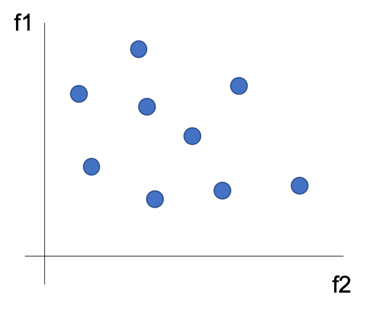

01 直感的な解釈
=============

* `次元削除`：重要な情報を残し、「価値のない情報」を取り除く

  * 「価値のない情報」を定義する方法は幾つもあり、`PCA`では線形独立に着目する

  * `列空間`の **本質的な次元** が特徴量の総数が比べて小さい場合、ほとんどの特徴量は少数の主要な特徴量の線型結合で表される

  > `列空間`：全ての特徴ベクトルが張るベクトル空間

  * `PCA`では、データをずっと低次元な線形部分空間に射影する

## 特徴空間におけるデータ点

* 各データ点：ドット

* データ点全体：斑点模様

### フルランクのデータ

* データ点が`f1`特徴量と`f2`特徴量の作る平面に散らばり空間を埋めている

* 列次元の空間は、線形従属関係の存在しないフルランクになっている

> しかし、一部の特徴量が他の特徴量の線型結合として表せる場合、このデータの斑点模様がなす全体の形状はより「細く」見える

### 低次元で表現可能なデータ

* `f1`特徴量は`f2`特徴量の定数倍となっている

* データ斑点模様が成す全体の形状が細くなっている

> この場合、2次元の特徴空間であっても、その本質的な次元は1となる

### 近似的に低次元で表現可能なデータ

* 現実のデータの場合は、データの全体像は以下の図のようになる

> このデータの全体像は細く見える

* モデルに使う特徴量を減らしたい場合、`f1`特徴量と`f2`特徴量を、2つの特徴量の作る対角線上にある「`f1.5`特徴量」として置き換える

  * 元々のデータセットにある`f1`と`f2`という特徴量の代わりに、1つの特徴量(`f1.5`の方向に剃った位置)で表す

## まとめ

* 重要なことは、「**元の冗長な特徴量を、特徴空間に含まれる情報を要約した特徴量に置き換える**」こと

  > 元々の特徴量が2つしかない場合は、次元削除後の特徴量がどのようなものかはわかる
  >
  > しかし、特徴量空間の次元が数百千次元もある場合はずっと大変

  * 探し求めている新しい特徴量を数学的に表す必要がある(最適化の技術)

### 「情報の適切な要約」

* 数学的に定義する方法の1つとして、要約・変換されたデータが元のデータが持つ情報をなるべく減らさないようにする方法

* データの斑点模様を、出来るだけ正しい方向への広がり(情報)を保ったまま、平たいパンケーキのように潰す

  * つまり、その情報の「量」を測る基準が必要

### 最適化における最大距離の難しさ

* 情報の量は距離と関係している

  > しかし、まばらに散っているデータ全体に対して定義される距離は漠然とした概念

  * 直感的に理解しやすいデータ点2点間の距離から求められる、ある種の要約統計量(`最大距離`、`平均`、`分散`など)を考える必要がある

  * データ点の集まりにおける任意の2点に対する最大距離を測ることは可能だが、最大距離は数学の最適化において扱いが難しい

### 代替案

* 任意の2点間の距離を全て組み合わせて、その2乗平均をとる

* これは、中心と各点との間の平均的な距離と等価であり、「分散」に相当する

  > この分散の最適化は、最大距離を用いる方法に比べたら簡単

* 数学的には、「情報の適切な要約」という問題が、新しい特徴空間におけるデータ点間の分散最大化へと変換される

| 版   | 年/月/日   |
| ---- | ---------- |
| 初版 | 2019/04/24 |
