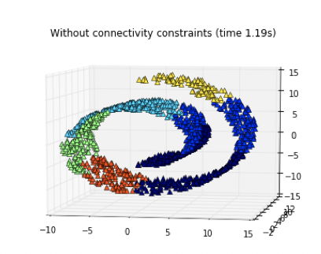

00 はじめに
=========

* `PCA`が有用な場合：線形部分空間において、平らなパンケーキのようにデータが広がっている場合

  > データが複雑な形をしている場合は、どうすれば良いか？

## 多様体の目的

* `多様体`：非線形空間

  * これまでに扱った平面(線形部分空間)を含めて、一般化

  * これは、伸ばしたり、丸めたりすることのできる曲面のようなもの

* 非線形部分空間が平らな紙であるとすると、くるくると丸めた紙は非線形多様体の簡単な例となる

  * この多様体は、`スイスロール`と呼ばれている

  * 丸めることで、2次元平面から3次元空間内に存在するようになる

  > しかし、本質的には2次元のまま

  

* もしスイスロールを元に戻すことができれば、元の2次元平面を復元できる

  * これは、`非線形次元削減`のゴール

  * 多様体が存在している次元よりも小さな次元の多様体を仮定し、丸まった多様体を元に戻そうとする

## 非線形次元削減のアイデア

* 大きな多様体が複雑な形に見えても、各データ点の近傍はパッチで十分よく近似できること

  * つまり、局所的な構造を表すパッチの集まりで、大域的な全体の構造を表現する

  > `パッチ`：ちいさな「あて布」を指す

* `非線形次元削減`は、`非線形埋め込み`や`多様体学習`などと呼ばれる

  * 高次元のデータを低次元に圧縮する場合に有効で、2次元や3次元のプロットで可視化したい場合によく使われる

* しかし、特徴量エンジニアリングのゴールは、特徴量の次元をできるだけ小さくすることではない

  * タスクのために良い特徴量を作ること

  * ここでは、次元削減にはこだわらず、**局所的な構造の学習によってデータの空間的な特徴を表現できている特徴量が良いと考える**

## 最終的なゴール

* クラスタリングにより、データの局所構造を学習して特徴量を生成する方法について考える

  > 通常、クラスタリングはその学習を実現するためのテクニックとしては紹介されていない
  >
  > しかし、近くの点は同じクラスタに所属するので、このような考え方もできる

* クラスタリングの結果を使うと、データ点を各クラスタ成分(各クラスタへの所属の強さ)を要素としたベクトルで表現できる

  * クラスタの個数が元の特徴量の数より小さな場合には、データを低い次元に圧縮したことになる

* クラスタリングは特徴量の数を増やしてしまうこともあるが、特徴量エンジニアリングであれば問題ない

| 版   | 年/月/日   |
| ---- | ---------- |
| 初版 | 2019/05/26 |
