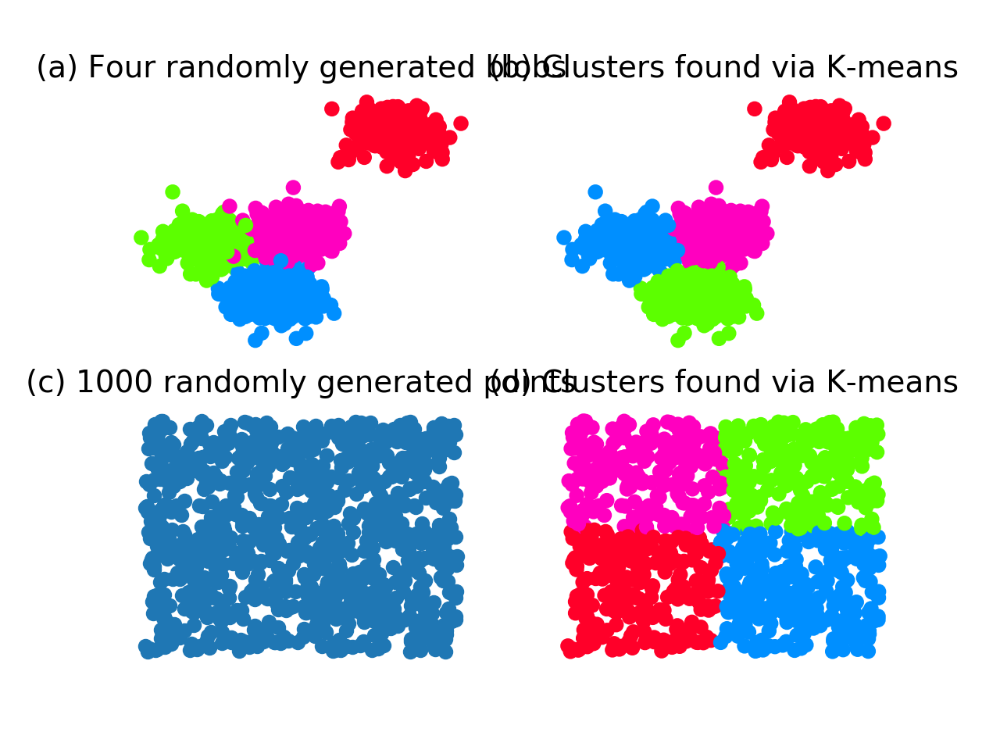

01 k-means
===========

* `k-means`：クラスタリングのアルゴリズムの1つ

  * `クラスタリング`：データの部分的な分布情報を使ってデータをグループに分ける

    * 正解となるラベルを必要としないので、`教師なし学習`と呼ばれる

  * ラベルを推定するのはアルゴリズムの仕事で、データの分布だけから決定する

* `メトリック`：クラスタリングのアルゴリズムで必要となるもの

  * データ点の近さをどう計算するかを決める

  * 例)ユークリッド距離(2点間の直線距離)

  > ベクトル $`\mathbf{x}`$ とベクトル $`\mathbf{y}`$ の間の`ユークリッド距離`
  >
  > $`\mathbf{x} - \mathbf{y}`$ の $`l^2`$ ノルム
  >
  > 式では通常、 $`\|\mathbf{x} - \mathbf{y} \|_2`$ 、もしくは $`\|\mathbf{x} - \mathbf{y} \|`$ と書く


## ハードクラスタリング

* `ハードクラスタリング`：各データ点が、ただ1つのクラスタに割り付けられること

  * `k-means`は、`ハードクラスタリング`の一種

* `k-means`の計算過程では、あるクラスタの中心と、そのクラスタに所属する各データ点のユークリッド距離の総和を求める

  * 他のすべてのクラスタについても同様に総和を求め、さらにそれらの総和を合計する

  * その合計が最も小さくなるように、各データ点が所属するクラスタと、各クラスタの中心を求める

  * 最小化すべき目的関数は、以下のように記述される

$`\underset{C_1, \cdots, C_k,\mathbf{\mu_1}, \cdots, \mathbf{\mu_k}}{\min} \sum_{i=1}^k \sum_{\mathbf{x} \in C_i} \| \mathbf{x} - \mathbf{\mu_i}\|_2`$

* 各クラスタ $`C_i`$ ：データ点の部分集合

* クラスタ $`i`$ の中心 $`\mathbf{\mu_i}`$ ：そのクラスタに所属する全てのデータ点の平均点に等しい

  * $`n_i`$ ：クラスタ $`i`$ に所属するデータ点の数

$`\mathbf{\mu_i} = \sum_{\mathbf{x} \in C_i} \frac{\mathbf{x}}{n_i}`$


## 実際のデータ

* ここで、2つの異なるデータセットに対して`k-means`を適用した結果で、どのように空間を分割するかを示す

  * (a)：4つの二変量正規分布からランダムに生成

  * (c)：2次元の一様分布からランダムに生成

  > これらの正規分布は、分散共分散行列は同じだが、平均が異なる

```python
import numpy as np
from sklearn.cluster import KMeans
from sklearn.datasets import make_blobs
import matplotlib.pyplot as plt

n_data = 1000
seed = 1
n_centers = 4

# 4つの二変量正規分布に従うデータを生成し、k-meansを実行する
blobs, blob_labels = make_blobs(n_samples=n_data, n_features=2, centers=n_centers, random_state=seed)
clusters_blob = KMeans(n_clusters=n_centers, random_state=seed).fit_predict(blobs)

#　2次元の一様分布に従うデータを生成し、k-meansを実行する
uniform = np.random.rand(n_data, 2)
clusters_uniform = KMeans(n_clusters=n_centers, random_state=seed).fit_predict(uniform)

# 結果を可視化するためのMatplotlibのおまじない
figure = plt.figure()
plt.subplot(221)
plt.scatter(blobs[:, 0], blobs[:, 1], c=blob_labels, cmap='gist_rainbow')
plt.title('(a) Four randomly generated blobs', fontsize=14)
plt.axis('off')

plt.subplot(222)
plt.scatter(blobs[:, 0], blobs[:, 1], c=clusters_blob, cmap='gist_rainbow')
plt.title('(b) Clusters found via K-means', fontsize=14)
plt.axis('off')

plt.subplot(223)
plt.scatter(uniform[:, 0], uniform[:, 1])
plt.title('(c) 1000 randomly generated points', fontsize=14)
plt.axis('off')

plt.subplot(224)
plt.scatter(uniform[:, 0], uniform[:, 1], c=clusters_uniform, cmap='gist_rainbow')
plt.title('(d) Clusters found via K-means', fontsize=14)
plt.axis('off')

plt.show()
```




| 版   | 年/月/日   |
| ---- | ---------- |
| 初版 | 2019/05/26 |
