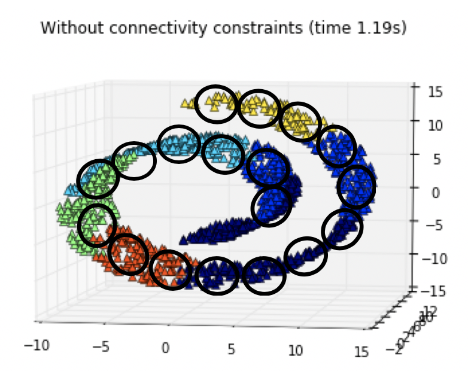
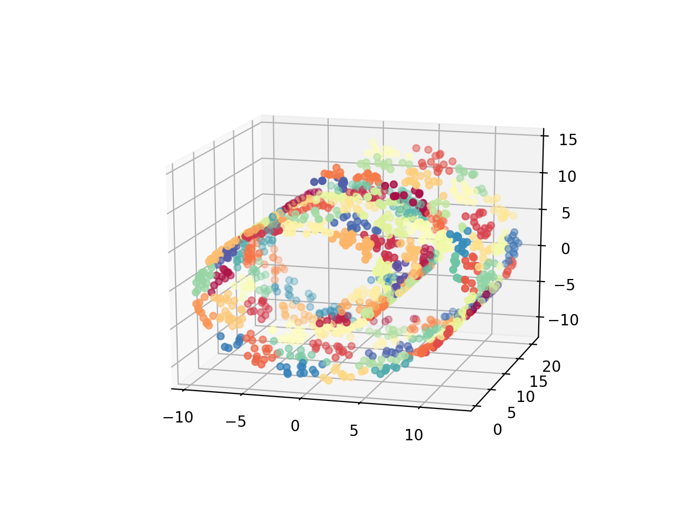
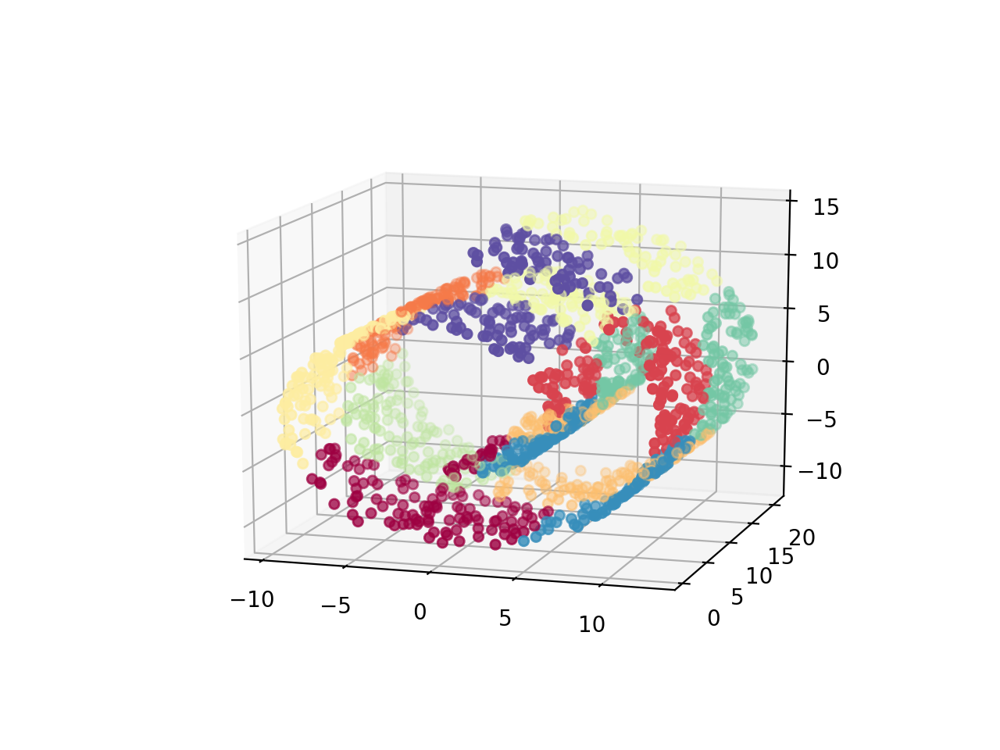

02 パッチで覆うためのクラスタリング
=============================

* 一般に`クラスタリング`は、複数の自然なクラスタを見つけるために使われる

* `クラスタ`：データが密集している領域を意味する

  * ある程度の集合がある場合には、クラスタの個数の「正解」が存在する

  * クラスタの個数 $`k`$ を決めるために、どの程度グルーピングできているかを測る指標が考案された

* しかし、データが一様に広がっている場合は、正解と言えるクラスタの個数は存在しない

  * データを $`k`$ 個の塊に小分けにして、データを $`k`$ 次元のベクトルで表現する

  > この手法を、`ベクトル量子化`と呼ぶ

  * 元のデータの代わりに $`k`$ 次元ベクトルで近似すると誤差が生じる

  * この誤差をどれくらい許容できるかによって、クラスタの個数を決めることができる


## ベクトル量子化のイメージ

* この`k-means`の使い方は、以下の図のようにパッチでデータの表現を覆うイメージ



* 以下に、scikit-learnを使って結果を可視化したもの

  * データ点は、所属するクラスタのIDにしたがって色分けされる


### 100個のクラスタでk-meansを実行した結果

* この例では、スイスロール上にランダムに1,500個のデータ点を生成し、k-meansでそのデータを 100個のクラスタで近似

* 各クラスタはパッチのようになっており、多様体上で離れている部分はクラスタも別になっている

```python
import numpy as np
from sklearn.cluster import KMeans
from sklearn.datasets import make_blobs
import matplotlib.pyplot as plt
from mpl_toolkits.mplot3d import Axes3D
from sklearn import manifold, datasets

# スイスロール上にランダムにデータを生成する
X, color = datasets.samples_generator.make_swiss_roll(n_samples=1500)

# k-meansでそのデータを100個のクラスタで近似する
clusters_swiss_roll = KMeans(n_clusters=100, random_state=1).fit_predict(X)

# 所属するk-meansのクラスタIDごとに色分けをしてデータをプロットする
fig2 = plt.figure()
ax = fig2.add_subplot(111, projection='3d')
ax.scatter(X[:, 0], X[:, 1], X[:, 2], c=clusters_swiss_roll, cmap='Spectral')

plt.show()
```




### 10個のクラスタでk-meansを実行した結果

* 10個のクラスタで実行した場合、多様体上で離れている部分が同じクラスタになってしまっている

```python
import numpy as np
from sklearn.cluster import KMeans
from sklearn.datasets import make_blobs
import matplotlib.pyplot as plt
from mpl_toolkits.mplot3d import Axes3D
from sklearn import manifold, datasets

# スイスロール上にランダムにデータを生成する
X, color = datasets.samples_generator.make_swiss_roll(n_samples=1500)

# k-meansでそのデータを10個のクラスタで近似する
clusters_swiss_roll = KMeans(n_clusters=10, random_state=1).fit_predict(X)

# 所属するk-meansのクラスタIDごとに色分けをしてデータをプロットする
fig2 = plt.figure()
ax = fig2.add_subplot(111, projection='3d')
ax.scatter(X[:, 0], X[:, 1], X[:, 2], c=clusters_swiss_roll, cmap='Spectral')

plt.show()
```




## 球充填問題

* データが一様に分布している場合、正しい $`k`$ を選ぶのは「球充填問題」に帰着する

  > `k-means`の各クラスタは、球に相当する

* データが $`d`$ 次元の特徴空間に存在する場合、おおまかに言って $`\frac{1}{r^d}`$ 個の球でデータを覆うことができる


### 理由

* 1辺の長さが1である $`d`$ 次元の立方体(体積： $`1^d=1`$ )にデータが収まっているとする

* 小さな半径 $`r`$ の球の体積： $`(定数) \times r^d`$ なので、定数分を無視すると、$`O(\frac{1}{r^d})`$ 個の球があれば、立方体を満たす計算となる


## まとめ

* 一様分布は`k-means`にとって最悪なケース

* もしデータが一様に分布していなければ、もっと少ないクラスタでデータを表現できる

* しかし、高次元空間にデータがどのように分布しているかを知るのは、一般的に難しい

> ただし、 $`k`$ はモデリングの段階では特徴量の数になるので、大きすぎないようにする


| 版   | 年/月/日   |
| ---- | ---------- |
| 初版 | 2019/05/26 |
