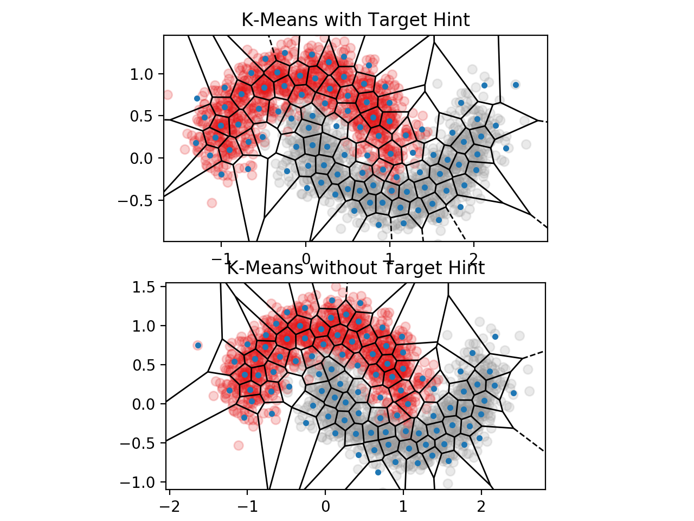
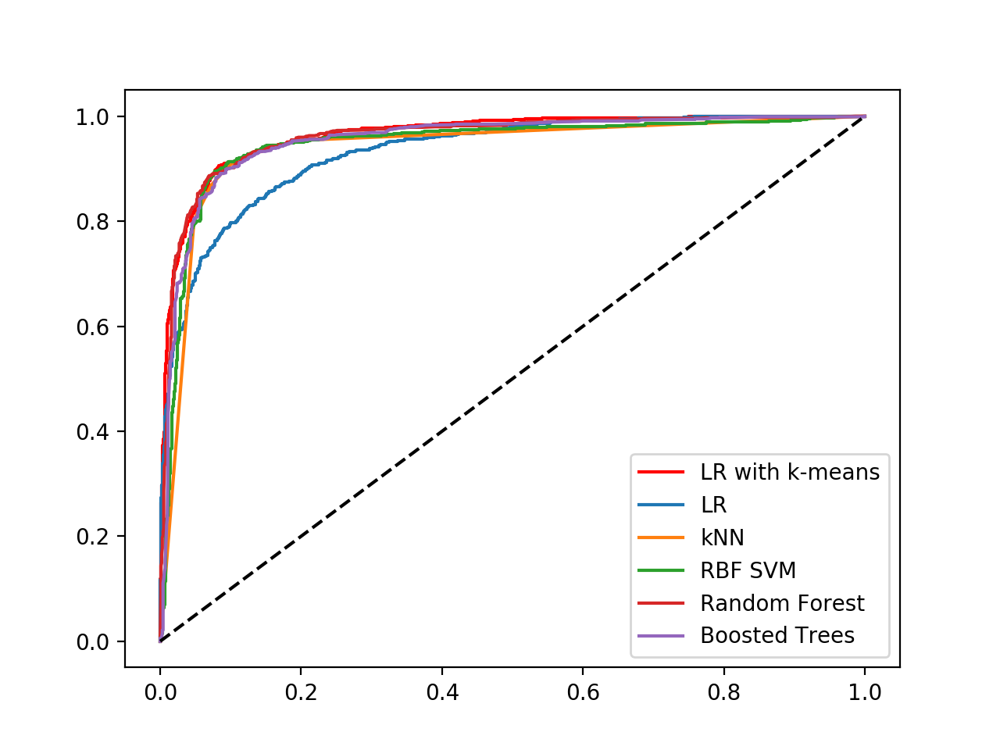

03 k-meansによるクラス分類用の特徴量作成
===================================

* `k-means`の結果、所属するクラスタのIDを用いて、データ点を表現できる

  * また、そのIDをカテゴリ変数と見なしてOne-Hotエンコーディングした、スパースな $`k`$ 次元ベクトルでも表現できる

* もしターゲット変数が利用可能ならば、その情報をクラスタリングのヒントにする方法もある

  * そのうちの1つは、ターゲット変数も入力特徴量に含めて`k-means`を実行するという単純な方法

  * これは、元の特徴空間における類似度と、ターゲット変数の値の類似度が同程度の重みで考慮される

  > `k-means`は全ての入力次元から計算されるユークリッド距離の総和を最小化するため

* クラスタリング実行時に、ターゲット変数の値をスケーリングすることで、重みのバランスを変更することもできる

  * ターゲット変数の重みを大きくすれば、クラス分類の境界をより重視したクラスタリングの結果となる

> **`k-means`による特徴量生成**
>
> クラスタリングのアルゴリズムは、データが空間でどのように広がっているか、分布しているかを解析する
>
> そのため、`k-means`を使って特徴量を生成すると、データの空間情報を圧縮したクラスタIDを作れる
>
> そして、そのクラスタIDを次のモデリングの段階で使用できる(`モデルスタッキング`)

* 以下に、`k-means`による特徴量生成を実装する

  * `fit`関数で学習データに対してクラスタリングを実行し、`transform`関数で新しいデータ点をクラスタIDに変換する

```python
import numpy as np
from sklearn.cluster import KMeans
from sklearn.preprocessing import OneHotEncoder

class KMeansFeaturizer:
    """
    数値データをk-meansのクラスタIDに変換します。

    この変換器は入力データに対してk-meansを実行し、各データポイントを最も近い
    クラスタのIDに変換します。ターゲット変数yが存在する場合、クラス分類の境界を
    より重視したクラスタリングの結果を得るために、ターゲット変数をスケーリングして
    入力データに含めてk-meansに渡します。
    """

    def __init__(self, k=100, target_scale=5.0, random_state=None):
        self.k = k
        self.target_scale = target_scale
        self.random_state = random_state
        self.cluster_encoder = OneHotEncoder(categories='auto').fit(np.array(range(k)).reshape(-1,1))

    def fit(self, X, y=None):
        """
        入力データに対しk-meansを実行し、各クラスタの中心を見つけます。
        """
        if y is None:
            # ターゲット変数がない場合、ふつうのk-meansを実行します。
            km_model = KMeans(n_clusters=self.k, n_init=20, random_state=self.random_state)
            km_model.fit(X)
            self.km_model_ = km_model
            self.cluster_centers_ = km_model.cluster_centers_
            return self

        # ターゲット変数がある場合。スケーリングして入力データに含めます。
        data_with_target = np.hstack((X, y[:,np.newaxis]*self.target_scale))

        # ターゲットを組み入れたデータで事前学習するためのk-meansモデルを構築します。
        km_model_pretrain = KMeans(n_clusters=self.k, n_init=20, random_state=self.random_state)
        km_model_pretrain.fit(data_with_target)

        # ターゲット変数の情報を除いて元の空間におけるクラスタを得るために
        # k-meansを再度実行します。事前学習で見つけたクラスタの中心を
        # 使って初期化し、クラスタの割り当てと中心の再計算を1回にします。
        km_model = KMeans(n_clusters=self.k, init=km_model_pretrain.cluster_centers_[:,:2], n_init=1, max_iter=1)
        km_model.fit(X)

        self.km_model = km_model
        self.cluster_centers_ = km_model.cluster_centers_
        return self

    def transform(self, X, y=None):
        """
        入力データポイントに最も近いクラスタのIDを返します。
        """
        clusters = self.km_model.predict(X)
        return self.cluster_encoder.transform(clusters.reshape(-1,1))

    def fit_transform(self, X, y=None):
        self.fit(X, y)
        return self.transform(X, y)
```

* 次に、ターゲット変数の情報を使った場合と、使っていない場合の違いを示すために、`make_moons`関数を使ってデータを生成

  * そのデータに対して`k-means`を実行し、クラスタの境界からボロノイ図を描く

```python
from scipy.spatial import Voronoi, voronoi_plot_2d
from sklearn.datasets import make_moons
import matplotlib.pyplot as plt

training_data, training_labels = make_moons(n_samples=2000, noise=0.2)
kmf_hint = KMeansFeaturizer(k=100, target_scale=10).fit(training_data, training_labels)
kmf_no_hint = KMeansFeaturizer(k=100, target_scale=0).fit(training_data, training_labels)

def kmeans_voronoi_plot(X, y, cluster_centers, ax):
   """
   k-meansのクラスタの境界からボロノイ図を描き、データに重ね合わせます
   """
   ax.scatter(X[:, 0], X[:, 1], c=y, cmap='Set1', alpha=0.2)

   # voronoi_plot_2d関数内で、ishold関数が利用されているが、matplotlib 2.0以降では廃止されているため設定
   def ishold():
       return True
   ax.ishold = ishold

   vor = Voronoi(cluster_centers)
   voronoi_plot_2d(vor, ax=ax, show_vertices=False, alpha=0.5)

fig = plt.figure()
ax = plt.subplot(211, aspect='equal')
kmeans_voronoi_plot(training_data, training_labels, kmf_hint.cluster_centers_, ax)
ax.set_title('K-Means with Target Hint')
ax2 = plt.subplot(212, aspect='equal')
kmeans_voronoi_plot(training_data, training_labels, kmf_no_hint.cluster_centers_, ax2)
ax2.set_title('K-Means without Target Hint')
```




### 結果

* 2つの三日月型のデータが、クラスのラベルに従って色分けされている

  * 上図：ターゲット変数の情報を使って学習した場合

  * 下図：ターゲット変数の情報を使わないで学習した場合

* 上図は下図と比べて、クラスタの境界とクラスの境界が揃っていることがわかる


### クラス分類にどれだけ適用できるか

* `k-means`で生成した特徴量が、クラス分類にどれだけ効果的か試してみる

  * `k-means`で生成したクラスタID(クラスタ特徴量)の情報を入力特徴量に追加して、ロジスティック回帰を行っている

  * 他の分類器：`RBF SVM`(動的基底関数カーネルを使用)、`kNN`(k最近傍法)、`RF`(ランダムフォレスト)、`GBT`(勾配ブースティング回帰木)

* 分類器に入力するデータは、各データ点の2次元座標

  * ロジスティック回帰では、それに加えて`k-means`で生成したクラスタ特徴量も入力する

  * ベースラインとして、2次元座標だけを使ったロジスティック回帰も試す

```python
from sklearn.linear_model import LogisticRegression
from sklearn.svm import SVC
from sklearn.neighbors import KNeighborsClassifier
from sklearn.ensemble import RandomForestClassifier, GradientBoostingClassifier
import sklearn
import scipy

seed = 1

### 学習データと同じ分布からテストデータを生成する
test_data, test_labels = make_moons(n_samples=2000, noise=0.3)

### クラスタID（クラスタ特徴量）を得るために先ほどのk-meansの結果を使う
training_cluster_features = kmf_hint.transform(training_data)
test_cluster_features = kmf_hint.transform(test_data)

### クラスタ特徴量を入力特徴量に追加する
training_with_cluster = scipy.sparse.hstack((training_data, training_cluster_features))
test_with_cluster = scipy.sparse.hstack((test_data, test_cluster_features))


### クラス分類を実行する
lr_cluster = LogisticRegression(solver='liblinear', random_state=seed).fit(training_with_cluster, training_labels)


classifier_names = ['LR',
                    'kNN',
                    'RBF SVM',
                    'Random Forest',
                    'Boosted Trees']


classifiers = [LogisticRegression(solver='liblinear', random_state=seed),
               KNeighborsClassifier(5),
               SVC(gamma=2, C=1),
               RandomForestClassifier(max_depth=5, n_estimators=10, max_features=1),
               GradientBoostingClassifier(n_estimators=10, learning_rate=1.0, max_depth=5)]

for model in classifiers:
    model.fit(training_data, training_labels)

### クラス分類の性能をROC曲線を使って評価するためのヘルパ関数
def test_roc(model, data, labels):
    if hasattr(model, 'decision_function'):
        predictions = model.decision_function(data)
    else:
        predictions = model.predict_proba(data)[:,1]
    fpr, tpr, _ = sklearn.metrics.roc_curve(labels, predictions)
    return fpr, tpr

### 結果をプロット
import matplotlib.pyplot as plt
plt.figure()
fpr_cluster, tpr_cluster = test_roc(lr_cluster, test_with_cluster, test_labels)
plt.plot(fpr_cluster, tpr_cluster, 'r-', label='LR with k-means')

for i, model in enumerate(classifiers):
    fpr, tpr = test_roc(model, test_data, test_labels)
    plt.plot(fpr, tpr, label=classifier_names[i])

plt.plot([0, 1], [0, 1], 'k--')
plt.legend()
plt.show()
```



* 上の図より、クラスタ特徴量ありのロジスティック回帰は、無しのロジスティック回帰に比べて性能が非常によいことがわかる

  * そして、クラスタ特徴量ありのロジスティック回帰が、非線形分類器と同程度の性能を発揮している

* 線形分類器は、非線形分類器よりも高速に学習できるので、多くのモデルを試すことができる


## 1.密なクラスタ特徴量

* クラスタIDやOne-Hotエンコーディングした疎なクラスタ特徴量の代わりに、密なクラスタ特徴量を使ってデータ点を表現する方法もある

* 密なクラスタ特徴量は、そのデータ点から各クラスタの中心までの距離の逆数を並べた $`k`$ 次元ベクトル

  * このベクトルは、所属しているか否かの二値のクラスタへの割り当てよりも多くの情報を持っているが、疎ではない

  > **トレードオフの関係がある**
  >
  > クラスタIDを使った特徴量は疎であるために、非常に軽量だが、複雑な形のデータを表現するために大きな $`k`$ が必要になる可能性がある
  >
  > 距離の逆数を取った特徴量は密であるため、モデリングの段階で計算が重くなるかもしれないが、 $`k`$ で事足りる可能性がある

* 疎と密の折衷案として、 $`k`$ 個のクラスタのうち、最も近い $`p`$ 個のクラスタのみ距離の逆数を保持する方法がある

  * しかし、今度は $`p`$ がチューニングすべきハイパーパラメータとなってしまう可能性がある


| 版   | 年/月/日   |
| ---- | ---------- |
| 初版 | 2019/05/26 |
