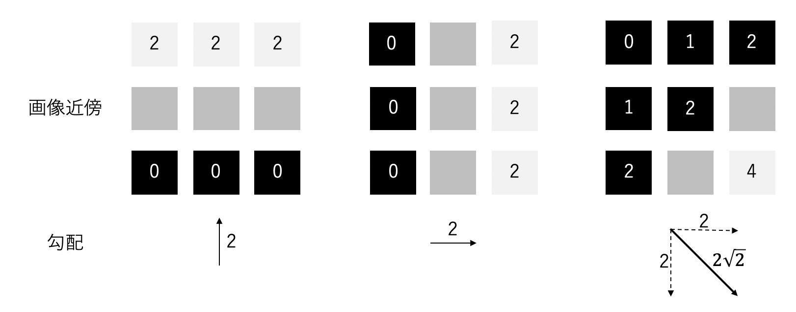
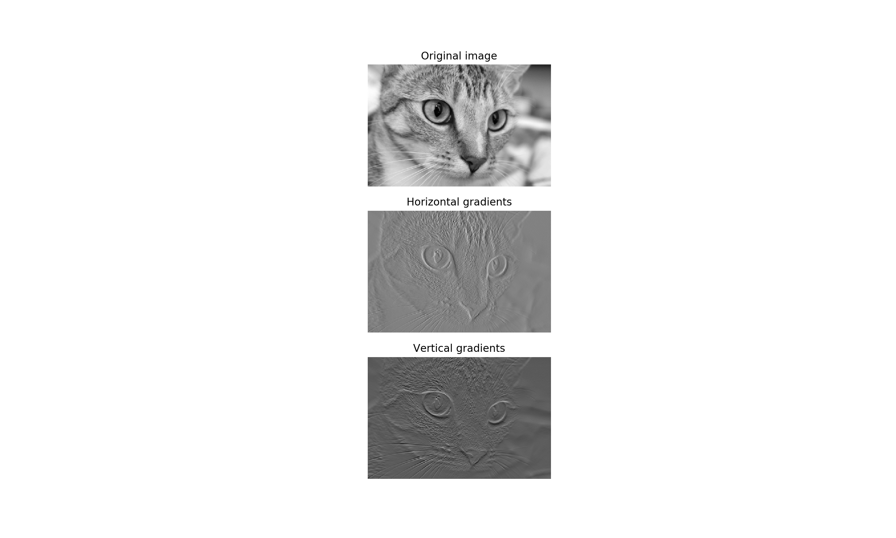
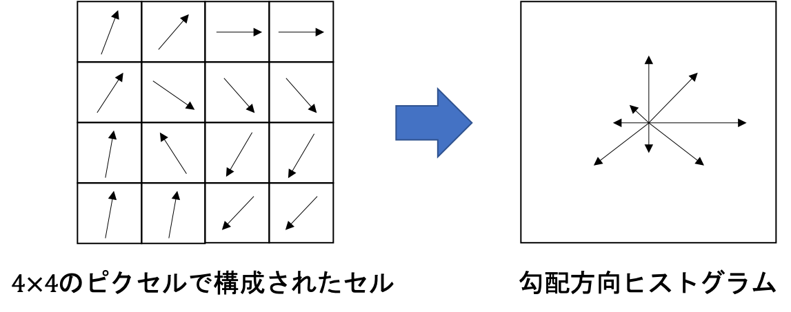

02 手動の特徴抽出法：SIFTおよびHOG
==============================

* `SIFT`：画像を小部分に分割し、その統計量を用いることで、画像をよりうまく表現できる

* 画像に含まれる物体から画像にタグをつけ、されにその物体がその画像のどこに位置するかを示すことができる

* 物体の位置を検出する際は、以下の項目を行っている

  * 画像内のスケールの階層の把握

  * 物体を示す特徴点の検出

  * その特徴点によって表される特徴量(`画像記述子`)の抽出

  * 物体のオリエンテーションの決定

* `SIFT`による特徴量の抽出は、`HOG`と非常に似ている

  * いずれの手法も、本質的には勾配方向のヒストグラムの計算と言える


## 1.画像勾配

* 画像処理においては、ピクセル値をそのまま使うのではなく、ピクセルを何らかの形で「組織化」する必要がある

  * ここでは、隣接するピクセル間の差を利用する

  > `ピクセル値`：物体の境界や影があるところ、模様内、強く質感の出る場所において変化する
  >
  > `画像勾配`：`ピクセル値`間の差

* 画像勾配を計算する最も単純な方法は、隣接するピクセル間で水平方向( $`x`$ )、垂直方向( $`y`$ )の差をそれぞれ計算すること

  > この計算結果は、2次元のベクトルとして表現できる

* $`x`$ 方向および $`y`$ 方向の2つのベクトルの差の計算は、ベクトルのマスクもしくはフィルタとして表現できる

  > 例)`[1 0 -1]`フィルタ：水平方向もしくは垂直方向の隣接するピクセル値の差を計算する

* `畳み込み`：画像にフィルタをかけること

  * パッチ(画像の一部分)にフィルタをかけてその内積をとり、また別のパッチに移動して同じ作業を繰り返していく

  > `畳み込み`は、信号処理では一般的な手法
>
> $`[a b c]*[1 2 3] = c*1 + b*2 + a*3`$
>
> ピクセル $`(i,j)`$ における $`x`$ 方向と $`y`$ 方向の勾配は以下の通り
>
> $`g_x(i,j)=[1 0 -1]*[I(i-1,j) I(i,j) I(i+1,j)] = -1*I[i-1,j]+1*I[i+1,j]`$
>
> $`g_x(i,j)=[1 0 -1]*[I(i,j-1) I(i,j) I(i,j+1)] = -1*I[i,j-1]+1*I[i,j+1]`$
>
> まとめると、`勾配`は以下の通りになる
>
> $`\bigtriangledown I(i,j) = \left[\begin{array}{rrr}g_x(i,j) \\ g_y(i,j)\end{array}\right]`$

* 「勾配の大きさ」は、`ユークリッドノルム`( $`\sqrt{g_x^2+g_y^2}`$ )と等価

  * これは、ピクセルの近傍における`ピクセル値`の変化を示している

* 「勾配の方向( $`\theta`$ )」：水平方向および垂直方向の変化の比に依存する

  > $`\theta = \arctan\Bigl(\frac{g_y}{g_x}\Bigr)`$

* 以下の図に、垂直方向及び水平方向の勾配から構成される3つの画像勾配を例示した

  * それぞれの図は9つのピクセルで構成されており、各ピクセルはグレースケールの値を持っている(値が小さいほど黒に近づく)



* 9つのピクセルの中心に位置するピクセルの勾配を各図の下に示した

  * 左の図：水平方向の縞模様を表しており、垂直方向のみ色の変化がある

    > 水平方向の勾配は0、垂直方向の勾配は非0となる

  * 真ん中の図：垂直方向の縞模様を示しており、水平方向の勾配は非0となる

  * 右の図：対角方向の縞模様を示しており、勾配もそれに対応した結果となる


### 実際の例

* `scikit-image`から取得した猫の画像を用いて、水平方向と垂直方向の勾配を示す

```python
import matplotlib.pyplot as plt
import numpy as np
from skimage import data, color

### 画像をロードしてグレースケールに変換する
image = color.rgb2gray(data.chelsea())

# 水平方向の勾配を中心化した1次元フィルタ（centered 1D filter）を用いて算出する。
# 具体的には境界に位置しないピクセルをその左右に隣接するピクセル値の差で置き換えている。
# 画像両端のピクセルの勾配を0とする。
gx = np.empty(image.shape, dtype=np.double)
gx[:, 0] = 0
gx[:, -1] = 0
gx[:, 1:-1] = image[:, :-2] - image[:, 2:]

# 垂直方向の勾配も同様に算出する
gy = np.empty(image.shape, dtype=np.double)
gy[0, :] = 0
gy[-1, :] = 0
gy[1:-1, :] = image[:-2, :] - image[2:, :]

# Matplotlibのおまじない
fig, (ax1, ax2, ax3) = plt.subplots(3, 1, figsize=(5, 9), sharex=True, sharey=True)

ax1.axis('off')
ax1.imshow(image, cmap=plt.cm.gray)
ax1.set_title('Original image')
ax1.set_adjustable('box', share=True)

ax2.axis('off')
ax2.imshow(gx, cmap=plt.cm.gray)
ax2.set_title('Horizontal gradients')
ax2.set_adjustable('box', share=True)

ax3.axis('off')
ax3.imshow(gy, cmap=plt.cm.gray)
ax3.set_title('Vertical gradients')
ax3.set_adjustable('box', share=True)

plt.show()
```



* `水平方向の勾配`：猫の目の中にある垂直のパターンが強調される

* `垂直方向の勾配`：髭などの水平方向のパターンが強調される


## 2.勾配方向ヒストグラム

* 画像勾配は、画像内の各ピクセル近傍における変化を捉える

* 私達の目は、ある領域における連続したパターンを捉えている

  * 近傍に存在する画像勾配をまとめあげて、全体的なパターンとして認識させる

* `SIFT`、`HOG`は、画像の勾配の分布を見ている

  * (正規化した形で)勾配ベクトルのヒストグラムを算出、各ビン内に含まれるデータ点の数をカウント

  > これは、(正規化されていない)`経験分布`と呼ばれる
  >
  > $`l^1`$ ノルムと呼ばれる

* 画像勾配はベクトルなので、ヒストグラムを算出する際に`方向`と`大きさ`に注意する

  > 画像勾配を、方向角 $`\theta`$ でビン化、`大きさ`で重み付け

  1. $`0^\circ`$ 〜 $`360^\circ`$ を、均等な幅のビンに分割

  1. 各ピクセルにおいて、方向角 $`\theta`$ に応じて、重み $`w`$ を加える

  1. ヒストグラムを正規化

  > $`w`$ ：勾配の大きさ、関連情報(パッチの中心からの距離の逆数)

  


### 2.1.適正なビンの数および範囲はどのように決めるべきか

* ビンの数

  * 多い：勾配方向に関してより緻密な量子化が可能

  > 元の勾配についてより多くの情報を保持

  * ただし、多すぎると学習データに対して過学習となる

* ビンの範囲

  * $`0^\circ〜180^\circ`$ ：9つのビンに分割(HOG)

  * $`0^\circ〜360^\circ`$ ：8つのビンに分割(SIFT)


### 2.2.どのような重み付け関数を用いるべきか

* `SIFT`、`HOG`ともに勾配の大きさをそのまま利用していた

  * 加えて、`ガウシアン距離関数`を用いた(バッチの中心からの距離に応じてその周辺部の勾配の重みを下げる)

  $`
  \begin{eqnarray}
  \frac{1}{2 \pi \sigma^2} \exp^{-\frac{\|p-p_0\|^2}{2 \sigma^2}}
  \end{eqnarray}
  `$
`
  > $`p`$ ：各勾配に対応したピクセルの位置、$`p_0`$ ：画像パッチの中心位置、$`\sigma`$ ：ガウシアンの幅(パッチの半径の半分の値)

* `SIFT`は、1つの勾配の重みを隣接する方向ビンに広げる`補間トリック`を用いている

  1. ルートとなるビン(勾配を計算しているビン)： $`1`$ の重み

  1. 隣接するビンには： $`1-d`$ の重み

* `SIFT`において、各勾配に与えられる重み

  * $`\bigtriangledown p`$ ：ビン $`b`$ における、各ピクセルの勾配

  * $`w_b`$ ：補間された $`b`$ の重み

  * $`\sigma`$ ：中心 $`p`$ からの`ガウシアン距離`

  $`
  \begin{eqnarray}
  w(\bigtriangledown p, b) = w_b \sigma \| \bigtriangledown_p \|
  \end{eqnarray}
  `$
`


### 2.3.近傍はどのように定義すべきか・画像内でどのように位置させるか

* `SIFT`・`HOG`は、画像の近傍表現を以下の2レベルで定義している

  1. 隣接するピクセルをセルにまとめ、そのセルをブロックとしてまとめる

  1. 勾配方向ヒストグラムはセル単位で算出し、それをブロック単位で結合して最終的な画像記述子を構成

* `R-HOG`：セル、ブロックが四角形のHOG

  * $`8 \times 8`$ ピクセルから9つのビンの勾配方向ヒストグラムを作成後、$`2 \times 2`$ のセルで1つのブロックを構成

* `C-HOG`：セル、ブロックが円形のHOG

  * 範囲は中心セルからの半径、セルが半径方向に分割できるか、中心セルの外周セルの幅等で定義

> 近傍表現は複数の階層で構成される
>
> 数個のピクセルで構成されたセル、ブロックは、水平方向・垂直方向にシフトして画像全体をカバーする


### 2.4.どのような正規化を行うべきか？

* 分類精度は一般的な画像における明度やコントラストの変化に極めてセンシティブ

  > はじめに色調における正規化を行う

* `SIFT`：「正規化-外れ値の除去-再正規化」スキーム

  1. ブロック単位の特徴ベクトルを単位長になるように正規化($`l^2`$ 正規化)

  1. 各特徴量における最大値を取り除く(照明効果を除く)

  1. この最大値を取り除いた特徴量を、再び単位長になるように正規化


## 3.SIFT

1. 元画像において、関心領域を定めた上で、その領域をグリッドに分割する

1. グリッドに分割されたセルは、複数のピクセルを含む形でさらに区切られる(`サブグリッド`)

1. 複数のピクセルに対して、サブグリッドの外側の勾配に応じて重み付けして、勾配を算出

1. 重み付けされた勾配は、サブグリッド単位で購買方向ヒストグラムとしてまとめられる

1. これはその上層のグリッド単位で1つの長い勾配方向ヒストグラムとしてまとめられる

1. 「正規化-外れ値の除去-再正規化」に移る


| 版   | 年/月/日   |
| ---- | ---------- |
| 初版 | 2019/06/10 |
