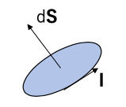
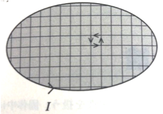
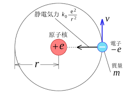

磁気モーメント
============

* 磁性における最も基本的な対象は、`磁気モーメント`である

  * 古典電磁気学では`磁気モーメント`を`環状電流`と等価とみる

  * 面積$|d{\bf S}|$の環状素片(`素`：大きさ無限小)に電流${\bf I}$が流れる時、`磁気モーメント`$d{\bf \mu}$は以下の式で表される(単位：$Am^2$)
  
      * ベクトル$d{\bf S}$の大きさ：ループの面積
      
      * ベクトル$d{\bf S}$の方向：ループに垂直

\begin{eqnarray}
d{\bf \mu}=Id{\bf S}
\end{eqnarray}

* これは、`磁気双極子`と等価である

    * `磁気双極子`は`電気双極子`(間隔微笑の正負の電荷)と一見類似の振る舞いをするので、そう呼ばれる
    
    * すなわち、`磁気モーメント`は「反対の磁化を持つ2つの磁気単極子が、ベクトル$d{\bf S}$と同方向に微小間隔で結ばれたもの」
    

* 磁気モーメント$d{\bf \mu}$は**環状電流の面に垂直**であり、ループを巡る電荷が担う`角運動量ベクトル`に**平行**または**反平行**である

* 大きさが有限のループが持つ磁気モーメント$d{\bf \mu}$を計算するには、
    
    * そのループを等価な微小ループに分割し、
    
    * 微小環状電流が作る磁気モーメントを足し合わせれば良い
    
    * 隣接する微小ループの電流は全て相殺し、外周を流れる電流だけが残る
    
\begin{eqnarray}
\bf \mu =\int d{\bf \mu} = I \int d{\bf S}
\end{eqnarray}

* 多数の微小環状電流が作る磁気モーメントの和と見なされる

## 1. 磁気モーメントと角運動量

* `環状電流`は1つまたは複数の電荷の運動によるものである

    * ここで考える電荷は全て質量を持つ粒子が担っている
    
    * そのため、電荷はもちろん質量の軌道運動も存在し、磁気モーメントは常に角運動量と結びついている

* `原子`では、周回する電子が担う`磁気モーメント`$d{\bf \mu}$は、電子の角運動量$d{\bf L}$と同方向で、かつ`角運動量`に比例する

    * $\gamma$：`磁気回転比`と呼ばれる定数

\begin{eqnarray}
\bf \mu =\gamma{\bf L}
\end{eqnarray}

## 2. 歳差運動

* 上の図のような磁場${\bf B}$中の磁気モーメント${\bf \mu}$を考える

    * 磁気モーメントのエネルギー${\bf E}$は、以下のように表される

\begin{eqnarray}
E = - \mu\bullet {\bf B}
\end{eqnarray}

* `磁気モーメント`が磁場方向を向くと最小になる

    * 磁場をかけると、磁気モーメントには`トルク`が作用する
    
    * 仮に磁気モーメントが全く角運動量を伴わないとすると、トルクによって磁気モーメントは磁場方向に傾くはずである

\begin{eqnarray}
{\bf G} = - \mu\times {\bf B}
\end{eqnarray}

* ただし、`磁気モーメント`は角運動量${\bf L}$を伴い、トルクは角運動量の変化率に等しいので、以下の式で表される

    *  $ {\bf \mu}$の経時変化が${\bf \mu}$と$ {\bf B}$の両方に垂直であることを意味する
    
    * すなわち、磁場は$ {\bf \mu}$を$ {\bf B}$の方向に傾けるのではなく、$ {\bf B}$の周りに回転(`歳差運動`)させる
    
    * 以下の式から、$| {\bf \mu}|$が時間変化しないことがわかる
    
    * これは、ジャイロスコープまたはコマの回転と全く同じである

\begin{eqnarray}
\frac{d{\bf \mu}}{dt} = \gamma {\bf \mu}\times {\bf B}
\end{eqnarray}

### ラーモア歳差運動

* $ {\bf B}$がz方向で、$ {\bf \mu}$は最初$xz$面内にあり、$ {\bf B}$と角度$\theta$をなすとする

    * この時、以下の式が成立する
    
\begin{eqnarray}
\frac{d{\bf \mu_x}}{dt} = - \gamma B\mu_y\\
\frac{d{\bf \mu_y}}{dt} = - \gamma B\mu_x\\
\frac{d{\bf \mu_z}}{dt} = 0
\end{eqnarray}

* ${\bf \mu_z}$は時間変化しない

* ${\bf \mu_x}$と${\bf \mu_y}$はどちらも振動する

    * これらの微分方程式の解は、以下の値で得られる
    
    * $\omega_L$：`ラーモア周波数`

\begin{eqnarray}
\mu_x(t) = |\mu| \sin \theta \cos(\omega_L t)\\
\mu_y(t) = |\mu| \sin \theta \sin(\omega_L t)\\
\mu_z(t) = |\mu| \cos \theta
\end{eqnarray}

\begin{eqnarray}
\omega_L　= \gamma B
\end{eqnarray}

* 磁気回転比$\gamma$は比例定数であり、`角運動量`と`磁気モーメント`を結びつけると同時に、`磁場`と`歳差運動`の周波数を結びつける

    * この歳差運動現象は、今後取り扱う現象が単純出ないことを暗示している
    
    * すなわち、磁場は磁気モーメントを揃えるだけでなく、様々な動的効果を誘起する

## 3. ボーア磁子

* `原子磁気モーメント`の大きさ、`磁気回転比`の大きさを求める

    * 水素原子核を回る1つの電子(電荷：$-e$、質量：$m_e$)

* 原子の`周回電流`は、以下の式で表される

    * 回転周期：$\tau = 2\pi r/ v$
    
    * 速さ：$v = |{\bf v}|$
    
    * 円軌道の半径：$r$

\begin{eqnarray}
I = - \frac{e}{\tau}
\end{eqnarray}

* 電子の角運動量の大きさ：$m_e v r$(基底状態：$\hbar$)

    * 電子の`磁気モーメント`は、以下の式で表される

\begin{eqnarray}
\mu = \pi r^2 I = - \frac{e \hbar}{2 m_e}
\end{eqnarray}

* ここで、$\mu_b$を、`ボーア磁子`として定義する

    * `原子磁気モーメント`の大きさを表す単位として用いられる
    
    * 値は、$9.274 \times 10^{-24} A m^2$
    
    * `磁気モーメント`の符号は、`負`である(電子の電荷が`負`であ理、その磁気モーメントは角運動量に反平行であるため)

\begin{eqnarray}
\mu_B = - \frac{e \hbar}{2 m_e}
\end{eqnarray}

* 電子の`磁気回転比`は$\gamma = - frac{e}{2 m_e}$であるため、`ラーモア周波数`は以下の式で表される

\begin{eqnarray}
\omega_L = |\gamma| B = \frac{e B}{2 m_e}
\end{eqnarray}

## 4. 磁化と磁場

* `磁性体`は、`磁気モーメント`を持つ多数の原子から構成される

    * `磁化`$M$：単位体積当たりの`磁気モーメント`
        
        * 通常、このベクトル量は**連続体近似**で扱われる
        
        * すなわち、個々の`原子磁気モーメント`がバラバラに見えない程度に大きなスケールで考える
        
        * このとき、$M$は磁性体の端を除いたあらゆる場所で連続でなめらかなベクトル場と見なされる

* 自由空間(真空)には、`磁化`が存在しない

    * この時、`磁場`はベクトル場$B$(または$H$)で、以下の関係式で表される
    
    * $B$：`磁束密度`(単位：$T$)
    
    * $H$：`磁場の強さ`(単位：$Am^{-1}$)
    
    * $\mu_0 = 4 \pi \times 10^{-7} H m^{-1}$

\begin{eqnarray}
B = \mu_0 H
\end{eqnarray}

* `磁性体`内部では、$B$と$H$の関係は多少複雑になり、2つのベクトル場は大きさと方向が全く異なることもある

    * 一般的には、これらベクトル間に以下の式が成立する
    
    
\begin{eqnarray}
B = \mu_0 (H + M)
\end{eqnarray}

 * 特に、磁化$M$が磁場$H$に比例する場合は、その磁性体を`線形物質`と呼ぶ
 
     * この磁性体は、以下の式で表される
     
     * $\chi$：`磁化率`(無次元量)

\begin{eqnarray}
M = \chi H
\end{eqnarray}

* この特別な関係が成り立つ場合にも、$B$と$H$の間には比例関係が存在し、以下の式で表される

    * `比透磁率`：$\mu_r = 1 + \chi$(物質ごとに異なる)

\begin{eqnarray}
B = \mu_0(1 + \chi)H = \mu_0 \mu_r H
\end{eqnarray}

* 実際は、磁化された媒質中の磁場を定義する際には、注意が必要である

    * 真空に磁場$B_a$(あるいは$H_a$)
    
    * 真空の領域に磁性体を挿入した時に、磁場$B_i$(あるいは$H_i$)は、$B_a$(あるいは$H_a$)と大幅に異なる
    
    * この差の原因は、磁性体内の磁気モーメント自身が原因となる

* 一般には、$B_i$と$H_i$の値はどちらも測定場所に依存する

    * 試料を磁化すると、試料内部の磁場同様、試料外部の磁場も影響を受ける
    
* 試料の形状が**回転楕円体形**の時は例外である

    * $a$、$b$、$c$は主軸、球($a=b=c$)と平面($a, b\rightarrow\infty, c=0$)

    * 主軸の1つの方向に磁場をかけた時は、試料のあらゆる場所で以下の式が成立する
    
    * $N$：反磁場係数(それぞれの場合に応じて適切に取っている)
    
        * $H_i$を求めるには、$H_a$に補正項$H_d = - N M$を加える必要がある
        
        * この補正項を、`反磁場`と呼ぶ

\begin{eqnarray}
H_i = H_a - NM
\end{eqnarray}

\begin{eqnarray}
B_i = \mu_0(H_i + M) = B_a + \mu_0(1 - N)M
\end{eqnarray}

 例)球形試料

\begin{eqnarray}
N = \frac{1}{3}
\end{eqnarray}

球内部の磁場は、以下の式で表される

\begin{eqnarray}
H_i = H_a - \frac{M}{3}
\end{eqnarray}

\begin{eqnarray}
B_i = B_a + \frac{2 \mu_0 M}{3}
\end{eqnarray}

* `磁化`が外から加えられた`磁場`$|H_a| = \frac{|B_a|}{\mu_0}$(試料挿入前の値)に比べて大きい時は、`反磁場補正`を考える必要がある

    * 磁性が弱い場合に限って、このような煩雑さは事実上回避できる
    
    * $ \chi \ll 1$の線形物質では、
    
        * $M \ll H$
        
        * $H_i \approx H_a$
        
        * $B_i \approx \mu_0 H_i$
        
      である
      
     * つまり、物質中の磁場は外からかけた磁場に等しいと見なして良い
     
     * 反磁場の比較的弱い効果を扱う際には、この近似を用いる
     
     * 強磁性体では反磁場の効果は常に重要である

例)物質固有の磁化率

\begin{eqnarray}
\chi_{固有} = \frac{M}{H_i}
\end{eqnarray}

* 実験で測定される量はこの物質固有量ではない

    *　磁化$M$は外から加える磁場$H_a$に対する応答として観測されるため
    
    * 測定値は、以下の式で表される

\begin{eqnarray}
\chi_{実験} = \frac{M}{H_a}
\end{eqnarray}

* これらの2つの物質量の間には、以下の関係がある

\begin{eqnarray}
\chi_{実験} = \frac{M}{H_i + NM} = \frac{\frac{M}{H_i}}{1+\frac{NM}{H_i}} = \frac{\chi_{固有}}{1 + N \chi_{固有}}
\end{eqnarray}

* $\chi \ll 1$の時は、$\chi_{固有}$と$\chi_{実験}$の差は取るに足らない

* $\chi_{固有}$が1に近いか、あるいは1より大きい場合、差は大きくなる

    * 例)強磁性体が高温側からキュリー温度に近づく時は、$\chi_{固有} \rightarrow\infty $であるが、$\chi_{実験} \rightarrow \frac{1}{N}$

* 強磁性体材料は試料全体で磁気モーメントを持たないことがある

    * 強磁性体には`磁区`が存在しているため
    
    * それぞれの`磁区`は一様であるが、`磁化`の方向は隣接する`磁区`とは異なる
    
    * 微視的なスケールで全ての`磁気モーメント`が局所的に存在していても、試料に`磁化`が現れないことがある

|  版  |   年/月/日   |
|-----|-----------------|
|初版|2019/03/01|
