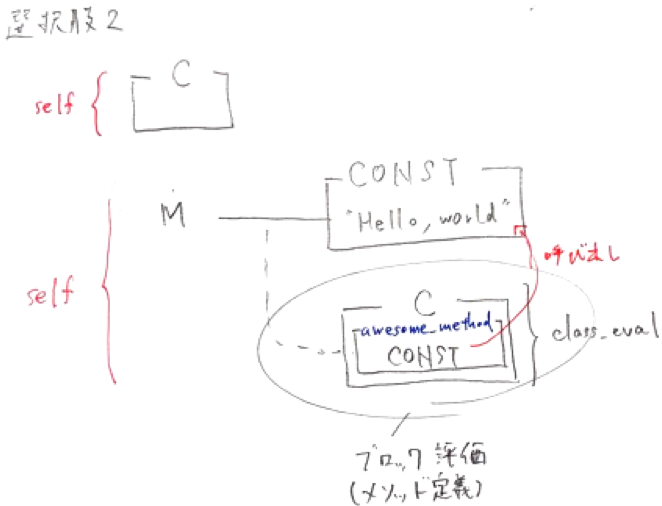
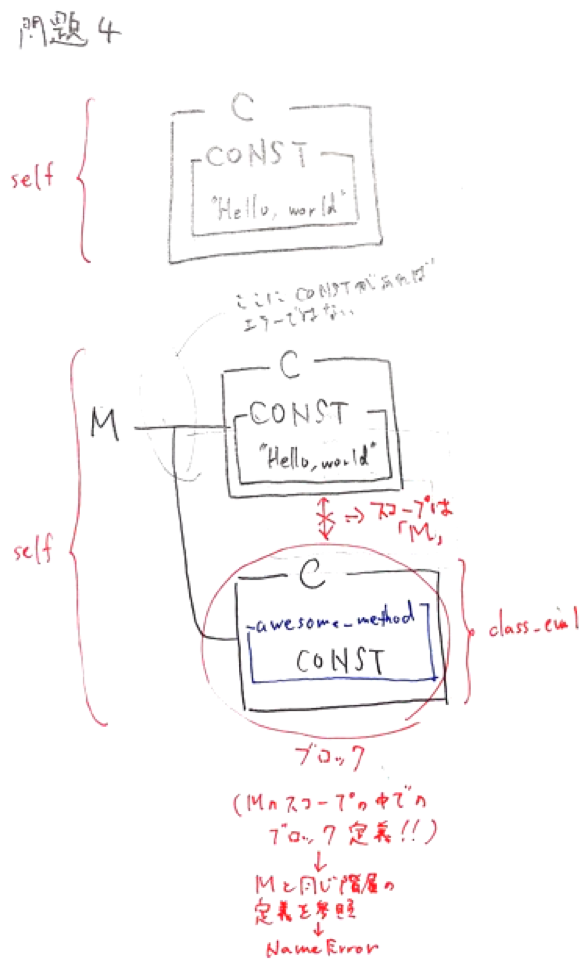

goldで間違えた問題
================

## 次のプログラムは"Hello, world"と表示します。同じ結果になる選択肢はどれですか（複数選択）

```ruby
>> module M
>>  CONST = "Hello, world"
>>
>>  class C
>>    def awesome_method
>>      CONST
>>    end
>>  end
>> end
=> :awesome_method
>>
>> p M::C.new.awesome_method
"Hello, world"
=> "Hello, world"
```


### 選択肢1

定数の参照はレキシカルに行われます。

`M::C#awesome_method`のコンテキスト(`self`)に`CONST`がないため例外が発生します。

→`M::CONST`と、`M::C`のコンテキストが一致していれば可能

→ **クラス継承** と **継承関係** は関係ない!!!

→自分自身に一番近い定数を参照する

```ruby
>> module M
>>   CONST = "Hello, world"
>> end
=> "Hello, world"

>> class M::C
>>   def awesome_method
>>     CONST
>>   end
>> end
=> :awesome_method
>>
>> p M::C.new.awesome_method
NameError: uninitialized constant M::C::CONST

# クラス継承と、継承関係の調査
>> a = M::C.new
=> #<M::C:0x007fefa586fdc0>
>> a.class
=> M::C
>> a.class.class       # Mが親クラスと思うが、継承関係はない
=> Class
```


### 選択肢2

`class_eval`にブロックを渡した場合は、ブロック内のネストはモジュール`M`になります。

そのコンテキストから定数を探しますので`"Hello, world"`が表示されます。

```ruby
>> class C
>> end
=> nil
>>
?> module M
>>   CONST = "Hello, world"
>>
?>   C.class_eval do
?>     def awesome_method
>>       CONST
>>     end
>>   end
>> end
=> :awesome_method
>>
>> p C.new.awesome_method
"Hello, world"
=> "Hello, world"
```




### 選択肢3

`class_eval`に文字列を渡した場合のネストの状態はクラス`C`です。

`CONST`はクラス`C`にありますので`"Hello, world"`が表示されます。

> `class_eval`メソッドの引数に文字列`code`を渡すと、その文字列をクラス定義やモジュール定義の中のコードであるように実行します。
>
> 戻り値は、文字列のコードの戻り値です。

```ruby
>> class C
>>   CONST = "Hello, world"
>> end
=> "Hello, world"
>>
?> module M
>>   C.class_eval(<<-CODE)
    def awesome_method
      CONST
    end
  CODE
>> end
=> :awesome_method
>>
>> p C.new.awesome_method
"Hello, world"
=> "Hello, world"
```


### 選択肢4

`class_eval`にブロックを渡した場合は、ブロック内のネストはモジュール`M`になります。

そのコンテキストから定数を探しますがないため例外が発生します。

> `Module#class_eval`
>
> 文字列が与えられた場合には、定数とクラス変数のスコープは自身のモジュール定義式内と同じスコープになります。
>
> ブロックが与えられた場合には、定数とクラス変数のスコープはブロックの外側のスコープになります。

```ruby
>> class C
>>   CONST = "Hello, world"
>> end
=> "Hello, world"
>>
>> module M
>>   C.class_eval do
>>     def awesome_method
>>       CONST
>>     end
>>   end
>> end
=> :awesome_method
>>
>> p C.new.awesome_method
NameError: uninitialized constant M::CONST
```




## 以下のコードを実行するとどうなりますか

`C#initialize`が`S#initialize`をオーバーライドされているため、`@@val += 1`は実行されません。

> initializeメソッドは重複して定義するたびに、最後に定義されたinitializeメソッドが使用されます。

`class << C ~ end`の処理はクラスを定義した時点で、実行されます。

→返り値？？

> 後日、もう一度検索してみる
> 2018/10/27

```ruby
>> class S
>>   @@val = 0
>>   def initialize
>>     @@val += 1
>>   end
>> end
=> :initialize
>>
>> class C < S
>>   class << C
>>     @@val += 1
>>   end
>>
>>   def initialize           # 最後のinitializeが使用される
>>   end
>> end
=> :initialize
>>
>> C.new                   # initializeで実行されていない(オーバーライドされている)
=> #<C:0x007f826e078d00>
>> C.new                   # initializeで実行されていない(オーバーライドされている)
=> #<C:0x007f826e073328>
>> S.new
=> #<S:0x007f826e0719b0>
>> S.new
=> #<S:0x007f826e070038>
>>
>> p C.class_variable_get(:@@val)
3
=> 3
```


## 次のプログラムは`Enumerator::Lazy`を使っています。先頭から5つの値を取り出すにはどのメソッドが必要ですか

値を取り出すには、

* `Enumerator::Lazy#force`

* `Enumerator::Lazy#first`

を呼び出す必要があります。

問題文には「先頭から5つ」とあるので、`first(5)`として取り出します。

また、`Enumerator::Lazy#force`で問題文の通りにするには`Enumerator::Lazy#take`も利用します。

`Enumerator::Lazy#take`は`Enumerable#take`と違い`Enumerator::Lazy`のインスタンスを戻り値にします。

そのインスタンスから`Enumerator::Lazy#force`で実際の値を取り出します。

```ruby
(1..100).each.lazy.chunk(&:even?)
```


### リファレンスより

* `Enumerable#chunk`：要素を前から順にブロックで評価し、その結果によって 要素をチャンクに分けた(グループ化した)要素を持つ Enumerator を返します。

* `Enumerator::Lazy#chunk`：Enumerable#chunk_while と同じですが、Enumerator ではなく Enumerator::Lazy を返します。

```ruby
# Enumerable#chunk
>> [3, 1, 4, 1, 5, 9, 2, 6, 5, 3, 5].chunk {|n|
>>   n.even?
>> }.each {|even, ary|
>>   p [even, ary]
>> }
[false, [3, 1]]
[true, [4]]
[false, [1, 5, 9]]
[true, [2, 6]]
[false, [5, 3, 5]]
=> nil

# Enumerator::Lazy#chunk
>> 1.step.lazy.chunk{ |n| n % 3 == 0 }
=> #<Enumerator::Lazy: #<Enumerator: #<Enumerator::Generator:0x007fc2f1071348>:each>>
```

* `Enumerator::Lazy#force`：全ての要素を含む配列を返します。Lazy から実際に値を取り出すのに使います。

* `Enumerator::Lazy#first`：Enumerable オブジェクトの最初の要素、もしくは最初の n 要素を返します。

```ruby
# Enumerator::Lazy#first
>> 1.step.lazy.first
=> 1

# Enumerator::Lazy#force
>> 1.step.lazy.take(5).force
=> [1, 2, 3, 4, 5]
```

* `Enumerable#take`：Enumerable オブジェクトの先頭から n 要素を配列として返します。

* `Enumerator::Lazy#take`：Enumerable#take と同じですが、配列ではなくEnumerator::Lazy を返します。

```ruby
# Enumerable#take
>> a = [1, 2, 3, 4, 5, 0]
=> [1, 2, 3, 4, 5, 0]
>> a.take(3)
=> [1, 2, 3]

# Enumerator::Lazy#take
>> 1.step.lazy.take(5)
=> #<Enumerator::Lazy: #<Enumerator::Lazy: #<Enumerator: 1:step>>:take(5)>
>> 1.step.lazy.take(5).force
=> [1, 2, 3, 4, 5]
```


### 解答

```ruby
# 解答1
>> (1..100).each.lazy.chunk(&:even?).take(5)
=> #<Enumerator::Lazy: #<Enumerator::Lazy: #<Enumerator: #<Enumerator::Generator:0x007fe94b841a20>:each>>:take(5)>

# 解答2
>> (1..100).each.lazy.chunk(&:even?).take(5).force
=> [[false, [1]], [true, [2]], [false, [3]], [true, [4]], [false, [5]]]

# 解答3
>> (1..100).each.lazy.chunk(&:even?).first(5)
=> [[false, [1]], [true, [2]], [false, [3]], [true, [4]], [false, [5]]]

# 解答4
>> (1..100).each.lazy.chunk(&:even?).first(5).force
NoMethodError: undefined method 'force' for #<Array:0x007fe94d058a50>
```


## 次のコードを実行するとどうなりますか

`include`はモジュールのメソッドをインスタンスメソッドとして追加します。

メソッド探索順は`self`(クラス)の後に追加されます。

複数回`include`された場合は、後に宣言された方からメソッド探索されます。

.png)

```ruby
>> module M1
>> end
=> nil
>>
>> module M2
>> end
=> nil
>>
>> class C
>>   include M1
>>   include M2
>> end
=> C
>>
>> p C.ancestors
[C, M2, M1, Object, Kernel, BasicObject]
=> [C, M2, M1, Object, Kernel, BasicObject]
```


## 次のプログラムを実行するとどうなりますか

```ruby
>> module M1
>>   class C1
>>     CONST = "001"
>>   end
>>
>>   class C2 < C1
>>     CONST = "010"
>>
>>     module M2
>>       CONST = "011"
>>
>>       class Ca
>>         CONST = "100"
>>       end
>>
>>       class Cb < Ca
>>         p CONST
>>       end
>>     end
>>   end
>> end
"011"
=> "011"
```


### 解説

Rubyは定数の参照はレキシカルに決定されます。

名前空間ではなく、プログラム上の定義された場所と使われている場所の静的な位置づけが重要です。

例えば、次のプログラムでは期待した結果が得られません。`CONST`がモジュールMのスコープにあるためです。

```ruby
>> module M
>>   CONST = "Hello, world"
>> end
=> "Hello, world"
>>
>> class M::C
>>   def awesome_method
>>     CONST
>>   end
>> end
=> :awesome_method
>>
>> p M::C.new.awesome_method
NameError: uninitialized constant M::C::CONST
```

一方で同じレキシカルスコープにある場合は例外は発生しません。

```ruby
>> module M
>>   CONST = "Hello, world"
>>
>>   class C
>>     def awesome_method
>>       CONST
>>     end
>>   end
>> end
=> :awesome_method
>>
>> p M::C.new.awesome_method
"Hello, world"
=> "Hello, world"
```

また、使われている定数の場所がネストされている場合は内側から順に定数の探索が始まります。

レキシカルスコープに定数がない場合は、スーパークラスの探索を行います。

クラス`Cb`から最も物理的に近いのは`M2::CONST`であるため答えは`"011"`になります。

スーパークラスの探索はこの場合には行われません。


## 次のコードを実行するとどうなりますか

```ruby
>> def m1(*)
>>   str = yield if block_given?
>>   p "m1 #{str}"
>> end
=> :m1
>>
?> def m2(*)
>>   str = yield if block_given?
>>   p "m2 #{str}"
>> end
=> :m2
>>
?> m1 m2 do
?>   "hello"
>> end
"m2 "
"m1 hello"
=> "m1 hello"
```


### 解説

問題のコードで使用されているメソッド類は以下の通りです。

  * `Kernel#block_given?`はブロックが渡された場合は、真になります。

  * `yield`はブロックの内容を評価します。

  * `{ }`は`do end`よりも結合度が高い為、実行結果に差が出ます。

問題のコードは以下のように解釈されます。

* `m1`の引数と解釈されるため、`m2`の戻り値は`m2`が表示されます。

* `m1`へ`do .. end`のブロックが渡されます。よって、`m1 hello`が表示されます。

```ruby
m1(m2) do
  "hello"
end

# 実行結果
# "m2 "
# "m1 hello"
```

問題のコードを`do ... end`で置き換えた場合は以下の実行結果になります。

> こちらの方だと思って解答してしまった
>
> 2018/10/26

```ruby
m1 m2 {  # m1 (m2 { .. } ) と解釈される
  "hello"
}

# 実行結果
# m2 hello
# m1
```


## 次のコードを実行するとどうなりますか

`Refinement`は有効化したスコープのみに影響を与えることが出来ます。

この問題ではクラスオープンした際に`using`で`Refinement`を有効化していますが、

スコープ外は無効になります。

よって、`puts C.new.m1`とした結果は`400`になります。

```ruby
>> class C
>>   def m1
>>     400
>>   end
>> end
=> :m1
>>
>> module M
>>   refine C do
>>     def m1
>>       100
>>     end
>>   end
>> end
=> #<refinement:C@M>
>>
>> class C       # クラスの再オープン時に、refinentを定義している
>>   using M
>> end
=> C
>>
>> puts C.new.m1
400
=> nil
```


## 以下のコードを実行するとどうなりますか

`initialize`の可視性は`private`に設定されています。

`initialize`の可視性を`public`に設定したとしても、必ずprivateになります。

> newメソッドの処理の内部でインスタンスの初期化のために使うメソッド
>
> インスタンスの外部からは呼び出すことができない

```ruby
>> class C
>> private
>>   def initialize
>>   end
>> end
=> :initialize
>>
>> p C.new.public_methods.include? :initialize
false
=> false
```


## 次のコードを実行するとどうなりますか。

`Class#name`はクラス名を文字列で返します。

`Human#name`クラスは`Class#name`をオーバーライドしているので、`const_get`が呼ばれます。

`const_get`は、`self`に定義された定数を探索します。自クラスに定義がない場合は、メソッドと同様に探索を行います。

問題コードの5行目時点のインスタンスは`Fukuzawa`クラスです。

よって、`Human#name`は`Fukuzawa`クラスの`Yukichi`を返します。

```ruby
>> class Human
>>   NAME = "Unknown"
>>
>>   def self.name
>>     const_get(:NAME)
>>   end
>> end
=> :name
>>
>> class Fukuzawa < Human
>>   NAME = "Yukichi"
>> end
=> "Yukichi"
>>
>> puts Fukuzawa.name
Yukichi
=> nil
```


## 次のコードを実行するとどうなりますか

`method_missing`は、継承チェーンを辿った末にメソッドが見つからなかった場合に、呼び出されます。

`method_missing`も継承チェーンを辿ります。

よって、`B#method_missing`が出力されます。

> 現在のクラス・モジュールで`method_missing`があれば実行
>
> そうしないと、動的にメソッドを定義するときに不都合になる

```Ruby
>> module M
>>   def method_missing(id, *args)
>>     puts "M#method_missing"
>>   end
>> end
=> :method_missing
>> class A
>>   include M
>>   def method_missing(id, *args)
>>     puts "A#method_missing"
>>   end
>> end
=> :method_missing
>> class B < A
>>   def method_missing(id, *args)
>>     puts "B#method_missing"
>>   end
>> end
=> :method_missing
>>
>> obj = B.new
=> #<B:0x007f876f01e188>
>> obj.dummy_method
B#method_missing
=> nil
```


## 次のコードを実行するとどうなりますか

同じメソッドに対して`Refinement`で再定義を2つのモジュールで行っています。

もし、`using`を2行書いたとしても **1つのメソッドで有効になる再定義は1つだけ** です。

最後に書いた`using`から優先されます。

この問題では`using R2`が最後に有効化された`Refinement`です。

有効になる再定義は1つだけですので、モジュール`R2`にある`super`はクラス`C`にある`m1`を呼び出します。

よって、`super + 100`は`100 + 100`となり`200`が表示されるのが正解です。

```ruby
class C
  def m1(value)
    100 + value
  end
end

module R1
  refine C do
    def m1
      super 50
    end
  end
end

module R2
  refine C do
    def m1
      super 100
    end
  end
end

using R1
using R2

puts C.new.m1
=> 200
```

一方で、`using R1`に書いた内容はすべて無効になったかというとそういうわけではありません。

次のサンプルコードだとモジュール`R2`に`m2`が定義されていなくても呼び出すことが出来ます。

```ruby
class C
  def m1(value)
    100 + value
  end

  def m2(value)
    value + ", world"
  end
end

module R1
  refine C do
    def m1
      super 50
    end

    def m2
      super "Hello"
    end
  end
end

module R2
  refine C do
    def m1
      super 100
    end
  end
end

using R1
using R2

puts C.new.m1
puts C.new.m2
=> 200
=> Hello, world
```


## 次のコードを実行するとどうなりますか

問題の`self`は`Object`クラスのインスタンスになります。

`Object`クラスには`*`メソッドが定義されていないためエラーになります。

```ruby
>> p [1,2,3,4].map(&self.method(:*))
NameError: undefined method `*' for class `#<Class:#<Object:0x007fc6a60da4c0>>'

# 検証
>> Object.instance_methods.grep(/ * /)
=> []
```


## 次のプログラムを実行するとどうなりますか

```ruby
>> module A
>>   B = 42
>>
?>   def f
>>     21
>>   end
>> end
=> :f
>> # module_evalは、class_evalと同様
>> A.module_eval(<<-CODE)
  def self.f
    p B
  end
CODE
=> :f
>>
>> B = 15
=> 15
>>
>> A.f
42
=> 42
```


### 解説

`module_eval`に文字列を引数とした場合は、レシーバーのスコープで評価されます。

問題のプログラムを次のようにするとネストの状態を調べることができます。

```ruby
>> A.module_eval(<<-CODE)
  p Module.nesting
CODE
[A]
=> [A]
```

定数は静的に探索が行われますので、`A::B`の`42`が答えになります。


## 次のコードを実行するとどうなりますか

`lambda`を`call`する際の引数は省略できません。

`lambda`に似た機能に`Proc`があります。

似ていますが、異なる部分もあります。

次の表が`lambda`と`Proc`の違いになります。

|        特徴        |           Proc           |      lambda     |
|:------------------|:-------------------------|:----------------|
|      引数の数      |            曖昧           |       厳密       |
|     引数の渡し方    |       Proc.new { \       |      x, y\      |
|return, brake, next|    call以降が実行されない   |call以降も実行される|


```ruby
>> local = 0
=> 0

>> p1 = lambda { |arg1, arg2|
>>   arg1, arg2 = arg1.to_i, arg2.to_i
>>   local += [arg1, arg2].max
>> }
=> #<Proc:0x007ffdf1084840@(irb):3 (lambda)>

>> p1.call("1", "2")
=> 2
>> p1.call("7", "5")
=> 9
>> p1.call("9")      # こちらは実行されない
ArgumentError: wrong number of arguments (given 1, expected 2)

>> p local
9
=> 9
```


## 次のプログラムを実行するとどうなりますか

`::`演算子が先頭にあるとトップレベルから定数の探索を行います。

モジュール`M`にあるクラス`C`はトップレベルにあるものを指します。

`greet`メソッドにある`CONST`はクラス`C`にはありませんが、スーパークラスにあるか探索を行います。

クラス`Base`を継承していますので、`"Hello, world"`が表示されます。

```ruby
>> class Base
>>   CONST = "Hello, world"
>> end
=> "Hello, world"
>>
>> class C < Base
>> end
=> nil
>>
>> module P
>>   CONST = "Good, night"
>> end
=> "Good, night"
>>
>> class Base
>>   prepend P
>> end
=> Base
>>
>> module M
>>   class C
>>     CONST = "Good, evening"
>>   end
>> end
=> "Good, evening"
>>
>> module M
>>   class ::C       # モジュールMでネストされているが、トップレベルのクラスCを指している
>>     def greet
>>       CONST
>>     end
>>   end
>> end
=> :greet
>>
>> p C.new.greet
"Hello, world"
=> "Hello, world"
```


## 以下のコードを実行するとどうなりますか

`@@val`に`1`加算しているタイミングは以下です。

* `C`クラスの特異クラスを定義

* `C.new`の呼び出し

* `S.new`の呼び出し

```ruby
>> class S
>>   @@val = 0
>>   def initialize
>>     @@val += 1
>>   end
>> end
=> :initialize
>>
>> class C < S
>>   class << C
>>     @@val += 1
>>   end
>> end
=> 1
>>
>> C.new
=> #<C:0x007fc7c98e4b88>
>> C.new
=> #<C:0x007fc7c98def58>
>> S.new
=> #<S:0x007fc7c98dd5e0>
>> S.new
=> #<S:0x007fc7c98d7c08>
>>
>> p C.class_variable_get(:@@val)
5
=> 5
```


## 次のプログラムを実行するとどうなりますか

```ruby
>> class Object
>>   CONST = "1"                 # 最初の定義(CONST = "1")
>>   def const_succ
>>     CONST.succ!
>>   end
>> end
=> :const_succ

>> class Child1
>>   const_succ                  # 1回目(CONST = "2")
>>   class << self
>>     const_succ                # 2回目(CONST = "3")
>>   end
>> end
=> "3"

>> class Child2
>>   const_succ                  # 3回目(CONST = "4")
>>   def initialize
>>     const_succ                # 4回目(CONST = "5")
>>   end
>> end
=> :initialize

>> Child1.new
=> #<Child1:0x007fc59f06e570>
>> Child2.new
=> #<Child2:0x007fc59f06c4f0>

>> p Object::CONST
"5"
=> "5"
```


### 解説

クラスObjectにメソッドを定義すると特異クラスでもそのメソッドを利用することが出来ます。

問題のプログラムを順に実行すると、答えは"5"になります。


> 補足　`Object#const_succ`について

> 内部で`String#succ!`を実行しています。このメソッドはレシーバーの文字列を次の文字列へ進めます。

> この問題ですと、`"1"`→`"2"`・・・と`1`ずつ繰り上がります。

> また、定数に対して行っていますが破壊的メソッドの呼び出しですので再代入にはならず警告は表示されません。

```ruby
class Object
  CONST = "1"
  def const_succ
    CONST.succ!
  end
end

class Child1
  const_succ # "2"になる
  class << self
    const_succ # "3"になる
  end
end

class Child2
  const_succ # "4になる"
  def initialize
    const_succ
  end
end

Child1.new # "4"のまま
Child2.new # "5"になる

p Object::CONST
"5"
=> "5"
```


## 次のコードを実行するとどうなりますか

`super`はスーパークラスと同名のメソッドが呼ばれます。

引数ありのメソッドで`super`を呼び出すと、引数ありのメソッドが呼ばれますが、そのメソッドが存在しない場合は、`ArgumentError`が発生します。

引数ありのメソッドで引数なしのスーパークラスを呼び出すには、`super()`と明示的に呼び出す必要があります。

> 正解しているけど、念のため
>
> 2018/10/28

```ruby
>> class S
>>   def initialize
>>     puts "S#initialize"
>>   end
>> end
=> :initialize
>>
?> class C < S
>>   def initialize(*args)
>>     super()
>>     puts "C#initialize"
>>   end
>> end
=> :initialize
>>
?> C.new(1,2,3,4,5)
S#initialize
C#initialize
=> #<C:0x007f92790acab8>
```


## 次のプログラムを実行するとどうなりますか

Rubyは定数の参照はレキシカルに決定されますが、この問題ではレキシカルスコープに定数はありません。

レキシカルスコープに定数がない場合は、スーパークラスの探索を行います。

この問題では、クラスC2のスコープで定数を参照しています。

クラス`C2`のスーパークラスはクラス`Cd`ですので`"100"`が正解になります。

> 正解しているけど念のため
>
> 2018/10/28

```ruby
>> class Ca
>>   CONST = "001"
>> end
=> "001"
>>
?> class Cb
>>   CONST = "010"
>> end
=> "010"
>>
?> class Cc
>>   CONST = "011"
>> end
=> "011"
>>
?> class Cd
>>   CONST = "100"
>> end
=> "100"
>>
?> module M1
>>   class C0 < Ca
>>     class C1 < Cc
>>       class C2 < Cd
>>         p CONST
>>
?>         class C2 < Cb
>>         end
>>       end
>>     end
>>   end
>> end
"100"
=> nil
```


## 次のプログラムを実行するとどうなりますか

`module_eval`にブロックを渡した場合のネストは次の通りです。

```ruby
A.module_eval do
  p Module.nesting # []と表示され、ネストされた状態になく、トップレベルにいることがわかる
end
```
トップレベルで定数を定義した場合は`Object`の定数になります。

```ruby
B = "Hello, world"
p Object.const_get(:B) # "Hello, world"と表示される
```
問題にあるメソッド`A.f`はトップレベルにある定数を探索するため答えは`15`になります。

> `Module#module_eval`
>
> 文字列が与えられた場合には、定数とクラス変数のスコープは自身のモジュール定義式内と同じスコープになります。
>
> ブロックが与えられた場合には、定数とクラス変数のスコープはブロックの外側のスコープになります。

```ruby
>> module A
>>   B = 42
>>
>>   def f
>>     21
>>   end
>> end
=> :f
>>
>> A.module_eval do
>>   def self.f
>>     p B
>>   end
>> end
=> :f
>>
>> B = 15
=> 15
>>
>> A.f
15
=> 15
```


## 次のコードを実行するとどうなりますか

`String#+`は`String`クラスのオブジェクトを期待します。

引数に`Symbol`クラスを渡しているため`TypeError`が発生します。

> `else`ブロックは例外が発生しない場合に評価されます。
>
> 優先順位は、「エラー名指定のrescue」>「エラー名指定なしのrescue」

```ruby
>> begin
>>   print "liberty" + :fish
>> rescue TypeError
>>   print "TypeError."
>> rescue
>>   print "Error."
>> else
>>   print "Else."
>> end
TypeError.=> nil

# 検証
>> begin
>>   print "liberty" + :fish
>> rescue
>>   print "Error."
>> else
>>   print "Else."
>> end
Error.=> nil
```


## 次のコードを実行するとどうなりますか

キーワード引数へHashオブジェクトを渡すことができます。

Hashの中身を渡す必要があるので、変数の前に`**`を付加します。

> `*`は、Arrayオブジェクトとして渡される

```ruby
>> def foo(arg1:100, arg2:200)
>>   puts arg1
>>   puts arg2
>> end
=> :foo
>>
>> option = {arg2: 900}
=> {:arg2=>900}
>>
>> foo arg1: 200, *option
SyntaxError: (irb):8: syntax error, unexpected *
```


## 次のコードを実行するとどうなりますか

問題のコードで使用されているメソッド類は以下の通りです。

* `Kernel#block_given?`はブロックが渡された場合は、真になります。

* `yield`はブロックの内容を評価します。

* `{ }`は`do end`よりも結合度が高い為、実行結果に差が出ます。

問題のコードは以下のように解釈されます。

1. `m2`へブロックが渡され、`m2 hello`が表示されます。

1. `m1`へは引数が渡され、ブロックは渡されません。よって、`m1`が表示されます。

```ruby
m1 (m2 {
      "hello"
    }
)

# 実行結果
# "m2 hello"
# "m1 "
```

問題のコードを`do end`で置き換えた場合は以下の実行結果になります。

```ruby
m1 m2 do  # m1(m2) do と解釈されます。
  "hello"
end

# 実行結果
# "m2 "
# "m1 hello"
```


```ruby
>> def m1(*)
>>   str = yield if block_given?
>>   p "m1 #{str}"
>> end
=> :m1
>>
?> def m2(*)
>>   str = yield if block_given?
>>   p "m2 #{str}"
>> end
=> :m2
>>
?> m1 m2 {
?>   "hello"
>> }
"m2 hello"
"m1 "
=> "m1 "
```


## 次のコードを実行するとどうなりますか

`1i`は複素数(Complex)のオブジェクトを表します。

Complex同士の演算はComplexを返します。

```ruby
>> val = 1i * 1i
=> (-1+0i)
>> puts val.class
Complex
=> nil
```


## 次のプログラムの実行結果を得るために`__(1)__`に適切なメソッドをすべて選んでください。

```ruby
module Enumerable
  def with_prefix(prefix)
    return to_enum(__(1)__, prefix) { size } unless block_given?

    each do |char|
      yield "#{prefix} #{char}"
    end
  end
end

[1,2,3,4,5].with_prefix("Awesome").reverse_each {|char|
  puts char
}

# 実行結果
Awesome 5
Awesome 4
Awesome 3
Awesome 2
Awesome 1
```

```ruby
# 選択肢1
:with_prefix

# 選択肢2
:reverse_each

# 選択肢3
__method__

# 選択肢4
:each
```


### 解説

ブロックを渡さない場合は、Enumeratorオブジェクトを作成してメソッドをチェーン出来るようにします。

Enumeratorオブジェクトを作成するためには、`to_enum`または、`enum_for`を呼びます。

これらの引数にメソッド名をシンボルで指定することでチェーンした先でブロックを渡されたときにどのメソッドを評価すればよいかが分かります。

この問題では、`with_prefix`を再び評価する必要がありますので、`__method__`または:with_prefixを引数に指定します。`__method__`はメソッドの中で呼び出すと、そのメソッド名になります。

```ruby
def awesome_method
  __method__
end

p awesome_method # :awesome_methodとシンボルでメソッド名が分かります
```


### 文法

* `Enumerator#each`：生成時のパラメータに従ってブロックを繰り返します。

  →`each do |f| ~ end`のインスタンスメソッド

* `to_enum`・`enum_for`：レシーバのオブジェクトと列挙用のメソッドを元にしてEnumeratorオブジェクトを作成します。

  →Enumeratorクラスの`new`メソッドを使って、`Enumerator.new(obj, method, arg)`とするのと同じです。

  →引数`method`には、メソッドの名前をシンボルか文字列で渡します。`method`を指定しないと`each`メソッドが使われます。

  ```ruby
  >> enum = "hello".enum_for(:each_byte)
  => #<Enumerator: "hello":each_byte>
  >> p enum.collect {|byte| byte.to_s(16) }
  ["68", "65", "6c", "6c", "6f"]
  => ["68", "65", "6c", "6c", "6f"]
  ```


## 次のコードを実行するとどうなりますか

`method_missing`は、継承チェーンを辿った末にメソッドが見つからなかった場合に、呼び出されます。

`method_missing`も継承チェーンを辿ります。

問題で、`B.dummy_method`と呼び出しています。

これは、Classクラスのインスタンスメソッドが呼ばれます。

よって、`Class#method_missing`が出力されます。

> ClassクラスのオブジェクトがBクラス
>
> `dummy_method`は、Bから見ればクラスメソッドだが、Classから見ればBのインスタンスメソッド
>
> Bのインスタンスメソッドが見つからない場合は、Classのインスタンスメソッドを呼び出す

```ruby
>> class Class
>>   def method_missing(id, *args)
>>     puts "Class#method_missing"
>>   end
>> end
=> :method_missing
>> class A
>>   def method_missing(id, *args)
>>     puts "A#method_missing"
>>   end
>> end
=> :method_missing
>> class B < A
>>   def method_missing(id, *args)
>>     puts "B#method_missing"
>>   end
>> end
=> :method_missing
>>
>> B.dummy_method
Class#method_missing
=> nil
```


## 次のコードを実行するとどうなりますか。

定数はインスタンスではなくクラスに存在します。

定数の探索順位は`クラス内 -> スーパークラス -> クラス探索`順に行われます。

よって、`Human#name`のクラス内定数である`NAME = "Unknown"`が返されます。

```ruby
>> class Human
>>   NAME = "Unknown"
>>
>>   def name
>>     NAME
>>   end
>> end
=> :name
>>
>> class Noguchi < Human
>>   NAME = "Hideyo"
>> end
=> "Hideyo"
>>
>> puts Noguchi.new.name
Unknown
=> nil
```


## 次のコードを実行するとどうなりますか

`Array#sort`は比較に`<=>`を使用しています。

自作クラスの場合はオブジェクトIDが比較対象となります。

`Fixnum#<=>(other)`は以下の結果を返します。

* `self`が`other`より大きい場合は、`1`を返します。

* `self`が`other`と等しい場合は、`0`を返します。

* `self`が`other`より小さい場合は、`-1`を返します。

問題のコードでは、`sort`は非破壊的メソッドです。

よって`puts`時点ではソートが行われずに配列へ挿入した順番に表示されます。

> `puts`
>
> 引数のオブジェクトを文字列に変換し、改行を加えて標準出力に出力。
>
> `to_s`メソッドで文字列に変換される。

※組み込みクラスのクラスメソッドのモンキーパッチをここでは行なっている

```ruby
>> class Company
>>   attr_reader :id
>>   attr_accessor :name
>>   def initialize id, name
>>     @id = id
>>     @name = name
>>   end
>>   def to_s
>>     "#{id}:#{name}"
>>   end
>>   def <=> other
>>     self.id <=> other.id
>>   end
>> end
=> :<=>
>>
>> companies = []
=> []
>> companies << Company.new(2, 'Liberyfish')
=> [#<Company:0x007fe8691249a0 @id=2, @name="Liberyfish">]
>> companies << Company.new(3, 'Freefish')
=> [#<Company:0x007fe8691249a0 @id=2, @name="Liberyfish">, #<Company:0x007fe8681834d8 @id=3, @name="Freefish">]
>> companies << Company.new(1, 'Freedomfish')
=> [#<Company:0x007fe8691249a0 @id=2, @name="Liberyfish">, #<Company:0x007fe8681834d8 @id=3, @name="Freefish">, #<Company:0x007fe86911d998 @id=1, @name="Freedomfish">]
>>
>> companies.sort
=> [#<Company:0x007fe86911d998 @id=1, @name="Freedomfish">, #<Company:0x007fe8691249a0 @id=2, @name="Liberyfish">, #<Company:0x007fe8681834d8 @id=3, @name="Freefish">]
>>
>> companies.each do |e|
>>   puts e
>> end
2:Liberyfish
3:Freefish
1:Freedomfish
=> [#<Company:0x007fe8691249a0 @id=2, @name="Liberyfish">, #<Company:0x007fe8681834d8 @id=3, @name="Freefish">, #<Company:0x007fe86911d998 @id=1, @name="Freedomfish">]
```


## 次のプログラムの実行結果を得るために`__(1)__`に適切なメソッドをすべて選んでください。

```ruby
class Array
  def succ_each(step = 1)
    return __(1)__(__method__, step) unless block_given?

    each do |int|
      yield int + step
    end
  end
end

[97, 98, 99].succ_each.map {|int|
  p int.chr
}

# 実行結果
"b"
"c"
"d"
```

```ruby
# 選択肢1
enum

# 選択肢2
enum_chr

# 選択肢3
to_enum

# 選択肢4
enum_for
```


### 解説

ブロックを渡さない場合は、Enumeratorオブジェクトを作成してメソッドをチェーン出来るようにします。

また、ブロックを渡す場合は`yield`で評価してブロックを評価します。

内部イテレータを実装する場合は次のような構造になることが多いです。

レシーバーの配列の要素に対して、`step`だけ数値を進めるようなイテレータを作ります。

簡単化の為、整数値しかない配列だけを想定します。

```ruby
class Array
  def succ_each(step = 1)
    # Enumeratorオブジェクトを作成して、メソッドチェーンできるようにします。
    # ブロックの有無は、block_given?メソッドで判定します。
    return to_enum(:succ_each, step) unless block_given?

    # ブロックを渡された場合の実装です。
    # ブロックはyieldで評価します。
    each do |int|
      yield int + step
    end
  end
end
```

`to_enum`または、`enum_for`でEnumeratorオブジェクトを作成しますが、引数に実行対象のメソッド名をシンボルで指定します。

先程のサンプルコードでは`to_enum(:succ_each, step)`と書いていますが、これは`to_enum(__method__, step)`と書くのと同じです

`__method__`は実行中のメソッドをシンボルで返します。


## 次のコードを実行するとどうなりますか

引数なしで`raise`を呼び出すと、`RuntimeError`例外が発生します。

```ruby
>> begin
>>   raise
>> rescue => e
>>   puts e.class
>> end
RuntimeError
=> nil
```


## 次のコードを実行するとどうなりますか

`raise`の例外クラスを省略した場合は、`RuntimeError`を発生させます。

`rescue`の例外クラスを省略した場合は、`StandardError`を捕捉します。

`RuntimeError`は`StanderdError`のサブクラスです。

```ruby
>> begin
>>   raise "Err!"
>> rescue => e
>>   puts e.class
>> end
RuntimeError
=> nil
```


## 次のプログラムを実行するとどうなりますか

```ruby
>> module K
>>   CONST = "Good, night"
>>   class P
>>   end
>> end
=> nil
>>
?> module K::P::M
>>   class C
>>     CONST = "Good, evening"
>>   end
>> end
=> "Good, evening"
>>
?> module M
>>   class C
>>     CONST = "Hello, world"
>>   end
>> end
=> "Hello, world"
>>
?> class K::P
>>   class M::C
>>     p CONST
>>   end
>> end
"Good, evening"
=> "Good, evening"
```

> 正解していたが、念のため
>
> 2018/10/28


### 解説

クラス`K::P`にあるクラス`M::C`はトップレベルにあるものとは異なります。

ネスト状態が同じものがあれば、そのレキシカルスコープから定数の探索を行います。

この問題では定数`CONST`が参照しているのは`K::P::M::C`で、そのレキシカルスコープにある定数を探索しますので`"Good, evening"`と表示されます。

```ruby
module K
  class P
    p Module.nesting # [K::P, K]と表示されます
  end
end

module K::P::M
  class C
    p Module.nesting # [K::P::M::C, K::P::M]と表示されます
  end
end

module M
  class C
    p Module.nesting # [M::C, M]と表示されます
  end
end

class K::P
  class M::C
    p Module.nesting # [K::P::M::C, K::P]と表示されます
  end
end
```


## 次のコードを実行するとどうなりますか

```ruby
>> class S
>>   def initialize
>>     puts "S#initialize"
>>   end
>> end
=> :initialize
>>
>> class C < S
>>   def initialize(*args)
>>     super
>>     puts "C#initialize"
>>   end
>> end
=> :initialize
>>
>> C.new(1,2,3,4,5)
ArgumentError: wrong number of arguments (given 5, expected 0)
```


### 解説

問題のコードは`ArgumentError: wrong number of arguments (5 for 0)`が発生します。

`super`と呼び出した場合は、現在のメソッドと同じ引数が引き継がれます。

引数を渡さずにオーバーライドしたメソッドを呼び出す際は`super()`とします。

問題のコードは次のように修正します。

### 修正後

```ruby
class S
  def initialize
    puts "S#initialize"
  end
end

class C < S
  def initialize(*args)
    super() # 引数なしを明示的に指定する
    puts "C#initialize"
  end
end
```


## 次のプログラムで実行した期待値を得られるように、`__(1)__`と`__(2)__`のメソッドの組み合わせを選んでください。

```ruby
fiber = Fiber.new do
  __(1)__ 'Hi, there!'
end

p __(2)__

# 期待値

"Hi, there!"
```

選択肢

```ruby
# 1
__(1)__ ruby Fiber.yield
__(2)__ ruby fiber.resume

# 2
__(1)__ ruby Fiber.resume
__(2)__ ruby fiber.yield

# 3
__(1)__ ruby fiber.resume
__(2)__ ruby Fiber.yield

# 4
__(1)__ ruby fiber.yield
__(2)__ ruby Fiber.resume
```

> 正解していたが、年のため
>
> 2018/10/28


### 解説

`Fiber`は軽量スレッドを提供します。

`Fiber#resume`を実行すると、以下の2通りの方法が考えられる

* `Fiber.yield`が最後に実行された行から再開

* `Fiber.new`に指定したブロックの最初の評価を行います。

サンプルプログラムを実行して、処理の内容を見てみましょう

```ruby
f = Fiber.new do |name|
  Fiber.yield "Hi, #{name}"
end

p f.resume('Matz') # 'Hi, Matz'と表示されます。
```


1. `f.resume('Matz')`を実行する。

1. `Fiber.new`のブロックを評価し、引数`name`には`'Matz'`をセットする。

1. 変数を展開して、`'Hi, Matz'`を`Fiber.yield`の引数にセットする。

1. `Fiber.yield('Hi, Matz')`を実行すると、`f.resume('Matz')`の戻り値が`'Hi, Matz'`になる。

1. `Fiber.yield('Hi, Matz')`の実行終了を待たずに、プログラムが終了する。

問題のプログラムの期待値を得る組み合わせは次のとおりです。

```ruby
>> fiber = Fiber.new do
>>   Fiber.yield 'Hi, there!'
>> end
=> #<Fiber:0x007febba840168>
>>
>> p fiber.resume
"Hi, there!"
=> "Hi, there!"
```


## 次のプログラムと同じ実行結果が得られる実装を選択肢から選んでください。

```ruby
>> class Array
>>   def succ_each(step = 1)
>>     return enum_for(:succ_each, step) unless block_given?
>>
>>     each do |int|
>>       yield int + step
>>     end
>>   end
>> end
=> :succ_each
>>
>> p [98, 99, 100].succ_each(2).map {|succ_chr| succ_chr.chr}
["d", "e", "f"]
=> ["d", "e", "f"]
>>
>> [101, 102, 103].succ_each(5) do |succ_chr|
>>   p succ_chr.chr
>> end
"j"
"k"
"l"
=> [101, 102, 103]
```


```ruby
# 選択肢1
>> class Array
>>   def succ_each(step = 1)
>>     return each(:succ_each) unless block_given?
>>
>>     each do |int|
>>       yield int + step
>>     end
>>   end
>> end
=> :succ_each
>>
>> p [98, 99, 100].succ_each(2).map {|succ_chr| succ_chr.chr}     # to_enumを使用していないので、エラー
ArgumentError: wrong number of arguments (given 1, expected 0)
>>
>> [101, 102, 103].succ_each(5) do |succ_chr|
>>   p succ_chr.chr
>> end
"j"
"k"
"l"
=> [101, 102, 103]
```

```ruby
# 選択肢2
>> class Array
>>   def succ_each(step = 1)
>>     return to_enum(:succ_each) unless block_given?
>>
>>     each do |int|
>>       yield int + step
>>     end
>>   end
>> end
=> :succ_each
>>
>> p [98, 99, 100].succ_each(2).map {|succ_chr| succ_chr.chr}
["c", "d", "e"]
=> ["c", "d", "e"]
>>
>> [101, 102, 103].succ_each(5) do |succ_chr|
>>   p succ_chr.chr
>> end
"j"
"k"
"l"
=> [101, 102, 103]
```

```ruby
# 3
>> class Array
>>   def succ_each(step = 1)
>>     return to_enum(:succ_each, step) unless block_given?
>>
>>     each do |int|
>>       yield int + step
>>     end
>>   end
>> end
=> :succ_each
>>
>> p [98, 99, 100].succ_each(2).map {|succ_chr| succ_chr.chr}
["d", "e", "f"]
=> ["d", "e", "f"]
>>
>> [101, 102, 103].succ_each(5) do |succ_chr|
>>   p succ_chr.chr
>> end
"j"
"k"
"l"
=> [101, 102, 103]
```

```ruby
# 4
>> class Array
>>   def succ_each(step = 1)
>>     unless block_given?
>>       Enumerator.new do |yielder|
>>         each do |int|
>>           yielder << int + step
>>         end
>>       end
>>     else
>>       each do |int|
>>         yield int + step
>>       end
>>     end
>>   end
>> end
=> :succ_each
```


### 解説

ブロックを渡す場合と、チェーンを行う場合の両方を考慮する必要があります。

チェーンを行う場合はEnumeratorオブジェクトを作成する必要があります。

→作成に必要なメソッド：`enum_for`・`to_enum`


問題では、`enum_for`を使っていますので選択肢のうち`to_enum`を使っている選択肢が答えのひとつです。

ただし、`to_enum`は引数にメソッド名と、そのメソッドに必要な引数を指定する必要があります。

問題では`succ_each`メソッドに引数2を渡していますので、Enumeratorオブジェクトを作成するときに必要になります。

また、Enumeratorオブジェクトは`new`メソッドで作成することが出来ます。この問題ですと少し冗長ではありますが、全体的には次のとおりです。

```ruby
class Array
  def succ_each(step = 1)
    unless block_given? # ブロックが無い場合は、オブジェクトを作成
      Enumerator.new do |yielder|
        each do |int|
          yielder << int + step
        end
      end
    else # ブロックがある場合の実装
      each do |int|
        yield int + step
      end
    end
  end
end
```


これも答えのひとつで、この問題では`to_enum(:succ_each, step)`とEnumeratorオブジェクトを作成する選択肢が答えになります。

なお、チェーンした先で渡されたブロックを評価するためには`Enumerator::Yielder`のオブジェクトを利用します。

オブジェクトに対して、`<<`を実行することでブロック内で評価した結果を受け取ることが出来ます。


## 次の2つのプログラムを実行するとどうなりますか

```ruby
# lib.rbの内容
module Lib
  $num += 1
end

# program.rbの内容
$num = 0
1..10.times do |n|
  load './lib.rb'
end
puts $num
```

> 正解しているけど、年のため
>
> 2018/10/28


### 解説

`load`はRubyプログラムをロードします。


### `require`と`load`の違い

* `require`は同じファイルは1度のみロードする、`load`は無条件にロードする。

* `require`は`.rb`や`.so`を自動補完する、`load`は補完は行わない。

* `require`はライブラリのロード、`load`は設定ファイルの読み込みに用いる。


## 次のプログラムと同じく特異クラスを取得する選択肢を選んでください。

```ruby
>> class C
>>   def self._singleton
>>     class << C
>>       self
>>     end
>>   end
>> end
=> :_singleton
>>
>> p C._singleton
#<Class:C>
=> #<Class:C>
```

```ruby
# 選択肢1
>> class C
>>   def self._singleton
>>     class << C
>>       val = self
>>     end
>>     val
>>   end
>> end
=> :_singleton
>>
?> p C._singleton
NameError: undefined local variable or method 'val' for C:Class
```

```ruby
# 選択肢2
>> class C
>> end
=> nil
>>
>> def C._singleton
>>   self
>> end
=> :_singleton
>>
>> p C._singleton
C
=> C
```

```ruby
# 選択肢3
>> class C
>> end
=> nil
>>
>> class << C
>>   def _singleton
>>     self
>>   end
>> end
=> :_singleton
>>
>> p C._singleton
C
=> C
```

```ruby
# 選択肢4
>> class C
>> end
=> nil
>> p C.singleton_class
#<Class:C>
=> #<Class:C>
```


### 解説

`Object.singleton_class`を利用すると特異クラスを取得することが出来ます。

特異クラスで`self`を参照するとレシーバのオブジェクトがとれます。この選択肢では、クラス`C`が取得できます。

また、特異クラス定義では新しくスコープが作られますので次のプログラムでは例外が発生します。

```ruby
>> class C
>>   def self._singleton
>>     class << C
>>       val = self # 特異クラスのみ有効なローカル変数
>>     end
>>     val
>>   end
>> end
=> :_singleton
>>
>> p C._singleton
NameError: undefined local variable or method 'val' for C:Class
```


## 次のプログラムを実行するとどうなりますか

```ruby
>> class Base
>>   def name
>>     p 'Base#name'
>>   end
>> end
=> :name
>>
>> module Scope
>>   class Base
>>     def name
>>       p 'Scope::Base#name'
>>     end
>>   end
>>
>>   class Inherited < Base
>>     def name
>>       p 'Scope::Inherited#name'
>>       super
>>     end
>>   end
>> end
=> :name
>>
>> inherited = Scope::Inherited.new
=> #<Scope::Inherited:0x007fc6239b08c0>
>> inherited.name
"Scope::Inherited#name"
"Scope::Base#name"
=> "Scope::Base#name"
```

> 正解だが、一応載せる
>
> 2018/10/28


### 解説

クラス`Inherited`の親クラス`Base`がどのように決定されるかがこの問題のポイントです。

クラスはRubyでは定数です。定数の探索はレキシカルスコープを利用します。

親クラス`Base`の探索はモジュール`Scope`から始まります。

レキシカルスコープにクラス（定数）`Base`が見つかったので、

クラス`Inherited`の親クラス`Base`は`Scope::Base`となります。

```ruby
class Base
  def name
    p 'Base#name'
  end
end

module Scope
  class Base
    def name
      p 'Scope::Base#name'
    end
  end

  class Inherited < Base # クラスScope::Baseとして解釈される
    def name
      p 'Scope::Inherited#name'
      super
    end
  end
end
```

もし、クラス`Base`がクラス`Inherited`より前に定義されていないのであれば動作が変わります。

継承を定義した時点で`Scope::Base`をRubyは見つけることができないので、親クラス`Base`はトップレベルにあるクラスを参照します。

```ruby
class Base
  def name
    p 'Base#name'
  end
end

module Scope
  class Inherited < Base # トップレベルにあるクラスBaseとして解釈される
    def name
      p 'Scope::Inherited#name'
      super
    end
  end

  class Base
    def name
      p 'Scope::Base#name'
    end
  end
end

inherited = Scope::Inherited.new
inherited.name

# 結果は次の通り
# "Scope::Inherited#name"
# "Base#name"
```


## Kernelモジュールで定義されているメソッドを選んでください。

```ruby
# 選択肢1
Kernel#String

# 選択肢2
Kernel#Array

# 選択肢3
Kernel#Date

# 選択肢4
Kernel#Hash
```


### 解説

`Kernel#Array`、`Kernel#Hash`、`Kernel#String`はKernelのモジュール関数として定義されています。

`Kernel#Date`はありません。

これらのメソッドは次のように使います。

```ruby
p Array("Awesome Array") #=> ["Awesome Array"]
p Hash(awesome_key: :value) #=> {:awesome_key=>:value}
p String('0123456789') #=> "0123456789"
```


## 次のプログラムの期待値を得られるように正しいメソッドを選んでください。

```ruby
require 'yaml'

yaml = <<YAML
  sum: 510,
  orders:
    - 260
    - 250
YAML

object = YAML.__(1)__

p object


# 期待値（Hashオブジェクト）

{"sum"=>510, "orders"=>[260, 250]}
```

> 正解しているけど、一応載せる
>
> 2018/10/28


### 解説

文字列のYAMLデータをHashオブジェクトにしています。

`YAML.load`は引数を１つ取り、YAMLデータをRubyオブジェクトにします。

引数は文字列でも良いですし、IOオブジェクトでも良いです。

`read`、`new`、`open`はYAMLモジュールにないメソッドです。

文字列からRubyオブジェクトにするサンプル

```ruby
require 'yaml'

yaml = <<YAML
sum: 510,
orders:
- 260
- 250
YAML

loaded_yaml = YAML.load yaml

p loaded_yaml
```

*  IOオブジェクトからRubyオブジェクトにするサンプル

```ruby
require 'yaml'

loaded_yaml = YAML.load DATA

p loaded_yaml

__END__
- japan
- america
- france
```

`__END__`より後続行はDATAを利用することで読み出すことが出来ます。


## 次のコードを実行するとどうなりますか

```ruby
>> CONST_LIST_A = ['001', '002', '003']
=> ["001", "002", "003"]
>> begin
>>   CONST_LIST_A.map{|id| id << 'hoge'}
>> rescue
>> end
=> ["001hoge", "002hoge", "003hoge"]
>>
>> CONST_LIST_B = ['001', '002', '003'].freeze
=> ["001", "002", "003"]
>> begin
>>   CONST_LIST_B.map{|id| id << 'hoge'}
>> rescue
>> end
=> ["001hoge", "002hoge", "003hoge"]
>>
>> CONST_LIST_C = ['001', '002', '003'].freeze
=> ["001", "002", "003"]
>> begin
>>   CONST_LIST_C.map!{|id| id << 'hoge'}      # 元の配列は変わらない
>> rescue
>> end
=> nil
>>
>> CONST_LIST_D = ['001', '002', '003'].freeze
=> ["001", "002", "003"]
>> begin
>>   CONST_LIST_D.push('add')
>> rescue
>> end
=> nil
>>
>> p CONST_LIST_A
["001hoge", "002hoge", "003hoge"]
=> ["001hoge", "002hoge", "003hoge"]
>> p CONST_LIST_B
["001hoge", "002hoge", "003hoge"]
=> ["001hoge", "002hoge", "003hoge"]
>> p CONST_LIST_C
["001", "002", "003"]
=> ["001", "002", "003"]
>> p CONST_LIST_D
["001", "002", "003"]
=> ["001", "002", "003"]
```


### 解説

#### 定数

変数は1文字目を大文字にすると定数になります。定数には次の特徴があります。

1. 代入を行うと警告が発生しますが、値は変更されます。

1. 中身を直接変更した場合は値が変わります。ただし、警告は発生しません。

特徴1の例

```ruby
CONST = ["001", "002", "003"]
CONST = ["A", "B", "C"]
p CONST

# <実行結果>
# warning: already initialized constant CONST
# ["A", "B", "C"]
```

特徴2の例

```ruby
CONST = ["001", "002", "003"]
CONST[0] = "A"
p CONST

# <実行結果>
# ["A", "002", "003"]
```

### `freeze`

`freeze`はオブジェクトを凍結します。凍結されたオブジェクトは次の特徴があります。

1. 破壊的な操作ができません。

1. オブジェクトの代入ができます。

1. 自作クラスのインスタンス変数を`freeze`しない限り、変更できます。

特徴1の実行結果

```ruby
hoge = "hoge".freeze
hoge.upcase!
p hoge

# <実行結果>
# RuntimeError: can't modify frozen String
```

特徴2の実行結果

```ruby
hoge = "hoge".freeze
hoge = "foo".freeze
p hoge

# <実行結果>
# foo
```

特徴3の実行結果

```ruby
class Fish
  attr_accessor :name
  def initialize(name)
    @name = name
  end
end

liberty = Fish.new("liberty")
liberty.name.upcase!
p liberty

# <実行結果>
# LIBERTY
```


### 文法

* `map`：要素の数だけ繰り返しブロックを実行し、ブロックの戻り値を集めた配列を作成して返します

* `map!`：要素の数だけ繰り返しブロックを実行し、各要素をブロックの戻り値と入れ替えます

  書き換えられる値は`map`メソッドで指定した変数のみであり、元の配列の値自体は変更されません。

```ruby
# mapメソッド
>> numbers = ["68", "65", "6C", "6C", "6F"]
=> ["68", "65", "6C", "6C", "6F"]
>> p numbers.map {|item| item.to_i(16) }
[104, 101, 108, 108, 111]
=> [104, 101, 108, 108, 111]

# map!メソッド
>> numbers = [104, 101, 108, 108, 111]
=> [104, 101, 108, 108, 111]
>> numbers.map! {|item| item.to_s(16) }
=> ["68", "65", "6c", "6c", "6f"]
>> p numbers
["68", "65", "6c", "6c", "6f"]
=> ["68", "65", "6c", "6c", "6f"]
```


| 版 | 年/月/日  |
|---|----------|
|初版|2018/10/28|
