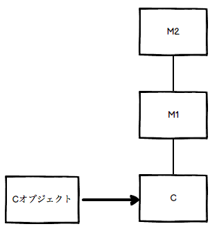

goldで間違えた問題
================


## 次のコードを実行するとどうなりますか

> 一応正解したが、念のため
>
> 2018/11/02

`lazy`は`Enumerator::Lazy`クラスを返します。

`Enumerator::Lazy`クラスは`map`や`select`メソッドに遅延評価を提供します。


`take(3)`が実行されると`1`から`3`まで`map`に渡されたものと判断され、`inject`に渡されます。

よって、答えは`12`になります。

この時、`4`から`10`までの評価は発生しません。

```ruby
>> p (1..10).lazy.map{|num|
>>   num * 2
>> }.take(3).inject(0, &:+)
12
=> 12
```


## 次のコードを実行するとどうなりますか

> 一応正解したが、念のため
>
> 2018/11/02

```ruby
>> ^C
>> class C
>>   @val = 3
>>   attr_accessor :val
>>   class << self
>>     @val = 10
>>   end
>>   def initialize
>>     @val *= 2 if val
>>   end
>> end
=> :initialize

>> c = C.new
=> #<C:0x007fc2e593b1d8>
>> c.val += 10
NoMethodError: undefined method '+' for nil:NilClass
>> p c.val
nil
=> nil
```


### 解説

問題のコードは、13行目で`c.val`が`nil`になり、実行エラーになります。

2行目の`@val`はクラスインスタンス変数といい、特異メソッドからアクセスすることができます。

3行目の`@val`は特異クラスのクラスインスタンス変数です。

この値にアクセスするためには以下のようにアクセスします。

```ruby
class << C
  p @val
end
```

13行目の`c.val`は`attr_accessor`よりアクセスされます。

`initialize`メソッドで初期化が行われていないため、`nil`が返されます。

以下のコードは問題コードに行番号をつけています。

```ruby
1: class C
2:   @val = 3
3:   attr_accessor :val
4:   class << self
5:     @val = 10
6:   end
7:   def initialize
8:     @val *= 2 if val
9:   end
10: end
11:
12: c = C.new
13: c.val += 10
14:
15: p c.val
```


## 次のコードを実行するとどうなりますか

`include`は`Module`のインスタンスメソッドをMix-inするメソッドです。

`C.methods`は`C`の特異メソッドを表示します。

よって、`C#class_m`はインスタンスメソッドです、`C.methods`では表示されません。

```ruby
>> module M
>>   def class_m
>>     "class_m"
>>   end
>> end
=> :class_m
>>
>> class C
>>   include M
>> end
=> C

>> p C.methods.include? :class_m
false
=> false

# オブジェクトを生成した場合は、存在する
>> obj = C.new
=> #<C:0x007f91a7936cd8>
>> p obj.methods.include? :class_m
true
=> true
```


## Rubyで使用可能なオプションではないものを選択しなさい(複数)。

> かなり覚える量が多いので、一回ストップ
>
> 2018/11/02

1. `-t`：存在しない

2. `-l`：行末の自動処理を行います。各行の最後に`String#chop!`を実行。

3. `-p`：`-n`と同じだが`$_`を出力

4. `-f`：存在しない


## 次のプログラムは`Enumerator::Lazy`を使っています。先頭から5つの値を取り出すにはどのメソッドが必要ですか

```ruby
>> (1..100).each.lazy.chunk(&:even?)
=> #<Enumerator::Lazy: #<Enumerator: #<Enumerator::Generator:0x007f91a7933ba0>:each>>
```

1. `take(5)`

  ```ruby
  >> (1..100).each.lazy.chunk(&:even?).take(5)
  => #<Enumerator::Lazy: #<Enumerator::Lazy: #<Enumerator: #<Enumerator::Generator:0x007f91a799bdb8>:each>>:take(5)>
  ```

2. `take(5).force`

  ```ruby
  >> (1..100).each.lazy.chunk(&:even?).take(5).force
  => [[false, [1]], [true, [2]], [false, [3]], [true, [4]], [false, [5]]]
  ```

3. `first(5)`

  ```ruby
  >> (1..100).each.lazy.chunk(&:even?).first(5)
  => [[false, [1]], [true, [2]], [false, [3]], [true, [4]], [false, [5]]]
  ```

4. `first(5).force`

  ```ruby
  >> (1..100).each.lazy.chunk(&:even?).first(5).force
  NoMethodError: undefined method 'force' for #<Array:0x007f91a9048f70>
  ```


### 解説

値を取り出すには、

* `Enumerator::Lazy#force`

* `Enumerator::Lazy#first`

を呼び出す必要があります。

問題文には「先頭から5つ」とあるので、`first(5)`として取り出します。

また、`Enumerator::Lazy#force`で問題文の通りにするには`Enumerator::Lazy#take`も利用します。

`Enumerator::Lazy#take`は`Enumerable#take`と違い`Enumerator::Lazy`のインスタンスを戻り値にします。

そのインスタンスから`Enumerator::Lazy#force`で実際の値を取り出します。


## 次のコードを実行するとどうなりますか

```ruby
>> local = 0
=> 0

>> p1 = Proc.new { |arg1, arg2|
>>   arg1, arg2 = arg1.to_i, arg2.to_i
>>   local += [arg1, arg2].max
>> }
=> #<Proc:0x007fe1b6883638@(irb):3>

>> p1.call("1", "2")
=> 2
>> p1.call("7", "5")
=> 9
>> p1.call("9")
=> 18

>> p local
18
=> 18
```


### 解説

`Proc`は`call`の際に引数の数を省略することができます。

その際、不足の引数へは`nil`が代入されます。

`Proc`に似た機能に`lambda`があります。

似ていますが、異なる部分もあります。

次の表が`Proc`と`lambda`の違いになります。

|    特徴   |    Proc    |lambda|
|----------|------------|------|
|  引数の数  |     曖昧    |  厳密 |
|引数の渡し方|Proc.new { \| x, y\|

`return`, `brake`, `next`	`call`以降が実行されない	call以降も実行される

そのほか、`lambda`はアロー演算子で定義することができます。


## 次のコードを実行するとどうなりますか

> 正解したが、念のため
>
> 2018/11/03

```ruby
>> val = 1 + 1/2r
=> (3/2)
>> puts val.class
Rational
=> nil
```


### 解説

`1/2r`はRationalのインスタンスが作成されます。

FixnumとRationalの演算はRationalになります。

(Ruby 2.4からFixnumとBignumが統合されIntegerになりました)

その他のクラス演算を以下にまとめます。

|         演算         |戻り値クラス|
|---------------------|-----------|
|FixnumとRationalの演算 | Rational |
| FloatとRationalの演算 |   Float  |
| FixnumとComplexの演算 |  Complex |
|  FloatとComplexの演算 |  Complex |
|     Date同士の減算    |  Rational |
|     Time同士の減算    |   Float   |
|   DateTime同士の減算  |  Rational |


## 次のコードを実行するとどうなりますか

```ruby
>> def m1(*)
>>   str = yield if block_given?
>>   p "m1 #{str}"
>> end
=> :m1

>> def m2(*)
>>   str = yield if block_given?
>>   p "m2 #{str}"
>> end
=> :m2

>> m1 m2 do
>>   "hello"
>> end
"m2 "
"m1 hello"
=> "m1 hello"
```


### 解説

問題のコードで使用されているメソッド類は以下の通りです。

* `Kernel#block_given?`はブロックが渡された場合は、真になります。

* `yield`はブロックの内容を評価します。

* `{ }`は`do end`よりも結合度が高い為、実行結果に差が出ます。

問題のコードは以下のように解釈されます。

* `m1`の引数と解釈されるため、`m2`の戻り値は`m2`が表示されます。

* `m1`へ`do .. end`のブロックが渡されます。よって、`m1 hello`が表示されます。

```ruby
>> m1(m2) do
>>   "hello"
>> end
"m2 "
"m1 hello"
=> "m1 hello"
```

問題のコードを`{}`で置き換えた場合は以下の実行結果になります。

```ruby
>> m1 m2 {  # m1 (m2 { .. } ) と解釈される
>>   "hello"
>> }
"m2 hello"
"m1 "
=> "m1 "
```


## 以下のコードを実行するとどうなりますか

`initialize`は`private`などでアクセス修飾子をつけたとしても、`private`から変わることはありません。

```ruby
>> class C
>> public
>>   def initialize
>>   end
>> end
=> :initialize

>> p C.new.private_methods.include? :initialize
true
=> true
```


## 次のコードを実行するとどうなりますか

```ruby
>> module M1
>> end
=> nil

>> module M2
>> end
=> nil

>> class C
>>   include M1, M2
>> end
=> C

>> p C.ancestors
[C, M1, M2, Object, Kernel, BasicObject]
=> [C, M1, M2, Object, Kernel, BasicObject]
```


### 解説

`include`はモジュールのメソッドをインスタンスメソッドとして追加します。

メソッド探索順は`self`の後に追加されます。

複数モジュールを指定した場合は、 **左側が先にメソッド探索** されます。




## 次のコードを実行するとどうなりますか

`using`はメソッドの中で呼び出すことは出来ません。呼び出した場合は`RuntimeError`が発生します。

```ruby
>> class C
>> end
=> nil
>>
>> module M
>>   refine C do
>>     def m1
>>       100
>>     end
>>   end
>> end
=> #<refinement:C@M>
>>
>> class C
>>   def m1
>>     400
>>   end
>>
>>   def self.using_m
>>     using M
>>   end
>> end
=> :using_m
>>
>> C.using_m
RuntimeError: Module#using is not permitted in methods
>>
>> puts C.new.m1
400
=> nil
```


## 次のプログラムを実行するとどうなりますか

`refer_const`はモジュールMにありますが、`CONST`はレキシカルに決定されるためモジュールMのスコープを探索します。

この問題では`CONST`が見つからないため例外が発生します。

```ruby
>> module M
>>   def refer_const
>>     CONST
>>   end
>> end
=> :refer_const

>> module E
>>   CONST = '010'
>> end
=> "010"

>> class D
>>   CONST = "001"
>> end
=> "001"

>> class C < D
>>   include E
>>   include M
>>   CONST = '100'
>> end
TypeError: superclass mismatch for class C

>> c = C.new
=> #<C:0x007ff8a10efaa0>
>> p c.refer_const
NoMethodError: undefined method 'refer_const' for #<C:0x007ff8a10efaa0>
```

> なぜTypeErrorになるのかが分からない
>
> 2018/11/03


## 次のプログラムは"Hello, world"と表示します。同じ結果になる選択肢はどれですか（複数選択）

```ruby
>> module M
>>   CONST = "Hello, world"
>>   def self.say
>>     CONST
>>   end
>> end
=> :say

>> p M::say
"Hello, world"
=> "Hello, world"
```

1. 選択肢1

定数の定義はメモリ上にあるテーブルに管理されます。

モジュールMを別々に書いたとしてもテーブルを参照して値を取得できます。

```ruby
>> module M
>>   CONST = "Hello, world"
>> end
=> "Hello, world"

>> module M
>>   def self.say
>>     CONST
>>   end
>> end
=> :say

>> p M::say
"Hello, world"
=> "Hello, world"
```

2. 選択肢2

`instance_eval`の引数に文字列を指定するとネストの状態はモジュールMの特異クラスになります。

`CONST`はモジュールMにのみありますので、例外が発生します。

```ruby
>> module M
>>   CONST = "Hello, world"
>> end
=> "Hello, world"

>> M.instance_eval(<<-CODE)
  def say
    CONST
  end
CODE
=> :say

>> p M::say
NameError: uninitialized constant #<Class:M>::CONST
```

3. 選択肢3

特異クラス定義のコンテキストでは、ネストの状態はモジュールMの特異クラスになります。

`CONST`はモジュールMにのみありますので、例外が発生します。

```ruby
>> module M
>>   CONST = "Hello, world"
>> end
=> "Hello, world"

>> class << M
>>   def say
>>     CONST
>>   end
>> end
=> :say

>> p M::say
NameError: uninitialized constant #<Class:M>::CONST
```

4. 選択肢4

`module_eval`の引数に文字列を指定するとネストの状態はモジュールMになります。

`CONST`はモジュールMにありますので値を取得できます。

```ruby
>> module M
>>   CONST = "Hello, world"
>> end
=> "Hello, world"

>> M.module_eval(<<-CODE)
  def self.say
    CONST
  end
CODE
=> :say

>> p M::say
"Hello, world"
=> "Hello, world"
```


## 次のプログラムを実行するとどうなりますか

```ruby
>> class C
>>   CONST = "Hello, world"
>> end
=> "Hello, world"

>> $c = C.new
=> #<C:0x007fa39b80c758>

>> class D
>>   class << $c
>>     def say
>>       CONST
>>     end
>>   end
>> end
=> :say

>> p $c.say
"Hello, world"
=> "Hello, world"
```

レキシカルスコープには定数はありません。その場合はスーパークラスを探索します。

特異クラスの継承関係にクラスCがありますので定数を見つけることができます。

参考：特異クラスの継承関係

```ruby
[#<Class:#<C:0x007fa4741607e0>>, C, Object, Kernel, BasicObject]
```


## 次のコードを実行するとどうなりますか

```ruby
class C
  def m1
    200
  end
end

module R
  refine C do
    def m1
      300
    end
  end
end

using R

class C
  def m1
    100
  end
end

puts C.new.m1
=> 300
```

Refinementで再定義したメソッドの探索ですが、prependより優先して探索が行われます。

例えば、クラスCはクラスBを継承しているとすると次のような順に探索を行います。

Refinement -> prependしたモジュール -> クラスC -> includeしたモジュール -> クラスCの親（クラスB）

問題では`using`の後にクラスオープンしてメソッドを再定義していますが、Refinementにある`300`が表示されます。

> 探索についてもう一度復習！
>
> 2018/11/03


## 次のプログラムの`__(1)__`に適切な内容を選択して実行すると、[97, 112, 112, 108, 101]と表示されます。期待した結果を得られるように正しい選択肢を選んでください

```ruby
enum_char = Enumerator.new do |yielder|
  "apple".each_char do |chr|
    __(1)__
  end
end

array = enum_char.map do |chr|
  chr.ord
end

p array
```

1. `yielder.call chr`

2. `yielder(chr)`

3. `yielder << chr`

4. `yielder.inject chr`


### 解説

`map`メソッドのブロックはEnumeratorオブジェクトをレシーバーとした場合にEnumerator::Yielderオブジェクトとなります。

この問題のプログラム上では変数`yielder`を指します。

Enumerator::Yielderを評価するには、`<<`を呼び出します。

選択肢にある他のメソッドは実装されていません。

```ruby
>> enum_char = Enumerator.new do |yielder|
>>   "apple".each_char do |chr|
>>     yielder << chr
>>   end
>> end
=> #<Enumerator: #<Enumerator::Generator:0x007fc1bf8dd168>:each>

>> array = enum_char.map do |chr|
>>   chr.ord
>> end
=> [97, 112, 112, 108, 101]

>> p array
[97, 112, 112, 108, 101]
=> [97, 112, 112, 108, 101]
```


## 以下のコードを実行するとどうなりますか

```ruby
>> class S
>>   @@val = 0
>>   def initialize
>>     @@val += 1
>>   end
>> end
=> :initialize

>> class C < S
>>   class << C
>>     @@val += 1
>>   end
>> end
=> 1

>> C.new
=> #<C:0x007fac7d09bfb0>
>> C.new
=> #<C:0x007fac7d09a610>
>> S.new
=> #<S:0x007fac7d098cc0>
>> S.new
=> #<S:0x007fac7c1472d0>

>> p C.class_variable_get(:@@val)
5
=> 5
```

`@@val`に`1`加算しているタイミングは以下です。

* Cクラスの特異クラスを定義

* C.newの呼び出し

* S.newの呼び出し


## 次のプログラムを実行するとどうなりますか

```ruby
>> module SuperMod
>> end
=> nil

>> module SuperMod::BaseMod
>>   p Module.nesting
>> end
[SuperMod::BaseMod]
=> [SuperMod::BaseMod]
```


### 解説

`Module.nesting`はネストの状態を表示します。

次のプログラムを実行すると、`[SuperMod]`と表示されます。

```ruby
>> module SuperMod
>>   p Module.nesting
>> end
[SuperMod]
=> [SuperMod]
```

モジュールがネストされた場合は、ネストの状態をすべて表示します。

`SuperMod::BaseMod`のようにプログラムを書くと、モジュールSuperModの内側にモジュールBaseModがあることを表現することが出来ます。

インデントして別々に書いた場合に比べて、プレフィックスがある場合は内側にあるモジュールしかネストの状態は表示されません。

```ruby
>> module SuperMod
>>   p Module.nesting
>> end
[SuperMod]
=> [SuperMod]

>> module SuperMod
>>   module BaseMod
>>     p Module.nesting
>>   end
>> end
[SuperMod::BaseMod, SuperMod]
=> [SuperMod::BaseMod, SuperMod]

>> module SuperMod::BaseMod
>>   p Module.nesting
>> end
[SuperMod::BaseMod]
=> [SuperMod::BaseMod]
```

* 定数はネストした構造を持つことがある（これは実行時に値から参照できる構造）

* 一方でプログラム中の定数の参照は、構文的な構造に依存するもので、実行時の構造は関係がない(レキシカルスコープ)

* SuperModの中に書いたBaseModは、それぞれのモジュール式を遡って行って、SuperMod::BaseMod、SuperModを出力

* 一方で、SuperMod::BaseModという名前のモジュール式の中に書いたものは、モジュール式を遡ることができず、SuperMod::BaseModが出力


## 次のコードを実行するとどうなりますか

```ruby
>> module M
>>   def foo
>>     super
>>     puts "M#foo"
>>   end
>> end
=> :foo

>> class C2
>>   def foo
>>     puts "C2#foo"
>>   end
>> end
=> :foo

>> class C < C2
>>   def foo
>>     super
>>     puts "C#foo"
>>   end
>>   include M
>> end
=> C

>> C.new.foo
C2#foo
M#foo
C#foo
=> nil
```

`include`はモジュールのメソッドをインスタンスメソッドとして追加します。

メソッド探索順は`self`の後に追加されます。


## 期待した出力結果になるようにXXXXに適切なコードを選べ

```ruby
class String
  XXXX
end

p "12345".hoge
```

```ruby
# 実行結果
54321
```

1. `alias :hoge, :reverse`

2. `alias :reverse, :hoge`

3. `alias hoge reverse`

4. `alias reverse hoge`


### 解説

`alias`式はメソッドやグローバル変数に別名を付けることができます。

定義は以下のようにします。

```ruby
alias new_method old_method
alias :new_method :old_method
alias $new_global_val $old_global_val
```

メソッド内でメソッドに別名をつける必要がある場合は、`Module#alias_method`を使います。

```ruby
alias_method "new_method", "old_method"
alias_method :new_method, :old_method
```


## 次のコードを実行するとどうなりますか。

```ruby
>> v1 = 1 / 2 == 0
=> true
>> v2 = !!v1 or raise RuntimeError
=> true
>> puts v2 and false
true
=> nil
```


### 解説

```ruby
1: v1 = 1 / 2 == 0
2: v2 = !!v1 or raise RuntimeError
3: puts v2 and false
```

#### 1行目

Fixnumクラス同士の除算はFixnumクラスになります。

よって、`0 == 0`が評価され、`v1`はtrueになります。

```ruby
>> 1 / 2      # Fixnumクラス(trueになる)
=> 0
>> 1.0 / 2.0  # Floatクラス(falseになる)
=> 0.5
```

#### 2行目

`or`は左辺が真であればその結果を返します。この時、右辺は評価されません。

左辺が偽であれば、右辺を評価しその結果を返します。

また、`or`は評価する優先順位が低い演算子です。

よって、優先順位が低いので`v2`には`!!v1`の結果のtrueが入ります。

次に、`!!v1 or raise RuntimeError`が評価され、左辺が真であるため、左辺のみ評価されます。

```ruby
>> v1 = 1 / 2 == 0
=> true
>> !v1
=> false
>> !!v1
=> true
```


#### 3行目

`and`は左辺が真であれば、右辺の結果を返します。左辺が偽であれば、左辺の結果を返します。

また、`and`は評価する優先順位が低い演算子です。

よって、優先順位が低いので`puts v2`が評価されます。


演算子の優先順位を適切にするためには、括弧で式を区切ります。


## 次のコードを実行するとどうなりますか

```ruby
>> def foo(arg1:100, arg2:200)
>>   puts arg1
>>   puts arg2
>> end
=> :foo

>> option = {arg2: 900}
=> {:arg2=>900}

>> foo arg1: 200, *option
SyntaxError: (irb):8: syntax error, unexpected *
```

キーワード引数へHashオブジェクトを渡すことができます。

Hashの中身を渡す必要があるので、変数の前に`**`を付加します。

```ruby
>> def foo(arg1:100, arg2:200)
>>   puts arg1
>>   puts arg2
>> end
=> :foo

>> option = {arg2: 900}
=> {:arg2=>900}

>> foo arg1: 200, **option    # 変数の前のオペランドを`**`に変更
200
900
=> nil
```


## 次のコードを実行するとどうなりますか

```ruby
>> class Integer
>>   def +(other)
>>     self.-(other)
>>   end
>> end
=> :+

>> p 1 + 1
0
=> 0
```

数値はFixnumクラスのオブジェクトです。FixnumクラスはIntegerクラスのサブクラスです。

問題では、Integerクラスへ`+`メソッドをオープンクラスし、オーバーロードているように取れます。

しかし、`+`メソッドはFixnumクラスで定義されています。

よって、元の`Fixnum#+`が呼ばれます。

```ruby
>> p 1.class.ancestors
[Integer, Numeric, Comparable, Object, Kernel, BasicObject]
=> [Integer, Numeric, Comparable, Object, Kernel, BasicObject]
>> p Numeric.method_defined?(:+)
false
=> false
>> p Integer.method_defined?(:+)
true
=> true
>> p Fixnum.method_defined?(:+)
(irb):-7: warning: constant ::Fixnum is deprecated
true
=> true
```


## 次のコードを実行するとどうなりますか

```ruby
>> class Company
>>   attr_reader :id
>>   attr_accessor :name
>>   def initialize id, name
>>     @id = id
>>     @name = name
>>   end
>>   def to_s
>>     "#{id}:#{name}"
>>   end
>>   def <=> other
>>     other.id <=> self.id
>>   end
>> end
=> :<=>

>> companies = []
=> []
>> companies << Company.new(2, 'Liberyfish')
=> [#<Company:0x007fc0c888c3a0 @id=2, @name="Liberyfish">]
>> companies << Company.new(3, 'Freefish')
=> [#<Company:0x007fc0c888c3a0 @id=2, @name="Liberyfish">, #<Company:0x007fc0c8136f10 @id=3, @name="Freefish">]
>> companies << Company.new(1, 'Freedomfish')
=> [#<Company:0x007fc0c888c3a0 @id=2, @name="Liberyfish">, #<Company:0x007fc0c8136f10 @id=3, @name="Freefish">, #<Company:0x007fc0c812d3e8 @id=1, @name="Freedomfish">]

>> companies.sort!
=> [#<Company:0x007fc0c8136f10 @id=3, @name="Freefish">, #<Company:0x007fc0c888c3a0 @id=2, @name="Liberyfish">, #<Company:0x007fc0c812d3e8 @id=1, @name="Freedomfish">]

>> companies.each do |e|
>>   puts e
>> end
3:Freefish
2:Liberyfish
1:Freedomfish
=> [#<Company:0x007fc0c8136f10 @id=3, @name="Freefish">, #<Company:0x007fc0c888c3a0 @id=2, @name="Liberyfish">, #<Company:0x007fc0c812d3e8 @id=1, @name="Freedomfish">]
```


### 解説

`Array#sort`は比較に`<=>`を使用しています。

自作クラスの場合はオブジェクトIDが比較対象となります。

別のソート条件を用いるには<=>をオーバーライドします。

`Fixnum#<=>(other)`は以下の結果を返します。

  * `self`が`other`より大きい場合は、`1`を返します。
  * `self`が`other`と等しい場合は、`0`を返します。
  * `self`が`other`より小さい場合は、`-1`を返します。

問題のコードでは、`sort!`は破壊的メソッドです。

よって`puts`時点ではソートが行われて表示されます。


## 実行してもエラーにならないコードを選べ

引数名に`&`を付与することでブロック引数になります。

ブロック引数は他の引数より後に記述します。

1. 選択肢1

```ruby
>> def bar(&block)
>>   block.yield
>> end
=> :bar

>> bar do
>>   puts "hello, world"
>> end
hello, world
=> nil
```

2. 選択肢2

```ruby
>> def bar(&block)
>>   block.call
>> end
=> :bar

>> bar do
>>   puts "hello, world"
>> end
hello, world
=> nil
```

3. 選択肢3

```ruby
>> def bar(&block, n)
>>   block.call
>> end
SyntaxError:

>> bar(5) {
>>   puts "hello, world"
>> }
NoMethodError:
```

4. 選択肢4

```ruby
>> def bar(n, &block)
>>   block.call
>> end
=> :bar

>> bar(5) {
>>   puts "hello, world"
>> }
hello, world
=> nil
```


## 次のコードを実行するとどうなりますか

```ruby
while not DATA.eof?
  print DATA.read 1
end

__END__
1
2
3
4

# 実行結果
1
2
3
4
```


### 解説

`__END__`以降をファイルとして扱います。

このファイルにアクセスするためには、FileクラスのオブジェクトのDATAを用います。

`File#read(length = nil, outbuf = "")`は`length`を指定すると、そのバイト数分文字列を読み込みます。

省略した場合は、ファイルの終端まで全て読み込みます。


## 次のコードを実行するとどうなりますか

```ruby
>> p "Matz is my tEacher".scan(/[is|my]/).length
4
=> 4
```

問題で使用されている正規表現の説明は下記の通りです。

  * `String#scan`はマッチした部分文字列を配列で返します。

  * 正規表現の`[]`は囲まれた`*`文字`*`1つ1つにマッチします。

  * `|`は正規表現ではORのメタ文字です。

  * 今回は、`|`が`[]`に囲まれているため、これもマッチ対象になります。

問題のコードで`scan(/[is|my]/)`が返す配列は`["i", "s", "m", "y"]`になります。

```ruby
>> p "Matz is my tEacher".scan(/[is|my]/)
["i", "s", "m", "y"]
=> ["i", "s", "m", "y"]
```


## 次のコードを実行するとどうなりますか

```ruby
>> begin
>>   raise "Err!"
>> rescue => e
>>   puts e.class
>> end
RuntimeError
=> nil
```

`raise`の例外クラスを省略した場合は、RuntimeErrorを発生させます。

`rescue`の例外クラスを省略した場合は、StandardErrorを捕捉します。

RuntimeErrorはstanderdErrorのサブクラスです。


## 次のプログラムを実行するとどうなりますか

```ruby
>> val = 100
=> 100

>> def method(val)
>>   yield(15 + val)       # 15 + 100 = 115
>> end
=> :method

>> _proc = Proc.new{|arg| val + arg }   # 115 + 100 = 215
=> #<Proc:0x007fce069018d0@(irb):7>

>> p method(val, &_proc)       # トップレベルのvalを指定
215
=> 215
```

ブロックにあるローカル変数`val`はトップレベルにあるものと同じです。

`100 + (15 + 100)`を計算して、この問題の答えは215です。


## 次のプログラムで実行した期待値を得られるように、`__(1)__`と`__(2)__`のメソッドの組み合わせを選んでください。

```ruby
fiber = Fiber.new do
  __(1)__ 'Hi, there!'
end

p __(2)__
```

```ruby
# 期待値
"Hi, there!"
```

* 解答

```ruby
__(1)__ ruby Fiber.yield
__(2)__ ruby fiber.resume
```


### 解説

Fiberは軽量スレッドを提供します。

Fiber#resumeを実行するとFiber.yieldが最後に実行された行から再開するか、Fiber.newに指定したブロックの最初の評価を行います。

サンプルプログラムを実行して、処理の内容を見てみましょう。

```ruby
>> f = Fiber.new do |name|
>>   Fiber.yield "Hi, #{name}"
>> end
=> #<Fiber:0x007fce068e8128>

>> p f.resume('Matz')
"Hi, Matz"
=> "Hi, Matz"
```

1. `f.resume('Matz')`を実行する。

1. `Fiber.new`のブロックを評価し、引数`name`には`'Matz'`をセットする。

1. 変数を展開して、`'Hi, Matz'`を`Fiber.yield`の引数にセットする。

1. `Fiber.yield('Hi, Matz')`を実行すると、`f.resume('Matz')`の戻り値が`'Hi, Matz'`になる。

1. `Fiber.yield('Hi, Matz')`の実行終了を待たずに、プログラムが終了する。

問題のプログラムの期待値を得る組み合わせは次のとおりです。

```ruby
>> fiber = Fiber.new do
>>   Fiber.yield 'Hi, there!'
>> end
=> #<Fiber:0x007fb0a880f2e0>

>> p fiber.resume
"Hi, there!"
=> "Hi, there!"
```


## 次のコードで指定した行を書き換えた時，同じ結果になるものを選べ（複数選択）

```ruby
class C
  def v=(other) # ここから
    @v = other
  end
  def v
    @v
  end           # ここまで
end

c = C.new
c.v = 100
p c.v
```

* 解答

```ruby
# 1
attr_reader :v
attr_writer :v

# 2
attr_accessor :v
```

* `attr_reader`はインスタンス変数を返すメソッド`(def v\ end)`を作成します。

* `attr_writer`はインスタンス変数を変更するメソッド`(def v=\ end)`を作成します。

* `attr_accessor`はインスタンス変数を返すメソッドと変更するメソッドを作成します。


## 次のプログラムを実行するとどうなりますか

```ruby
>> m = Module.new
=> #<Module:0x007f96b40472f0>

>> CONST = "Constant in Toplevel"
=> "Constant in Toplevel"
>>
>> _proc = Proc.new do
>>   CONST = "Constant in Proc"
>> end
=> #<Proc:0x007f96b38b0ac8@(irb):5>

>> m.instance_eval(<<-EOS)
  CONST = "Constant in Module instance"

  def const
    CONST
  end
EOS
=> :const

>> m.module_eval(&_proc)
(irb):6: warning: already initialized constant CONST
(irb):3: warning: previous definition of CONST was here
=> "Constant in Proc"

>> p m.const
"Constant in Module instance"
=> "Constant in Module instance"
```


### 解説

メソッド`const`は特異クラスで定義されていますので、実行することができます。

その中で参照している定数`CONST`はレキシカルに決定されますので、`"Constant in Module instance"`が表示されます。


`instance_eval`はブロックを渡す場合と、文字列を引数とする場合でネストの状態が異なります。

ブロックを渡した場合はネストは変わりませんが、文字列を引数とした場合は期待するネストの状態になります。

ネストが変わらない状態で定数の代入を行うと、再代入になり警告が表示される場合があります。

例えば、次のプログラムでは`module_eval`に文字列を引数とするとモジュールを再オープン、または定義したネストと同じです。

```ruby
>> module M
>>   p Module.nesting
>> end
[M]
=> [M]

>> M.module_eval(<<-EVAL)
  p Module.nesting
EVAL
[M]
=> [M]

>> M.instance_eval do
>>   p Module.nesting
>> end
[]
=> []

>> module M
>>   p Module.nesting
>> end
[M]
=> [M]
```


## 次のプログラムを実行すると何が表示されますか

```ruby
>> f = Fiber.new do |total|
>>   Fiber.yield total + 10
>> end
=> #<Fiber:0x007fb67d80d280>

>> p f.resume(100) + f.resume(5)
115
=> 115
```


### 解説

Fiberは軽量スレッドを提供します。

Fiber#resumeを実行するとFiber.yieldが最後に実行された行から再開するか、Fiber.newに指定したブロックの最初の評価を行います。

サンプルプログラムを実行して、処理の内容を見てみましょう。

```ruby
>> f = Fiber.new do |name|
>>   Fiber.yield "Hi, #{name}"
>> end
=> #<Fiber:0x007fa095806910>

>> p f.resume('Matz')
"Hi, Matz"
=> "Hi, Matz"
```

1. `f.resume('Matz')`を実行する。

1. `Fiber.new`のブロックを評価し、引数`name`には'Matz'をセットする。

1. 変数を展開して、'Hi, Matz'を`Fiber.yield`の引数にセットする。

1. `Fiber.yield('Hi, Matz')`を実行すると、`f.resume('Matz')`の戻り値が'Hi, Matz'になる。

1. `Fiber.yield('Hi, Matz')`の実行終了を待たずに、プログラムが終了する。

問題では、`Fiber#resume`を２回実行していますが処理の順序は同じです。

```ruby
>> f = Fiber.new do |total|
>>   Fiber.yield total + 10
>> end
=> #<Fiber:0x007f869a80d220>

>> p f.resume(100) + f.resume(5)
115
=> 115
```

1. `f.resume(100)`を実行する。

1. `Fiber.new`のブロックを評価し、引数`total`には`100`をセットする。

1. `100 + 10`を計算して`110`を`Fiber.yield`の引数にセットする。

1. `Fiber.yield(110)`を実行すると、`f.resume(100)`の戻り値が`110`になる。

1. `f.resume(5)`を実行する。

1. `Fiber.yield(110)`から処理を再開し、戻り値が`5`になる。

1. ブロックの最終行になったので、`f.resume(5)`の戻り値が`5`になる。

1. `110 + 5`を評価して、`115`が画面に表示される。


この問題のプログラムを実行すると、`115`が表示されます。

> よくわからない
>
> 2018/11/03


## 次のプログラムと同じ結果になる選択肢を選んでください

この問題ではアクセサを`attr_reader`で作成していますが、`alias`で`original_name`として別名をつけています。

新しく定義した`name`メソッドを実行すると、`Mr. Andrew`と表示されます。

```ruby
>> class Human
>>   attr_reader :name
>>
>>   alias original_name name
>>
>>   def name
>>     "Mr. " + original_name
>>   end
>>
>>   def initialize(name)
>>     @name = name
>>   end
>> end
=> :initialize

>> human = Human.new("Andrew")
=> #<Human:0x007f95588e40c8 @name="Andrew">
>> puts human.name
Mr. Andrew
=> nil
```

#### 選択肢1

`alias`と同じくメソッドの別名をつけます。オーバーライドして元のアクセサを呼び出すことができますので、問題と同じ結果になります

```ruby
>> class Human
>>   attr_reader :name
>>
>>   alias_method :original_name, :name
>>
>>   def name
>>     "Mr. " + original_name
>>   end
>>
>>   def initialize(name)
>>     @name = name
>>   end
>> end
=> :initialize

>> human = Human.new("Andrew")
=> #<Human:0x007fa7228176c8 @name="Andrew">
>> puts human.name
Mr. Andrew
=> nil
```

#### 選択肢2

`name`メソッドの中で`super`で親クラスの同名のメソッドを呼び出そうとしていますが、

親クラスのObjectにはそのようなメソッドはありませんので同じ結果になりません。

```ruby
>> class Human
>>   attr_reader :name
>>
>>   def name
>>     "Mr. " + super
>>   end
>>
>>   def initialize(name)
>>     @name = name
>>   end
>> end
=> :initialize

>> human = Human.new("Andrew")
=> #<Human:0x007fd32a0a7670 @name="Andrew">
>> puts human.name
NoMethodError: super: no superclass method 'name' for #<Human:0x007fd32a0a7670 @name="Andrew">
```

* 選択肢3

イニシャライザで初期化したインスタンス変数を`name`メソッドで参照していますので、問題と同じ結果になります。

```ruby
>> class Human
>>   attr_reader :name
>>
>>   def name
>>     "Mr. " + @name
>>   end
>>
>>   def initialize(name)
>>     @name = name
>>   end
>> end
=> :initialize

>> human = Human.new("Andrew")
=> #<Human:0x007feb948cbbf8 @name="Andrew">
>> puts human.name
Mr. Andrew
=> nil
```

* 選択肢4

`name`メソッドの中で同名のメソッドを呼び出していますので、再帰呼出し

終了せず、例外が発生しますので問題と同じ結果にはなりません。

```ruby
>> class Human
>>   attr_reader :name
>>
>>   def name
>>     "Mr. " + name
>>   end
>>
>>   def initialize(name)
>>     @name = name
>>   end
>> end
=> :initialize

>> human = Human.new("Andrew")
=> #<Human:0x007fd656213250 @name="Andrew">
>> puts human.name
SystemStackError: stack level too deep
```


| 版 |  年/月/日 |
|---|-----------|
|初版|2018/11/03|
