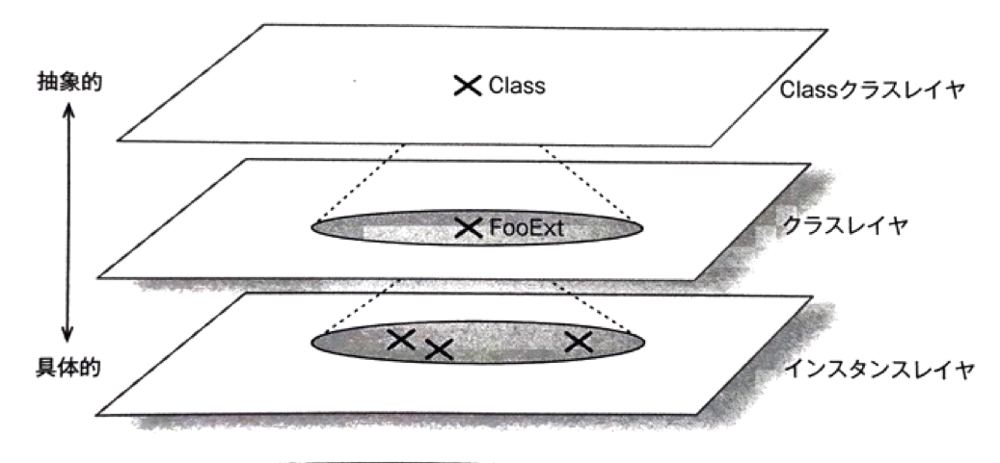
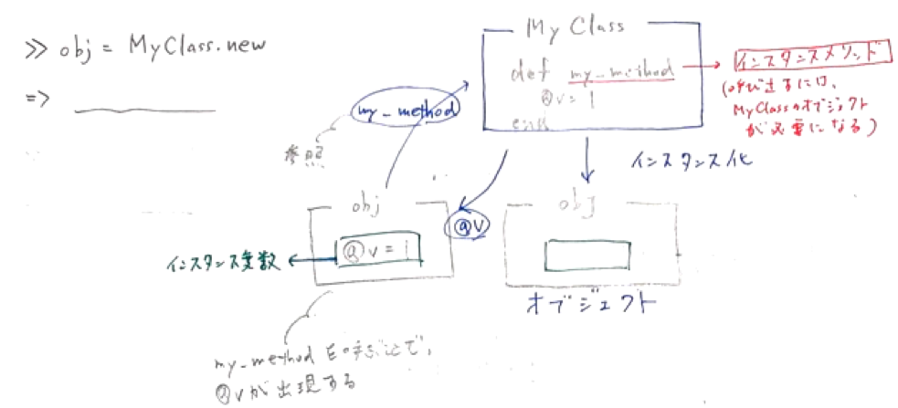
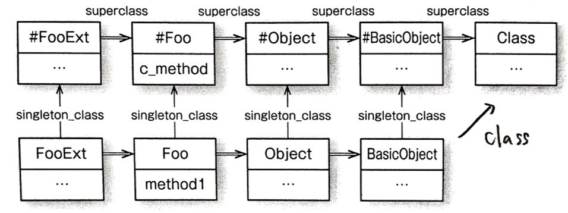

4-5.クラスメソッド
===============

* クラスメソッド：クラスオブジェクトをレシーバとするメソッド

  例)新たにインスタンスを作成する`new`メソッド

* Rubyのクラスメソッドは、クラスに対する特異クラスのメソッドとして定義される

## 4-5-1.`Class`クラス

* クラスオブジェクト：`Class`クラスのオブジェクト

  →`Class`クラスはクラスを定義する **クラス**

```ruby
>> "hello".class
=> String
>> String.class
=> Class
```

* `Class`クラスのインスタンスは、クラスそのもの

→`MyClass`という定数に、新しい`Class`クラスのインスタンスを割り当てることを意味する

```ruby
class MyClass; end
```


※Classオブジェクトを定数でなく、変数に代入した場合

```ruby
>> klass = Class.new
=> #<Class:0x007f9bac807290>
>> klass.name                     # Class#nameがnilとなる無名クラスができる
=> nil

>> obj = klass.new                # クラス名がなくてもインスタンスを作成できる
=> #<#<Class:0x007f9bac807290>:0x007f9bad027718>
>> obj.class
=> #<Class:0x007f9bac807290>

>> NamedClass = klass             # 名前のないClassオブジェクトに定数を代入すると、その時点で定数名がクラスとして設定される
=> NamedClass
>> klass.name
=> "NamedClass"
```

* `Class.new`を呼び出すことで、新しいクラスを生成している。他のオブジェクトのように操作することが可能

```ruby
>> SomeClass = Class.new
=> SomeClass
>> SomeClass.new
=> #<SomeClass:0x007f7ee000e360>
```

* オブジェクトと同様に、クラスにもメソッドがある。

  * オブジェクトのメソッド：そのクラスのインスタンスメソッド

  * クラスのメソッド：`Class`クラスのインスタンスメソッド

    * `new`：オブジェクトを生成する時に使用

    * `allocate`：`new`メソッドを補助(インスタンスの生成時に、`initialize`を呼び出さない)

    * `superclass`：継承を表す

* ただし、これらのインスタンスメソッドは`module`からインクルードされている

```ruby
>> Class.instance_methods(false)
=> [:new, :allocate, :superclass]

# superclassメソッド
>> Array.superclass
=> Object
>> Object.superclass
=> BasicObject
```


***

### `Class`クラスのスーパークラス

```ruby
>> Class.superclass
=> Module
>> Class.superclass.superclass
=> Object
```

* `Class`のスーパークラスは`Module`：全てのクラスはモジュール

  * クラス：オブジェクトの生成やクラス継承をするための3つのインスタンスメソッドを追加したモジュール

* クラスとモジュールは密接に結びついているため、同じ役割を担う「モノ」とみなしている

  * モジュール：どこかでインクルードする時に使用

  * クラス：インスタンスの生成や継承する時に使用

***

### `Class`クラスの生成

* クラスを定義するには2通りの方法がある

  1. class定義式を使う：スコープがclass定義式の内と外で変化する

  2. `Class.new`を使う：ブロックでクラスを定義するため、外側のスコープを参照することが可能

```ruby
>> external_scope = 1
=> 1

# 1. class定義式を使う
>> class ExpDefineClass
>>   puts external_scope
>> end
NameError: undefined local variable or method 'external_scope' for ExpDefineClass:Class

# 2. `Class.new`を使う
>> NewDefineClass = Class.new do
?>   puts external_scope
>> end
1
=> NewDefineClass
```

以下、教科書の例

```ruby
>> class Foo
>>   def initialize(a)
>>     @a
>>   end
>>   def method1
>>     @a
>>   end
>> end
=> :method1

>> FooExt = Class.new(Foo) do   # superclassはFoo
>>   def initialize(a,b)        # FooExtクラスの初期化メソッド
>>     @b = b
>>     super(a)
>>   end
>>   def method2(c)             # インスタンスメソッドmethod2の定義
>>     @a + @b + @c
>>   end
>> end
=> FooExt
```


#### `Class`クラスレイヤ位置



#### `Class`オブジェクトの位置


#### オブジェクトとクラスのまとめ




***

## 4-5-2.クラスメソッドの定義

* インスタンスメソッド：クラスオブジェクトに定義

* クラスメソッド：Classクラスオブジェクトに定義

### クラスメソッドの探索

* Classクラスを再オープンして、メソッドを定義すると、クラスメソッドとして使用される

* Classクラスで見つからない場合、Moduleクラスを探す

```ruby
>> class Class
>>   def c_method1
>>     1
>>   end
>> end
=> :c_method1

>> p Foo.c_method1
1
=> 1
>> p String.c_method1
1
=> 1
>> p Object.c_method1
1
=> 1
```

* 実行したインスタンスメソッドが見つからない場合、`Object#method_missing`が呼び出される

* 実行したクラスメソッドが見つからない場合、Moduleクラスを探してもない場合は、１つ下のレイヤにあるObjectを探す

  →Objectクラスのメソッドは、 **インスタンスメソッド** としても **クラスメソッド** としても使える


### クラスメソッドの定義

Classクラスにメソッドを追加すると、全てのクラスでクラスメソッドとして機能する

ここで、１つのクラスのみにクラスメソッドを定義する場合、特異メソッドを使用する

方法としては、以下の3通りがある

1. def式でクラスオブジェクトを指定する

2. `self`を用いて記述(クラス定義の中ではクラスを指すので)

3. `self`を指定して、特異クラスの再オープンをする

```ruby
# 1.の方法
>> class Foo
>>   def Foo.c_method2; 2; end
>> end
=> :c_method2
>> Foo.c_method2
=> 2

# 2.の方法
>> class Foo
>>   def self.c_method3; 3; end
>> end
=> :c_method3
>> Foo.c_method3
=> 3

# 3.の方法
>> class Foo
>>   class << self
>>     def c_method4; 4; end
>>   end
>> end
=> :c_method4
>> Foo.c_method4
=> 4
```

### Classクラスにおける特異クラスの継承チェーン

* クラスメソッドの定義は、一般的なインスタンスの特異クラスへメソッドを定義する考え方と同じ

* ただし、クラスオブジェクトは継承の関係を保持している



* 以下のコードでは、

  * `extend`：特異クラスの継承先に無名クラスを挿入する

  * `include`：クラスにインスタンスメソッドを追記する

```ruby
>> module M4
>>   def method1; 1; end
>> end
=> :method1

>> class C4
>>   include M4
>>   extend M4
>> end
=> C4

>> C4.method1
=> 1
>> c4 = C4.new
=> #<C4:0x007ff8638f1700>
>> c4.method1
=> 1
```


| 版 |  年/月/日 |
|----|----------|
|初版|2018/10/13|
