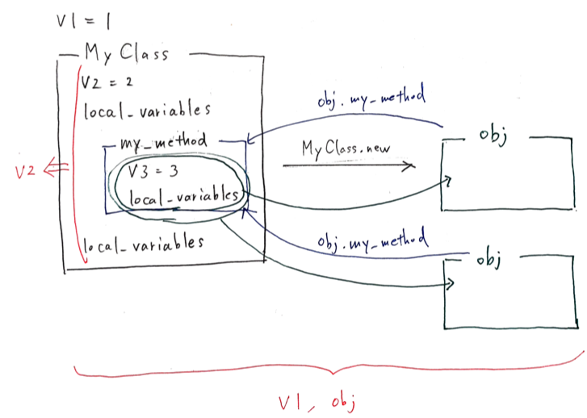

# ブロック

## ブロックの基本

* 波カッコ`{}`または`do...end`キーワードで定義される

  * 1行のブロック：波カッコ`{}`

  * 複数行のブロック：`do...end`

* ブロックを定義できるのは、メソッドを呼び出すとき

  →ブロックはメソッドに渡され、メソッドは`yield`キーワードを使ってブロックをコールバックする

```ruby
>> def a_method(a,b)
>>   a + yield(a,b)
>> end
=> :a_method

>> a_method(1,2) {|x,y| (x+y)*3}
=> 10
```


* メソッド内部では、`Kernel#block_given?`メソッドでブロックの有無を確認できる

```ruby
>> def a_method
>>   return yield if block_given?
>>   'ブロックがありません'
>> end
=> :a_method

>> a_method
=> "ブロックがありません"
>> a_method { "ブロックがあるよ！" }
=> "ブロックがあるよ！"
```

***

## ブロックはクロージャ

* ブロックのコードは、単体では実行できない

* 実行するには、ローカル変数、インスタンス変数、`self`といった環境が必要

  →これらは、オブジェクトに紐づけられた名前(束縛)という

  →ブロックは、これらをまとめてから実行の準備をする

  →コードと束縛の両方が含まれる

```ruby
>> def my_method
>>   x = "Goodbye"
>>   yield("cruel")
>> end
=> :my_method

>> x = "Hello"
=> "Hello"
>> my_method {|y| "#{x}, #{y} world"}
=> "Hello, cruel world"
```

* ブロックを作成すると、`x`のようなローカル変数を包み込む

* それからブロックをメソッドに渡すが、メソッドの中にある`x`はブロックからは見えないためにブロックが定義された時の`x`を見ている


* ブロックの中で新しい定義をすることができるが、ブロックが終了した時点で消えている

* ブロックがローカル束縛を包んで、一緒に連れて行くと考える

```ruby
>> def just_yield
>>   yield
>> end
=> :just_yield

>> top_level_variable = 1
=> 1

>> just_yield do
>>   top_level_variable += 1
>>   local_to_block = 1
>> end
=> 1

>> top_level_variable
=> 2
>> local_to_block
NameError: undefined local variable or method `local_to_block` for main:Object
```

### スコープ

#### スコープの変更

* トップレベルのスコープで、`v1`を定義している

* `MyClass`に入ることで、`v1`はスコープを外れて見えなくなる

* `MyClass`を定義しているスコープでは、変数`v2`とメソッドを定義している

  →メソッドのコードは実行されないので、クラス定義の終わりまで同じスコープ

  →クラス定義が終わると、`class`で開いたスコープが終わり、トップレベルのスコープに戻る

* `my_method`に入ると、新しいスコープをオープンして、ローカル変数`v3`を定義する

  →メソッドが終了すると、トップレベルのスコープに戻る。(スコープが消える)

  →2回目の呼び出しも同様

```ruby
>> v1 = 1
=> 1
>> class MyClass
>>   v2 = 2
>>   local_variables     # [:v2]
>>   def my_method
>>     v3 = 3
>>     local_variables
>>   end
>>   local_variables     # [:v2]
>> end
=> [:v2]

>> obj = MyClass.new
=> #<MyClass:0x007fdb80823350>
>> obj.my_method
=> [:v3]
>> obj.my_method
=> [:v3]
>> local_variables
=> [:obj, :v1, :_]
```



* 重要なことは、プログラムがスコープを変えると、新しい束縛と置き換えられる、こと


### グローバル変数とトップレベルのインスタンス変数

#### グローバル変数

* どのスコープからもアクセスできる

* システムのどこからでも変更可能なので、誰が何を変更したかを追跡するのが難しい

```ruby
>> def a_scope
>>   $var = "some value"
>> end
=> :a_scope

>> def another_scope
>>   $var
>> end
=> :another_scope

>> a_scope
=> "some value"
>> another_scope
=> "some value"
```

#### トップレベルのインスタンス変数

* トップレベルにある`main`オブジェクトのインスタンス変数

```ruby
>> @var = "トップレベルのインスタンス変数"
=> "トップレベルのインスタンス変数"

>> def my_method
>>   @var
>> end
=> :my_method

>> my_method
=> "トップレベルのインスタンス変数"
```

* `main`が`self`になる場所であればどこからでも呼び出せるが、他のオブジェクトが`self`になれば、トップレベルのインスタンス変数はスコープから外れる

```ruby
>> @var = "トップレベルのインスタンス変数"
=> "トップレベルのインスタンス変数"

>> class MyClass
>>   def my_method
>>     @var = "トップレベルの変数ではない"
>>   end
>> end
=> :my_method

>> obj = MyClass.new
=> #<MyClass:0x007fdb80816088>
>> obj.my_method
=> "トップレベルの変数ではない"
```

### スコープゲート

* プログラムがスコープを切り替えて、新しいスコープをオープンする場所は3つある

  * クラス定義

  * モジュール定義

  * メソッド

* これらの3つの境界線は、`class`、`module`、`def`といったキーワードで印がつけられる

  →`スコープゲート`として振る舞う

```ruby
>> v1 = 1
=> 1
>> class MyClass         # スコープゲート：classの入り口
>>   v2 = 2
>>   local_variables     # [:v2]
>>   def my_method       # スコープゲート：defの入り口
>>     v3 = 3
>>     local_variables
>>   end                 # スコープゲート：defの出口
>>   local_variables     # [:v2]
>> end                   # スコープゲート：classの出口
=> [:v2]

>> obj = MyClass.new
=> #<MyClass:0x007fdb80823350>
>> obj.my_method
=> [:v3]
>> obj.my_method
=> [:v3]
>> local_variables
=> [:obj, :v1, :_]
```

* クラスやモジュールの定義のコードは、すぐに実行される

* メソッド定義のコードは、メソッドを呼び出した時に実行される

### スコープのフラット化

* スコープゲートを超えて束縛を渡したいとき、

  * classのスコープゲート

  * defのスコープゲート

  を抜ける方法を以下で説明する

```ruby
my_var = "成功"

class MyClass
  # my_varをここに表示したい・・・
  def my_method
    # my_varをここに表示したい・・・
  end
end
```

#### classのスコープゲート

* `class`キーワードの代わりにメソッドを呼び出せば、`my_var`をクロージャに包んで、そのクロージャをメソッドに渡せる

* `class`と同じ効果のある、`Class.new`をブロックとして渡されれば、クラスにインスタンスメソッドが定義できる

```ruby
my_var = "成功"

MyClass = Class.new do
  puts "クラス定義の中は#{my_var}"

  def my_method
    # my_varをここに表示したい・・・
  end
end
```

#### defのスコープゲート

* キーワードをメソッド呼び出しに置き換えることで、動的メソッドと同じ要領でスコープを抜けることができる

* defの代わりに`Kernel#define_method`を使用する

```ruby
>> my_var = "成功"
=> "成功"

>> MyClass = Class.new do
>>   puts "クラス定義の中は#{my_var}"
>>
>>   define_method :my_method do
>>     "メソッド定義の中も#{my_var}"
>>   end
>> end
クラス定義の中は成功
=> MyClass

>> puts MyClass.new.my_method
メソッド定義の中も成功
=> nil
```

* `入れ子構造のレキシカルスコープ`：スコープゲートをメソッド呼び出しに置き換えることで、他のスコープ変数が見えるようになる技術

  →`フラットスコープ`：スコープのフラット化(2つのスコープを一緒の場所に押し込めて、変数を共有すること)

### スコープの共有

* 複数のメソッドで変数を共有したいが、その他からは見えないようにしたい場合、全てのメソッドを同じフラットスコープに定義する

* `Kernel`の`private`メソッドである`define_method`をアクセスするために、`send`を使用している

* `Kernel#counter`と`Kernel"inc`は、変数`shared`を参照できる。`define_methods`で囲んでいるので、その他のメソッドから参照できない

```ruby
>> def define_methods
>>   shared = 0
>>
>>   Kernel.send :define_method, :counter do
>>     shared
>>   end
>>
>>   Kernel.send :define_method, :inc do |x|
>>     shared += x
>>   end
>> end
=> :define_methods

>> define_methods
=> :inc

>> counter
=> 0
>> inc(4)
=> 4
>> counter
=> 4
```

***

## `instance_eval`

* オブジェクトのコンテキストでブロックを評価する

* `instance_eval`に渡したブロックは、レシーバを`self`にしてから評価される

  →レシーバの`private`メソッドや、インスタンス変数にアクセスできる

* 他のブロックと同じように、`instance_eval`を定義した時の束縛も見れる

```ruby
>> class MyClass
>>   def initialize
>>     @v = 1
>>   end
>> end
=> :initialize

>> obj = MyClass.new
=> #<MyClass:0x007fe49a80cc90 @v=1>

>> obj.instance_eval do
>>   p self
>>   p @v
>> end
#<MyClass:0x007fe49a80cc90 @v=1>
1
=> 1

>> v = 2
=> 2
>> obj.instance_eval{ @v = v}
=> 2
>> obj.instance_eval{ @v }
=> 2
```

* 同じフラットスコープえ評価されるものは、いずれもローカル変数`v`にアクセスできる

* ブロックは`self`となるオブジェクトのコンテキストでも評価されるため、`obj`のインスタンス変数である`@v`にもアクセスできる

  →`コンテキスト探査機`：`instance_eval`に渡したブロックのこと

### カプセル化の破壊

* コンテキスト探査機を使用すると、カプセル化を破壊できる

* テストでは、アプリケーションのロガーの設定を変更する必要のあるものがあるが、コンテキスト探査機で既存のアプリケーションロガーの中身を見てから、その設定を変更することで、新しいロガーを作る必要がなくなる

### クリーンルーム

* ブロックを評価する為だけにオブジェクトを生成したもの(ブロックを評価する環境のこと)

* ブロックに伴う環境のメソッドやインスタンス変数と名前が衝突する可能性があるので、メソッドもインスタンス変数もあまり増やさない方が良い

```ruby
class CleanRoom
  def current_temperature
    # ...
  end
end

clean_room = CleanRoom.new
clean_room.instance_eval do
  if current_temperature < 20
    # TODO: ジャケットを着る
  end
end
```

## 呼び出し可能オブジェクト

Rubyでコードを保管できる場所は、少なくとも3つある

* `Proc`のなか

* `lambda`のなか

* `メソッド`のなか

### `Proc`オブジェクト

* ブロックを保管しておき、あとで実行するにはオブジェクトが必要になる

  →`Proc`クラス：ブロックをオブジェクトにしたもの

* `Proc`を生成するには、`Proc.new`にブロックを渡す

* オブジェクトになったブロックをあとで評価するには、`Proc.call`を呼び出す(あとで評価)

```ruby
>> inc = Proc.new{|x| x + 1}
=> #<Proc:0x007fae4984b008@(irb):1>
>> inc.call(2)
=> 3
```

#### `lambda`

```ruby
>> dec = lambda {|x| x - 1}
=> #<Proc:0x007fae49809928@(irb):3 (lambda)>
>> dec.class
=> Proc
>> dec.call(2)
=> 1

# 矢印ラムダ演算子
>> p = ->(x) {x + 1}
=> #<Proc:0x007fae4b1527b8@(irb):6 (lambda)>
```

#### `&`修飾

ブロックは、メソッドに渡す無名引数のようなもの

通常は、メソッドの中で`yield`を使って実行するが、これでは足りないケースがある

* 他のメソッドにブロックを渡したい時

* ブロックを`Proc`に変換したい時

→ブロックを指して、「このブロックを使いたい」という必要があり、指し示す「名前」が必要

→ブロックに束縛を割り当てるには、メソッドに特別な引数(名前の前に`&`)を追加する

```ruby
>> def math(a, b)
>>   yield(a, b)
>> end
=> :math

>> def do_math(a, b, &operation)
>>   math(a, b, &operation)
>> end
=> :do_math

>> do_math(2, 3) {|x, y| x * y}
=> 6
```


* 変数`operation`を参照した時点で、すでに`Proc`オブジェクト

* `&`をつけると「メソッドに渡されたブロックを受け取って、それを`Proc`に変換したい」という意味になる

```ruby
>> def my_method(&the_proc)
>>   the_proc
>> end
=> :my_method

>> p = my_method {|name| "Hello, #{name}!"}
=> #<Proc:0x007f9fc5807480@(irb):5>
>> p.class
=> Proc
>> p.call("Bill")
=> "Hello, Bill!"
```

### 「Proc」対「lambda」

#### Procとlambdaとreturn

* `lambda`：`return`は単に`lambda`から戻るだけ

* `Proc`：`Proc`が定義されたスコープから戻る

```ruby
# labmda
>> def double(callable_object)
>>   callable_object.call * 2
>> end
=> :double

>> l = lambda { return 10 }
=> #<Proc:0x007fe7c58068f8@(irb):5 (lambda)>
>> double(l)
=> 20

# Proc
>> def another_double
>>   p = Proc.new { return 10 }
>>   result = p.call
>>   return result * 2         # ここまで来れない！
>> end
=> :another_double

>> another_double
=> 10
```

#### Procの特性を使ったエラー

```ruby
# 共通
>> def double(callable_object)
>>   callable_object.call * 2
>> end
=> :double

# エラー発生
>> p = Proc.new { return 10 }
=> #<Proc:0x007ffd588dbe38@(irb):12>
>> double(p)
LocalJumpError: unexpected return
```

* `p`が定義されたスコープから戻ろうとすると、トップレベルのスコープから戻ろうとしているので、例外が発生する

* 明示的な`return`を使わなければ、このようなミスは回避できる

```ruby
# エラー対処
>> p = Proc.new { 10 }
=> #<Proc:0x007ffd588d0b50@(irb):14>
>> double(p)
=> 20
```

#### Procとlambdaと項数

* `Proc`：引数が一致しない場合、少ない引数には`nil`を、多い引数は切り落とす

* `lambda`：違った項数で呼び出すと`ArgumentError`が発生する


### `Method`オブジェクト

```ruby
>> class MyClass
>>   def initialize(value)
>>     @x = value
>>   end
>>   def my_method
>>     @x
>>   end
>> end
=> :my_method

>> object = MyClass.new(1)
=> #<MyClass:0x007fbc028e2248 @x=1>
>> m = object.method :my_method
=> #<Method: MyClass#my_method>
>> m.call
=> 1
```

* `Object#method`を呼び出すと、メソッドそのものを`Method`オブジェクトとして取得できる

* このオブジェクトは、`Method#call`を使って実行できる

* 所属するオブジェクトのスコープで評価される

***

## ドメイン特化言語を書く

※2018/10/10 省略
