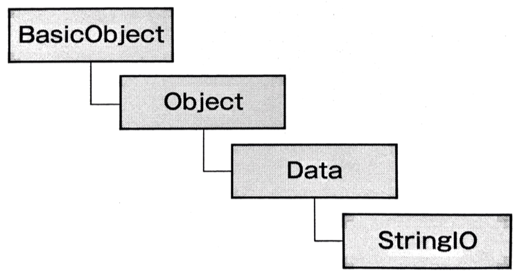

6-2.テキスト
===========

テキストライブラリには、

* `stringio`：文字列をIOオブジェクトのように取り扱うことができる

* `digest`：文字列のハッシュ化を行う

* `erb`：テンプレートに基づいて出力する

などがある

## 6-2-1.StringIO

* 文字列をIOクラスと同じインターフェースで取り扱うためのクラス

* メリットとしては、ログ出力のケースが挙げられている。 ファイルに書き込まずデータベースやメモリ上など 多様な出力先に文字列を出し入れする際に、
  DuckTyping(IOオブジェクトのようにファイルのように読み書きできればそれで良いじゃないか)の観点で メリットがある

* IOクラスと同じインターフェースをもつが、直接の継承関係はない



## インスタンスの生成

* インスタンスを生成するには、ファイルディスクリプタの代わりに文字列を渡す

* 第1引数：stringは、文字列を指定する(省略すると、空文字列を指定したものとされる)

* 第2引数：modeは、読み書きに関するオプション(デフォルトでは`r+`)

  * `r`：読み込みモードでインスタンスを作成。ポインタはバッファの先頭を示す

  * `w`：書き込みモードでインスタンスを作成。バッファは空文字列となる

  * `a`：書き込みモードでインスタンスを作成。ポインタはバッファの末尾を示す

  * `r+`：読み書きモードでインスタンスを作成。ポインタはバッファの先頭を示す

  * `w+`：読み書きモードでインスタンスを作成。バッファは空文字列となる

  * `a+`：読み書きモードでインスタンスを作成。ポインタはバッファの末尾を示す

```ruby
>> StringIO.new(string = '', mode = 'r+')
=> #<StringIO:0x007fc6d7138580>
>> StringIO.open(string = '', mode = 'r+')
=> #<StringIO:0x007fc6d7138120>
>> StringIO.open(string = '', mode = 'r+'){|io| p io}
=> #<StringIO:0x007fc6d713b848>
#<StringIO:0x007fc6d713b848>
>> sio = StringIO.new             # 空文字列によるStringIOインスタンスを生成
=> #<StringIO:0x007fd5060a7b10>
```

* `open`：`new`と同様の処理を行う。ブロック内で直接StringIOインスタンスを操作することができる。戻り値は、

  * ブロックを使用しないと、StringIOクラスのインスタンスが返る

  * ブロックを使用すると、ブロック内の評価結果が返る

```ruby
>> require 'stringio'

>> sio = StringIO.open "Hello, StringIO."
>> p sio
=> #<StringIO:0x007fe87d8da1b8>

>> sio = StringIO.open "Hello, StringIO." do |io|
>>         p io.read #=> "Hello, StringIO."
>>         nil
>>       end

>> p sio
=> nil
```

***

## バッファへ書き込むメソッド

* バッファに書き込むメソッドの中で代表的なものは、`putc`、`puts`、`print`、`printf`

* いずれも、IOクラスで実装されている同名のメソッドと同じ動きをStringIOインスタンス内のバッファに対して行う

* 書き込み後は、バッファが指し示すポインタが入力文字分、移動する

### putc

```ruby
putc(ch)
```

* 1文字だけバッファに書き込むメソッド

* 引数に2文字以上の文字列を与えた場合は、先頭の1文字のみをバッファに書き込み、残りの文字は無視する

* 入力に成功すると、戻り値には引数に渡した`ch`が返る

```ruby
>> p sio = StringIO.new
=> #<StringIO:0x007fab488f3dd8>

>> p sio.putc "a"
=> "a"
>> p sio.string
=> "a"

>> p sio.string = ""   # バッファを空にして、ポインタを0にする
=> ""

>> p sio.putc "bcd"
=> "bcd"
>> p sio.string        # 2文字以上の文字列を与えた場合は、先頭の1文字以外は無視される
=> "b"

>> p sio.putc          # 引数を省略すると、エラー
=> wrong number of arguments (given 0, expected 1) (ArgumentError)
```

### puts

* 引数に与えた文字列に改行を付加して、バッファに書き込む

* 引数を省略すると、改行のみをバッファに書き込む

* 複数の文字列が与えられた場合は、それぞれの文字列に対して改行を付加してバッファに書き込む(戻り値は`nil`)

* 引数には配列を使用可能で、配列内の値をバッファに書き込む

* 引数に配列以外を指定した場合は、`to_ary`メソッドで配列への変換を試み、次に`to_s`メソッドで文字列への変換を試みる

* `print`メソッドでは、`puts`メソッドとは異なり、末尾に改行を付加しない

```ruby

```
