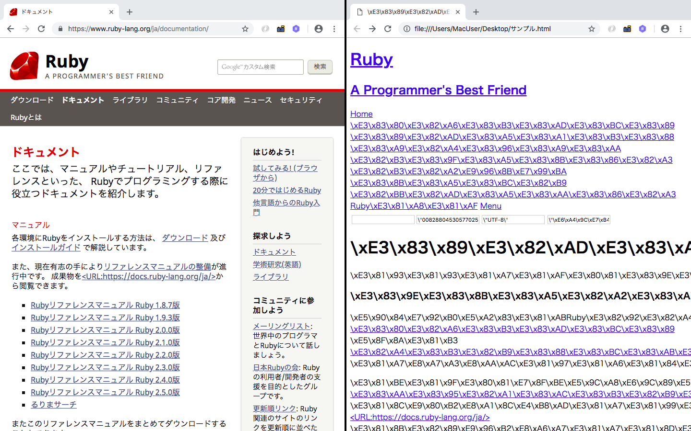

6-5.ネットワーク
==============

Rubyのネットワーク関連のライブラリは、

* socket：プロセス間、ホスト間の通信を行うライブラリ

* net/http：標準的なネットワーク(HTTP)のプロトコルを扱うライブラリ

* uri：ネットワーク内のリソースの場所を示すURIを扱うモジュール

などを備えている


## 6-5-1.socket

* プロセス間通信や、ホスト間通信を実現する通信ソケットを扱うライブラリ

* IOクラスを継承したクラス構成になっており、IOクラスと同じインターフェース(puts、getsなど)でデータの送受信を行うことができる

* TCPSocket・TCPServerクラス：TCP通信を行うプログラムを作成するのに適したインターフェースを提供

* UDPSocketクラス：UDP通信を行うプログラムを作成するのに適したインターフェースを提供

* UNIXSocket・UNIXServerクラス：UNIXドメインソケットによるプロセス間通信を行うプログラムを作成するのに適したインターフェースを提供する

* Socketクラス：汎用ソケットへのインターフェースを提供する


### TCPを扱うクラス

* `TCPServer`クラス：TCPをサーバー用途で扱う場合に利用する

```ruby
TCPServer.new([host, ]service)
TCPServer.open([host, ]service)
accept
```

例)
10080ポートへの接続用のインスタンスを作成し、`accept`メソッドでクライアントのアクセスを待つ。

クライアントからの接続があれば、クライアントに対して文字列を送信する

```ruby
require 'socket'

server = TCPServer.new 10080
loop {
  client = server.accept
  client.puts "Hello TCPServer."
  client.close
}
```

* `TCPSocket`クラス：TCPをクライアント用途で扱う

```ruby
TCPSocket.open(host, service [, local_host, local_service])
TCPSocket.new(host, service [, local_host, local_service])
```

例)
先ほどの10080ポートのサーバーに接続し、文字列"Hello TCPServer"を取得する

```ruby
$ ruby 6-5.sample2.rb
Hello TCPServer.
```

### UDPを扱うクラス

* `UDPSocket`クラス：サーバー用、クライアント用の区別はなく使用される。

  * UDPはコネクションレスなデータの送信方式

  * TCPに比べて伝達確認や通信ミスを検出しない分、オーバーヘッドが少なく、素早い通信ができる

  * 途中でデータの送信ミスが起きても大きな影響がない動画配信技術などに使われている

#### new/open

* UDPSocketクラスのインスタンスの生成を行う。

* 引数のsocktypeには、アドレスファミリーと呼ばれるネットワークアドレスの種類を指定する

  →デフォルトでは、`Socket::AF_INET`が使用される

|      引数       | アドレスの種類 |
|:---------------|:-------------|
|Socket::AF_INET |IPv4ネットワーク|
|Socket::AF_INET6|IPv6ネットワーク|

```ruby
UDPSocket.new([socktype])
UDPSocket.open([socktype])
```

#### bind

* 定義したソケットをホストのポートに関連付ける

```ruby
bind(host, port)
```

#### recv

* BasicSocketに定義されているメソッド

* ソケットからデータを受け取り、文字列として返す

* 引数には、受け取るデータの長さを指定する

  * flagsには、受信データ処理のオプションを指定でき、`Socket::MSG_OOB`(帯域外データを送信する)や`Socket::MSG_EOR`(レコードの終了を指示)を指定

  * オプションを指定しない場合には、デフォルト値は0

```ruby
recv(maxlen[, flags])
```

例)
UDPSocketを使って10000ポートでUDP通信を待ち受ける

```ruby
require 'socket'

MAX_PACKET = 1024
socket = UDPSocket.new
socket.bind("0.0.0.0", 10000)
print socket.recv(MAX_PACKET)
```

#### connect/send

UDPでデータを送信するには、

1. connectメソッドで接続先ホストとポートを指定して、sendメソッドを使用する方法

2. sendメソッドの引数の中に、接続先ホストとポートを指定する方法

sendメソッドの引数の`dest_sockaddr`は、`Socket.pack_sockaddr_in`を使って生成したソケットアドレス構造体を指定

sendメソッドの引数のflagsには、送信データのオプションを指定できる。recvのflagsと同じオプションを指定でき、指定しない場合は0を指定したものとみなす

```ruby
connect(host, port)
send(mesg, flags, dest_sockaddr = nil)
send(mesg, flags, host, port)
```

例)
UDPSocketを使って10000ポートに対してUDPでデータを送信する

```ruby
require 'socket'

socket = UDPSocket.new

socket.send "Hello UDP.\n", 0, "localhost", 10000
socket.close

# サーバー側のコンソール
Hello UDP.
```

### プロセス間通信を制御するクラス

* `UNIXServer`・`UNIXSocket`は、UNIX系OSのみで使用可能

* 通常、プロセスは独立したアドレス空間で動作しているため、互いに影響しないようになっているが、プロセス間でデータを

  共有したい場合や情報のやりとりをしたい場合に、プロセス間通信を使用する

* これらのクラスは、TCPServer・TCPSocketとほとんど同じように扱える

#### サーバー側インスタンスの作成(UNIXServer)

* プロセス間のサーバー側インスタンスを作成する

* TCPServerクラスではホストとポート番号を指定したが、UNIXServerクラスでは任意のパス名を用いる

```ruby
UNIXServer.new(path)
UNIXServer.open(path)
accept
```

例)
UNIXServerを使って、プロセス間の待ち受けを行う

```ruby
require 'socket'

socket_name = "test_socket"

File.unlink socket_name if File.exist?(socket_name) && File.socket?(socket_name)

server = UNIXServer.new socket_name
loop {
  client = server.accept
  client.puts "Hello UNIXServer."
  client.close
}
```

#### クライアント側インスタンスの作成(UNIXSocket)

* プロセス間通信のクライアント側インスタンスを作成する

* 引数には、通信するサーバーが作成したソケット名を指定する

```ruby
require 'socket'

socket = UNIXSocket.new "test_socket"
print socket.gets

# 実行結果
Hello UNIXServer.
```

***

## 6-5-2.uri

* URIを扱うライブラリ(現行のRubyのuriモジュールはURLのみ対応)

* URLはネットワーク上のリソースの場所を示し、スキームとスキーム毎に定められた表現形式を持つ


* Rubyでは以下のスキームに対応しており、それ以外のスキームには汎用のパーサが使われる

* これらのスキームのパーサは、URIモジュール以下に別々のクラスとして定義されている

  →どのパーサを使用するかは、URIモジュールが与えられたスキームから決定するので、個別に呼び出す必要はない


### parse/URI(uri_str)

* `URI.parse`：与えられたuri_strから該当するURIサブクラスのインスタンスを生成して返す

例)

```ruby
require 'uri'

>> uri = URI.parse "https://docs.ruby-lang.org/ja/man/html/index.html"

>> p uri
=> #<URI::HTTPS https://docs.ruby-lang.org/ja/man/html/index.html>
>> p uri.scheme
=> "https"
>> p uri.host
=> "docs.ruby-lang.org"
>> p uri.port
=> 443
>> p uri.path
=> "/ja/man/html/index.html"
```

* スキーム：httpsなので、内部では`URI::HTTPS`クラスのパーサが個々の要素に分割する

* HTTPSのパーサは、RFCの企画にしたがって厳密にパースするため、ホスト名として使用できない文字が含まれていると、正しくパースしない

* URI(uri_str)メソッドは、uriロード時にKernel内に定義され、内部でURI.parse(uri_str)を呼び出す

例)
`URI.parse`で正しくパースできない例

※パースできてしまう

```ruby
require 'uri'

uri = URI.parse "https://docs.ruby_lang.org/ja/man/html/index.html"

>> p uri
=> #<URI::HTTPS https://docs.ruby_lang.org/ja/man/html/index.html>
>> p uri.scheme
=> "https"
>> p uri.host
=> "docs.ruby_lang.org"
>> p uri.port
=> 443
>> p uri.path
=> "/ja/man/html/index.html"
```

### split

* URLを以下の要素に分割した配列を返す

* 該当しない場合は、nilが入る

```ruby
URI.split(url)

# 配列
[scheme, userinfo, host, port, registory, path, opaque, query, fragment]
```

例)

```ruby
require 'uri'

uri = URI.split "https://docs.ruby_lang.org/ja/man/html/index.html"

p uri

# 実行結果
["https", nil, "docs.ruby_lang.org", nil, nil, "/ja/man/html/index.html", nil, nil, nil]
```

### encode_www_form_component

* URIで使用できるASCII以外の文字列データを扱う場合、16進数で表記したバイトコードを「%xx」という形で表記することが定められている

  →これを「URIエンコード」という

* `URI.encode_www_form_component`：引数strで指定した文字列をURLエンコードした文字列で返す

  マルチバイト文字を使用したURIをエンコードする場合は、デフォルトではそのプログラムが書かれた文字コードによってエンコードされる

```ruby
URI.encode_www_form_component(str)
```

* エンコードを指定する場合は、文字列を変換する必要がある

* どの文字コードを用いるかは、通信先のサーバーなどの実装によって異なる

```ruby
require 'uri'

>> p "http://www.example.com/" + URI.encode_www_form_component("Ruby技術者試験対策教科書")
=> "http://www.example.com/Ruby%E6%8A%80%E8%A1%93%E8%80%85%E8%A9%A6%E9%A8%93%E5%AF%BE%E7%AD%96%E6%95%99%E7%A7%91%E6%9B%B8"
>> p "http://www.example.com/" + URI.encode_www_form_component("Ruby技術者試験対策教科書".encode("EUC-JP"))
=> "http://www.example.com/Ruby%B5%BB%BD%D1%BC%D4%BB%EE%B8%B3%C2%D0%BA%F6%B6%B5%B2%CA%BD%F1"
```

### decode_www_form_component

* URLエンコードされた文字列を元の文字列に戻す

```ruby
URI.decode_www_form_component(str)
```

例)

```ruby
require 'uri'

uri = "http://www.example.com/Ruby%E6%8A%80%E8%A1%93%E8%80%85%E8%A9%A6%E9%A8%93%E5%AF%BE%E7%AD%96%E6%95%99%E7%A7%91%E6%9B%B8"

parsed_uri = URI.parse(uri)

p URI.decode_www_form_component(parsed_uri.path[1..-1])

# 実行結果
$ ruby 6-5.sample.rb
"Ruby技術者試験対策教科書"
```

***

## 6-5-3.net/http

* Netモジュール以下には、ネットワークで広く利用されているプロトコルそれぞれ対応したサーバーと通信するためのクライアント用ライブラリが用意されている

  →net/httpはその中の１つで、HTTPを取り扱うことができる

* net/httpでは、

  * HTTP通信の中のリクエストデータの組み立て

  * サーバーへの通信

  * レスポンスデータの処理

  などをライブラリ側で処理してくれる

* net/httpは、以下の3つのクラスで構成されている

  |      クラス      |            内容            |
  |:----------------|:--------------------------|
  |Net::HTTP        |HTTPクライアントのためのクラス  |
  |Net::HTTPRequest |HTTPリクエストを抽象化するクラス|
  |Net::HTTPResponse|HTTPレスポンスを抽象化するクラス|

### HTTPの通信の仕組み

* TCPの80番ポートを使って通信するテキストベースのプロトコル

* 通信は、クライアント(Webブラウザなど)から行う

* クライアントはサーバーに対して、取得対象コンテンツへのパスと命令(メソッド)を指定し、

  * リクエストヘッダ(クライアントの設定や属性など)

  * リクエストボディ(クライアントから送信するデータ)

  と一緒に送信する

* メソッドは、クライアントやサーバーによって使用できるものが異なるが、ほとんどのサーバー・クライアントで

  * `GET`：コンテンツの取得

  * `POST`：データの投稿

  が使用できる

* サーバーはクライアントからの命令を解釈し、処理結果をクライアントに返す


### 接続されていないインスタンスの作成(new)

* `Net::HTTP.new`：指定したアドレス、ポートで`Net::HTTP`インスタンスを作成する

  接続の際に経由するプロキシサーバーを指定できる。この方法でインスタンスを作成すると、接続が未オープンの状態で作成される

```ruby
Net::HTTP.new(address, port = 80, procy_addr = nil, proxy_port = nil)
```

### 接続のオープンとクローズ(start/finish)

* `start`：`Net::HTTP`インスタンスの接続をオープンする。ブロックを渡すと、ブロックの終了時に自動的にfinishメソッドを実行する

  ブロック引数には、自分自身のインスタンスが代入される

* `finish`：`Net::HTTP`インスタンスの接続をクローズする。

```ruby
start
start{|http| ... }
finish
```

* `Net:HTTP.start`メソッドは、接続がオープンの状態でインスタンスを作成する

  ブロックを渡すと、startメソッドと同様にブロックを抜けると同時に接続をクローズする

```ruby
Net::HTTP.start(address, port = 80, procy_addr = nil, proxy_port = nil)
Net::HTTP.start(address, port = 80, procy_addr = nil, proxy_port = nil){|http| ....}
```

### コンテンツの取得

* `get`・`Net::HTTP.get`：GETメソッドを利用して、pathからコンテンツの取得を試みる

  headerは、リクエストヘッダに渡す値をヘッダ名と値のHashで渡す

  接続がクローズされていた場合、自動的にオープンして接続を行い、戻り値には`Net::HTTPResponse`の

  サブクラス(Net::HTTPOKクラス、Net::HTTPNotFoundクラス)のインスタンスが返る

* `Net::HTTP.get`は、インスタンスを作らずに、直接コンテンツの取得を試みる。戻り値は文字列が返る

```ruby
get(path, header = nil)
Net::HTTP.get(address, path, port = 80)
```

例)
Net::HTTPを使用した、HTMLの取得サンプル

```ruby
require 'net/http'

# サンプル1：接続がみオープンのインスタンスを作成し、コンテンツを取得する
net = Net::HTTP.new("docs.ruby-lang.org")
net.start
res = net.get("/ja/2.1.0/doc/index.html")
net.finish
p res.body
=> ""

# サンプル2：接続がオープンのインスタンスを作成し、startメソッドにブロックを渡してコンテンツを取得する
net = Net::HTTP.new("docs.ruby-lang.org")
net.start{|http|
  res = http.get("/ja/2.1.0/doc/index.html")
}
p res
=> #<Net::HTTPMovedPermanently 301 Moved Permanently readbody=true>

# サンプル3：Net::HTTP.getで直接コンテンツを取得する
body = Net::HTTP.get("docs.ruby-lang.org", "/ja/2.1.0/doc/index.html")
p body.force_encoding("UTF-8")
=> ""
```

* `post`：POSTメソッドで、pathからのコンテンツの取得を試みる。リクエスト送信時にdata文字列を送信する。戻り値には、HTTPResponseクラスが返る

  destには、<<メソッドを持つクラスのインスタンス(String、Arrayなど)を指定できる

  destを与えた場合は、<<メソッドを使ってレスポンスをdestに書き込む

```ruby
post(path, data, header = nil, dest = nil)
```

### HTTPRequest

* コンテンツ取得時にサーバーがBASIC認証を要求したり、細かいリクエストのパラメータを調整したい場合は`Net::HTTPRequest`を使用

* このクラスは、以下の4つのサブクラスに実装が定義されている

  * `Net::HTTP::Get`

  * `Net::HTTP::Post`

  * `Net::HTTP::Head`

  * `Net::HTTP::Put`

* 作成したHTTPRequestインスタンスを使ってサーバーと通信するには、`request`メソッドを使用する

```ruby
require 'net/http'

http = Net::HTTP.new("www.ruby-lang.org", 80)
req = Net::HTTP::Get.new("/ja/documentation/")
res = http.request(req)
p res.body
```

#### 実行結果



### new

Net::HTTPRequestのインスタンスを作成する

```ruby
Net::HTTP::Get.new(path)

Net::HTTP::Post.new(path)

Net::HTTP::Head.new(path)

Net::HTTP::Put.new(path)
```

### self

リクエストヘッダに、値をセットする

```ruby
self[key]
self[key] = val
```

### basic_auth

BASIC認証用のヘッダを作成する

* account:passwordの文字列をBASE64でエンコードしたものを、Authorizationヘッダにセットする

```ruby
basic_auth(account, password)
```

例)
BASIC認証用のヘッダを作成する

```ruby
require 'net/http'

req = Net::HTTP::Get.new("/ja/documentation")
req.basic_auth("rubyuser", "password")
p req["authorization"]
=> "Basic cnVieXVzZXI6cGFzc3dvcmQ="
```

### HTTPResponse

`Net::HTTP.get`などでコンテンツの取得を行うと、戻り値は`Net::HTTPResponse`のサブクラスのインスタンスが返る

戻り値には、リクエスト結果のステータスコード、レスポンスヘッダや取得したコンテンツの内容が含まれている

```ruby
code
message
```

リクエストの取得結果のステータスコードとメッセージを取得する

|ステータスコード|     メッセージ     |                                    意味                                   |
|:------------|:------------------|:-------------------------------------------------------------------------|
|     200     |OK                 |要求は正常に取得しました                                                      |
|     302     |Found              |要求への応答は別のURIにある。レスポンスヘッダのLocationに移動後のコンテンツのURIがある|
|     404     |NotFound           |要求されたURIに一致するものをサーバー上で見つけることができませんでした。             |
|     500     |InternalServerError|サーバー内部のエラー                                                         |


### self

レスポンスヘッダを取得する

```ruby
self[key]
```

### body

コンテンツを取得する

```ruby
body
```

#### 例

ステータスコード301のHTTPResponseインスタンスから、正しいURIを取得する

```ruby
require 'net/http'

res = nil
Net::HTTP.start("docs.ruby-lang.org"){|http|
  res = http.get("/")
}
p res.code
=> "301"

# ステータスコードが301の場合、移動後のURIはLocationヘッダに格納されている
p res["location"]
=> "https://docs.ruby-lang.org/"
```


| 版 |  年/月/日 |
|----|----------|
|初版|2018/10/21|
